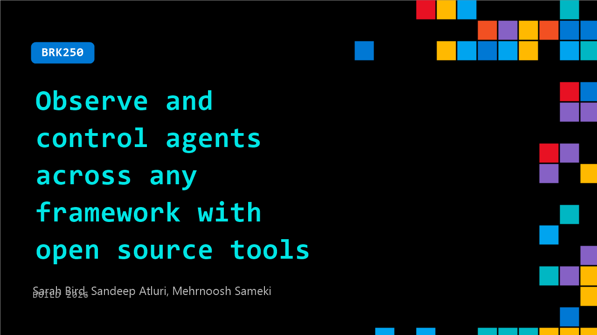

# BRK250: Observe and control agents across any framework with open source tools

**Session code:** BRK250  
**Date:** Tuesday, June 2, 2026 / 2:30 PM - 3:15 PM PDT (Duration 45 minutes)  
**Watch on-demand:** <https://build.microsoft.com/en-US/sessions/BRK250>

---

## Speakers

- **Sarah Bird** - Chief Product Officer, Responsible AI, Microsoft
- **Sandeep Atluri** - Partner Applied Research, Microsoft
- **Mehrnoosh Sameki** - Principal Product Lead, Microsoft

## About the session

As AI agents move into production, developers own safety, governance, and reliability across Microsoft Agent Framework and open-source stacks. This session shows how to govern agents end to end: turning your requirements into context-aware evaluations, stress-testing against adversarial risks, applying open controls that work across frameworks, and keeping humans in the loop on high-stakes actions. Leave with a blueprint for shipping agents at enterprise scale.

Seating for this session is first-come, first-served. Add it to your schedule to plan your day and arrive early to secure a spot.

## AI summary

**Introduction and Responsible AI Context:** The video opens with Sarah Byrd introducing herself as Microsoft's Chief Product Officer for Responsible AI, alongside Sandeep, who leads Responsible AI science efforts 00:00:08–00:00:20. Byrd begins by highlighting the increasing risks of autonomous agents in practical systems where errors can create company-wide and societal impact 00:00:37–00:01:50. She cites research showing 60% of agents have privileged data access, often causing unauthorized sharing and security breaches. Byrd emphasizes Microsoft’s active development of tools to observe, control, and secure AI agents across development and production phases.

**Understanding Agent Failures and the “Lethal Trifecta”:** Byrd explains four major categories of agent failure: misunderstanding instructions, hallucinating information, leaking sensitive data, and interacting unpredictably in multi-agent systems 00:01:56–00:03:03. She expands on a common pattern termed the “lethal trifecta,” wherein context rot, confusion, and privilege misuse can lead agents to exfiltrate confidential information 00:03:18–00:04:25. To mitigate these, she outlines the foundational Responsible AI process loop—identify risks, evaluate them, apply controls, and continuously refine based on performance outcomes 00:04:43–00:05:51.

**Demo: Banking Agent Risk and Evaluation with ASSERT:** Sandeep introduces a demo featuring a “Bank Manager Agent” designed for account balances and money transfers, built using LangGraph and MCP Server 00:06:02–00:07:06. Byrd and Sandeep discuss domain-specific risks including prompt injection, hallucinations, and unauthorized transfers 00:07:17–00:09:00. Byrd then announces Microsoft’s open-source tool ASSERT (Agent Systematic Evaluation and Risk Testing), enabling organizations to define evaluation metrics aligned with their safety requirements 00:10:22–00:11:08. ASSERT converts broad Responsible AI principles into granular testable rules and automatically generates falsifiable evaluations for agent behaviors.

**ASSERT Demo Results and Integration:** In the live demo, Sandeep shows how developers use ASSERT by writing simple YAML definitions of risks like “do not leak sensitive data or execute unauthorized transactions” 00:13:18–00:14:02. The framework systematizes these into categories and test sets covering both single-turn and multi-turn conversations 00:15:02–00:17:21. The initial evaluation shows baseline policy violations of 28–58%, later reduced with improved prompts. Though prompting offers limited effectiveness in layered scenarios, integrating deterministic guardrails through ACS—Agent Control Specification—drives a reduction toward near-zero violation rates 00:27:14–00:30:07. The conversation underscores the balance between avoiding policy violations and preventing over-refusal issues to preserve customer experience.

**ACS and Production Governance with Foundry:** Byrd introduces ACS, an open-source Agent Control Specification designed to unify control logic and provide deterministic as well as AI-assisted safety checks across frameworks 00:25:00–00:27:00. Integrated into the Agent Governance Toolkit (AGT) and Microsoft Foundry, ACS ensures consistent enforcement of input/output, data governance, and tool-specific rules in production settings. Foundry ties ACS with Microsoft Defender and Purview for data protection and integrates identity and tracing features for full observability 00:34:00–00:35:54. Byrd emphasizes continuous monitoring using ASSERT and ACS in live traffic for iterative improvement and alignment with organizational policies.

**Future Frontiers and Responsible Collaboration:** In closing, Byrd and Sandeep preview upcoming advancements including continuous evaluations powered by reinforcement-learning attackers that adapt tests based on production performance 00:37:03–00:39:20. They highlight work on content authenticity via invisible C2PA watermarks 00:41:11 and deterministic data flow policy enforcement 00:42:20. The session ends with a call for open collaboration across the community to improve AI trust, emphasizing transparent evaluation, control, and continuous innovation 00:45:09–00:45:46.

## Session tags

- **Session type:** Breakout
- **Level:** (300) Advanced
- **Topic:** Responsible AI
- **Tags:** Observability, Security, Agents, Microsoft Foundry, Responsible AI
- **Location:** Building B, Level 3, BATS Improv
