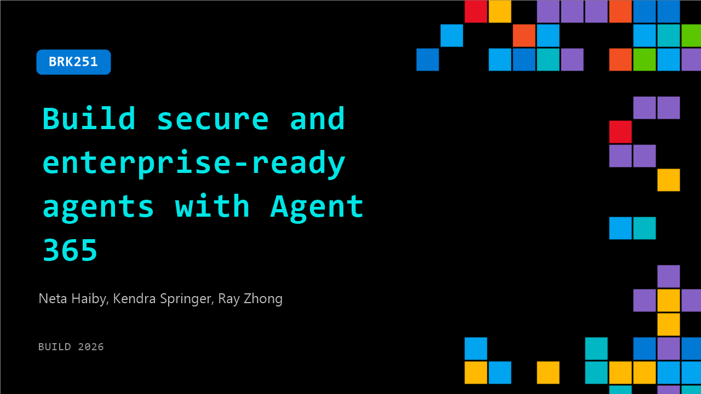

# BRK251: Build secure and enterprise-ready agents with Agent 365

**Session code:** BRK251  
**Date:** Wednesday, June 3, 2026 / 11:30 AM - 12:15 PM PDT (Duration 45 minutes)  
**Watch on-demand:** <https://build.microsoft.com/en-US/sessions/BRK251>

---

## Speakers

- **Neta Haiby** - Partner Product Manager, Microsoft
- **Kendra Springer** - Principal Product Manager, Microsoft
- **Ray Zhong** - Co-founder, Genspark

## About the session

As AI agents move to production, developers need observability, governance, and security across the agent lifecycle. We'll show how to build enterprise-ready agents using Agent 365 SDK and Purview SDK to instrument runtime visibility, enforce identity-aware access, protect data, and apply policy-based governance. Through practical examples, you'll learn to meet security and compliance requirements without slowing development. Ship agents that are powerful and trustworthy by default.

Seating for this session is first-come, first-served. Add it to your schedule to plan your day and arrive early to secure a spot.

## AI summary

**Introduction and Context:** The session opens with Neda welcoming the audience and encouraging everyone to use headphones for clarity 00:00:00. She introduces herself and explains that the purpose of the presentation is to show how to build secure, enterprise-ready, and governed agents using Agent 365 00:00:17. After an interactive segment asking attendees about their use of AI agents, Neda frames the problem: while many are developing or using agents, few are confident they’re secure or compliant 00:00:33. She highlights IDC’s prediction that by 2028 there will be over 1.3 billion agents in organizations, emphasizing the urgency of ensuring observability, governance, and security 00:01:00. Neda concludes her introduction by describing the growing landscape of SaaS agents, endpoint agents, and cloud-based agents and poses key governance questions that lead into the introduction of Agent 365 00:01:20.

**Overview of Agent 365 Capabilities:** Kendra takes over to explain why Agent 365 is essential and what value it provides for both Microsoft and third-party custom agents 00:02:40. She introduces its three value pillars: Observe, Govern, and Secure. Observation ensures you can see and analyze all deployed agents across various platforms and understand usage and adoption trends 00:03:24. Governance helps prevent risk while encouraging innovation by applying guardrails to maintain agent safety without slowing development 00:04:06. Security integrates with Defender, Purview, and Entra to provide identity management, threat detection, and compliance monitoring 00:05:01. She also introduces the Agent 365 SDK, which allows developers to wrap existing agents—Microsoft or third party—for discoverability, visibility, and policy enforcement within Agent 365 00:06:10. The SDK provides agents with an ID and observability while respecting existing governance and security frameworks.

**Architecture and Demo Setup:** Kendra elaborates that Agent 365 integrates seamlessly with trusted Microsoft enterprise tools—Entra for identity, Defender for risk protection, Purview for data governance, and Intune for shadow AI detection 00:07:28. She emphasizes that it manages a heterogeneous mix of agents across different clouds, frameworks, and providers 00:08:07. She then defines two critical constructs: Agent Blueprints (reusable instruction sets for agents) and Agent Identities (service principal extensions allowing agents to act consistently with user-like permissions) 00:12:28. Before transitioning to the demo, she clarifies how authentication models differ—either acting on behalf of users or operating under their own dedicated identity 00:13:30. Aarthy is invited on stage to demonstrate how these concepts come to life in practice through a hands-on walkthrough.

**End-to-End Demo: Building and Integrating an Agent:** In the live demo, Aarthy plays multiple roles to simulate the agent development lifecycle 00:13:40. She begins as a developer building a travel-planning agent using LangChain and Node.js, showing how to prepare it for Agent 365 by applying skills through the SDK 00:14:09. Using the Agent 365 CLI and skills, she demonstrates how observability, work IQ servers, and identity registration are automatically configured 00:15:07. Once configured, the agent is deployed, assigned tenant visibility, and activated via the Admin Center. Switching to the user perspective, she interacts with the same agent through Microsoft Teams, requests travel recommendations, and collaborates seamlessly across Teams and Word 00:19:07. The demo visually proves how an agent can behave like an enterprise “employee” with secure identities, managed permissions, and transparent telemetry 00:22:01.

**Admin Experience and Automation:** After Aarthy’s demo, Kendra returns to showcase the administrator view within the Microsoft 365 Admin Center 00:25:03. She demonstrates granular observability dashboards showing analytics like total agents, usage stats, and exceptions, as well as the ability to detect orphaned agents and manage ownership assignments 00:26:26. She also walks through the Registry Sync feature, which ingests agents from third-party platforms like Google Vertex and Amazon Bedrock for unified visibility 00:36:31. Moreover, she introduces Templates—comprehensive, reusable policy bundles combining Entra, Defender, and Purview controls—and demonstrates an agent publishing flow applying those templates automatically during approval 00:33:49. She notes new automation Rules that proactively reassign agents or block risky ones without human intervention 00:33:33. The visual elements highlight end-to-end control, compliance, and insights across all agents, regardless of origin or platform.

**Partner Integration and Conclusion:** The session closes with a partner spotlight featuring Ray from Genspark 00:39:44. Ray explains that Genspark integrated its Jasma AI workspace with Agent 365 to unify identity management, security, and observability 00:41:11. He describes how this combination allows every agent action to authenticate through Microsoft Entra and log securely to Purview, while leveraging Microsoft tools like Teams, Outlook, and OneDrive through MCP connectors 00:43:59. The integration enables flexible back-end compute options while maintaining centralized enterprise governance. Wrapping up, Neda thanks participants and summarizes that Agent 365 empowers organizations to confidently deploy, observe, and secure agents at enterprise scale—whether built internally or externally—making them governed, secure, and enterprise-ready 00:47:02.

## Session tags

- **Session type:** Breakout
- **Level:** (300) Advanced
- **Topic:** Responsible AI
- **Tags:** Security, Agent 365, Purview, Responsible AI, Governance, Foundry Control Plane, Entra
- **Location:** Festival Pavilion, Breakout 2
