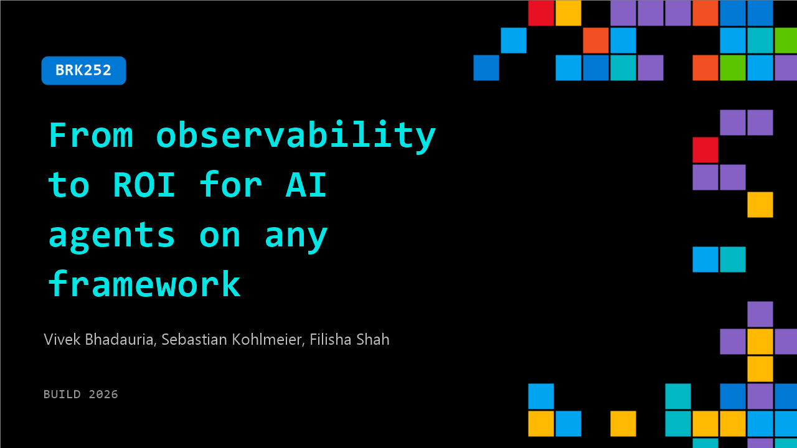

# BRK252: From observability to ROI for AI agents on any framework

**Session code:** BRK252  
**Date:** Tuesday, June 2, 2026 / 5:00 PM - 5:45 PM PDT (Duration 45 minutes)  
**Watch on-demand:** <https://build.microsoft.com/en-US/sessions/BRK252>

---

## Speakers

- **Vivek Bhadauria** - Partner Software Engineer, Microsoft
- **Sebastian Kohlmeier** - Principal PM Manager, Microsoft
- **Filisha Shah** - Senior Product Manager, Microsoft

## About the session

Nondeterministic, multi-agent systems break traditional monitoring. As agents reach production, observability must be built in—not added after failures. This session covers modern agent observability: cross-framework tracing and evals, rigorous inner-loop practices, evolving context-specific evals, and always-on signals that connect behavior to business outcomes to measure value, cost, and ROI.

Seating for this session is first-come, first-served. Add it to your schedule to plan your day and arrive early to secure a spot.

## AI summary

**Introduction and Overview:** The session titled "From Observability to ROI for AI Agents" opens with an overview of Microsoft's Foundry Observability platform 00:00:00–00:00:25. The speakers outline how observability helps developers manage the non-deterministic nature of AI agents that often create reliability challenges. Foundry Observability is built on four key pillars—tracing, evaluation, monitoring, and optimization 00:01:00–00:01:31. Each component provides capabilities such as tracking execution workflows, assessing quality and safety, detecting real-time issues, and continuously improving performance. The speakers highlight how observability spans the entire control plane across agent service models, knowledge tools, and machine learning enhancements. The session sets the stage for demonstrating how the traditional DevOps lifecycle evolves into AI agent DevOps with built-in observability integrated into both the inner and outer development loops 00:02:04.

**Demo 1: Getting Started and Evaluation:** Felicia leads the first demo, showcasing an AI agent for Microsoft’s data center operations—specifically a vendor history analyst agent that provides summarized insights for vendor performance 00:03:00–00:03:31. She demonstrates out-of-the-box observability and introduces the new "Rubric Evaluator" feature 00:05:30. This tool automatically generates multi-dimensional evaluation rubrics that assess agents across multiple criteria, simplifying agent reliability testing. Felicia shows how users can view traces pulled from production through continuous evaluations integrated with Azure Application Insights 00:08:01. The demo walks through diagnostic analysis of low-scoring responses to pinpoint hallucinations or inconsistent data, reinforcing the value of systematic evaluation in early development.

**Open Ecosystem and Code-First Observability:** The next segment announces open ecosystem support within Foundry, allowing developers to evaluate both Foundry and non-Foundry agents built using frameworks like LangChain, OpenAI SDK, and Microsoft's Agent Framework 00:10:04. This support brings end-to-end observability across the full agent execution workflow, connected directly with Azure Monitor for a unified data view 00:11:00. Felicia then demonstrates “code-first observability” within Visual Studio Code using the Foundry Toolkit, MCP server, and Foundry skill 00:12:06. She shows how developers can analyze evaluation results, identify failure patterns, and get actionable improvement suggestions—bridging observability directly within coding environments. This approach eliminates the need to comb through hundreds of traces, making continuous optimization efficient and developer-friendly.

**Multi-Turn Evaluation and Continuous Improvement:** The session continues with announcements of advanced public preview features—multi-turn evaluation and user simulation 00:17:48. Multi-turn evaluation enables tracking of whole conversation sessions rather than single prompts, offering deeper insights for complex agents. User simulation can automatically generate realistic conversation data to bootstrap evaluations where production data is insufficient. The presenters also explain how Foundry supports feeding selected execution traces back into datasets to strengthen test coverage 00:19:04. Built-in evaluators now cover multiple dimensions—quality, safety, performance, and user satisfaction—enabling developers to create custom and rubric-based evaluators suitable for non-deterministic scenarios.

**Demo 2: Agent Optimization at Scale:** Vivek takes the stage to showcase “Agent Optimizer,” a new feature designed for iterative, automated optimization of AI agents based on rubrics and datasets 00:21:01. The optimizer autonomously generates and tests new combinations of prompts, models, and tool definitions by evaluating them against task rubrics. The system iterates to improve performance and automatically deploys optimal versions of agents. Vivek demonstrates how a baseline agent achieved a 14% performance boost simply through automated context engineering 00:25:02. Foundry’s optimization feature can evaluate multiple models to balance cost, accuracy, and latency, driving data-grounded iterative refinement. The demo concludes with an example that improves an agent’s response accuracy from 57% to 70%, proving how automation accelerates AI agent evolution.

**Demo 3 and Conclusion: ROI and Final Highlights:** The final section introduces the “Agent ROI” feature, which quantifies the business value of agents by comparing performance-derived benefits against computation and tool costs 00:27:22. This tool allows teams to assign monetary values to successful outcomes, track cost per invocation, and identify low-ROI executions for targeted improvement. The presenters recap how observability spans all stages—tracing, evaluation, monitoring, optimization, and now ROI analysis 00:30:49. They emphasize Microsoft’s continued investment in open telemetry standards, red-teaming integrations, and single-shot optimizations for production-ready deployment. Examples from enterprise users like Entity Data show how Azure Monitor and Foundry enable full-stack observability for AI in the enterprise. The presentation closes with upcoming session invitations and encouragement to explore the Foundry hands-on labs available at Build 00:35:19.

## Session tags

- **Session type:** Breakout
- **Level:** (300) Advanced
- **Topic:** Responsible AI
- **Tags:** Observability, Microsoft Foundry, Responsible AI
- **Location:** Festival Pavilion, Breakout 2
