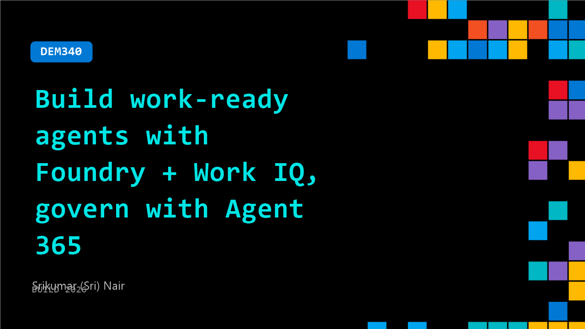

# DEM340: Build work-ready agents with Foundry + Work IQ, govern with Agent 365

**Session code:** DEM340  
**Date:** Wednesday, June 3, 2026 / 3:00 PM - 3:25 PM PDT (Duration 25 minutes)  
**Watch on-demand:** <https://build.microsoft.com/en-US/sessions/DEM340>

---

## Speakers

- **Srikumar (Sri) Nair** - Principal Group Product Manager, Microsoft

## About the session

An agent that knows nothing about your work is only half an agent. In this demo, we connect a Foundry agent to Work IQ via MCP, giving it real context about your work and ecosystem, governed by Agent 365. See it run under agent identity, watch Work IQ tools invoked at runtime, and get full observability on every call. Then we run side-by-side evals context-aware vs. context-blind, with scores that prove the difference. Leave knowing how to ground, govern, and evaluate your Foundry agents.

Seating for this session is first-come, first-served. Add it to your schedule to plan your day and arrive early to secure a spot.

## AI summary

**Introduction and Overview:** The session opens with an energetic greeting from Sri, the Group Product Manager for Agent 365, addressing developers at 00:00:06. Sri introduces himself as responsible for helping teams build AI agents while ensuring they are governable within enterprise systems. He explains the key enterprise challenge: IT administrators want control and transparency over what AI is doing within their systems, only approving what meets compliance and governance needs. After playful engagement with the audience about familiarity with Foundry IQ, Work IQ, and Agent 365, he outlines the session plan — a rapid demo covering Work IQ, agent creation, evaluations, security, governance, and a final surprise topic 00:01:07.

**Understanding Context and Work IQ:** Sri stresses that “context is key” when building effective AI agents 00:01:27. He details how context — stored across enterprise data sources such as SQL, SAP, emails, and chats — empowers agents to make intelligent, relevant decisions (00:02:00). Work IQ consolidates these contexts from Microsoft 365 assets like email, Teams, and SharePoint into a single, secure intelligence layer that agents leverage for responses. Sri explains that Work IQ includes data, context, skills, and tools, with the Work IQ MCP API unlocking secure access to contextual enterprise data. He announces general availability targeting mid-June 00:03:11, promising full security compliance so agents only see appropriate data per identity permissions.

**Demonstrating Foundry IQ and Integration with Work IQ:** Transitioning to the demo 00:05:29, Sri builds a playful “Agent 007” in the Foundry UI. He demonstrates how simple it is to attach Work IQ to the agent catalog 00:06:21, automatically connecting with all enterprise context sources. Then, he introduces Foundry IQ as the system’s knowledge backbone 00:07:39—a tool that converts enterprise data stored in blob containers into searchable, vector-indexed knowledge through Azure AI Search. He shows how connecting Foundry IQ to an agent gives instant access to files like pricing guides or product specs, meaning the agent can deliver grounded, context-aware answers. By combining Work IQ for enterprise context with Foundry IQ for deep knowledge, Sri demonstrates how easily developers can enrich agents with secure, compliant information 00:10:09.

**Evaluation, Testing, and Publishing:** Sri introduces “evals,” a built-in Foundry capability to test and validate agents before deployment 00:12:07. Evals assess agents for metrics such as task completion, customer satisfaction, coherence, and groundedness — ensuring that answers remain faithful to enterprise knowledge bases and not hallucinated 00:14:00. After uploading sample evaluation data, he shows how the system generates quantitative performance scores, identifying readiness for production deployment. Once validated, the agent can be published directly to the company registry or Microsoft Teams channels. Foundry automatically provisions a bot service and agent ID, drastically simplifying distribution processes 00:16:07.

**Agent 365: Governance, Observability, and Security:** Switching perspectives to that of an IT administrator 00:16:40, Sri showcases Agent 365’s governance tools. The admin interface allows viewing active agents, their risk posture, usage analytics, and required approvals. Each agent is automatically registered with a unique “agent identity,” carrying principal permissions similar to a human user for fine-grained access control. Sri explains that Agent 365 bridges a 52% governance gap between agents deployed in production and those compliant with enterprise standards 00:19:00. The system integrates security features through Intune for sandboxed environments, Defender for prompt injection protection, and policies for data labeling, access restriction, and exfiltration blocking. These capabilities ensure that agents follow enterprise policies rather than arbitrary model behavior.

**Conclusion and Key Takeaways:** The presentation wraps up 00:25:22 by demonstrating the agent registry map view, which visualizes all AI agents across platforms including third-party systems such as Databricks and AWS. IT admins can monitor local agents like GitHub Copilot, set isolation policies, and enforce compliant workspace execution 00:23:20. Tool governance in Agent 365 ensures that MCP connectors, APIs, and other agent plugins adhere to strict regulations. Sri ends by reinforcing the dual mission: build intelligent, context-rich agents in Foundry while maintaining governance and security via Agent 365. The combined ecosystem delivers observability, compliance, and protection across the full lifecycle of enterprise AI agents 00:25:38.

## Session tags

- **Session type:** Demo
- **Level:** (300) Advanced
- **Topic:** Responsible AI
- **Tags:** Agent 365, Foundry IQ, Microsoft Foundry, Responsible AI, Governance, Work IQ, Context Engineer, Grounding
- **Location:** Gateway Pavilion, Level 2, Theater C
