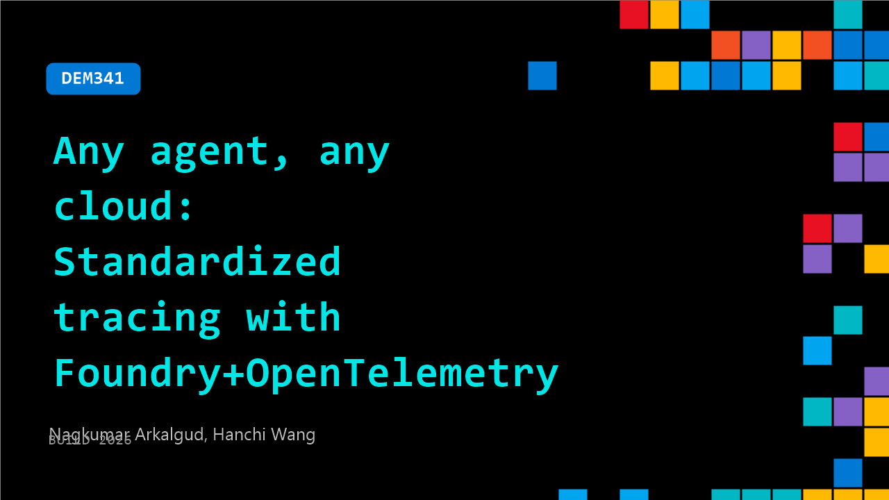

# DEM341: Any agent, any cloud: Standardized tracing with Foundry+OpenTelemetry

**Session code:** DEM341  
**Date:** Wednesday, June 3, 2026 / 11:50 AM - 12:15 PM PDT (Duration 25 minutes)  
**Watch on-demand:** <https://build.microsoft.com/en-US/sessions/DEM341>

---

## Speakers

- **Nagkumar Arkalgud** - Senior software engineer, Microsoft
- **Hanchi Wang** - Principal Software Engineer Manager, Microsoft

## About the session

Teams are shipping agents across clouds and frameworks—but telemetry is fragmented. In this demo, see how Microsoft Foundry and OpenTelemetry standards for GenAI tracing bring consistent observability that is agent framework agnostic and cloud agnostic. We’ll walk through the simple setup steps to instrument model and tool calls, quickly diagnose failures, latency, and cost spikes, and close the loop with trace-based evaluation, visualization and optimization.

Seating for this session is first-come, first-served. Add it to your schedule to plan your day and arrive early to secure a spot.

## AI summary

**Introduction and Problem Overview:** The session opens with greetings and the speaker introducing themselves as a software engineering manager on the Foundry of the Ability team at Microsoft (00:00:19). They welcome attendees to Day 2 of Build and outline the focus: achieving consistent, high-quality, and actionable agent observability across all frameworks and cloud environments via Foundry (00:00:40). Through interactive questions, the speaker identifies challenges with heterogeneous agent setups—different frameworks, hosting stacks, and metrics—across enterprise environments. They introduce Foundry Observability as a way to unify monitoring using OpenTelemetry instrumentation, requiring minimal code changes (00:03:00).

**Foundry Prompt Agent Demonstration:** The next section dives into a hands-on demo using Microsoft Foundry’s portal and playground view. The presenter showcases building a travel expert agent using Foundry’s no-code Prompt Agent (00:04:47). They describe uploading a PDF of travel notes from Xi’an for the agent to reference in generating itineraries. The demo highlights Foundry’s trace view capabilities, showing details like token usage, latency, span counts, and execution trees (00:05:56). With Query metadata visualization and replay controls, the system provides deep insight into RAG patterns and debugging hallucination or retrieval issues (00:07:12). This establishes how Foundry’s observability reveals agent reasoning and behavior step by step.

**Multi-Agent and Multi-Cloud Integration:** The speaker invites their colleague Kumar to demonstrate interoperability of agents built outside Foundry. Kumar showcases a Bangalore travel agent built on Google’s ADK running on GCP and another Seattle agent deployed with LangGraph on AWS (00:09:03). A Foundry-based orchestrator agent routes user queries intelligently across these specialized agents using OpenTelemetry traces. They demonstrate combined trace visualization showing multiple frameworks and clouds stitched into a unified trace (00:11:10). Queries covering Seattle, Bangalore, and Lisbon show how fallbacks like Copilot SDK handle missing specializations, proving Foundry’s seamless cross-cloud observability (00:13:02).

**Core Components and Technical Foundations:** The talk transitions to explaining Foundry’s architecture and OpenTelemetry integration. Foundry supports both no-code Prompt Agents and pro-code Hosted Agents, offering enterprise features such as VM isolation, key identity controls, and long-running operation routines (00:13:36). The second key ingredient is the OpenTelemetry GenAI semantic conventions, ensuring standardized telemetry attributes across agent frameworks. Microsoft contributes to these standards to guarantee compatibility on Foundry (00:15:08). Kumar shows minimal code changes needed to enable auto-instrumentation through Microsoft’s OpenTelemetry Distro and Azure Monitor integration (00:16:00), enabling agents to instantly emit unified traces regardless of deployment stack.

**Operational Monitoring and Evaluation Features:** Foundry’s Monitor and Operate tabs provide real-time operational visibility. Metrics such as latency distributions, token consumption, and error rates help detect anomalies (00:18:19). Automatic alerts trigger for issues like jailbreak attempts or malicious URLs, enhancing security (00:19:25). Evaluation workflows connect directly to traces to identify performance problems — for instance, failed intent adherence when an agent’s output misses a concise comparison task (00:21:07). This illustrates the feedback loop where developers instrument, debug, evaluate, and optimize agents on a single observability plane.

**Conclusion and Next Steps:** In closing, the presenters highlight additional Foundry features such as rubric-based evaluators, optimization tools, and support for both OpenTelemetry and OpenInference formats (00:22:04). They encourage checking Foundry’s documentation and demo repository via QR code (00:23:20). The summarizing message unites the session: build any agent, deploy on any cloud, and observe it all through one Foundry observability platform — ensuring consistent, high-quality, actionable monitoring for modern enterprise agent systems (00:23:51).

## Session tags

- **Session type:** Demo
- **Level:** (200) Intermediate
- **Topic:** Responsible AI
- **Tags:** Observability, Microsoft Foundry, Responsible AI, Tracing, Open Telemetry
- **Location:** Gateway Pavilion, Level 2, Theater B
