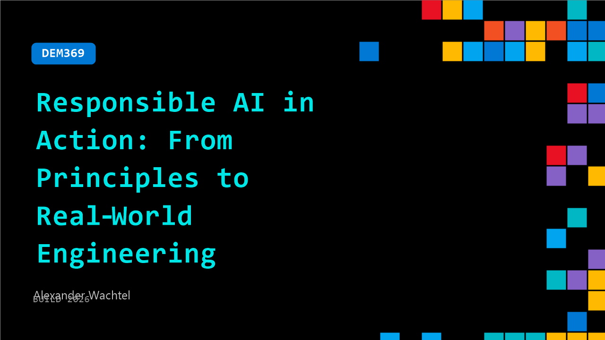

# DEM369: Responsible AI in Action: From Principles to Real‑World Engineering

**Session code:** DEM369  
**Date:** Wednesday, June 3, 2026 / 11:20 AM - 11:45 AM PDT (Duration 25 minutes)  
**Watch on-demand:** <https://build.microsoft.com/en-US/sessions/DEM369>

---

## Speakers

- **Alexander Wachtel** - Microsoft AI MVP, MCT & CEO, ESC Deutschland GmbH

## About the session

As AI moves into production, teams must keep models safe, compliant, and reliable without slowing delivery. This session shows how to implement Responsible AI directly in engineering workflows using Microsoft tools. Learn how to assess models, apply safety filters, enforce policies, and monitor risks in real time, plus explore new governance and explainability features that help you build trustworthy AI at scale.

Seating for this session is first-come, first-served. Add it to your schedule to plan your day and arrive early to secure a spot.

## AI summary

**Introduction and Purpose of the Demo:**
At 00:00:01, Alex, a Microsoft INDP and trainer, begins by welcoming the audience and introducing a demo focused on Responsible Line Action. He mentions the initiative was successfully run in Germany in January 2026, earning a Microsoft impact award. Alex encourages participants to replicate similar projects within their own Microsoft offices or local communities to enhance discussions around the theme of responsibility. He explains that the session will focus less on redefining AI principles and more on demonstrating practical applications for responsible AI using Microsoft technologies. The goal is to show how responsibility is incorporated through frameworks, standards, and implementation tools available for use across different setups.

**Evolution of AI Solutions and Microsoft's Technological Progress:**
Around 00:00:55–00:03:00, Alex transitions into a historical view of Microsoft’s advancements in building AI systems. He recalls early experiments at Microsoft Build events several years ago, where developers were able to build agents to access places like SharePoint Online or Azure Blob Storage. Initially, these solutions worked only as proofs of concept and remained “black box” systems, causing uncertainty about data transparency and control. Over time, Microsoft filled the missing “puzzle pieces” through continuous innovations at Build and Ignite conferences, enabling customers to move safely from proof-of-concept models to production-scale AI solutions. These advancements eliminated the phenomenon of “shadow AI,” turning opaque systems into manageable, measurable, and controllable environments—bringing AI development in alignment with traditional software engineering practices.

**Collaboration between Frameworks and Team Members:**
Between 00:03:53–00:07:03, Alex introduces his colleagues to illustrate Microsoft’s comprehensive ecosystem. Hannah represents Microsoft Fabric, managing integrated company data and ontologies; Rafael handles Copilot 365 compliance and legal aspects, ensuring adherence to privacy standards. Together, they demonstrate a complete cycle of responsibility from data management to compliance enforcement. Microsoft Fabric plays a key role by providing a unified platform where company data can be modeled as ontologies and queried via natural language agents. These agents can then be quickly published to Copilot in Microsoft 365 with a simple click, extending intelligent capabilities directly to organizational workflows. The updated design of Fabric and Copilot, as noted in Alex’s demo, emphasizes usability and security, making AI integration more intuitive and manageable for any enterprise user.

**Compliance, Monitoring, and Purview Integration:**
In the next segment from 00:09:40–00:15:00, Rafael’s participation brings focus to Microsoft Purview, which manages data privacy, compliance, and monitoring across AI services. Purview provides visibility into agent activity and flags sensitive information or unusual interactions. Alex demonstrates how Purview assists in identifying potential misuse or policy violations, such as improper querying of confidential data, by generating logs and compliance alerts. The platform maintains 30-day activity records, enabling organizations to perform advanced hunting through Defender tools to investigate anomalies. The demo showcases Purview’s evolution from a mere compliance system into a sophisticated Data Security Posture Management (DSPM) solution. It highlights how users must monitor and control their tenants, since Microsoft ensures a secure baseline but relies on users to maintain responsible operations of agents and their outputs.

**Agent Evaluation, Tracing, and Security Enhancements:**
From 00:16:00–00:22:02, Alex delves into how AI agents are tested, evaluated, and secured inside Microsoft Foundry. He demonstrates tracing and monitoring options—showing metrics like coherence, grounding, token usage, and error rates—all visible through Azure Monitor and Application Insights integration. Developers can perform scheduled evaluations and red teaming tests to ensure security robustness. Using Microsoft’s SDKs, AI models, datasets, and conversational agents can be systematically evaluated and monitored for reliability. Alex shows how automatic evaluations and trace-based data sets simplify iterative improvement. The segment also covers advanced analytics with Kusto Query Language (KQL), allowing users to perform in-depth log hunting similar to SQL but tailored for cloud AI operations. These monitoring features ensure transparency and auditability across all AI tasks, closing the loop on responsible lifecycle management.

**Red Teaming, Guardrails, and Conclusion:**
In the final section from 00:22:03–00:25:38, the demo illustrates Microsoft’s red teaming process, where agents are tested against harmful prompts and restricted actions. When queries breach defined security policies—such as attempts to retrieve confidential or financial information—the system issues restrictions automatically. Alex demonstrates how developers can reinforce agent safety using custom guardrails and regex-based block lists to prevent specific outputs, like detecting credit card numbers or betting odds. This approach ensures ongoing protection against malicious or unauthorized instructions. He also introduces an AI Gateway for API management that tracks token usage, sets user quotas, and prevents system overloads due to excessive requests—improving cost control and risk mitigation. Alex concludes the demo by emphasizing the importance of responsible management, continuous compliance monitoring, and proactive reinforcement of ethical and secure AI practices within every organization.

## Session tags

- **Session type:** Demo
- **Level:** (300) Advanced
- **Topic:** Responsible AI
- **Tags:** Community, MVP
- **Location:** Festival Pavilion, Theater A
