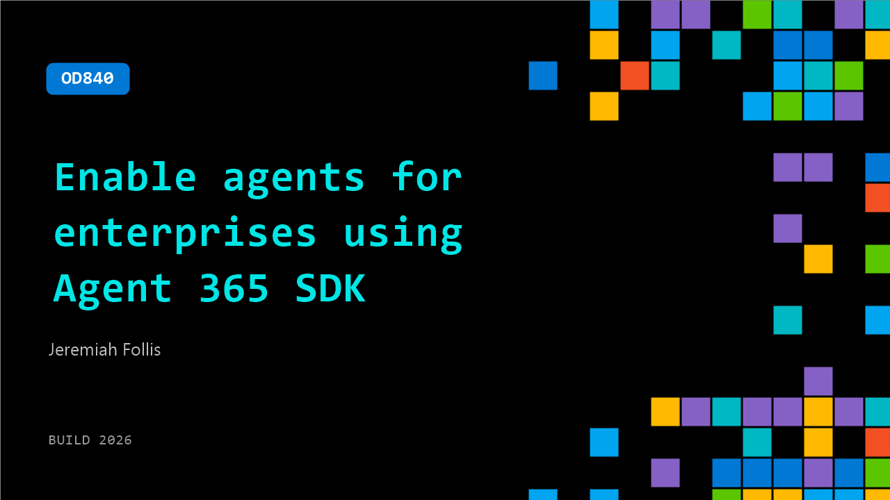

# OD840: Enable agents for enterprises using Agent 365 SDK

**Session code:** OD840  
**Watch on-demand:** <https://build.microsoft.com/en-US/sessions/OD840>

---

## Speakers

- **Jeremiah Follis** - Product Marketing Manager, Microsoft

## About the session

As agents move from prototypes into real business workflows, organizations need a way to make custom and third-party agents visible, governable, and secure at enterprise scale. This session shows how Agent 365 SDK helps bring agents into an enterprise-ready control plane so teams can manage identity, observability, governance, and security with confidence.

## AI summary

_No AI summary available._

## Session tags

- **Session type:** Pre-recorded
- **Level:** (200) Intermediate
- **Topic:** Responsible AI
- **Tags:** Security, Agent 365, Responsible AI, Governance, Enterprise, Identity
