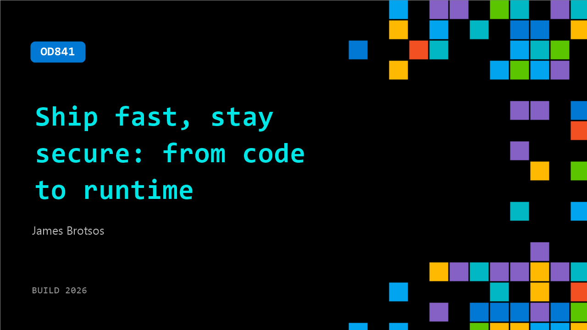

# OD841: Ship fast, stay secure: from code to runtime

**Session code:** OD841  
**Watch on-demand:** <https://build.microsoft.com/en-US/sessions/OD841>

---

## Speakers

- **James Brotsos** - Principal Product Manager, Microsoft

## About the session

You write the code. You own the pipeline. Now security is yours too — but it doesn't have to slow you down. See how Defender for Cloud and GitHub Advanced Security catch vulnerabilities where you already work: your CLI, your repo, your pull request, your cloud. No workflow changes required.

## AI summary

_No AI summary available._

## Session tags

- **Session type:** Pre-recorded
- **Level:** (300) Advanced
- **Topic:** Responsible AI
- **Tags:** Security, GitHub Advanced Security, Responsible AI, DevSecOps
