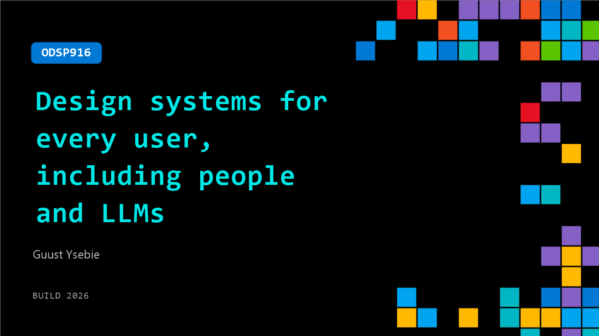

# ODSP916: Design systems for every user, including people and LLMs

**Session code:** ODSP916  
**Watch on-demand:** <https://build.microsoft.com/en-US/sessions/ODSP916>

---

## Speakers

- **Guust Ysebie** - Senior Software Engineer, Apryse

## About the session

Accessibility is often viewed as a usability feature or compliance requirement, important but secondary. In AI‑driven systems, that no longer holds. LLMs interpret the content we produce, and their reliability depends on structure, semantics, and clarity. Accessible content is easier for humans and machines to understand, process, and reuse. This session reframes accessibility as a systems‑level engineering concern, showing why it outperforms OCR and leads to safer, more predictable AI outcomes.

## AI summary

**Introduction and Objectives:** At 00:00:01, Guust Ysebie opens the session by introducing himself and outlining the topic — designing systems for all users, including both people and large language models (LLMs). He explains that his work focuses on PDF accessibility within enterprise environments and emphasizes the relevance of accessibility across both human and machine consumers. The guiding principles introduced — perceivable, operable, understandable, and robust — are identified as crucial for making digital documents universally accessible 00:00:45.

**Understanding PDF Structures and Challenges for LLMs:** Beginning around 00:01:01, Ysebie explains how PDFs function as physical data formats combining text, images, and other media through drawing instructions. These instructions render content at precise coordinates on a canvas 00:01:19. While humans interpret these visuals intuitively, LLMs perceive only pixel data, making text extraction and semantic understanding difficult without additional processing. He contrasts the human ability to intuit reading order and meaning with the LLM’s lack of inherent context, emphasizing how missing semantics complicates efficient LLM training and comprehension 00:02:23.

**Semantic PDFs and Structured Accessibility:** From 00:03:32, the discussion turns to the solution provided by tagged PDFs. Ysebie explains that while early PDFs lacked semantic structure, modern ones can embed metadata defining document elements such as headers, paragraphs, and tables. Using such tags mirrors HTML-like organization while preserving pixel-perfect rendering, providing clarity for assistive technologies and LLMs alike. The addition of metadata simplifies searching, extraction, and accessibility workflows. He notes that this structured model transforms unstructured content into meaning-rich data layers, enabling smarter applications and analysis tools 00:04:49.

**Demonstration of OCR and Embedded Text Extraction:** Starting around 00:05:26, Ysebie presents a live demo comparing two methods of data extraction from PDFs: using Docling (OCR-based) and using iText (tag-based). He describes running Docling to convert a multi-page PDF to Markdown 00:06:34, noting its reliance on pixel-level interpretation and extended runtime of about 18 seconds 00:07:33. Although the OCR output preserves tables and lists, it also incorrectly extracts artifacts like watermarks, which may pose risks in AI training pipelines. By contrast, iText completes extraction in only 0.075 seconds 00:08:42, producing structurally accurate data without unintended elements and showing 200x better performance and reliability.

**Results and Comparative Analysis:** In the following segment (00:09:00–00:10:04), Ysebie compares the semantic accuracy of both methods. He highlights that Docling’s OCR failed to detect sublists correctly due to missing contextual tags, whereas iText accurately maintained hierarchy and author intent. This emphasizes how loss of metadata leads to compounded errors over time, affecting LLM training and business data extraction. Tagged PDF structures thus enable safer, faster, and semantically sound outputs that reflect true document design intent.

**Best Practices and Conclusion:** Closing around 00:10:17, Ysebie stresses the importance of designing PDFs for understanding, not just for rendering. He advises enabling embedded metadata using appropriate library options and verifying that tags accurately mirror the author’s intent. Doing so unlocks advantages like smarter extraction, easier searching, and accessible documents 00:10:52. He concludes by reinforcing that accessibility is not extra work but a strategic investment that strengthens both user experience and AI data infrastructure, leading to competitive gains in document processing efficiency. He ends with an invitation for further questions and collaboration 00:11:31.

## Session tags

- **Session type:** Pre-recorded
- **Level:** (200) Intermediate
- **Topic:** Responsible AI
- **Tags:** AI, Automation, Platform Engineering, Reliability, Developer, Data
