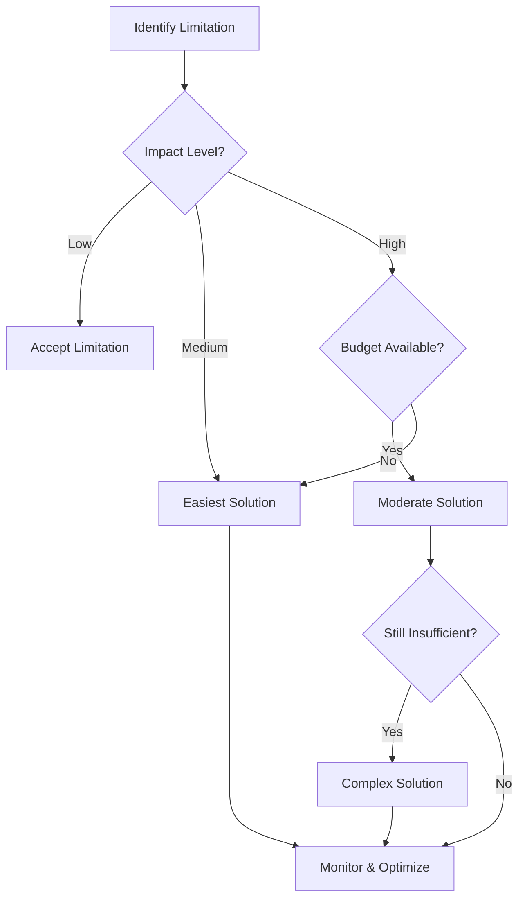

# Azure Web Apps Limitations

This article provides a comprehensive analysis of <mark>Azure Web Apps limitations</mark> and practical solutions to overcome them. Solutions are presented from simplest to most complex, with detailed implementation guidance.

## 📑 Table of Contents

1. [🚀 Performance and Scaling Limitations](#1--performance-and-scaling-limitations)
   - Configuration Adjustments
   - Scale Up/Out Strategies
   - Performance Optimization
2. [💾 Storage and File System Limitations](#2--storage-and-file-system-limitations)
   - Local Storage Workarounds
   - External Storage Integration
   - Persistent Storage Solutions
3. [🌐 Networking and Connectivity Limitations](#3--networking-and-connectivity-limitations)
   - DNS and Domain Configuration
   - IP Address and Port Restrictions
   - Virtual Network Integration
4. [⏱️ Runtime and Execution Limitations](#4--runtime-and-execution-limitations)
   - Timeout Management
   - Process and Thread Handling
   - Resource Consumption Optimization
5. [🔧 Platform and Technology Limitations](#5--platform-and-technology-limitations)
   - Runtime Stack Constraints
   - Feature Availability
   - Custom Extension Solutions
6. [📊 Monitoring and Diagnostics Limitations](#6--monitoring-and-diagnostics-limitations)
   - Built-in Monitoring Enhancement
   - External Monitoring Integration
   - Advanced Diagnostics Setup
7. [✅ Best Practices Summary](#7--best-practices-summary)
8. [📚 References](#8--references)

**Appendices:**
- [A. Advanced Configuration Details](#appendix-a-advanced-configuration-details)
- [B. Complex Migration Scenarios](#appendix-b-complex-migration-scenarios)
- [C. Enterprise-Scale Solutions](#appendix-c-enterprise-scale-solutions)

---

## 1. 🚀 Performance and Scaling Limitations

### 1.1 Request Timeout Limitations (230 seconds)

**Problem:** Azure Web Apps have a hard limit of **<mark>230 seconds** for HTTP requests, which can cause issues for long-running operations.

#### Solution 1: Asynchronous Processing Pattern (Easiest)

**Implementation:**
```csharp
// Controller for long-running operations
[ApiController]
public class AsyncController : ControllerBase
{
    [HttpPost("start-job")]
    public async Task<IActionResult> StartJob([FromBody] JobRequest request)
    {
        var jobId = Guid.NewGuid().ToString();
        
        // Queue the job for background processing
        await _queueService.EnqueueAsync(new JobMessage 
        { 
            JobId = jobId, 
            Data = request 
        });
        
        return Accepted(new { JobId = jobId, StatusUrl = $"/api/job-status/{jobId}" });
    }
    
    [HttpGet("job-status/{jobId}")]
    public async Task<IActionResult> GetJobStatus(string jobId)
    {
        var status = await _jobStatusService.GetStatusAsync(jobId);
        return Ok(status);
    }
}
```

**Pros:**
- ✅ Simple to implement
- ✅ Follows HTTP best practices
- ✅ Better user experience
- ✅ Scalable pattern

**Cons:**
- ❌ Requires status polling mechanism
- ❌ More complex client-side handling
- ❌ Additional storage for job status

#### Solution 2: Azure Service Bus Integration (Moderate)

**Implementation:**
```csharp
// Using Azure Service Bus for reliable messaging
public class ServiceBusJobProcessor
{
    private readonly ServiceBusClient _client;
    private readonly ServiceBusSender _sender;
    
    public async Task<string> EnqueueJobAsync<T>(T jobData)
    {
        var jobId = Guid.NewGuid().ToString();
        var message = new ServiceBusMessage(JsonSerializer.Serialize(jobData))
        {
            MessageId = jobId,
            ContentType = "application/json"
        };
        
        await _sender.SendMessageAsync(message);
        return jobId;
    }
}

// Background service to process messages
public class JobProcessorService : BackgroundService
{
    protected override async Task ExecuteAsync(CancellationToken stoppingToken)
    {
        await foreach (var message in _receiver.ReceiveMessagesAsync(stoppingToken))
        {
            try
            {
                // Process long-running job
                await ProcessJobAsync(message);
                await _receiver.CompleteMessageAsync(message);
            }
            catch (Exception ex)
            {
                await _receiver.AbandonMessageAsync(message);
                // Log error
            }
        }
    }
}
```

**Pros:**
- ✅ Reliable message delivery
- ✅ Built-in retry mechanisms
- ✅ Dead letter queue support
- ✅ Scales automatically

**Cons:**
- ❌ Additional Azure service costs
- ❌ More complex setup
- ❌ Requires Service Bus knowledge

### 1.2 Memory Limitations by Service Plan

**Problem:** Memory limits vary by service plan and can cause OutOfMemory exceptions.

#### Solution 1: Memory Optimization (Easiest)

**Implementation:**
```csharp
// Memory-efficient data processing
public class EfficientDataProcessor
{
    public async Task<ProcessResult> ProcessLargeDataset(Stream dataStream)
    {
        const int batchSize = 1000;
        var result = new ProcessResult();
        
        // Process in batches to manage memory
        await foreach (var batch in ReadBatchesAsync(dataStream, batchSize))
        {
            ProcessBatch(batch);
            
            // Force garbage collection periodically
            if (result.ProcessedCount % (batchSize * 10) == 0)
            {
                GC.Collect();
                GC.WaitForPendingFinalizers();
            }
        }
        
        return result;
    }
    
    private async IAsyncEnumerable<T[]> ReadBatchesAsync<T>(
        Stream stream, int batchSize)
    {
        var batch = new List<T>(batchSize);
        
        await foreach (var item in DeserializeStreamAsync<T>(stream))
        {
            batch.Add(item);
            
            if (batch.Count >= batchSize)
            {
                yield return batch.ToArray();
                batch.Clear();
            }
        }
        
        if (batch.Count > 0)
            yield return batch.ToArray();
    }
}
```

**Pros:**
- ✅ No additional costs
- ✅ Immediate implementation
- ✅ Better memory utilization

**Cons:**
- ❌ May impact performance
- ❌ Requires code changes
- ❌ Limited by fundamental constraints

#### Solution 2: Scale Up Service Plan (Moderate)

**Implementation via ARM Template:**
```json
{
    "$schema": "https://schema.management.azure.com/schemas/2019-04-01/deploymentTemplate.json#",
    "contentVersion": "1.0.0.0",
    "parameters": {
        "webAppName": {
            "type": "string"
        },
        "sku": {
            "type": "string",
            "defaultValue": "P1v3",
            "allowedValues": ["B1", "B2", "B3", "S1", "S2", "S3", "P1v3", "P2v3", "P3v3"]
        }
    },
    "resources": [
        {
            "type": "Microsoft.Web/serverfarms",
            "apiVersion": "2022-03-01",
            "name": "[concat(parameters('webAppName'), '-plan')]",
            "location": "[resourceGroup().location]",
            "sku": {
                "name": "[parameters('sku')]"
            },
            "properties": {
                "reserved": false
            }
        }
    ]
}
```

**Pros:**
- ✅ More memory and CPU
- ✅ Better performance
- ✅ Minimal code changes

**Cons:**
- ❌ Higher costs
- ❌ May still hit limits on largest plans
- ❌ Vertical scaling limits

### 1.3 Concurrent Connection Limitations

**Problem:** Limited number of concurrent outbound connections can cause connection pool exhaustion.

#### Solution 1: Connection Pool Management (Easiest)

**Implementation:**
```csharp
public class HttpClientService
{
    private static readonly HttpClient _httpClient = new HttpClient(new SocketsHttpHandler()
    {
        PooledConnectionLifetime = TimeSpan.FromMinutes(15),
        PooledConnectionIdleTimeout = TimeSpan.FromMinutes(2),
        MaxConnectionsPerServer = 50
    });
    
    public async Task<T> GetAsync<T>(string url)
    {
        using var response = await _httpClient.GetAsync(url);
        response.EnsureSuccessStatusCode();
        
        var json = await response.Content.ReadAsStringAsync();
        return JsonSerializer.Deserialize<T>(json);
    }
}

// Configure in Startup/Program.cs
services.AddHttpClient<ApiService>(client =>
{
    client.Timeout = TimeSpan.FromSeconds(30);
})
.ConfigurePrimaryHttpMessageHandler(() => new SocketsHttpHandler()
{
    PooledConnectionLifetime = TimeSpan.FromMinutes(15),
    MaxConnectionsPerServer = 100
});
```

**Pros:**
- ✅ Better connection reuse
- ✅ Reduces connection exhaustion
- ✅ Improved performance

**Cons:**
- ❌ Requires careful tuning
- ❌ May not solve all scenarios
- ❌ Complex debugging

#### Solution 2: Scale Out with Load Balancing (Moderate)

**Implementation:**
```yaml
# Azure CLI commands for scale out
az webapp scale --name myapp --resource-group mygroup --instance-count 3

# Application Request Routing (ARR) configuration
az webapp config set --name myapp --resource-group mygroup \
    --generic-configurations '{"ARR_DISABLE_SESSION_AFFINITY": "true"}'
```

**Pros:**
- ✅ Distributes load across instances
- ✅ Higher total connection capacity
- ✅ Better fault tolerance

**Cons:**
- ❌ Higher costs (multiple instances)
- ❌ Session state complexity
- ❌ Requires stateless design

---

## 2. 💾 Storage and File System Limitations

### 2.1 Local File System Restrictions

**Problem:** Azure Web Apps have read-only file system except for specific directories, and limited local storage.

#### Solution 1: Use Allowed Writable Directories (Easiest)

**Implementation:**
```csharp
public class FileStorageService
{
    private readonly string _tempPath;
    private readonly string _localPath;
    
    public FileStorageService()
    {
        // These directories are writable in Azure Web Apps
        _tempPath = Path.Combine(Path.GetTempPath());
        _localPath = Environment.GetEnvironmentVariable("TEMP") ?? 
                    Environment.GetEnvironmentVariable("TMP") ?? 
                    "/tmp";
    }
    
    public async Task<string> SaveTemporaryFile(Stream fileStream, string fileName)
    {
        var tempFileName = Path.Combine(_tempPath, $"{Guid.NewGuid()}_{fileName}");
        
        using var fileStreamOut = new FileStream(tempFileName, FileMode.Create);
        await fileStream.CopyToAsync(fileStreamOut);
        
        // Schedule cleanup
        _ = Task.Delay(TimeSpan.FromHours(1))
            .ContinueWith(_ => DeleteFileIfExists(tempFileName));
        
        return tempFileName;
    }
    
    private void DeleteFileIfExists(string filePath)
    {
        try
        {
            if (File.Exists(filePath))
                File.Delete(filePath);
        }
        catch (Exception ex)
        {
            // Log but don't throw
            Console.WriteLine($"Failed to delete temp file: {ex.Message}");
        }
    }
}
```

**Pros:**
- ✅ No additional services needed
- ✅ Fast access
- ✅ Simple implementation

**Cons:**
- ❌ Files lost on app restart
- ❌ Limited storage space
- ❌ Not suitable for persistent data

#### Solution 2: Azure Blob Storage Integration (Moderate)

**Implementation:**
```csharp
public class BlobStorageService
{
    private readonly BlobServiceClient _blobServiceClient;
    private readonly string _containerName;
    
    public BlobStorageService(IConfiguration configuration)
    {
        _blobServiceClient = new BlobServiceClient(
            configuration.GetConnectionString("AzureStorage"));
        _containerName = configuration["BlobStorage:ContainerName"];
    }
    
    public async Task<string> UploadFileAsync(Stream fileStream, string fileName)
    {
        var containerClient = _blobServiceClient.GetBlobContainerClient(_containerName);
        await containerClient.CreateIfNotExistsAsync(PublicAccessType.None);
        
        var blobName = $"{DateTime.UtcNow:yyyy/MM/dd}/{Guid.NewGuid()}/{fileName}";
        var blobClient = containerClient.GetBlobClient(blobName);
        
        await blobClient.UploadAsync(fileStream, new BlobHttpHeaders 
        { 
            ContentType = GetContentType(fileName) 
        });
        
        return blobClient.Uri.ToString();
    }
    
    public async Task<Stream> DownloadFileAsync(string blobName)
    {
        var containerClient = _blobServiceClient.GetBlobContainerClient(_containerName);
        var blobClient = containerClient.GetBlobClient(blobName);
        
        var response = await blobClient.DownloadStreamingAsync();
        return response.Value.Content;
    }
    
    private string GetContentType(string fileName)
    {
        var extension = Path.GetExtension(fileName).ToLowerInvariant();
        return extension switch
        {
            ".jpg" or ".jpeg" => "image/jpeg",
            ".png" => "image/png",
            ".pdf" => "application/pdf",
            ".txt" => "text/plain",
            _ => "application/octet-stream"
        };
    }
}
```

**Pros:**
- ✅ Persistent storage
- ✅ Unlimited capacity
- ✅ Global accessibility
- ✅ Built-in redundancy

**Cons:**
- ❌ Additional service costs
- ❌ Network latency for access
- ❌ More complex error handling

### 2.2 Database Connection Limitations

**Problem:** Limited number of concurrent database connections and connection pool exhaustion.

#### Solution 1: Connection String Optimization (Easiest)

**Implementation:**
```csharp
public class DatabaseConfiguration
{
    public static string GetOptimizedConnectionString(IConfiguration configuration)
    {
        var baseConnectionString = configuration.GetConnectionString("DefaultConnection");
        
        var builder = new SqlConnectionStringBuilder(baseConnectionString)
        {
            // Optimize connection pooling
            Pooling = true,
            MinPoolSize = 5,
            MaxPoolSize = 100,
            ConnectionLifetime = 600, // 10 minutes
            
            // Optimize timeouts
            ConnectTimeout = 30,
            CommandTimeout = 300, // 5 minutes for long operations
            
            // Enable connection resiliency
            ConnectRetryCount = 3,
            ConnectRetryInterval = 10
        };
        
        return builder.ConnectionString;
    }
}

// Entity Framework configuration
services.AddDbContext<ApplicationDbContext>(options =>
{
    options.UseSqlServer(
        DatabaseConfiguration.GetOptimizedConnectionString(Configuration),
        sqlOptions =>
        {
            sqlOptions.EnableRetryOnFailure(
                maxRetryCount: 3,
                maxRetryDelay: TimeSpan.FromSeconds(30),
                errorNumbersToAdd: null);
        });
});
```

**Pros:**
- ✅ Better connection utilization
- ✅ Reduced connection timeouts
- ✅ Built-in retry logic

**Cons:**
- ❌ Still limited by service plan
- ❌ Requires careful tuning
- ❌ May not solve high-load scenarios

#### Solution 2: Connection Proxy and Pooling (Moderate)

**Implementation:**
```csharp
// Custom connection factory with monitoring
public class ManagedConnectionFactory
{
    private readonly string _connectionString;
    private readonly SemaphoreSlim _connectionSemaphore;
    private readonly ILogger _logger;
    
    public ManagedConnectionFactory(string connectionString, int maxConnections, ILogger logger)
    {
        _connectionString = connectionString;
        _connectionSemaphore = new SemaphoreSlim(maxConnections, maxConnections);
        _logger = logger;
    }
    
    public async Task<T> ExecuteWithConnectionAsync<T>(Func<IDbConnection, Task<T>> operation)
    {
        await _connectionSemaphore.WaitAsync();
        
        try
        {
            using var connection = new SqlConnection(_connectionString);
            await connection.OpenAsync();
            
            return await operation(connection);
        }
        catch (Exception ex)
        {
            _logger.LogError(ex, "Database operation failed");
            throw;
        }
        finally
        {
            _connectionSemaphore.Release();
        }
    }
}

// Usage with dependency injection
services.AddSingleton<ManagedConnectionFactory>(provider =>
{
    var configuration = provider.GetService<IConfiguration>();
    var logger = provider.GetService<ILogger<ManagedConnectionFactory>>();
    var connectionString = configuration.GetConnectionString("DefaultConnection");
    
    return new ManagedConnectionFactory(connectionString, maxConnections: 50, logger);
});
```

**Pros:**
- ✅ Fine-grained connection control
- ✅ Better monitoring and diagnostics
- ✅ Prevents connection exhaustion

**Cons:**
- ❌ Additional complexity
- ❌ Custom implementation maintenance
- ❌ Potential bottleneck

---

## 3. 🌐 Networking and Connectivity Limitations

### 3.1 Outbound IP Address Changes

**Problem:** Outbound IP addresses can change when scaling or during platform maintenance, breaking firewall rules.

#### Solution 1: Use All Possible Outbound IPs in Firewall (Easiest)

**Implementation:**
```powershell
# Get all possible outbound IP addresses
$webApp = Get-AzWebApp -ResourceGroupName "myResourceGroup" -Name "myWebApp"

# Get current outbound IPs
$outboundIPs = $webApp.OutboundIpAddresses -split ","

# Get all possible outbound IPs
$possibleOutboundIPs = $webApp.PossibleOutboundIpAddresses -split ","

Write-Host "Configure firewall for these IPs:"
$possibleOutboundIPs | ForEach-Object { Write-Host $_ }
```

```sql
-- SQL Server firewall rules (example)
-- Add all possible outbound IPs to SQL Server firewall
EXEC sp_set_firewall_rule 
    N'WebApp-OutboundIP-1', '20.1.2.3', '20.1.2.3'
EXEC sp_set_firewall_rule 
    N'WebApp-OutboundIP-2', '20.1.2.4', '20.1.2.4'
-- ... repeat for all possible IPs
```

**Pros:**
- ✅ Simple to implement
- ✅ Covers all scenarios
- ✅ No additional costs

**Cons:**
- ❌ Overly permissive security
- ❌ Large IP range to manage
- ❌ May not meet compliance requirements

#### Solution 2: NAT Gateway Integration (Moderate)

**Implementation:**
```json
{
    "$schema": "https://schema.management.azure.com/schemas/2019-04-01/deploymentTemplate.json#",
    "contentVersion": "1.0.0.0",
    "resources": [
        {
            "type": "Microsoft.Network/publicIPAddresses",
            "apiVersion": "2022-05-01",
            "name": "natGatewayPublicIP",
            "location": "[resourceGroup().location]",
            "sku": {
                "name": "Standard"
            },
            "properties": {
                "publicIPAllocationMethod": "Static"
            }
        },
        {
            "type": "Microsoft.Network/natGateways",
            "apiVersion": "2022-05-01",
            "name": "webAppNatGateway",
            "location": "[resourceGroup().location]",
            "sku": {
                "name": "Standard"
            },
            "dependsOn": [
                "[resourceId('Microsoft.Network/publicIPAddresses', 'natGatewayPublicIP')]"
            ],
            "properties": {
                "publicIpAddresses": [
                    {
                        "id": "[resourceId('Microsoft.Network/publicIPAddresses', 'natGatewayPublicIP')]"
                    }
                ]
            }
        }
    ]
}
```

**Pros:**
- ✅ Static outbound IP
- ✅ Dedicated NAT capacity
- ✅ Better security control

**Cons:**
- ❌ Additional costs
- ❌ Requires VNet integration
- ❌ More complex setup

### 3.2 Custom Domain and SSL Limitations

**Problem:** Free tier doesn't support custom domains, SSL certificate management complexity.

#### Solution 1: App Service Managed Certificates (Easiest)

**Implementation:**
```powershell
# Add custom domain
$webApp = Get-AzWebApp -ResourceGroupName "myResourceGroup" -Name "myWebApp"
Set-AzWebAppCustomDomain -WebApp $webApp -Name "www.mydomain.com"

# Create managed certificate
$cert = New-AzWebAppSSLBinding -WebApp $webApp -Name "www.mydomain.com" -CertificateFilePath $null
```

```csharp
// Redirect HTTP to HTTPS in ASP.NET Core
public void Configure(IApplicationBuilder app, IWebHostEnvironment env)
{
    if (!env.IsDevelopment())
    {
        // Force HTTPS
        app.UseHttpsRedirection();
        
        // Add HSTS header
        app.UseHsts();
    }
}

// Configure HSTS
services.AddHsts(options =>
{
    options.Preload = true;
    options.IncludeSubDomains = true;
    options.MaxAge = TimeSpan.FromDays(365);
});
```

**Pros:**
- ✅ Free SSL certificates
- ✅ Automatic renewal
- ✅ Easy setup

**Cons:**
- ❌ Limited to App Service domains
- ❌ Requires Standard tier or higher
- ❌ Limited certificate types

#### Solution 2: Azure Key Vault Certificate Integration (Moderate)

**Implementation:**
```csharp
public class CertificateService
{
    private readonly KeyVaultClient _keyVaultClient;
    private readonly string _keyVaultUrl;
    
    public CertificateService(KeyVaultClient keyVaultClient, IConfiguration configuration)
    {
        _keyVaultClient = keyVaultClient;
        _keyVaultUrl = configuration["KeyVault:Url"];
    }
    
    public async Task<X509Certificate2> GetCertificateAsync(string certificateName)
    {
        try
        {
            var certificateBundle = await _keyVaultClient
                .GetCertificateAsync(_keyVaultUrl, certificateName);
            
            return new X509Certificate2(certificateBundle.Cer);
        }
        catch (Exception ex)
        {
            throw new CertificateException($"Failed to retrieve certificate {certificateName}", ex);
        }
    }
}

// Configure certificate in Startup
services.Configure<KestrelServerOptions>(options =>
{
    options.ConfigureHttpsDefaults(httpsOptions =>
    {
        httpsOptions.ServerCertificateSelector = (context, name) =>
        {
            // Load certificate from Key Vault based on SNI
            return LoadCertificateFromKeyVault(name);
        };
    });
});
```

**Pros:**
- ✅ Centralized certificate management
- ✅ Support for custom certificates
- ✅ Integration with enterprise PKI

**Cons:**
- ❌ Additional Key Vault costs
- ❌ More complex setup
- ❌ Requires certificate management expertise

---

## 4. ⏱️ Runtime and Execution Limitations

### 4.1 Cold Start Delays

**Problem:** Applications experience delays when starting after periods of inactivity.

#### Solution 1: Application Warm-up Configuration (Easiest)

**Implementation:**
```xml
<!-- web.config for warm-up -->
<configuration>
  <system.webServer>
    <applicationWarmup>
      <add initializationPage="/api/health" />
      <add initializationPage="/api/warmup" />
    </applicationWarmup>
  </system.webServer>
</configuration>
```

```csharp
// Warm-up controller
[ApiController]
[Route("api/[controller]")]
public class WarmupController : ControllerBase
{
    private readonly IServiceProvider _serviceProvider;
    
    public WarmupController(IServiceProvider serviceProvider)
    {
        _serviceProvider = serviceProvider;
    }
    
    [HttpGet]
    public async Task<IActionResult> Warmup()
    {
        // Initialize critical services
        var dbContext = _serviceProvider.GetService<ApplicationDbContext>();
        await dbContext.Database.CanConnectAsync();
        
        var cache = _serviceProvider.GetService<IMemoryCache>();
        cache.Set("warmup", DateTime.UtcNow);
        
        return Ok(new { Status = "Warmed up", Timestamp = DateTime.UtcNow });
    }
}
```

**Pros:**
- ✅ Reduces initial request latency
- ✅ Configurable warm-up paths
- ✅ No additional costs

**Cons:**
- ❌ Still has some delay
- ❌ Limited effectiveness
- ❌ Doesn't prevent all cold starts

#### Solution 2: Always On + Health Check Pinging (Moderate)

**Implementation:**
```csharp
// Health check service
public class ComprehensiveHealthCheck : IHealthCheck
{
    private readonly ApplicationDbContext _dbContext;
    private readonly IMemoryCache _cache;
    private readonly HttpClient _httpClient;
    
    public async Task<HealthCheckResult> CheckHealthAsync(
        HealthCheckContext context, 
        CancellationToken cancellationToken = default)
    {
        var tasks = new List<Task<(string name, bool healthy)>>
        {
            CheckDatabaseAsync(),
            CheckCacheAsync(),
            CheckExternalServiceAsync()
        };
        
        var results = await Task.WhenAll(tasks);
        var unhealthy = results.Where(r => !r.healthy).ToList();
        
        if (unhealthy.Any())
        {
            return HealthCheckResult.Unhealthy(
                $"Unhealthy components: {string.Join(", ", unhealthy.Select(u => u.name))}");
        }
        
        return HealthCheckResult.Healthy("All systems operational");
    }
    
    private async Task<(string, bool)> CheckDatabaseAsync()
    {
        try
        {
            await _dbContext.Database.CanConnectAsync();
            return ("Database", true);
        }
        catch
        {
            return ("Database", false);
        }
    }
}

// External monitoring service (Azure Logic App example)
{
    "definition": {
        "$schema": "https://schema.management.azure.com/providers/Microsoft.Logic/schemas/2016-06-01/workflowdefinition.json#",
        "triggers": {
            "Recurrence": {
                "recurrence": {
                    "frequency": "Minute",
                    "interval": 5
                },
                "type": "Recurrence"
            }
        },
        "actions": {
            "HTTP": {
                "type": "Http",
                "inputs": {
                    "method": "GET",
                    "uri": "https://myapp.azurewebsites.net/health"
                }
            }
        }
    }
}
```

**Pros:**
- ✅ Keeps application warm
- ✅ Monitors application health
- ✅ Automatic recovery detection

**Cons:**
- ❌ Higher costs (Always On feature)
- ❌ Additional monitoring complexity
- ❌ Still some cold start scenarios

### 4.2 Background Task Limitations

**Problem:** Limited support for long-running background tasks and no native scheduled job support.

#### Solution 1: Hosted Services with Cancellation (Easiest)

**Implementation:**
```csharp
public class BackgroundTaskService : BackgroundService
{
    private readonly IServiceProvider _serviceProvider;
    private readonly ILogger<BackgroundTaskService> _logger;
    
    public BackgroundTaskService(
        IServiceProvider serviceProvider,
        ILogger<BackgroundTaskService> logger)
    {
        _serviceProvider = serviceProvider;
        _logger = logger;
    }
    
    protected override async Task ExecuteAsync(CancellationToken stoppingToken)
    {
        while (!stoppingToken.IsCancellationRequested)
        {
            try
            {
                using var scope = _serviceProvider.CreateScope();
                var taskProcessor = scope.ServiceProvider.GetRequiredService<ITaskProcessor>();
                
                await taskProcessor.ProcessPendingTasksAsync(stoppingToken);
                
                // Wait before next execution
                await Task.Delay(TimeSpan.FromMinutes(5), stoppingToken);
            }
            catch (OperationCanceledException)
            {
                // Expected when cancellation is requested
                break;
            }
            catch (Exception ex)
            {
                _logger.LogError(ex, "Error in background task processing");
                
                // Wait before retrying
                await Task.Delay(TimeSpan.FromMinutes(1), stoppingToken);
            }
        }
    }
}

// Task processor with timeout handling
public class TaskProcessor : ITaskProcessor
{
    public async Task ProcessPendingTasksAsync(CancellationToken cancellationToken)
    {
        const int maxProcessingTime = 200; // Leave buffer for 230s limit
        
        using var timeoutCts = new CancellationTokenSource(TimeSpan.FromSeconds(maxProcessingTime));
        using var combinedCts = CancellationTokenSource.CreateLinkedTokenSource(
            cancellationToken, timeoutCts.Token);
        
        var tasks = await GetPendingTasksAsync();
        
        foreach (var task in tasks)
        {
            if (combinedCts.Token.IsCancellationRequested)
                break;
                
            await ProcessSingleTaskAsync(task, combinedCts.Token);
        }
    }
}
```

**Pros:**
- ✅ Built into .NET Core
- ✅ Proper cancellation handling
- ✅ Integrated with DI container

**Cons:**
- ❌ Limited by web app lifecycle
- ❌ No persistence across restarts
- ❌ May be terminated during scale events

#### Solution 2: Azure Functions Integration (Moderate)

**Implementation:**
```csharp
// Azure Function for scheduled tasks
[FunctionName("ScheduledDataProcessor")]
public class ScheduledDataProcessor
{
    private readonly IDataProcessor _dataProcessor;
    
    public ScheduledDataProcessor(IDataProcessor dataProcessor)
    {
        _dataProcessor = dataProcessor;
    }
    
    [FunctionName("ProcessDataDaily")]
    public async Task ProcessDataDaily(
        [TimerTrigger("0 0 2 * * *")] TimerInfo timer, // 2 AM daily
        ILogger log)
    {
        log.LogInformation($"Data processing started at: {DateTime.Now}");
        
        try
        {
            var result = await _dataProcessor.ProcessDailyDataAsync();
            log.LogInformation($"Processed {result.RecordsProcessed} records");
        }
        catch (Exception ex)
        {
            log.LogError(ex, "Failed to process daily data");
            throw; // Re-throw to trigger retry
        }
    }
}

// Web App integration to trigger on-demand processing
[ApiController]
[Route("api/[controller]")]
public class TaskController : ControllerBase
{
    private readonly string _functionAppUrl;
    private readonly HttpClient _httpClient;
    
    [HttpPost("trigger-processing")]
    public async Task<IActionResult> TriggerProcessing()
    {
        var functionUrl = $"{_functionAppUrl}/api/ProcessDataOnDemand";
        
        var response = await _httpClient.PostAsync(functionUrl, null);
        
        if (response.IsSuccessStatusCode)
        {
            return Accepted(new { Message = "Processing triggered successfully" });
        }
        
        return StatusCode(500, "Failed to trigger processing");
    }
}
```

**Pros:**
- ✅ Dedicated compute for background tasks
- ✅ Built-in scheduling support
- ✅ Automatic scaling and management

**Cons:**
- ❌ Additional service costs
- ❌ Separate deployment and monitoring
- ❌ Cross-service communication complexity

---

## 5. 🔧 Platform and Technology Limitations

### 5.1 Runtime Version Constraints

**Problem:** Limited availability of latest runtime versions and framework features.

#### Solution 1: Runtime Stack Configuration (Easiest)

**Implementation:**
```json
// Configure specific runtime in ARM template
{
    "type": "Microsoft.Web/sites",
    "apiVersion": "2022-03-01",
    "name": "[parameters('webAppName')]",
    "properties": {
        "siteConfig": {
            "linuxFxVersion": "DOTNETCORE|8.0",
            "appSettings": [
                {
                    "name": "DOTNET_FRAMEWORK_VERSION",
                    "value": "v8.0"
                }
            ]
        }
    }
}
```

```powershell
# Update runtime using Azure CLI
az webapp config set --resource-group myResourceGroup --name myWebApp --net-framework-version "v8.0"

# For Linux apps
az webapp config set --resource-group myResourceGroup --name myWebApp --linux-fx-version "DOTNETCORE|8.0"
```

**Pros:**
- ✅ Access to latest features
- ✅ Performance improvements
- ✅ Security updates

**Cons:**
- ❌ Limited to supported versions
- ❌ May have compatibility issues
- ❌ Delayed availability of newest versions

#### Solution 2: Container-Based Deployment (Moderate)

**Implementation:**
```dockerfile
# Custom Dockerfile with specific runtime
FROM mcr.microsoft.com/dotnet/aspnet:8.0-alpine AS base
WORKDIR /app
EXPOSE 80
EXPOSE 443

# Install additional runtime components
RUN apk add --no-cache \
    icu-libs \
    libgdiplus \
    fontconfig \
    ttf-dejavu

FROM mcr.microsoft.com/dotnet/sdk:8.0-alpine AS build
WORKDIR /src
COPY ["MyApp.csproj", "."]
RUN dotnet restore "./MyApp.csproj"
COPY . .
WORKDIR "/src/."
RUN dotnet build "MyApp.csproj" -c Release -o /app/build

FROM build AS publish
RUN dotnet publish "MyApp.csproj" -c Release -o /app/publish

FROM base AS final
WORKDIR /app
COPY --from=publish /app/publish .
ENTRYPOINT ["dotnet", "MyApp.dll"]
```

```yaml
# Azure DevOps pipeline for container deployment
trigger:
- main

pool:
  vmImage: 'ubuntu-latest'

variables:
  dockerRegistryServiceConnection: 'myACR'
  imageRepository: 'mywebapp'
  containerRegistry: 'myregistry.azurecr.io'
  dockerfilePath: '$(Build.SourcesDirectory)/Dockerfile'
  tag: '$(Build.BuildId)'

stages:
- stage: Build
  displayName: Build and push stage
  jobs:
  - job: Build
    displayName: Build
    steps:
    - task: Docker@2
      displayName: Build and push an image to container registry
      inputs:
        command: buildAndPush
        repository: $(imageRepository)
        dockerfile: $(dockerfilePath)
        containerRegistry: $(dockerRegistryServiceConnection)
        tags: |
          $(tag)
          latest
```

**Pros:**
- ✅ Full control over runtime environment
- ✅ Custom dependencies support
- ✅ Consistent across environments

**Cons:**
- ❌ Container management complexity
- ❌ Larger deployment artifacts
- ❌ Additional container registry costs

### 5.2 Extension and Module Limitations

**Problem:** Limited ability to install custom extensions or native modules.

#### Solution 1: Site Extensions (Easiest)

**Implementation:**
```powershell
# Install site extensions via PowerShell
$resourceGroup = "myResourceGroup"
$webAppName = "myWebApp"
$extensionName = "Microsoft.ApplicationInsights.AzureWebSites"

# Install extension
az webapp config appsettings set --resource-group $resourceGroup --name $webAppName --settings "APPINSIGHTS_INSTRUMENTATIONKEY=your-key"

# Enable specific features
az webapp config appsettings set --resource-group $resourceGroup --name $webAppName --settings "ApplicationInsightsAgent_EXTENSION_VERSION=~2"
```

```csharp
// Configure application to use available extensions
public void ConfigureServices(IServiceCollection services)
{
    // Use built-in Application Insights
    services.AddApplicationInsightsTelemetry();
    
    // Configure available logging providers
    services.AddLogging(builder =>
    {
        builder.AddConsole();
        builder.AddDebug();
        builder.AddApplicationInsights();
    });
}
```

**Pros:**
- ✅ Officially supported extensions
- ✅ Easy installation and management
- ✅ Integrated monitoring and diagnostics

**Cons:**
- ❌ Limited extension catalog
- ❌ Cannot install arbitrary modules
- ❌ No custom native dependencies

#### Solution 2: NuGet Package Alternatives (Moderate)

**Implementation:**
```xml
<!-- Use managed alternatives to native modules -->
<PackageReference Include="System.Drawing.Common" Version="8.0.0" />
<PackageReference Include="SkiaSharp" Version="2.88.6" />
<PackageReference Include="ImageSharp" Version="3.0.2" />
<PackageReference Include="Microsoft.Data.SqlClient" Version="5.1.1" />
<PackageReference Include="StackExchange.Redis" Version="2.7.4" />
```

```csharp
// Image processing without native dependencies
public class ImageProcessorService
{
    public async Task<byte[]> ProcessImageAsync(Stream inputStream, int width, int height)
    {
        // Using ImageSharp instead of System.Drawing
        using var image = await Image.LoadAsync(inputStream);
        
        image.Mutate(x => x.Resize(new ResizeOptions
        {
            Size = new Size(width, height),
            Mode = ResizeMode.Crop
        }));
        
        using var outputStream = new MemoryStream();
        await image.SaveAsJpegAsync(outputStream);
        return outputStream.ToArray();
    }
}

// PDF processing without native dependencies
public class PdfService
{
    public async Task<byte[]> GeneratePdfAsync(string htmlContent)
    {
        // Use libraries that don't require native dependencies
        var renderer = new ChromePdfRenderer();
        var pdf = await renderer.RenderHtmlAsPdfAsync(htmlContent);
        return pdf.BinaryData;
    }
}
```

**Pros:**
- ✅ Cross-platform compatibility
- ✅ No deployment complexity
- ✅ Better performance characteristics

**Cons:**
- ❌ May have feature limitations
- ❌ Different API than native alternatives
- ❌ Potential licensing costs

---

## 6. 📊 Monitoring and Diagnostics Limitations

### 6.1 Limited Built-in Monitoring

**Problem:** Basic monitoring capabilities may not provide sufficient insights for complex applications.

#### Solution 1: Enhanced Application Insights Configuration (Easiest)

**Implementation:**
```csharp
public void ConfigureServices(IServiceCollection services)
{
    // Enhanced Application Insights configuration
    services.AddApplicationInsightsTelemetry(options =>
    {
        options.EnableDependencyTrackingTelemetryModule = true;
        options.EnablePerformanceCounterCollectionModule = true;
        options.EnableEventCounterCollectionModule = true;
        options.EnableHeartbeat = true;
        options.AddAutoCollectedMetricExtractor = true;
    });
    
    // Custom telemetry initializers
    services.AddSingleton<ITelemetryInitializer, CustomTelemetryInitializer>();
    
    // Custom telemetry processors
    services.AddApplicationInsightsTelemetryProcessor<FilteringTelemetryProcessor>();
}

public class CustomTelemetryInitializer : ITelemetryInitializer
{
    public void Initialize(ITelemetry telemetry)
    {
        if (telemetry is RequestTelemetry requestTelemetry)
        {
            requestTelemetry.Properties["Environment"] = 
                Environment.GetEnvironmentVariable("ASPNETCORE_ENVIRONMENT");
            requestTelemetry.Properties["InstanceId"] = 
                Environment.GetEnvironmentVariable("WEBSITE_INSTANCE_ID");
        }
    }
}

// Custom metrics tracking
public class MetricsService
{
    private readonly TelemetryClient _telemetryClient;
    
    public void TrackBusinessMetric(string metricName, double value, 
        IDictionary<string, string> properties = null)
    {
        _telemetryClient.TrackMetric(metricName, value, properties);
    }
    
    public void TrackUserAction(string actionName, string userId)
    {
        _telemetryClient.TrackEvent("UserAction", new Dictionary<string, string>
        {
            ["Action"] = actionName,
            ["UserId"] = userId,
            ["Timestamp"] = DateTimeOffset.UtcNow.ToString("O")
        });
    }
}
```

**Pros:**
- ✅ Deep integration with Azure
- ✅ Comprehensive telemetry collection
- ✅ Built-in alerting and dashboards

**Cons:**
- ❌ Costs scale with usage
- ❌ Learning curve for advanced features
- ❌ Limited customization options

#### Solution 2: Multi-Platform Monitoring (Moderate)

**Implementation:**
```csharp
// Structured logging with Serilog
public void ConfigureLogging(IServiceCollection services, IConfiguration configuration)
{
    Log.Logger = new LoggerConfiguration()
        .MinimumLevel.Information()
        .MinimumLevel.Override("Microsoft", LogEventLevel.Warning)
        .Enrich.FromLogContext()
        .Enrich.WithProperty("ApplicationName", "MyWebApp")
        .Enrich.WithProperty("Environment", Environment.GetEnvironmentVariable("ASPNETCORE_ENVIRONMENT"))
        .WriteTo.Console(outputTemplate: "[{Timestamp:HH:mm:ss} {Level:u3}] {Message:lj} {Properties:j}{NewLine}{Exception}")
        .WriteTo.ApplicationInsights(configuration["ApplicationInsights:InstrumentationKey"], TelemetryConverter.Traces)
        .WriteTo.Seq(configuration["Seq:ServerUrl"], apiKey: configuration["Seq:ApiKey"])
        .CreateLogger();
    
    services.AddSingleton(Log.Logger);
}

// Health checks with custom endpoints
public class DatabaseHealthCheck : IHealthCheck
{
    private readonly string _connectionString;
    
    public async Task<HealthCheckResult> CheckHealthAsync(
        HealthCheckContext context, CancellationToken cancellationToken = default)
    {
        try
        {
            using var connection = new SqlConnection(_connectionString);
            await connection.OpenAsync(cancellationToken);
            
            using var command = connection.CreateCommand();
            command.CommandText = "SELECT 1";
            await command.ExecuteScalarAsync(cancellationToken);
            
            return HealthCheckResult.Healthy("Database connection successful");
        }
        catch (Exception ex)
        {
            return HealthCheckResult.Unhealthy("Database connection failed", ex);
        }
    }
}

// Configure comprehensive health checks
services.AddHealthChecks()
    .AddCheck<DatabaseHealthCheck>("database")
    .AddCheck<RedisHealthCheck>("redis")
    .AddCheck<StorageHealthCheck>("storage")
    .AddApplicationInsightsPublisher();
```

**Pros:**
- ✅ Vendor-agnostic monitoring
- ✅ Flexible log shipping
- ✅ Custom health check logic

**Cons:**
- ❌ Multiple service integrations
- ❌ More complex configuration
- ❌ Additional infrastructure costs

---

## 7. ✅ Best Practices Summary

### Quick Reference Guide

| **Limitation** | **Easiest Solution** | **Moderate Solution** | **Complex Solution** |
|---|---|---|---|
| **Request Timeout (230s)** | Async patterns | Service Bus queuing | Container orchestration |
| **Memory Limits** | Code optimization | Scale up tier | Multi-instance architecture |
| **File System Access** | Temp directories | Blob Storage | Distributed file systems |
| **Cold Starts** | Warm-up endpoints | Always On + monitoring | Reserved instances |
| **Outbound IP Changes** | Configure all possible IPs | NAT Gateway | Application Gateway |
| **Background Tasks** | Hosted Services | Azure Functions | Service Bus + Functions |
| **Runtime Limitations** | Supported stack versions | Container deployment | Custom infrastructure |

### Implementation Priority

1. **Start Simple**: Implement easiest solutions first for immediate relief
2. **Measure Impact**: Monitor effectiveness before moving to complex solutions
3. **Cost Considerations**: Evaluate additional service costs vs. benefits
4. **Maintenance Overhead**: Consider long-term maintenance implications

### Architecture Decision Matrix



---

## 8. 📚 References

### Official Microsoft Documentation
- [Azure App Service Documentation](https://docs.microsoft.com/azure/app-service/)
- [App Service Limits and Quotas](https://docs.microsoft.com/azure/azure-resource-manager/management/azure-subscription-service-limits#app-service-limits)
- [App Service Best Practices](https://docs.microsoft.com/azure/app-service/app-service-best-practices)
- [Troubleshooting Performance](https://docs.microsoft.com/azure/app-service/troubleshoot-performance-degradation)

### Architecture Patterns and Guidelines
- [Cloud Design Patterns](https://docs.microsoft.com/azure/architecture/patterns/)
- [Well-Architected Framework](https://docs.microsoft.com/azure/architecture/framework/)
- [App Service Architecture Center](https://docs.microsoft.com/azure/architecture/reference-architectures/app-service-web-app/)

### Monitoring and Diagnostics
- [Application Insights Documentation](https://docs.microsoft.com/azure/azure-monitor/app/app-insights-overview)
- [Azure Monitor Documentation](https://docs.microsoft.com/azure/azure-monitor/)
- [Diagnostic Logging](https://docs.microsoft.com/azure/app-service/troubleshoot-diagnostic-logs)

### Security and Networking
- [App Service Security](https://docs.microsoft.com/azure/app-service/overview-security)
- [Virtual Network Integration](https://docs.microsoft.com/azure/app-service/web-sites-integrate-with-vnet)
- [Private Endpoints](https://docs.microsoft.com/azure/app-service/networking/private-endpoint)

### Performance Optimization
- [Performance Tuning Guidelines](https://docs.microsoft.com/azure/app-service/app-service-web-tutorial-monitoring)
- [Scaling Best Practices](https://docs.microsoft.com/azure/app-service/manage-scale-up)
- [Load Testing with Azure Load Testing](https://docs.microsoft.com/azure/load-testing/)

---

## Appendix A: Advanced Configuration Details

### A.1 Connection String Optimization Parameters

```csharp
// Comprehensive connection string optimization
public static class ConnectionStringOptimizer
{
    public static string OptimizeForHighLoad(string baseConnectionString)
    {
        var builder = new SqlConnectionStringBuilder(baseConnectionString)
        {
            // Connection pooling
            Pooling = true,
            MinPoolSize = 10,
            MaxPoolSize = 200,
            ConnectionLifetime = 1200, // 20 minutes
            
            // Timeout settings
            ConnectTimeout = 15,
            CommandTimeout = 600, // 10 minutes for complex operations
            
            // Retry logic
            ConnectRetryCount = 3,
            ConnectRetryInterval = 10,
            
            // Security
            Encrypt = true,
            TrustServerCertificate = false,
            
            // Performance
            MultipleActiveResultSets = true,
            Enlist = false, // Disable distributed transactions if not needed
            
            // Application-specific
            ApplicationName = $"{Environment.MachineName}-{Environment.ProcessId}",
            WorkstationId = Environment.MachineName.Length > 16 
                ? Environment.MachineName.Substring(0, 16) 
                : Environment.MachineName
        };
        
        return builder.ConnectionString;
    }
}
```

### A.2 Advanced Caching Strategies

```csharp
// Multi-level caching implementation
public class AdvancedCacheService
{
    private readonly IMemoryCache _memoryCache;
    private readonly IDistributedCache _distributedCache;
    private readonly ILogger<AdvancedCacheService> _logger;
    
    public async Task<T> GetOrSetAsync<T>(
        string key,
        Func<Task<T>> factory,
        TimeSpan? localTtl = null,
        TimeSpan? distributedTtl = null) where T : class
    {
        // Try L1 cache (memory)
        if (_memoryCache.TryGetValue(key, out T cachedValue))
        {
            return cachedValue;
        }
        
        // Try L2 cache (distributed)
        var distributedValue = await _distributedCache.GetStringAsync(key);
        if (distributedValue != null)
        {
            var deserialized = JsonSerializer.Deserialize<T>(distributedValue);
            
            // Store in L1 cache
            _memoryCache.Set(key, deserialized, localTtl ?? TimeSpan.FromMinutes(5));
            
            return deserialized;
        }
        
        // Generate value
        var value = await factory();
        
        // Store in both caches
        await SetAsync(key, value, localTtl, distributedTtl);
        
        return value;
    }
    
    private async Task SetAsync<T>(string key, T value, TimeSpan? localTtl, TimeSpan? distributedTtl)
    {
        // Set in L1 cache
        _memoryCache.Set(key, value, localTtl ?? TimeSpan.FromMinutes(5));
        
        // Set in L2 cache
        var serialized = JsonSerializer.Serialize(value);
        var options = new DistributedCacheEntryOptions
        {
            AbsoluteExpirationRelativeToNow = distributedTtl ?? TimeSpan.FromHours(1)
        };
        
        await _distributedCache.SetStringAsync(key, serialized, options);
    }
}
```

---

## Appendix B: Complex Migration Scenarios

### B.1 Legacy Application Migration Patterns

```csharp
// Strangler Fig pattern for gradual migration
public class LegacyMigrationMiddleware
{
    private readonly RequestDelegate _next;
    private readonly IConfiguration _configuration;
    private readonly HttpClient _legacyClient;
    
    public async Task InvokeAsync(HttpContext context)
    {
        var path = context.Request.Path.Value;
        var migratedRoutes = _configuration.GetSection("Migration:MigratedRoutes")
            .Get<string[]>();
        
        if (ShouldUseLegacySystem(path, migratedRoutes))
        {
            await ProxyToLegacyAsync(context);
            return;
        }
        
        await _next(context);
    }
    
    private bool ShouldUseLegacySystem(string path, string[] migratedRoutes)
    {
        return !migratedRoutes.Any(route => 
            path.StartsWith(route, StringComparison.OrdinalIgnoreCase));
    }
    
    private async Task ProxyToLegacyAsync(HttpContext context)
    {
        var legacyUrl = _configuration["Migration:LegacyBaseUrl"];
        var targetUri = new Uri(new Uri(legacyUrl), context.Request.Path + context.Request.QueryString);
        
        using var requestMessage = new HttpRequestMessage(
            new HttpMethod(context.Request.Method),
            targetUri);
        
        // Copy headers and body
        await CopyRequestAsync(context.Request, requestMessage);
        
        using var response = await _legacyClient.SendAsync(requestMessage);
        
        // Copy response back
        await CopyResponseAsync(response, context.Response);
    }
}
```

### B.2 Database Migration Strategies

```csharp
// Dual-write pattern for database migration
public class DualWriteRepository<T> : IRepository<T> where T : class
{
    private readonly IRepository<T> _primaryRepository;
    private readonly IRepository<T> _secondaryRepository;
    private readonly ILogger<DualWriteRepository<T>> _logger;
    private readonly bool _readFromSecondary;
    
    public async Task<T> CreateAsync(T entity)
    {
        var primary = await _primaryRepository.CreateAsync(entity);
        
        // Async write to secondary (fire and forget with error handling)
        _ = Task.Run(async () =>
        {
            try
            {
                await _secondaryRepository.CreateAsync(entity);
            }
            catch (Exception ex)
            {
                _logger.LogError(ex, "Failed to write to secondary repository");
                // Could implement compensation logic here
            }
        });
        
        return primary;
    }
    
    public async Task<T> GetByIdAsync(int id)
    {
        if (_readFromSecondary)
        {
            try
            {
                return await _secondaryRepository.GetByIdAsync(id);
            }
            catch (Exception ex)
            {
                _logger.LogWarning(ex, "Fallback to primary repository");
                return await _primaryRepository.GetByIdAsync(id);
            }
        }
        
        return await _primaryRepository.GetByIdAsync(id);
    }
}
```

---

## Appendix C: Enterprise-Scale Solutions

### C.1 Multi-Region Deployment Architecture

```yaml
# Azure Resource Manager template for multi-region setup
apiVersion: 2019-04-01
kind: Template
metadata:
  name: multi-region-webapp
spec:
  parameters:
    regions:
      type: array
      defaultValue: ["eastus", "westus", "northeurope"]
    appServicePlanSku:
      type: string
      defaultValue: "P2v3"
  
  resources:
    # Traffic Manager Profile
    - type: Microsoft.Network/trafficManagerProfiles
      apiVersion: 2022-04-01
      name: webapp-traffic-manager
      properties:
        profileStatus: Enabled
        trafficRoutingMethod: Performance
        dnsConfig:
          relativeName: myapp-global
          ttl: 60
        monitorConfig:
          protocol: HTTPS
          port: 443
          path: /health
          intervalInSeconds: 30
          timeoutInSeconds: 10
          toleratedNumberOfFailures: 3
    
    # Regional deployments
    - copy:
        name: regionalDeployments
        count: "[length(parameters('regions'))]"
      type: Microsoft.Resources/deployments
      apiVersion: 2022-09-01
      name: "[concat('deploy-', parameters('regions')[copyIndex()])]"
      properties:
        mode: Incremental
        template:
          # Regional app service and supporting resources
```

### C.2 Advanced Monitoring and Alerting

```csharp
// Custom metrics and alerting system
public class AdvancedMonitoringService
{
    private readonly TelemetryClient _telemetryClient;
    private readonly IServiceBusClient _alertingClient;
    
    public async Task MonitorApplicationHealthAsync()
    {
        var healthMetrics = await CollectHealthMetricsAsync();
        
        foreach (var metric in healthMetrics)
        {
            _telemetryClient.TrackMetric(metric.Name, metric.Value, metric.Properties);
            
            if (metric.IsAlert)
            {
                await SendAlertAsync(metric);
            }
        }
    }
    
    private async Task<List<HealthMetric>> CollectHealthMetricsAsync()
    {
        var metrics = new List<HealthMetric>();
        
        // Collect various system metrics
        metrics.Add(await CollectMemoryUsageAsync());
        metrics.Add(await CollectResponseTimeAsync());
        metrics.Add(await CollectDatabaseConnectionsAsync());
        metrics.Add(await CollectQueueDepthAsync());
        
        return metrics;
    }
    
    private async Task SendAlertAsync(HealthMetric metric)
    {
        var alert = new AlertMessage
        {
            Severity = metric.Severity,
            Title = $"Alert: {metric.Name}",
            Description = $"Metric {metric.Name} exceeded threshold: {metric.Value}",
            Timestamp = DateTimeOffset.UtcNow,
            Source = Environment.MachineName,
            Tags = metric.Properties
        };
        
        await _alertingClient.SendMessageAsync(alert);
    }
}
```

---

**Last Updated:** October 31, 2025
**Version:** 1.0
**Author:** Technical Documentation Team
