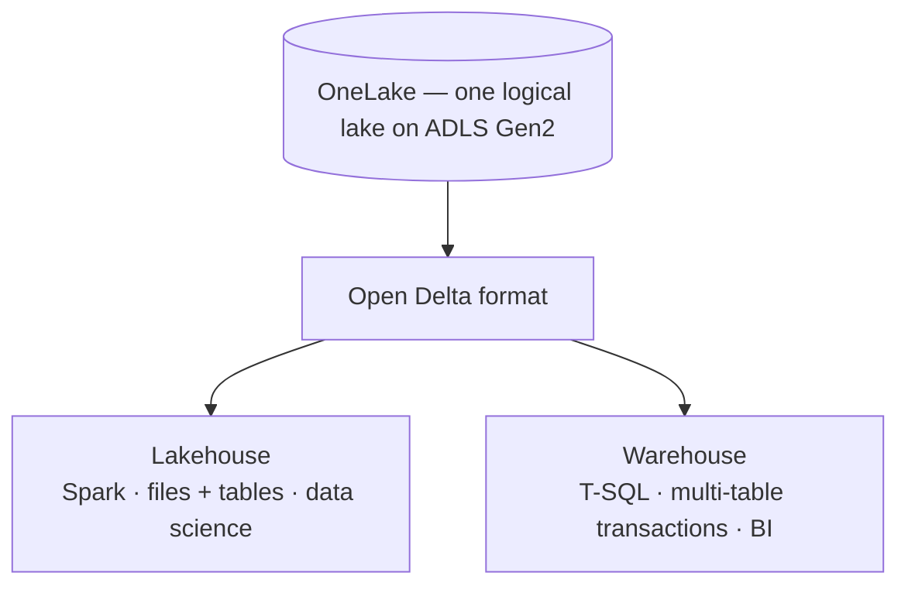

# Introduction to Microsoft Fabric data stores

> **Microsoft Fabric** is Microsoft's all-in-one SaaS analytics platform. Its data stores — chiefly the **Lakehouse** and the **Warehouse** — all sit on a single logical data lake (**OneLake**) and share one open table format (**Delta**).

**Source:** [Microsoft Fabric documentation](https://learn.microsoft.com/en-us/fabric/) 📘 [Official] — Microsoft's SaaS analytics platform spanning Data Factory, Data Engineering, Data Warehousing, Data Science, Real-Time Intelligence, and Power BI.

## 📋 Table of contents

- [What Fabric is](#what-fabric-is)
- [OneLake: one lake for the whole tenant](#onelake-one-lake-for-the-whole-tenant)
- [Open Delta: the shared table format](#open-delta-the-shared-table-format)
- [The data-store items](#the-data-store-items)
- [Why the difference is engine, not storage](#why-the-difference-is-engine-not-storage)
- [Under the hood (deep dive)](#under-the-hood-deep-dive)
- [Where to go next](#where-to-go-next)
- [References](#references)

## 🎯 What Fabric is

Microsoft Fabric is an **all-in-one SaaS analytics solution** that bundles previously separate services — <mark>Data Factory</mark>, <mark>Data Engineering</mark>, <mark>Data Warehousing</mark>, <mark>Data Science</mark>, <mark>Real-Time Intelligence</mark>, and <mark>Power BI</mark> — into one platform. Because it is <mark>**SaaS**</mark>, there is no infrastructure to provision, size, or tune: capacity is bought as Fabric (or Power BI Premium) capacity, and the platform handles the rest.

That "no infrastructure" characteristic is the thread that runs through every comparison in this series — it is what most distinguishes Fabric from the earlier Synapse / Analysis Services / Azure SQL building blocks.

## 🌊 <mark>OneLake</mark>: one lake for the whole tenant

**OneLake** is a <mark>single</mark>, <mark>tenant-wide</mark> <mark>logical data lake</mark>, provisioned automatically — Microsoft calls it *"the OneDrive for data."* It is built on **<mark>Azure Data Lake Storage (ADLS) Gen2</mark>**, and every workspace and data item lives inside it.

Two consequences matter:

- **<mark>One copy</mark>, <mark>many engines</mark>.** Data does not need to be copied between services; a Lakehouse and a Warehouse can read the same lake.
- **<mark>Shortcuts avoid duplication</mark>.** OneLake *shortcuts* reference data in place — in another lake, in ADLS, or in Amazon S3 — so you can query external data without moving it.

## 🔷 <mark>Open Delta</mark>: the shared table format

Both the <mark>Warehouse</mark> and the <mark>Lakehouse</mark> **store their tables in OneLake in the open Delta format**. This is the key fact that makes the two stores comparable: the *bytes on disk* use the same open format, so the difference between them is about the **engine, experience, and persona** on top — not about where or how the data is stored.

## 🧱 The data-store items

The two analytical data stores this series focuses on:

| Item | Built for | Primary engine |
|---|---|---|
| **<mark>Lakehouse</mark>** | Data engineering and data science over structured **and** unstructured data | Apache Spark (Python, Scala, SQL, R) |
| **<mark>Warehouse</mark>** | Enterprise data warehousing and BI over structured data | T-SQL |

<mark>Both are included in Fabric</mark> (or <mark>Power BI Premium</mark>) capacity, and both persist to OneLake as Delta.

> Fabric also offers other stores — a **<mark>SQL database</mark>** workload (OLTP) and **<mark>Eventhouse/KQL</mark>** for real-time intelligence — but those serve different jobs and are outside this series' scope.

## 🔑 Why the difference is engine, not storage

Because storage (OneLake) and format (Delta) are shared, the choice between a Lakehouse and a Warehouse is really a choice about **how you develop** and **which persona owns the data**:

That shared foundation is why the next two articles can focus purely on capability and lineage.

## 🔬 Under the hood (deep dive)

The sections above treat OneLake and Delta as a black box on purpose. If you want to know **how** the storage works — how OneLake maps onto ADLS Gen2, how the Delta format is laid out on disk, and **whether you can read the data without Fabric at all** (you can) — see the companion appendix:

- **[Appendix: Open Delta and ADLS Gen2 under the hood](01.02-appendix-open-delta-and-adls-gen2-under-the-hood.md)**

## 🚀 Where to go next

- **[Lakehouse vs Warehouse](02.01-lakehouse-vs-warehouse.md)** — how to choose, and the common pairing architecture.
- **[Mapping Fabric to familiar Microsoft data products](04.01-mapping-fabric-to-legacy-data-products.md)** — Synapse, ADLS, Analysis Services, and Azure SQL.

## 📚 References

- [Microsoft Fabric documentation](https://learn.microsoft.com/en-us/fabric/) 📘 [Official] — platform overview and workload docs.
- [What is OneLake?](https://learn.microsoft.com/en-us/fabric/onelake/onelake-overview) 📘 [Official] — the single, tenant-wide lake on ADLS Gen2.
- [Fabric decision guide: choose between Warehouse and Lakehouse](https://learn.microsoft.com/en-us/fabric/fundamentals/decision-guide-lakehouse-warehouse) 📘 [Official] — confirms both stores use OneLake + open Delta.
- [Delta Lake overview in Microsoft Fabric](https://learn.microsoft.com/en-us/fabric/fundamentals/delta-lake-overview) 📘 [Official] — Fabric's universal storage format: Parquet + transaction log, ACID, time travel, schema evolution.
