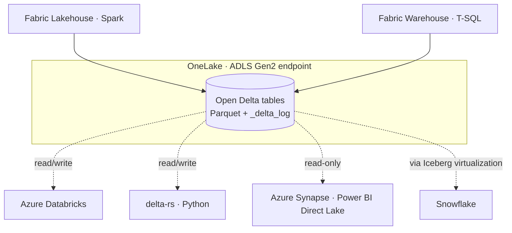

# Appendix: Open Delta and ADLS Gen2 under the hood

> The [introduction](01.01-introduction-to-microsoft-fabric-data-stores.md) treats **OneLake** and **Delta** as a black box on purpose — for a first pass, *"both stores keep open Delta tables in OneLake"* is all you need. This appendix opens the box for readers who want to know **how** the storage works and, most importantly, **whether you can reach the data without Fabric compute at all**. (You can.)

**Source:** [Delta Lake overview in Microsoft Fabric](https://learn.microsoft.com/en-us/fabric/fundamentals/delta-lake-overview) 📘 [Official] — Fabric's universal storage format and how OneLake exposes it over ADLS Gen2.

## 📋 Table of contents

- [How Fabric uses ADLS Gen2](#how-fabric-uses-adls-gen2)
- [Can you "see" the ADLS Gen2 under a Fabric item?](#can-you-see-the-adls-gen2-under-a-fabric-item)
- [How the open Delta format works](#how-the-open-delta-format-works)
- [Reading Delta without Fabric](#reading-delta-without-fabric)
- [The short version](#the-short-version)
- [Where to go next](#where-to-go-next)
- [References](#references)

## 🧩 How Fabric uses ADLS Gen2

OneLake isn't a new storage technology — it's a **managed lake built on <mark>Azure Data Lake Storage (ADLS) Gen2</mark>**, provisioned automatically for your tenant. What Fabric adds on top is organization and an access surface:

- Every **workspace** appears as an ADLS Gen2 **container**.
- Every **data item** (a Lakehouse, a Warehouse) appears as a **folder** inside that container.
- Tables and files live inside those folders as ordinary ADLS Gen2 paths.

Because of that mapping, every table has a normal ADLS Gen2 **ABFS path**. A Lakehouse table, for example, looks like this:

```text
abfss://<workspace>@onelake.dfs.fabric.microsoft.com/<item>.Lakehouse/Tables/<table>
```

Anything that speaks ADLS Gen2 can address the data by that path — which is the whole point of the next two sections.

## 👁️ Can you "see" the ADLS Gen2 under a Fabric item?

Yes and no — and the distinction is the interesting part.

- **Yes, through the API.** OneLake exposes the **same ADLS Gen2 APIs and SDKs** as any data lake, so you can list, read, and (for Lakehouse data) write with existing tools. The catch is the endpoint: OneLake answers on its **own** hostname, `onelake.dfs.fabric.microsoft.com`, *not* the classic `dfs.core.windows.net`.
- **No, not the storage account.** You never see, provision, or manage the physical Azure Storage account behind OneLake. There's no account to find in the Azure portal, no access keys to rotate, and no capacity to size. It's a **Microsoft-managed abstraction** that happens to talk the ADLS Gen2 protocol.

The endpoints you'll actually use:

| Endpoint | Protocol | Use for |
|---|---|---|
| `onelake.dfs.fabric.microsoft.com` | ADLS Gen2 / DFS | Filesystem-style access (directories, ACLs) |
| `onelake.blob.fabric.microsoft.com` | Blob | Blob-style access |
| `api.onelake.fabric.microsoft.com` | General FQDN | Works like the above; may not match tools that key off `.dfs`/`.blob` |

> **Common gotcha:** some ADLS-compatible tools reject OneLake because they hard-code the `dfs.core.windows.net` suffix during URL validation. The fix is usually to add OneLake's endpoint to the tool's allowed hosts — or to use a tool that permits custom endpoints.

Practical ways to browse the bytes yourself, no Fabric notebook required:

- **OneLake file explorer for Windows** — navigate workspaces and items in File Explorer, just like OneDrive.
- **Azure Storage Explorer** — connect to an ADLS Gen2 resource, sign in with OAuth, and paste the item's OneLake URL.
- **ADLS Gen2 SDKs** — the .NET, Python, and Java filesystem SDKs work unchanged against the OneLake endpoint.

## 🔷 How the open Delta format works

Fabric uses **Delta Lake as its universal storage format** — Warehouse, Lakehouse, pipelines, and Power BI all land data as Delta in OneLake. Delta itself is refreshingly simple; it combines just two things:

1. **<mark>Parquet files</mark>** — the actual rows, stored column-by-column for fast analytics.
2. **A <mark>transaction log</mark>** — an ordered record of every change, which is what turns a pile of Parquet files into a real *table*.

On disk, a Delta table is just a folder:

```text
<table>/
├── _delta_log/
│   ├── 00000000000000000000.json              ← commit 0
│   ├── 00000000000000000001.json              ← commit 1
│   └── 00000000000000000010.checkpoint.parquet ← periodic checkpoint
├── part-0000-....snappy.parquet                ← data
└── part-0001-....snappy.parquet
```

That log is what buys Delta the capabilities a bare folder of Parquet can't offer:

- **ACID transactions** — consistent reads and writes even when multiple processes touch the table at once.
- **Time travel** — query the table as it existed at an earlier version.
- **Schema evolution** — add or change columns without rewriting history.
- **Unified batch and streaming** — one table format for both.

Crucially, Delta Lake is an **open specification** maintained as a **Linux Foundation** project — not a Fabric invention. That openness is exactly why the data isn't trapped inside Fabric.

## 🔓 Reading Delta without Fabric

Because a table is *only* Parquet files plus a log sitting at an ADLS Gen2 endpoint, **any engine that understands Delta can read it directly** — with no Fabric compute in the path.

There's one rule to internalize, and it's about writes, not reads:

- **Lakehouse tables** can be **read and written** by external Delta engines (Spark, delta-rs, and friends).
- **Warehouse tables** are **read-only** from outside. Fabric *publishes* the Delta log for every Warehouse user table so external engines can read them, but all `INSERT`/`UPDATE`/`DELETE` must go through the Warehouse so it can keep its ACID guarantees.



A minimal read from outside Fabric — here with the Python `deltalake` (delta-rs) library, pointed straight at the OneLake path:

```python
from deltalake import DeltaTable

# token = a Microsoft Entra ID bearer token scoped for OneLake
onelake_uri = (
    "abfss://<workspace>@onelake.dfs.fabric.microsoft.com/"
    "<item>.Lakehouse/Tables/<table>"
)
dt = DeltaTable(
    onelake_uri,
    storage_options={"bearer_token": token, "use_fabric_endpoint": "true"},
)
df = dt.to_pandas()
```

Other first-class consumers include **Azure Databricks**, **Azure Synapse Analytics**, **Azure Storage Explorer**, and Power BI's **Direct Lake** mode. OneLake even bridges table formats: through **metadata virtualization**, a Delta table can be read by external **Apache Iceberg** readers such as Snowflake, and Iceberg tables read back as Delta — so "open" isn't limited to the Delta ecosystem.

## 📌 The short version

| Question | Answer |
|---|---|
| How does Fabric use ADLS Gen2? | OneLake *is* an ADLS Gen2-backed lake — workspaces map to containers, data items to folders. |
| Can you see the underlying ADLS Gen2? | You reach the data through ADLS Gen2 APIs at `onelake.dfs.fabric.microsoft.com`, but the storage account itself is a managed abstraction you never provision or see. |
| How does open Delta work? | Parquet data files + a transaction log (`_delta_log`) that adds ACID, time travel, and schema evolution. |
| Readable outside Fabric? | Yes — any Delta engine can read directly (read-only for Warehouse tables, read/write for Lakehouse). |

## 🚀 Where to go next

- **[Introduction to Microsoft Fabric data stores](01.01-introduction-to-microsoft-fabric-data-stores.md)** — the OneLake + open Delta foundation this appendix drills into.
- **[Lakehouse vs Warehouse](02.01-lakehouse-vs-warehouse.md)** — how to choose, and the common pairing architecture.

## 📚 References

- [Delta Lake overview in Microsoft Fabric](https://learn.microsoft.com/en-us/fabric/fundamentals/delta-lake-overview) 📘 [Official] — Fabric's universal storage format: Parquet + transaction log, ACID, time travel, schema evolution.
- [Connecting to Microsoft OneLake (access and APIs)](https://learn.microsoft.com/en-us/fabric/onelake/onelake-access-api) 📘 [Official] — the ADLS Gen2 endpoints (`dfs`/`blob`), the OneLake-vs-`dfs.core.windows.net` distinction, and URL-validation gotchas.
- [Delta Lake logs in Warehouse in Microsoft Fabric](https://learn.microsoft.com/en-us/fabric/data-warehouse/query-delta-lake-logs) 📘 [Official] — how the Warehouse publishes Delta logs for read-only external access while keeping writes ACID.
- [Integrate OneLake with Azure Databricks](https://learn.microsoft.com/en-us/fabric/onelake/onelake-azure-databricks) 📘 [Official] — reading and writing OneLake Delta tables from outside Fabric via the ABFS path.
- [Delta Lake (open-source project)](https://delta.io/) 📘 [Official] — the Linux Foundation project and open specification behind the format.
