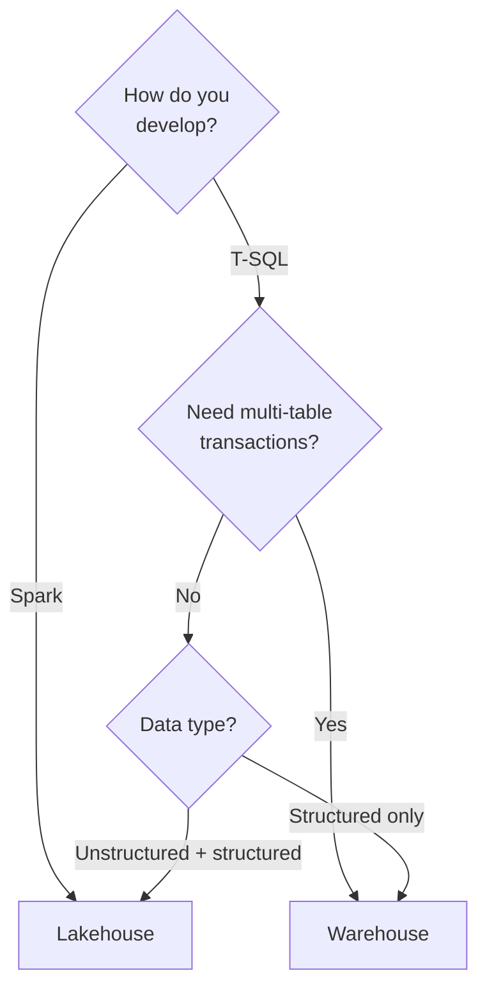
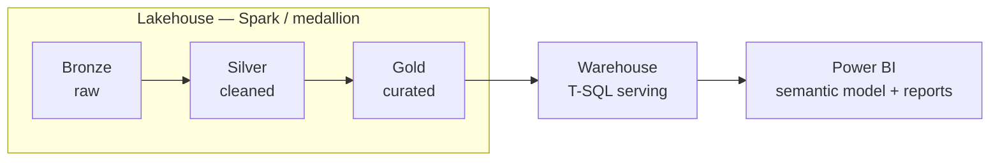

# Lakehouse vs Warehouse in Microsoft Fabric

> In Microsoft Fabric, the **Lakehouse** and the **Warehouse** both store open **Delta** tables in **OneLake**. They differ not in *where* data lives, but in the **engine**, the **persona**, and the **capabilities** on top. This article explains how to choose.

**Source:** [Fabric decision guide: choose between Warehouse and Lakehouse](https://learn.microsoft.com/en-us/fabric/fundamentals/decision-guide-lakehouse-warehouse) 📘 [Official] — Microsoft's product-comparison guidance for the two stores.

## 📋 Table of contents

- [The one-sentence answer](#the-one-sentence-answer)
- [The three decision points](#the-three-decision-points)
- [Capability comparison](#capability-comparison)
- ["No-knobs" performance](#no-knobs-performance)
- [The common pairing architecture](#the-common-pairing-architecture)
- [Choosing in practice](#choosing-in-practice)
- [Where to go next](#where-to-go-next)
- [References](#references)

## 🎯 The one-sentence answer

- **Choose a Lakehouse** when you want flexibility, Spark, data science, or to work with raw and semi-structured data.
- **Choose a Warehouse** when your team is SQL-centric and needs a traditional enterprise data warehouse — stored procedures, multi-table transactions, and mature T-SQL development.

Both persist to OneLake in open Delta format, so this is a decision about **how you develop**, not about storage.

## 🔀 The three decision points

Microsoft's decision guide reduces the choice to three questions:

| Question | Answer → store |
|---|---|
| **How do you want to develop?** | Spark → **Lakehouse** · T-SQL → **Warehouse** |
| **Do you need multi-table transactions?** | Yes → **Warehouse** · No → **Lakehouse** |
| **What type of data are you analyzing?** | Unstructured + structured (or "don't know") → **Lakehouse** · Structured only → **Warehouse** |

## 📊 Capability comparison

Both stores expose T-SQL, but with an important asymmetry: the Warehouse is **full read/write**, while the Lakehouse's automatically generated **SQL analytics endpoint is read-only**.

| Capability | Lakehouse | Warehouse |
|---|---|---|
| Primary persona | Data Engineers, Data Scientists | SQL Developers, BI Developers |
| Main language | Spark (Python, Scala, SQL, R) | T-SQL |
| Data types | Structured **and** unstructured | Structured only |
| Data ingestion | Notebooks, Spark, pipelines, dataflows, shortcuts | T-SQL, pipelines, dataflows |
| Delta tables | Reads (writes via Spark) | Reads **and writes** via T-SQL |
| SQL surface | Read-only SQL analytics endpoint (full DQL, **no DML**, limited DDL) | Full **DQL + DML + DDL**, stored procedures |
| Multi-table transactions | No | **Yes** (full ACID) |
| Storage | Open Delta in OneLake | Open Delta in OneLake |

> **The load-bearing distinction:** you can *query* a Lakehouse in SQL, but you cannot `INSERT/UPDATE/DELETE/MERGE` through its SQL endpoint. If your team needs to write data with T-SQL and stored procedures, that points to a Warehouse.

Sources: [decision guide](https://learn.microsoft.com/en-us/fabric/fundamentals/decision-guide-lakehouse-warehouse) 📘 and [lakehouse overview](https://learn.microsoft.com/en-us/fabric/data-engineering/lakehouse-overview) 📘.

## ⚙️ "No-knobs" performance

A Fabric Warehouse needs **no configuration of compute or storage** — there are no distributions or indexes to design and tune the way a classic MPP warehouse required. The engine handles physical optimization automatically. This is a genuine simplification for anyone coming from Synapse dedicated SQL pools, and it is covered further in [Mapping Fabric to legacy Microsoft data products](04.01-mapping-fabric-to-legacy-data-products.md).

## 🏗️ The common pairing architecture

Because the two stores are complementary, a very common Fabric design uses **both**:

1. **Land and transform** raw data in a **Lakehouse** with Spark, following the medallion pattern (bronze → silver → gold).
2. **Curate** business-ready, structured datasets in the gold zone.
3. **Serve** those datasets through a **Warehouse** for T-SQL and BI consumption.

The decision guide explicitly lists "pairing with Warehouse for enterprise analytics use cases" as a recommended Lakehouse pattern — so this is Microsoft's intended design, not a workaround.

## 🧭 Choosing in practice

- **Data engineering / data science / unstructured data / medallion ETL** → **Lakehouse**.
- **SQL-centric team / stored procedures / multi-table transactions / BI serving** → **Warehouse**.
- **Both needs** → use both, with the Lakehouse feeding the Warehouse.

Framing this as "which one wins" is the wrong lens: they are designed to work together.

## 🚀 Where to go next

- **[Mapping Fabric to legacy Microsoft data products](04.01-mapping-fabric-to-legacy-data-products.md)** — how the Warehouse relates to Synapse, and where Analysis Services and Azure SQL fit.
- **[Introduction to Microsoft Fabric data stores](01.01-introduction-to-microsoft-fabric-data-stores.md)** — the OneLake + Delta foundation both stores share.

## 📚 References

- [Fabric decision guide: choose between Warehouse and Lakehouse](https://learn.microsoft.com/en-us/fabric/fundamentals/decision-guide-lakehouse-warehouse) 📘 [Official] — decision points and capability comparison.
- [What is a lakehouse in Microsoft Fabric?](https://learn.microsoft.com/en-us/fabric/data-engineering/lakehouse-overview) 📘 [Official] — the Lakehouse and its SQL analytics endpoint.
- [What is data warehousing in Microsoft Fabric?](https://learn.microsoft.com/en-us/fabric/data-warehouse/data-warehousing) 📘 [Official] — the Warehouse item and T-SQL surface.
- [Medallion lakehouse architecture](https://learn.microsoft.com/en-us/fabric/onelake/onelake-medallion-lakehouse-architecture) 📘 [Official] — bronze/silver/gold zones.
