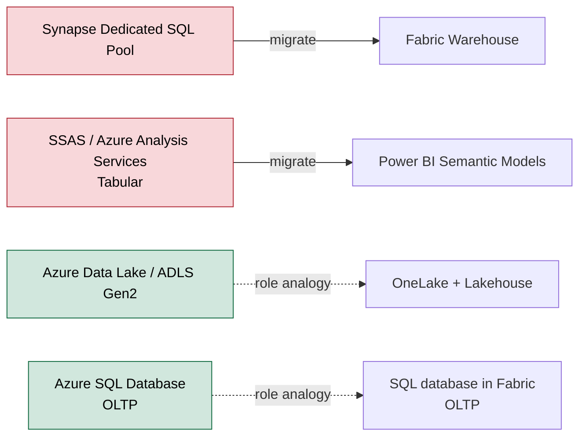

# Mapping Fabric to familiar Microsoft data products

> If you know the classic Microsoft data stack — SQL Server, Synapse, SSAS, Azure SQL — the fastest way to understand Fabric is to map each new store onto a product you already know. The analogies below are **orientation aids, not equivalences**, and each comes with the caveat that keeps it honest.

**Source:** [Migration: Azure Synapse dedicated SQL pools to Fabric Data Warehouse](https://learn.microsoft.com/en-us/fabric/data-warehouse/migration-synapse-dedicated-sql-pool-warehouse) 📘 [Official] — Microsoft's official modernization path from Synapse to Fabric.

## 📋 Table of contents

- [The mental map at a glance](#the-mental-map-at-a-glance)
- [Warehouse ≈ successor to Synapse Dedicated SQL Pool](#warehouse--successor-to-synapse-dedicated-sql-pool)
- [OneLake + Lakehouse ≈ Azure Data Lake](#onelake--lakehouse--azure-data-lake)
- [Semantic models ≈ Analysis Services Tabular](#semantic-models--analysis-services-tabular)
- [Azure SQL Database stays in the OLTP lane](#azure-sql-database-stays-in-the-oltp-lane)
- [Why the analogies are aids, not equivalences](#why-the-analogies-are-aids-not-equivalences)
- [Where to go next](#where-to-go-next)
- [References](#references)

## 🗺️ The mental map at a glance

Not everything here is "legacy." Two of these familiar products are genuinely being **superseded** — you migrate off them — while the other two are **current** products that Fabric simply offers an in-platform analogue for. The **Status** column makes the difference explicit.

| Familiar product | Status | Fabric store / mapping | The one caveat |
|---|---|---|---|
| **Synapse Dedicated SQL Pool** | **Legacy** — being superseded | **Fabric Warehouse** | SaaS, no-knobs, Delta in OneLake — not a lift of the MPP pool |
| **Azure Data Lake (ADLS Gen2)** | **Current** — OneLake is built on it | **OneLake + Lakehouse** | OneLake is one tenant-wide lake, auto-provisioned |
| **SSAS / Azure Analysis Services (Tabular)** | **Legacy** — Azure AS on a retirement path | **Power BI semantic models** | Same tabular engine; no separate AS workload |
| **Azure SQL Database (OLTP)** | **Current** — role analogy, not a successor | **SQL database in Fabric** (or external Azure SQL) | Different job from the Warehouse — OLTP, not BI analytics |

## 🏢 Warehouse ≈ successor to Synapse Dedicated SQL Pool

This is the closest analogy. Microsoft publishes a dedicated **migration strategy from Azure Synapse Analytics dedicated SQL pools to Fabric Data Warehouse**, positioning Fabric DW as the recommended modernization target. In other words, the Synapse dedicated SQL pool is genuinely **legacy** here — a product you migrate *off*, not one you keep building on.

But the Warehouse is **not** simply "a SQL pool inside Fabric":

- It is fully **SaaS** — there is no dedicated pool to provision, scale, or pause.
- Data is stored in **OneLake in open Delta**, not in a proprietary MPP store.
- There is **no distribution or index tuning**. The migration guide is explicit: indexes "usually aren't migrated… now Fabric takes care of that automatically for you."
- It integrates natively with the Lakehouse, semantic models, and every other Fabric workload.

So the accurate phrasing is *"the Warehouse is the modernization path for Synapse dedicated SQL pool workloads,"* not *"the Warehouse is a Synapse SQL pool."*

## 🌊 OneLake + Lakehouse ≈ Azure Data Lake

The classic "raw data lake + Spark" role maps to **OneLake + Lakehouse**. OneLake is a single, tenant-wide logical lake built on **ADLS Gen2**; the Lakehouse is the item that organizes files and Delta tables on top of it. The difference from a hand-rolled ADLS Gen2 lake is that OneLake is **one automatically provisioned lake for the whole tenant**, with shortcuts to reference external data in place. Note that **ADLS Gen2 itself is current, not legacy** — OneLake is built *on* it, so this row is a role analogy (a managed lake vs. a do-it-yourself lake), not a product being retired.

## 📈 Semantic models ≈ Analysis Services Tabular

There is **no standalone Analysis Services workload** in Fabric. The analytical semantic-model role once served by **SSAS / Azure Analysis Services Tabular** is now served by **Power BI semantic models**, which run the same tabular (VertiPaq) engine. Microsoft's guidance for Azure Analysis Services customers is migration toward Power BI / Fabric semantic models, and **Azure Analysis Services (the PaaS) is on a retirement path**.

So the common shorthand — *"Analysis Services is gone in Fabric"* — is directionally right, stated precisely: the **role** persists as semantic models (same engine); the **separate product** does not exist as a Fabric workload.

## 🔁 Azure SQL Database stays in the OLTP lane

Unlike the Synapse SQL Pool and Azure Analysis Services rows above, **Azure SQL Database is not legacy** — it is a current, actively developed PaaS product, and nothing in Fabric is retiring or replacing it. This row is a **role analogy**, not a modernization path.

Azure SQL Database is a **transactional (OLTP)** engine; the Warehouse is an **analytical (OLAP)** store. They are **not substitutes** — do not present the Warehouse as a replacement for Azure SQL Database.

Fabric does add a **SQL database** workload — an OLTP database inside Fabric built on the **same Azure SQL Database engine**. It is a *new deployment option* for operational data that lives close to your analytics, **not a successor** to Azure SQL Database: Microsoft is not migrating Azure SQL customers off it, and for most standalone OLTP apps external Azure SQL Database remains the more mature choice. Its job is transactional, not enterprise BI at analytical scale.

## ⚖️ Why the analogies are aids, not equivalences

The two **legacy** mappings share one theme: Fabric **removes the infrastructure and tuning surface** the superseded product exposed (pool sizing, distributions, indexes, server management) and stores everything as **open Delta in OneLake**. The two **current-product** mappings — ADLS Gen2 and Azure SQL Database — are different: those products aren't going anywhere, and Fabric just offers an in-platform analogue in the same role. Either way, treat the analogies as orientation aids — *"Warehouse ≈ Synapse SQL Pool, Semantic Model ≈ Analysis Services Tabular"* — that hide real architectural change beneath a familiar name. Use them to get oriented quickly, then rely on the capability details, not the analogy, for design decisions.

## 🚀 Where to go next

- **[Lakehouse vs Warehouse](02.01-lakehouse-vs-warehouse.md)** — the capability comparison behind the Synapse analogy.
- **[Introduction to Microsoft Fabric data stores](01.01-introduction-to-microsoft-fabric-data-stores.md)** — the OneLake + Delta foundation the mappings rest on.

## 📚 References

- [Migration: Azure Synapse dedicated SQL pools to Fabric Data Warehouse](https://learn.microsoft.com/en-us/fabric/data-warehouse/migration-synapse-dedicated-sql-pool-warehouse) 📘 [Official] — the official Synapse → Fabric modernization guidance.
- [What is OneLake?](https://learn.microsoft.com/en-us/fabric/onelake/onelake-overview) 📘 [Official] — the tenant-wide lake on ADLS Gen2.
- [SQL database in Microsoft Fabric](https://learn.microsoft.com/en-us/fabric/database/sql/overview) 📘 [Official] — the OLTP database workload, distinct from the Warehouse.
- [Why Fabric Data Warehouse is the Modernization Path for Synapse](https://community.fabric.microsoft.com/t5/Fabric-Updates-Blog/Why-Fabric-Data-Warehouse-is-the-Modernization-Path-for-Synapse/ba-p/5178874) 📗 [Verified Community] — Microsoft Fabric community blog framing the Synapse → Fabric path.
