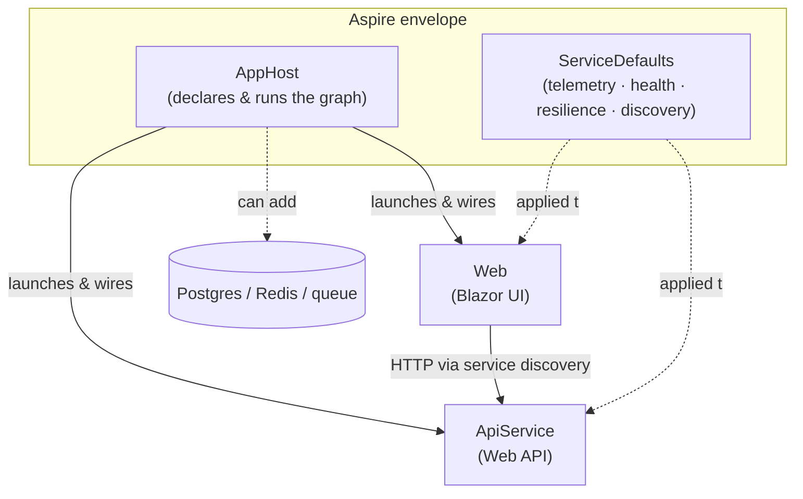

# Blazor Concepts: Using Blazor with Aspire

Open a modern "Blazor + Aspire" sample and you see **more projects than expected** — an `AppHost` and a `ServiceDefaults` alongside the web app and the API. This article explains what those projects do and shows that Blazor + Aspire is really your familiar client + API shape **wrapped in an orchestration and observability envelope** — not a new way to build Blazor.

## 📑 Table of Contents

1. [What Aspire is (and isn't)](#what-aspire-is-and-isnt)
2. [The two samples side by side](#the-two-samples-side-by-side)
3. [What the extra projects do](#what-the-extra-projects-do)
4. [What is actually different](#what-is-actually-different)
5. [Pros and cons](#pros-and-cons)
6. [Which is modern and recommended?](#which-is-modern-and-recommended)
7. [Where to go next](#where-to-go-next)
8. [References](#references)

## What Aspire is (and isn't)

**Aspire is** a **code-first orchestration and observability layer** for distributed applications. You describe the services, front ends, databases, caches, and queues that make up your app in code, run the whole thing with one command, and observe it in one dashboard.

**Aspire is not:**

- a new Blazor **hosting model** or render mode,
- an **application framework** (it doesn't replace ASP.NET Core or Blazor),
- a **cloud provider or production runtime**,
- **.NET-only** — modern Aspire supports C# and TypeScript AppHosts and can orchestrate workloads written in C#, Node.js, Python, Go, Java, and more.

The key mental shift: Aspire operates **around** your app, not inside your components.

## The two samples side by side

**Classic — a Blazor WebAssembly client + a Web API:**

| Project | Role |
|---|---|
| `BlazorWebassemblyApp` | Standalone WebAssembly client (static, CDN-friendly). |
| `BlazorWebassemblyApi` | Independent ASP.NET Core Web API. |
| `BlazorWebassemblyModel` | Shared DTO/model library referenced by both. |

**Modern — Blazor + Aspire:**

| Project | Role |
|---|---|
| `*.Web` | The Blazor front end (Razor components) — same as before. |
| `*.ApiService` | The backend HTTP API — same as before. |
| `*.AppHost` | **New** — the Aspire orchestrator. |
| `*.ServiceDefaults` | **New** — shared cross-cutting defaults. |

The first two rows are the *same application*. The last two rows are what Aspire adds.



## What the extra projects do

### AppHost — the single source of truth

The **AppHost** is a small code-first program that declares every resource in your system and their relationships, then runs the whole graph:

```csharp title="AppHost.cs (illustrative)"
var builder = DistributedApplication.CreateBuilder(args);

var db  = builder.AddPostgres("db");
var api = builder.AddProject<Projects.ApiService>("apiservice")
                 .WithReference(db);

builder.AddProject<Projects.Web>("web")
       .WithReference(api);   // service discovery wires the URL

builder.Build().Run();
```

- One command (`aspire run`) starts **everything** in the right order — no five-terminals dance.
- `WithReference(...)` sets up **service discovery**, so the Web app finds the API without hard-coded URLs — the same code works locally and when deployed.
- Adding a dependency is one line (`AddPostgres`, `AddRedis`, …), containerized and versioned.

### ServiceDefaults — uniform cross-cutting concerns

A shared library each service calls at startup to apply consistent defaults:

- **OpenTelemetry** — logs, metrics, and traces,
- **Health checks**,
- **HTTP resilience** (retries, timeouts),
- **Service discovery** defaults.

For a WebAssembly client, .NET ships a dedicated `blazor-wasm-servicedefaults` variant to wire the browser client into the same telemetry/discovery/resilience stack.

## What is actually different

- The **Blazor UI is unchanged** — same Razor components, same render modes (see [Concepts: hosting models and render modes](02-concepts-hosting-models-and-render-modes.md)).
- The **client↔server REST boundary is unchanged** — the `Web` + `ApiService` split mirrors the classic `client` + `Web API` split.
- What changes is **dev-time composition and operations**: one-command run, service discovery instead of hard-coded endpoints, and uniform telemetry surfaced in the **Aspire Dashboard**.

> Remove `AppHost` and `ServiceDefaults` and you are back to "a Blazor app talking to an API." That's why Blazor + Aspire is best read as **classic client + API *plus* an orchestration + observability envelope** — not a different architecture.

## Pros and cons

| Factor | Classic (WASM client + Web API) | Blazor + Aspire |
|---|---|---|
| Setup complexity | Lower (2–3 projects) | Higher (+AppHost, +ServiceDefaults) |
| Run experience | Start each service; wire URLs by hand | `aspire run` starts the whole graph |
| Config / endpoints | Hard-coded per environment | Service discovery; same code local↔prod |
| Observability | Add per project | Uniform telemetry + one Dashboard |
| Extra dependencies (DB, cache, queue) | Install & wire manually | `builder.AddPostgres(...)`, containerized |
| Learning curve | Familiar | New AppHost/ServiceDefaults concepts |
| Best fit | Single client + single API | Multiple services/dependencies, team & cloud |

## Which is modern and recommended?

- **Aspire is the modern, recommended envelope** for **multi-service / multi-dependency** solutions and for any team or cloud scenario where one-command run, service discovery, and built-in observability pay off.
- For a **single client + single API** with minimal moving parts, the **classic split is perfectly fine** — Aspire is optional overhead there.
- Crucially, Aspire is **orthogonal** to the Blazor app-shape decision. You still choose Blazor Web App vs standalone WASM + API on its own merits (see [Analysis: architecture decision](04-analysis-architecture-decision.md)); Aspire then wraps *whichever* shape you picked.

## Where to go next

- [Concepts: hosting models and render modes](02-concepts-hosting-models-and-render-modes.md) — the Blazor mental model underneath.
- [Analysis: architecture decision](04-analysis-architecture-decision.md) — Blazor Web App vs standalone WASM + API.
- [Concepts: the `.localhost` TLD and hostname ordering](../10.00-local-development-dns/02-concepts-localhost-tld-and-hostname-ordering.md) — the local dev hostnames Aspire assigns.
- [Resources](06-resources.md) — curated links.

## References

- [What is Aspire?](https://aspire.dev/get-started/what-is-aspire/) 📘 [Official] — Aspire as a code-first, multi-language orchestration and observability layer; the "is/isn't" list; AppHost, service discovery, and Dashboard.
- [Tooling for ASP.NET Core Blazor](https://learn.microsoft.com/en-us/aspnet/core/blazor/tooling?view=aspnetcore-10.0) 📘 [Official] — `blazor-wasm-servicedefaults` (OpenTelemetry, service discovery, HTTP resilience).
- [ASP.NET Core Blazor](https://learn.microsoft.com/en-us/aspnet/core/blazor/?view=aspnetcore-10.0) 📘 [Official]

<!--
article_metadata:
  content_type: "concepts"
  created: "2026-07-06"
  last_updated: "2026-07-06"
  status: "draft"
  primary_topic: "Blazor"
  source_issue: "src/docs/90. Issues/202607/20260705.01-aspire-overview-how-it-works"
-->
