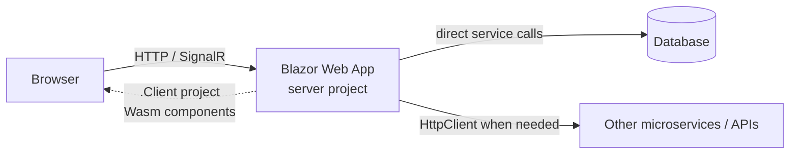
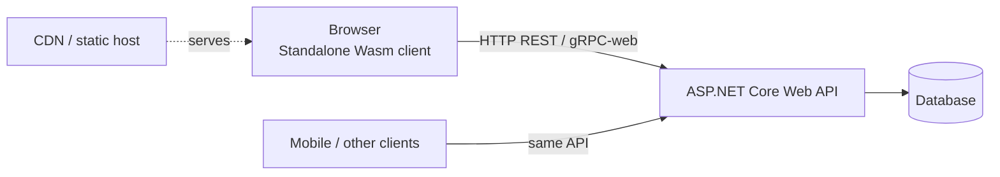

# Blazor Architecture Decision: Web App vs Standalone WASM + Web API

For "a web app talking to a server," modern Blazor gives you two supported shapes. Neither is "the API template" — the API is now a composition choice. This guide helps you pick.

## 📑 Table of Contents

1. [Option A — Blazor Web App](#option-a--blazor-web-app)
2. [Option B — Standalone WASM + Web API](#option-b--standalone-wasm--web-api)
3. [Comparison matrix](#comparison-matrix)
4. [Technology Radar classification](#technology-radar-classification)
5. [Where the legacy shape fits](#where-the-legacy-shape-fits)
6. [References](#references)

## Option A — Blazor Web App

Create with `dotnet new blazor` (choose **Interactive Auto** or **Interactive Server**).

- One deployable app hosts UI and server logic.
- Server-rendered components call data services **directly** — no REST hop, no serialization, no separate auth surface.
- WebAssembly components (in `.Client`) reach the server through endpoints on the *same* app.
- Add calls to external services only where needed.

**Choose this when:** you want the modern default, the fastest path to a full-stack app, simpler auth, and per-component interactivity.

## Option B — Standalone WASM + Web API

Create two projects — `dotnet new blazorwasm` (client) and `dotnet new webapi` (backend) — in one solution.

- The client is a pure static site — CDN-deployable, offline-capable as a PWA.
- The backend is independent (REST by default; gRPC-web or SignalR also fit) and shareable by other clients.
- Clear boundary; independent scaling and deployment.

**Choose this when:** you need static/CDN hosting or offline support, a strict frontend/backend split, or a backend shared across client types.

## Comparison matrix

| Factor | Blazor Web App (A) | Standalone WASM + API (B) |
|---|---|---|
| Deployables | One app | Two (static client + API) |
| Data access | Direct server-side calls | Always over HTTP |
| Static/CDN hosting | No (needs a server) | Yes |
| Offline / PWA | Limited | Yes |
| Backend reuse across clients | Add APIs as needed | Yes, by design |
| Auth complexity | Lower (single surface) | Higher (token-based) |
| Best default for new apps | ✅ | For SPA/static needs |

## Technology Radar classification

- **ADOPT** — Blazor Web App (`blazor`) for most new full-stack apps.
- **ADOPT** — Standalone WASM (`blazorwasm`) + Web API for static/CDN or offline SPAs and shared backends.
- **HOLD** — Hosted Blazor WebAssembly (Client + Server + Shared) and the standalone Blazor Server template; migrate toward the Blazor Web App model.

## Where the legacy shape fits

The old **Hosted Blazor WebAssembly** was essentially Option B pre-wired into one template. Today you either compose Option B yourself, or adopt Option A — the recommended target. See the [migration How-to](03-howto-migrate-hosted-wasm-to-blazor-web-app.md).

## Aspire is an orthogonal choice

This decision is about the **Blazor app shape**. Adding **Aspire** — an orchestration and observability layer (AppHost + ServiceDefaults) — is a *separate*, orthogonal choice that wraps *whichever* shape you pick above; it is not a third option here. See [Concepts: using Blazor with Aspire](02.01-concepts-blazor-with-aspire.md).

## References

- [ASP.NET Core Blazor hosting models](https://learn.microsoft.com/en-us/aspnet/core/blazor/hosting-models?view=aspnetcore-10.0) 📘 [Official]
- [ASP.NET Core Blazor project structure](https://learn.microsoft.com/en-us/aspnet/core/blazor/project-structure?view=aspnetcore-10.0) 📘 [Official]
- [Tooling for ASP.NET Core Blazor](https://learn.microsoft.com/en-us/aspnet/core/blazor/tooling?view=aspnetcore-10.0) 📘 [Official]

<!--
article_metadata:
  content_type: "analysis"
  subcategory: "comparative"
  created: "2026-07-06"
  last_updated: "2026-07-06"
  status: "draft"
  primary_topic: "Blazor"
  source_issue: "src/docs/90. Issues/202607/20260702.04-why-no-blazor-webassembly-webapi"
-->
