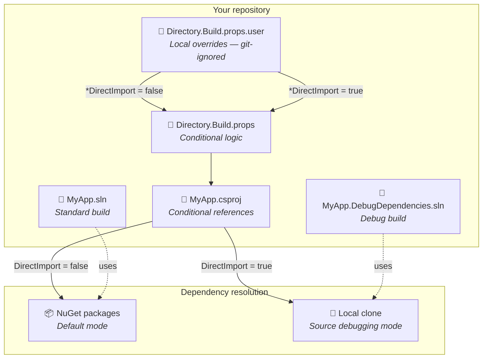
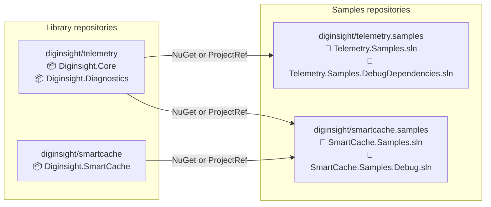
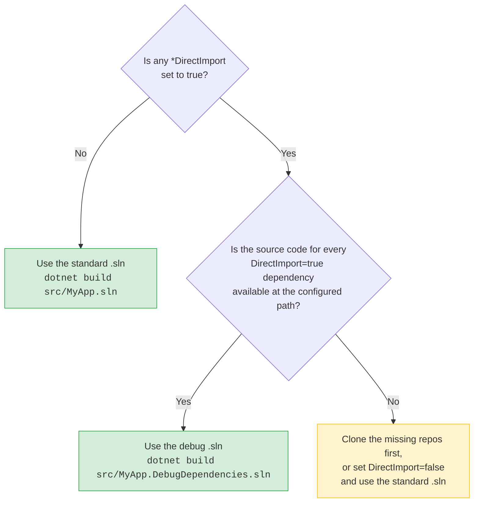

# Debug solutions with dependencies as project references

## 🎯 Introduction

When you're troubleshooting a bug that lives inside a NuGet dependency, decompilation and symbol servers only get you so far. Wouldn't it be better to set breakpoints directly in the dependency's source code and step through it as if it were part of your own solution?

The <mark>DebugDependencies pattern</mark> solves this problem. It maintains two parallel `.sln` files — one that resolves dependencies from NuGet packages (for everyday builds and CI), and one that replaces selected packages with local project references (for source-level debugging).

This article explains the pattern, walks you through setup, and covers common pitfalls. The technique uses **standard MSBuild conditional logic** — no custom scripts, no environment variable hacks outside of MSBuild.

**What you'll learn:**

- How the dual-solution pattern works under the hood
- How to configure `Directory.Build.props` and a local `.user` file to toggle between modes
- How to choose the correct solution for your scenario
- Troubleshooting tips for common issues

**Prerequisites:**

- .NET SDK installed (6.0 or later)
- Git and a basic understanding of MSBuild
- Visual Studio or Rider (for IDE-based debugging)

> **Note:** The examples in this article use the [Diginsight](https://github.com/diginsight) open-source repositories as a concrete illustration — specifically `telemetry.samples` and `smartcache.samples`. However, this pattern is **generic**: you can apply it to any .NET solution where you need to toggle dependencies between NuGet packages and local project references. The variable names (e.g., `DiginsightCoreSolutionDirectory`, `DiginsightCoreDirectImport`) are just one naming convention; your project might use `MyLibSolutionDirectory` / `MyLibDirectImport` or any other prefix that makes sense for your dependency families.

---

## 🏗️ How the pattern works

The core idea is simple: for each dependency family, a pair of MSBuild properties controls whether the dependency is resolved from its NuGet package or from a local source clone.

### Architecture overview



### MSBuild properties

Two MSBuild properties control each dependency family:

| Property | Type | Purpose |
|---|---|---|
| `*SolutionDirectory` | Path | Absolute path to the local clone's `src\` folder |
| `*DirectImport` | Boolean | When `true`, project references from `*SolutionDirectory` are active |

The table below shows concrete examples from the Diginsight repositories. Other projects follow the same pattern with different prefixes:

| Property | Example value | Meaning |
|---|---|---|
| `DiginsightCoreSolutionDirectory` | `E:\dev\Diginsight\telemetry\src\` | Path to the local [diginsight/telemetry](https://github.com/diginsight/telemetry) clone |
| `DiginsightCoreDirectImport` | `true` / `false` | Toggle project references for the telemetry library |
| `DiginsightSmartCacheSolutionDirectory` | `E:\dev\Diginsight\smartcache\src\` | Path to the local [diginsight/smartcache](https://github.com/diginsight/smartcache) clone |
| `DiginsightSmartCacheDirectImport` | `true` / `false` | Toggle project references for the SmartCache library |

These properties are defined in `Directory.Build.props` (with safe defaults) and are overridden in the **local** `Directory.Build.props.user` file (which isn't committed to source control).

### `Directory.Build.props` logic

The props file imports the local user overrides, then applies guard logic:

```xml
<!-- Import machine-local overrides (git-ignored) -->
<Import Project="$(MSBuildThisFileDirectory)Directory.build.props.user"
        Condition="Exists('$(MSBuildThisFileDirectory)Directory.build.props.user')" />

<!-- If no SolutionDirectory is configured, disable DirectImport -->
<PropertyGroup Condition="'$(DiginsightCoreSolutionDirectory)' == ''">
    <DiginsightCoreDirectImport>false</DiginsightCoreDirectImport>
</PropertyGroup>

<!-- Ensure the path ends with a trailing slash -->
<PropertyGroup Condition="'$(DiginsightCoreSolutionDirectory)' != ''">
    <DiginsightCoreSolutionDirectory>
        $([MSBuild]::EnsureTrailingSlash('$(DiginsightCoreSolutionDirectory)'))
    </DiginsightCoreSolutionDirectory>
</PropertyGroup>

<!-- Default DirectImport to false if not explicitly set -->
<PropertyGroup Condition="'$(DiginsightCoreDirectImport)' == ''">
    <DiginsightCoreDirectImport>false</DiginsightCoreDirectImport>
</PropertyGroup>
```

> **Tip:** The same block is repeated for each dependency family (e.g., `DiginsightSmartCache*`). When you adapt this pattern to your own project, create one block per dependency you want to toggle.

### Conditional references in `.csproj` files

Each project file uses conditional `ProjectReference` / `PackageReference` items. When `*DirectImport` is `true`, MSBuild resolves the dependency from source; otherwise, it pulls the NuGet package:

```xml
<ItemGroup>
  <!-- Source mode: project references from local clone -->
  <ProjectReference Include="$(DiginsightCoreSolutionDirectory)Diginsight.Core\Diginsight.Core.csproj"
                    Condition="'$(DiginsightCoreDirectImport)' == 'true'" />
  <ProjectReference Include="$(DiginsightCoreSolutionDirectory)Diginsight.Diagnostics\Diginsight.Diagnostics.csproj"
                    Condition="'$(DiginsightCoreDirectImport)' == 'true'" />

  <!-- Package mode: NuGet references (default) -->
  <PackageReference Include="Diginsight.Core"
                    Version="$(DiginsightCoreVersion)"
                    Condition="'$(DiginsightCoreDirectImport)' != 'true'" />
  <PackageReference Include="Diginsight.Diagnostics"
                    Version="$(DiginsightCoreVersion)"
                    Condition="'$(DiginsightCoreDirectImport)' != 'true'" />
</ItemGroup>
```

---

## 📋 Real-world examples from the Diginsight ecosystem

The Diginsight organization uses this pattern across multiple repositories. Each samples repository follows the same dual-solution convention:

| Samples repository | Standard solution | Debug solution | Dependencies toggled |
|---|---|---|---|
| [diginsight/telemetry.samples](https://github.com/diginsight/telemetry.samples) | `Telemetry.Samples.sln` | `Telemetry.Samples.DebugDependencies.sln` | `diginsight/telemetry` |
| [diginsight/smartcache.samples](https://github.com/diginsight/smartcache.samples) | `SmartCache.Samples.sln` | `SmartCache.Samples.Debug.sln` | `diginsight/telemetry`, `diginsight/smartcache` |

> **Key insight:** The naming convention isn't fixed — `telemetry.samples` uses `*.DebugDependencies.sln` while `smartcache.samples` uses `*.Debug.sln`. What matters is that the pattern remains the same: one solution for package references, one for project references.

### Repository layout

Both samples repositories share an identical folder-level layout. The screenshot below shows the typical `src/` folder structure from the [telemetry.samples](https://github.com/diginsight/telemetry.samples/tree/main/src) repository:

```
src/
├── 00. Console/           # Console app samples
├── 01. Wpf/               # WPF client samples
├── 02. WebApi/             # Web API samples
├── 02.01 Aspnet/           # ASP.NET samples
├── Directory.Build.props   # ← Conditional logic lives here
├── Directory.Build.targets
├── Telemetry.Samples.sln                    # Standard (NuGet packages)
├── Telemetry.Samples.DebugDependencies.sln  # Debug (project references)
└── diginsight.snk
```

The [smartcache.samples](https://github.com/diginsight/smartcache.samples/tree/main/src) repository follows the same structure:

```
src/
├── SampleWebAPI/              # Web API sample
├── Directory.Build.props      # ← Same conditional logic
├── Directory.Build.targets
├── SmartCache.Samples.sln             # Standard (NuGet packages)
├── SmartCache.Samples.Debug.sln       # Debug (project references)
└── diginsight.snk
```

### How dependencies flow between repositories

The diagram below shows the relationship between the Diginsight repositories and how the DebugDependencies pattern connects them:



---

## ⚙️ Setup: enabling DirectImport

### Step 1 — Clone the dependency repositories locally

Clone the libraries you want to debug next to your working repository:

```bash
# Clone the diginsight telemetry library
git clone https://github.com/diginsight/telemetry.git E:\dev\Diginsight\telemetry

# (Optional) Clone the smartcache library
git clone https://github.com/diginsight/smartcache.git E:\dev\Diginsight\smartcache
```

### Step 2 — Create or edit `Directory.Build.props.user`

This file lives at `src\Directory.Build.props.user` and is **git-ignored** (machine-local). `Directory.Build.props` automatically imports it when it exists.

```xml
<Project>
  <PropertyGroup>
    <!-- Point to your local clone of the dependency repository -->
    <DiginsightCoreSolutionDirectory>E:\dev\Diginsight\telemetry\src\</DiginsightCoreSolutionDirectory>
    <DiginsightCoreDirectImport>true</DiginsightCoreDirectImport>

    <!-- Optionally, enable smartcache from source too -->
    <!-- <DiginsightSmartCacheSolutionDirectory>E:\dev\Diginsight\smartcache\src\</DiginsightSmartCacheSolutionDirectory> -->
    <!-- <DiginsightSmartCacheDirectImport>true</DiginsightSmartCacheDirectImport> -->
  </PropertyGroup>
</Project>
```

### Step 3 — Open the correct solution

| Condition | Solution to use |
|---|---|
| All `*DirectImport` values are `false` | `*.sln` (standard) |
| Any `*DirectImport` is `true` | `*.DebugDependencies.sln` or `*.Debug.sln` |

> **Important:** The debug solution includes dependency projects from the `*SolutionDirectory` paths. If those paths don't exist on disk, the solution won't load.

---

## ✅ Which solution to build

Use this decision tree to pick the right solution:



---

## 💡 Pros and cons

### Pros

| Benefit | Detail |
|---|---|
| **Full source-level debugging** | Set breakpoints inside dependency libraries and step through them — no decompilation or PDB symbol servers needed |
| **Immediate iteration** | Changes to dependency source compile together with the consumer — no intermediate `dotnet pack` / NuGet publish cycle |
| **Accurate stack traces** | Debug sessions show real file/line information from the dependency source |
| **Consistent tooling** | Uses standard MSBuild conditional logic — no custom scripts or environment variable hacks outside of MSBuild |
| **Non-invasive** | The `Directory.Build.props.user` file is git-ignored; switching modes doesn't pollute commit history |

### Cons

| Drawback | Detail |
|---|---|
| **Two solutions to maintain** | The debug `.sln` must be kept in sync — every time you add a project to the standard solution, consider adding it to the debug one too |
| **Local clone required** | You must manually clone every dependency repository at the correct path before using the debug solution |
| **Version skew risk** | If the local clone is on a different branch/commit than the package version in the standard solution, behavior may differ between modes |
| **Slower builds** | Building from source compiles more projects; incremental builds reduce the cost, but cold builds are significantly slower |
| **NuGet lock files** | Projects using `RestorePackagesWithLockFile` may show restore errors when switching modes — delete `packages.lock.json` files and restore again |
| **CI always uses packages** | The DebugDependencies mechanism is inherently local; CI pipelines (e.g., GitHub Actions) always build the standard solution with NuGet packages |

---

## 🔧 Troubleshooting

### Build fails with "project not found" after enabling DirectImport

Verify that `*SolutionDirectory` points to the correct path and that the referenced `.csproj` files exist there. Check the path includes the `src\` subfolder if the dependency repository organizes its projects under `src\`.

### Restore errors / lock file conflicts

When toggling `DirectImport`, the `packages.lock.json` files become invalid. Delete them and restore again:

```powershell
Get-ChildItem -Recurse -Filter packages.lock.json | Remove-Item
dotnet restore src/Telemetry.Samples.DebugDependencies.sln
```

### IntelliSense still shows the NuGet version

Close and reopen the solution after changing `Directory.Build.props.user`. If the problem persists, delete the `.vs` folder and reopen.

### Changes in the dependency aren't reflected

Make sure you're building the debug solution, not the standard one. Confirm `*DirectImport` is `true` by checking `Directory.Build.props.user` and running:

```powershell
dotnet msbuild src/Telemetry.Samples.DebugDependencies.sln -t:WriteLinesToFile `
  -p:Lines="$(DiginsightCoreDirectImport)" -p:File=directimport.txt
```

---

## 🚀 Summary

The DebugDependencies solution pattern enables seamless cross-repository source-level debugging by leveraging conditional MSBuild `ProjectReference` / `PackageReference` items controlled by two properties per dependency family (`*DirectImport` and `*SolutionDirectory`).

**Key takeaways:**

- Use the **standard solution** for regular development and CI
- Switch to the **debug solution** only when you need to investigate or modify dependency source code alongside your consumer code
- The pattern is **generic** — adapt the variable names and solution naming to fit your project's conventions
- The `Directory.Build.props.user` file keeps everything local and git-ignored — zero commit noise

**Next steps:**

- Explore the [Diginsight telemetry.samples](https://github.com/diginsight/telemetry.samples) and [smartcache.samples](https://github.com/diginsight/smartcache.samples) repositories to see this pattern in action
- Review the [HowTo: Use Diginsight Samples](https://github.com/diginsight/telemetry/blob/main/src/docs/01.%20Concepts/90.00%20-%20HowTo%20-%20Use%20Diginsight%20Samples.md) article for a walkthrough of running the samples

---

## 📚 References

**[diginsight/telemetry](https://github.com/diginsight/telemetry)** 📗 [Verified Community]
The core Diginsight telemetry library. Provides automatic observability for .NET applications using `ILogger<>` and `System.Diagnostics`. This is the primary dependency toggled in the `Telemetry.Samples.DebugDependencies.sln` solution.

**[diginsight/smartcache](https://github.com/diginsight/smartcache)** 📗 [Verified Community]
Diginsight SmartCache — hybrid, distributed, multilevel caching based on age-sensitive data management. The second dependency family toggled in the `SmartCache.Samples.Debug.sln` solution.

**[diginsight/telemetry.samples](https://github.com/diginsight/telemetry.samples)** 📗 [Verified Community]
Sample applications demonstrating Diginsight telemetry integration across .NET versions (4.8 to .NET 8+) and application types (console, WPF, Web API, Blazor). Contains the `Telemetry.Samples.sln` and `Telemetry.Samples.DebugDependencies.sln` files referenced in this article.

**[diginsight/smartcache.samples](https://github.com/diginsight/smartcache.samples)** 📗 [Verified Community]
Sample applications for Diginsight SmartCache. Contains `SmartCache.Samples.sln` and `SmartCache.Samples.Debug.sln` — another concrete example of this dual-solution pattern.

**[MSBuild conditional constructs](https://learn.microsoft.com/en-us/visualstudio/msbuild/msbuild-conditional-constructs)** 📘 [Official]
Official Microsoft documentation on MSBuild conditional logic — the foundation that makes the `Condition` attributes in `Directory.Build.props` and `.csproj` files work.

**[Customize your build with Directory.Build.props](https://learn.microsoft.com/en-us/visualstudio/msbuild/customize-your-build)** 📘 [Official]
Official Microsoft guide to `Directory.Build.props` and `Directory.Build.targets` — covers the import mechanism and property inheritance used in this pattern.

---

<!--
validations:
  grammar: {status: "not_run", last_run: null}
  readability: {status: "not_run", last_run: null}
  structure: {status: "not_run", last_run: null}
  references: {status: "not_run", last_run: null}

article_metadata:
  filename: "01-HOWTO-debug-solutions-with-dependencies-as-project-references.md"
  created: "2026-05-17"
  last_updated: "2026-05-17"
  version: "2.0"
  diataxis_type: "how-to"
  purpose: "Explain the dual-solution DebugDependencies pattern for cross-repository source-level debugging in .NET"
  changes:
    - "v2.0: Major rewrite — added YAML frontmatter, emoji H2 headings, Mermaid diagrams, references section, generalized examples beyond Telemetry.Samples, improved writing style per article-writing.instructions.md, added validation metadata"
    - "v1.0: Initial version — Diginsight-specific examples only"
-->
