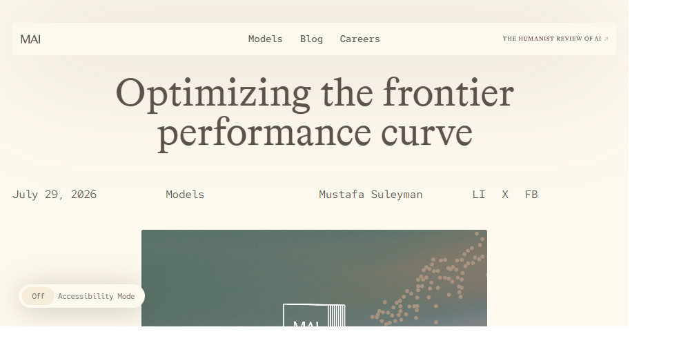

# Optimizing AI systems on the cost-to-outcome frontier

Choosing the strongest available model for every request is easy to explain, but expensive to operate. A production AI system has a better target: deliver the required customer outcome at the lowest sustainable cost, latency, and operational risk.

Microsoft AI describes this target as a <mark>frontier performance curve</mark>. The useful unit of optimization isn't an isolated model. It's the complete system: models, prompts and context, tools, the execution harness, product-specific evaluations, routing, serving hardware, and feedback from real use. This article analyzes that approach, separates the reusable architecture from Microsoft's first-party performance claims, and connects it to Learning Hub practices.

## 📑 Table of contents

- [Source analyzed](#source-analyzed)
- [The system is the unit of optimization](#the-system-is-the-unit-of-optimization)
- [How the cost-to-outcome frontier works](#how-the-cost-to-outcome-frontier-works)
- [Four architecture implications](#four-architecture-implications)
- [How to measure the frontier](#how-to-measure-the-frontier)
- [Evidence and limitations](#evidence-and-limitations)
- [Impact on Learning Hub content](#impact-on-learning-hub-content)
- [Conclusion](#conclusion)
- [References](#references)

## 📰 Source analyzed

> **[Optimizing the frontier performance curve](https://microsoft.ai/news/optimizing-the-frontier-performance-curve/)** 📘 [Official]  
> Mustafa Suleyman, Microsoft AI, July 29, 2026. The article argues that firms should co-optimize models, harnesses, reinforcement-learning environments, and hardware for customer outcomes per dollar.

The announcement is valuable because it connects model efficiency to production outcomes across coding, spreadsheets, image generation, voice, transcription, and cybersecurity. Its exact product metrics are first-party reports, however, and the post doesn't provide enough experimental detail for independent reproduction. Treat those numbers as directional evidence from Microsoft deployments, not universal performance guarantees.

## 🏗️ The system is the unit of optimization

A model-only comparison asks, "Which model has the highest benchmark score?" A system comparison asks, "Which configuration meets this workload's quality threshold with the best overall operating profile?"

That configuration includes:

- **Model** — A general model, a smaller specialized model, or a portfolio of both.
- **Harness** — The prompts, context assembly, memory, tools, action space, retries, and guardrails around the model.
- **Evaluation environment** — Product-specific tasks, graders, acceptance thresholds, and regression tests. Microsoft uses "RLE" for the reinforcement-learning environments that support this optimization loop.
- **Router** — Logic that selects a model or escalation path according to task difficulty, risk, latency, and cost.
- **Serving stack** — Accelerators, inference runtime, batching, caching, and energy use.
- **Feedback loop** — Offline evaluations and production signals that reveal whether quality improvements produce better customer outcomes.

This framing matters because a smaller model can outperform a stronger general model inside a narrow, well-instrumented product environment. The harness supplies relevant context and tools, while product evaluations define what "better" means. Model capability remains important, but it becomes one adjustable component rather than the architecture's center of gravity.

## 📈 How the cost-to-outcome frontier works

For a workload configuration $s$, define a simplified utility:

$$
U(s) = \frac{Q(s) \times O(s)}{C(s)}
$$

where $Q$ is task quality, $O$ is the value of the customer outcome, and $C$ is total cost. In practice, latency, safety, energy, and resilience act as constraints rather than values that can always be collapsed into one score.

A configuration is on the <mark>Pareto frontier</mark> when no alternative improves one objective without worsening another. Teams move the frontier by changing several parts of the system together:

1. Specialize a model against product-specific tasks and tools.
2. Improve the harness so the model receives better context and a clearer action space.
3. Route common requests to the efficient path and escalate difficult or high-risk requests.
4. Optimize serving for the hardware and workload profile.
5. Re-evaluate after every model, prompt, tool, or routing change.

Microsoft reports a 90/10 pattern for its MDASH cybersecurity system: a specialized model handles up to 90% of tasks, while GPT-5.4 is reserved for the most difficult 10%. The ratio isn't a general rule. The reusable pattern is **threshold-based escalation**: use the least expensive path that passes workload-specific quality and risk gates.

Independent research supports that pattern. FrugalGPT demonstrated learned model cascades that matched its strongest tested model with up to 98% lower inference cost in its experiments. RouteLLM reported more than a twofold cost reduction in some benchmark settings without reduced response quality. These studies don't validate Microsoft's product figures, but they corroborate the underlying claim that routing and cascades can improve the cost-quality trade-off.

## 🧭 Four architecture implications

### Route by difficulty and risk

Static model selection maps a task category to a model. Production routing goes further: it estimates whether a particular request needs escalation. Useful signals include request type, input complexity, confidence, evaluator scores, tool failures, safety class, and customer tier.

The router needs an explicit fallback path. A cheap model that fails silently doesn't save money; it shifts cost into retries, support, or poor outcomes. Route against an acceptance threshold, not price alone.

### Specialize where demand is stable

Specialization works best when a workload has repeatable tasks, representative evaluation data, stable tools, and enough volume to repay training and operations costs. It works poorly when tasks change rapidly, examples are sparse, or failures are difficult to detect.

The Microsoft examples illustrate several specialization methods: post-training a coding checkpoint within the GitHub Copilot harness, further training it in an Excel reinforcement-learning environment, and pairing cybersecurity models with an MDASH-specific harness. The transferable idea is to train and evaluate against the environment in which the model must act.

### Keep the harness model-independent

Microsoft links efficiency to resilience: a model might become unavailable because of security, policy, commercial, or geopolitical changes. Substitution is practical only when context, memory, tools, evaluations, and action definitions live outside one model family.

Model independence doesn't mean every model behaves identically. Provider-specific adapters and prompts will remain at the edges. The durable capability should live in model-neutral contracts, test cases, tool schemas, and outcome measures. This extends the Learning Hub's existing model-independence test from cost control into operational continuity.

### Optimize hardware with the workload

Token counts don't describe the whole cost. Microsoft reports that smaller specialized models can run on A100 or H100 accelerators instead of requiring only the newest hardware, and that MAI models achieve 40% better performance per watt on Maia 200. These are first-party results, but they expose an important accounting boundary: compare total serving cost, capacity, energy, latency, and availability, not token price alone.

## 📏 How to measure the frontier

Use a scorecard that keeps outcome quality visible alongside efficiency. The following dimensions prevent a low token count from becoming a misleading success metric.

| Dimension | Example measure | Why it matters |
|-----------|-----------------|----------------|
| **Task quality** | Pass rate, error rate, groundedness, grader score | Confirms that efficiency doesn't reduce correctness |
| **Customer outcome** | Acceptance, task completion, retention, save rate | Tests whether benchmark gains matter in the product |
| **Inference cost** | Cost per accepted result, GPU seconds, tokens per completed task | Connects resource use to useful work |
| **Latency** | Median and tail latency per completed task | Captures interactive experience and timeout risk |
| **Escalation** | Share of requests routed to stronger models | Reveals whether the efficient path handles its intended load |
| **Reliability** | Retry rate, fallback success, tool failure rate | Exposes hidden costs and fragile integrations |
| **Safety** | Policy violations, harmful-action rate, human overrides | Prevents efficiency from bypassing risk controls |
| **Resilience** | Time and quality loss when replacing a model | Tests whether substitutability is real |
| **Energy** | Performance per watt or energy per accepted result | Captures hardware efficiency and capacity constraints |

Measure per accepted result rather than per request whenever possible. A system that uses fewer tokens but produces more rejected answers has moved backward.

## 🔬 Evidence and limitations

The source clears a soundness gate for architectural analysis: its thesis is clear, internally consistent, substantial, falsifiable, and independently corroborated by model-cascade and routing research. The strength of evidence varies by claim.

| Claim type | Evidence strength | Interpretation |
|------------|-------------------|----------------|
| System-level optimization can beat model-only selection | Strong conceptual and experimental support | Use as an architecture principle |
| Cascades and routers can reduce cost at similar quality | Supported by FrugalGPT and RouteLLM experiments | Validate again on your workload |
| Microsoft's listed product gains | First-party production report | Treat as directional until methods or independent results are available |
| A 90/10 split is optimal | One Microsoft deployment example | Don't generalize the ratio |
| Model substitution improves resilience | Strong architectural reasoning; limited quantitative evidence in the source | Test through planned replacement exercises |

The Microsoft post omits sample sizes, confidence intervals, detailed benchmark protocols, traffic allocation, failure distributions, and full cost definitions. Some comparisons use product behavior, some use benchmarks, and others use hardware efficiency, so the percentages aren't directly comparable. It also doesn't detail the training cost required to create specialized models. Include that investment when deciding whether specialization improves lifetime economics.

## 🧩 Impact on Learning Hub content

This analysis changes the Learning Hub's model-selection story in four ways:

- **Extend model selection into system design** — [Understanding LLM models and model selection](../03-concepts/01.07-understanding-llm-models-and-model-selection.md) explains which model fits a task. This article adds dynamic routing, escalation, and workload-specific evaluation.
- **Measure outcomes rather than raw tokens** — Token optimization remains useful, but the primary metric should become cost per accepted result under quality, latency, safety, and resilience constraints.
- **Elevate evaluations to architecture** — Product-specific evaluations aren't a final validation step. They define the objective that model, harness, router, and hardware changes optimize.
- **Connect independence to continuity** — A model-neutral harness preserves routing choices and reduces the operational impact of provider or model loss.

The immediate corpus impact is additive. Existing prompt-engineering guidance already covers model characteristics, per-task routing, token budgets, and model independence in separate places. This article becomes the canonical analysis that connects them into one production optimization loop. Future how-to content can build on it with routing implementation, evaluator design, cost telemetry, and replacement drills.

For operational token budgeting details in Foundry reasoning workflows, see the context authority file [02.02-context-window-and-token-optimization.md](../../../.copilot/context/00.00-prompt-engineering/02.02-context-window-and-token-optimization.md), including the Foundry reasoning-token caveats and preview/deployment constraint guidance.

## ✅ Conclusion

- **Optimize the system** — Treat models, harnesses, evaluations, routing, feedback, and hardware as one configuration.
- **Route against thresholds** — Send each request to the least expensive path that meets workload-specific quality and risk requirements.
- **Measure accepted outcomes** — Track cost, latency, reliability, safety, and energy per useful result, not tokens in isolation.
- **Own durable capability** — Keep context, tools, memory, evaluations, and action contracts independent of one model family.
- **Calibrate the evidence** — Use Microsoft's production results as directional examples and validate every frontier claim on your own workload.

Next, connect this framework to [model selection](../03-concepts/01.07-understanding-llm-models-and-model-selection.md) and [token optimization patterns](../04-howto/13.01-appendix-token-optimization-patterns.md). Together, they move from choosing a model to operating a measurable, replaceable model portfolio.

## 📚 References

### Official sources

**[Optimizing the frontier performance curve](https://microsoft.ai/news/optimizing-the-frontier-performance-curve/)** 📘 [Official]  
Microsoft AI's statement of the cost-to-outcome strategy, with first-party deployment results across coding, Excel, cybersecurity, image, voice, and transcription workloads.

**[Hill-climbing MAI models for GitHub Copilot and Excel](https://microsoft.ai/news/hill-climbing-mai-models-for-github-copilot-and-excel/)** 📘 [Official]  
Describes how Microsoft post-trained a coding model in the GitHub Copilot harness, then adapted the checkpoint in an Excel reinforcement-learning environment.

### Research sources

**[FrugalGPT: How to Use Large Language Models While Reducing Cost and Improving Performance](https://arxiv.org/abs/2305.05176)** 📗 [Verified Community]  
Introduces prompt adaptation, model approximation, and learned LLM cascades. Its experiments independently support the cost-quality value of routing, within the tested models and datasets.

**[RouteLLM: Learning to Route LLMs with Preference Data](https://arxiv.org/abs/2406.18665)** 📗 [Verified Community]  
Evaluates learned routers that choose between stronger and weaker models. The results support dynamic model selection while also showing that gains depend on router training and evaluation conditions.

<!--
validations:
  grammar:
    status: "not_run"
    last_run: null
  readability:
    status: "not_run"
    last_run: null
  structure:
    status: "not_run"
    last_run: null

article_metadata:
  filename: "23-optimizing-ai-systems-on-the-cost-to-outcome-frontier.md"
  last_updated: "2026-08-04"
-->