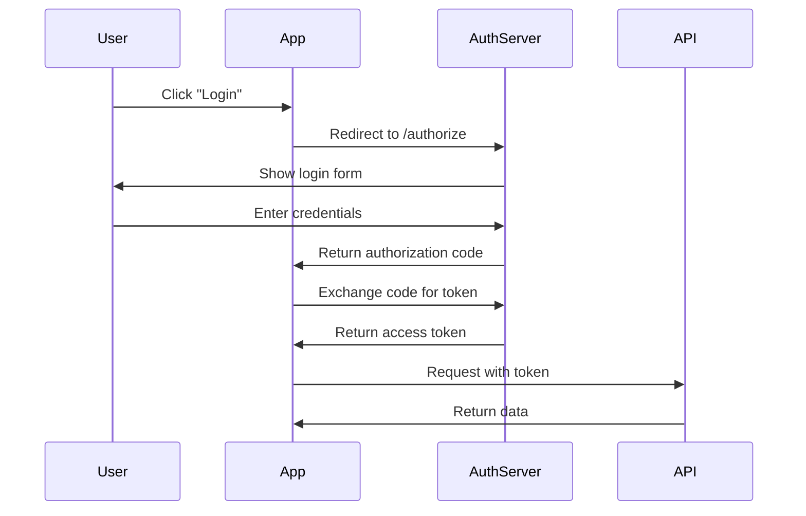
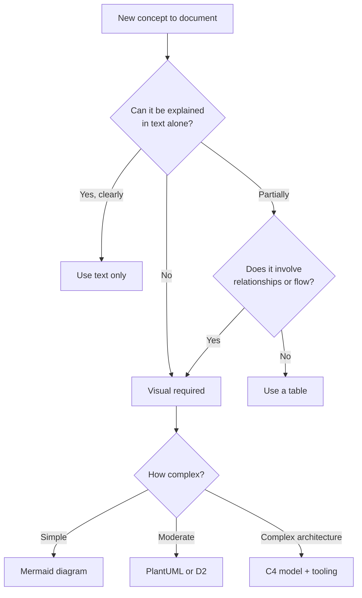
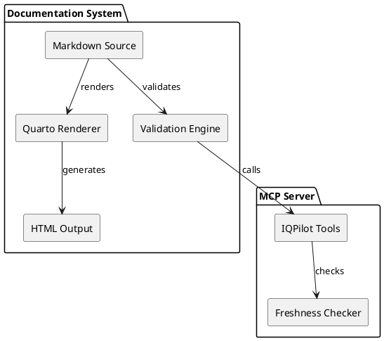
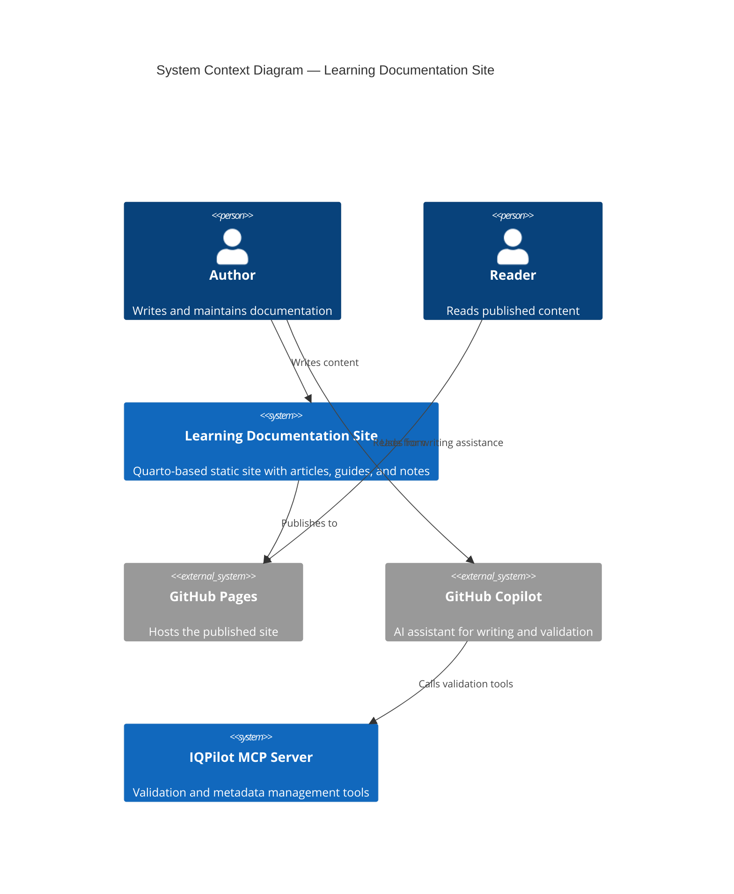

---
# Quarto Metadata
title: "Visual Documentation and Diagrams"
author: "Dario Airoldi"
date: "2026-02-28"
categories: [technical-writing, diagrams, visual-documentation, mermaid, architecture, accessibility]
description: "Create effective visual documentation using diagrams-as-code, screenshots, and architecture models to complement text-based technical content"
---

# Visual Documentation and Diagrams

> Text explains *how*; visuals show *how things relate*. Effective documentation uses both.

## Table of Contents

- [🎯 Introduction](#-introduction)
- [📋 When to use visuals vs. text](#-when-to-use-visuals-vs-text)
- [🏗️ Diagrams-as-code](#-diagrams-as-code)
- [📐 Architecture documentation models](#-architecture-documentation-models)
- [📸 Screenshot best practices](#-screenshot-best-practices)
- [🎨 Visual information hierarchy](#-visual-information-hierarchy)
- [♿ Accessibility for visual content](#-accessibility-for-visual-content)
- [🎬 Video and animated documentation](#-video-and-animated-documentation)
- [⚙️ Tooling and workflow integration](#-tooling-and-workflow-integration)
- [📌 Applying visual documentation to this repository](#-applying-visual-documentation-to-this-repository)
- [✅ Conclusion](#-conclusion)
- [📚 References](#-references)

## 🎯 Introduction

The technical writing series up to this point focuses on text-based documentation—writing style, structure, accessibility, validation, and consistency. But many concepts resist clear textual explanation. System architectures, data flows, decision trees, and UI interactions are often easier to understand visually. The gap isn't just about "adding pictures"—it's about choosing the right visual medium, maintaining visuals over time, and ensuring they're accessible to all readers.

This article covers:

- **Visual vs. text decisions** — When diagrams add clarity and when they add noise
- **Diagrams-as-code** — Mermaid, PlantUML, and D2 for version-controlled, maintainable diagrams
- **Architecture documentation** — C4 model and Arc42 for systematic architecture visualization
- **Screenshot discipline** — Annotation, versioning, and maintenance strategies
- **Visual hierarchy** — Layout principles that guide the reader's eye
- **Accessibility** — Making visual content work for all users, including those using screen readers
- **Video and animation** — When moving images justify their cost

**Article type:** Explanation (understanding concepts) with how-to elements (actionable patterns)

**Prerequisites:** Familiarity with [accessibility in technical writing](03-accessibility-in-technical-writing.md) provides essential context for the accessibility sections. Understanding of [documentation lifecycle](10-documentation-lifecycle-and-maintenance.md) helps with visual content maintenance strategies.

## 📋 When to use visuals vs. text

Not every concept benefits from a diagram. Adding visuals indiscriminately clutters documentation and increases maintenance burden. The decision to use a visual should be deliberate.

### Visuals outperform text when

| Scenario | Why visuals work better | Example |
|----------|------------------------|---------|
| **Showing relationships** | Spatial layout reveals connections text can't | System architecture, dependency graphs |
| **Depicting sequences** | Arrow direction conveys flow faster than numbered prose | Authentication flows, deployment pipelines |
| **Comparing options** | Side-by-side layouts support parallel evaluation | Feature comparison matrices, decision trees |
| **Orienting spatially** | Maps and layouts leverage spatial memory | UI navigation, physical topology |
| **Revealing patterns** | Shapes and groupings surface structure | Data models, organizational hierarchies |

### Text outperforms visuals when

| Scenario | Why text works better | Example |
|----------|----------------------|---------|
| **Explaining reasoning** | Prose conveys nuance, caveats, and context | Design decisions, trade-off analysis |
| **Providing precise values** | Tables and specifications need exact data | API parameters, configuration settings |
| **Guiding step-by-step** | Numbered instructions with code snippets are scannable | Installation guides, CLI tutorials |
| **Describing exceptions** | Edge cases and error handling need conditional language | Troubleshooting guides, error handling docs |
| **Supporting search** | Text is indexable; diagram content isn't (without alt text) | Reference documentation |

### The complementary principle

The most effective documentation uses visuals and text together. Follow this pattern:

1. **Lead with text** — State the concept in words
2. **Show with visual** — Illustrate the concept with a diagram or image
3. **Explain the visual** — Narrate key elements that the reader should notice
4. **Provide detail in text** — Expand on specifics the visual can't convey

> **Anti-pattern:** Don't embed a complex diagram and say "as shown in Figure 3." Explain what the visual shows and why it matters. The visual should reinforce text, not replace it.

### Visual requirements by article type

The "when to use visuals vs. text" decision above addresses individual content choices. This subsection maps those decisions to article types, giving writers a <mark>visual budget</mark>—a guideline for how many and what kind of visuals an article type typically needs.

The following table maps each Diátaxis article type to its recommended visual patterns. For content density and depth guidelines by article type, see [Article 02](02-structure-and-information-architecture.md#content-density-and-depth-by-article-type).

| Article type | Primary visual needs | Recommended visuals | Typical count | Anti-pattern |
|-------------|---------------------|--------------------|--------------|--------------|
| **Explanation** (concepts) | Illustrate mental models, show relationships between ideas | Architecture diagrams, concept maps, comparison tables, flowcharts | 2–5 per article | Dense diagrams without narration; readers can't extract the "why" from a picture alone |
| **How-to** (task guidance) | Show UI state, confirm progress, clarify ambiguous steps | Annotated screenshots, short GIFs (<10 s), numbered step diagrams | 1–3 per major task | Screenshots of every screen (over-documenting); prefer text for straightforward steps |
| **Reference** (lookup) | Visualize structure, relationships, and data models | Entity-relationship diagrams, schema diagrams, syntax railroad diagrams | 0–2 per article | Decorative diagrams that don't add information beyond what the tables already convey |
| **Tutorial** (learning) | Build learner confidence, show expected outcomes | Before/after screenshots, progressive diagrams that grow with each step, output previews | 3–6 per article | Complex diagrams early in the tutorial before the learner has enough context to interpret them |

**Three rules for applying visual budgets:**

1. **Treat the count as guidance, not a quota.** An explanation article with one perfect architecture diagram beats one with five mediocre illustrations. The budget prevents over- and under-investing, not creativity.
2. **Match visual complexity to article depth.** A deep explanation article (Art. 09's readability formulas) can use detailed annotated diagrams. A surface-level overview (Art. 00's foundations survey) should use simpler concept maps.
3. **Pair every visual with the complementary principle.** Regardless of article type, every visual needs the four-step pattern: state → show → explain → detail. See [the complementary principle](#the-complementary-principle) above.

**This series' visual distribution:**

| Tier | Articles | Current visual use | Recommended additions |
|------|----------|-------------------|-----------------------|
| Visually rich | Art. 11 (this article) | Extensive code examples for diagram tools | Add rendered diagram examples alongside code |
| Moderate | Art. 02, Art. 07, Art. 09 | Tables and structured comparisons | Add concept map (Art. 02), workflow diagram (Art. 07), formula visualization (Art. 09) |
| Text-only | Art. 00, 01, 03, 04, 05, 06, 08, 10, 12 | No diagrams or screenshots | Add 1–2 targeted visuals per article based on the type-specific guidance above |

## 🏗️ Diagrams-as-code

<mark>Diagrams-as-code</mark> means writing diagrams in a text-based syntax that renders into visual output. Like documentation-as-code, this approach enables version control, diff tracking, and automated rendering—solving the maintenance problems that plague image-based diagrams.

### Why diagrams-as-code matters

Traditional diagram workflows (draw in Visio, export as PNG, embed in docs) create maintenance nightmares:

- **No version control** — Binary image files can't be meaningfully diffed
- **No single source** — The "source" diagram lives in a tool most contributors can't access
- **Stale visuals** — Updating a diagram means re-exporting and re-uploading—friction that leads to neglect
- **Inconsistent styling** — Each author applies different colors, fonts, and layouts

Diagrams-as-code eliminates all four problems. The diagram source lives alongside the documentation, is version-controlled, and renders automatically.

### Mermaid

<mark>Mermaid</mark> is the most widely supported diagrams-as-code language. GitHub, GitLab, Azure DevOps, Notion, Obsidian, and Quarto all render Mermaid natively.

**Strengths:**
- Native rendering in GitHub Markdown (no build step)
- Wide variety of diagram types (flowcharts, sequence, class, state, Gantt, ER, pie, mindmap)
- Simple syntax with low learning curve
- Active community and frequent updates

**Limitations:**
- Limited layout control (auto-layout can produce unexpected results)
- Complex diagrams become hard to read in source form
- Styling options are less flexible than dedicated tools

**Example — sequence diagram:**



**Example — flowchart for a decision process:**



### PlantUML

<mark>PlantUML</mark> is a mature diagrams-as-code tool with broader diagram type support and more precise layout control than Mermaid.

**Strengths:**
- Extensive diagram types (UML class, sequence, component, deployment, activity, use case, and more)
- Fine-grained layout control (`left to right direction`, grouping, spacing)
- Preprocessing with `!include` for reusable components
- Strong ecosystem (VS Code extensions, CI/CD integration, server-based rendering)

**Limitations:**
- Requires a Java runtime or a server for rendering (no native browser rendering)
- Not natively supported in GitHub Markdown (needs pre-rendering or a proxy service)
- Syntax is more verbose than Mermaid

**Example — component diagram:**



### D2

<mark>D2</mark> is a newer diagrams-as-code language focused on software architecture diagrams. It emphasizes readability and modern aesthetics.

**Strengths:**
- Clean, intuitive syntax ("shape: text" pattern)
- Multiple layout engines (dagre, ELK, TALA)
- Native support for layers, scenarios, and interactive diagrams
- Excellent default styling
- Markdown inside labels

**Limitations:**
- Younger ecosystem with fewer integrations
- No native rendering in GitHub or most documentation platforms (requires build step)
- Smaller community than Mermaid or PlantUML

**Example — architecture overview:**

```d2
direction: right

User -> App: HTTP Request
App -> Auth: Validate token {
  style.stroke-dash: 3
}
Auth -> App: Token valid

App -> Database: Query data
Database -> App: Results

App -> User: JSON Response
```

### Choosing a diagrams-as-code tool

| Factor | Mermaid | PlantUML | D2 |
|--------|---------|----------|-----|
| **Native GitHub rendering** | ✅ Yes | ❌ No | ❌ No |
| **Quarto support** | ✅ Native | ⚠️ Via extension | ❌ Build step |
| **Learning curve** | Low | Medium | Low |
| **Diagram types** | 12+ | 20+ | 8+ |
| **Layout control** | Limited | Good | Excellent |
| **Styling flexibility** | Moderate | High | High |
| **Interactive diagrams** | ❌ No | ❌ No | ✅ Yes (layers) |
| **CI/CD integration** | Easy | Moderate | Easy |
| **Best for** | Quick diagrams in docs | Detailed UML modeling | Architecture diagrams |

**Recommendation for this repository:** Use Mermaid as the default—it renders natively in GitHub and Quarto. Reach for PlantUML or D2 when Mermaid's layout limitations become a problem.

## 📐 Architecture documentation models

Architecture diagrams without a consistent model become ad hoc drawings that confuse more than they clarify. Two frameworks bring structure to architecture visualization.

### The C4 model

<mark>The C4 model</mark> (Context, Containers, Components, Code) provides four levels of zoom for software architecture diagrams. Created by Simon Brown, it addresses the problem that most architecture diagrams are "boxes and lines" with no clear purpose or consistent abstraction level.

**The four levels:**

| Level | Shows | Audience | Detail |
|-------|-------|----------|--------|
| **Context** (Level 1) | System in its environment—users and external systems | Everyone (business and technical) | Lowest detail; highest abstraction |
| **Container** (Level 2) | Major runtime units—applications, databases, message brokers | Technical decision-makers | Technology choices visible |
| **Component** (Level 3) | Internal structure of a container—modules, services, controllers | Developers and architects | Design patterns visible |
| **Code** (Level 4) | Class-level detail—UML class diagrams | Developers | Highest detail; rarely maintained manually |

**When to use each level:**

- **Level 1** — Include in every system's documentation. It answers "what does this system interact with?"
- **Level 2** — Include for systems with multiple deployment units. It answers "what are the major building blocks?"
- **Level 3** — Include selectively for complex containers. It answers "how is this container organized internally?"
- **Level 4** — Generate from code rather than maintaining manually. It answers "what are the classes and interfaces?"

**C4 in Mermaid (using C4 diagram type):**



### Arc42

<mark>Arc42</mark> is a documentation template for software architecture that defines 12 sections covering everything from requirements to deployment. Where C4 focuses on *diagrams*, Arc42 focuses on the *complete documentation structure*.

**The 12 Arc42 sections:**

| # | Section | Purpose |
|---|---------|---------|
| 1 | Introduction and goals | Business context, quality goals, stakeholders |
| 2 | Constraints | Technical, organizational, and convention constraints |
| 3 | Context and scope | System boundary (similar to C4 Level 1) |
| 4 | Solution strategy | Key technology and architecture decisions |
| 5 | Building block view | Static decomposition (similar to C4 Level 2-3) |
| 6 | Runtime view | Dynamic behavior—sequence diagrams, activity flows |
| 7 | Deployment view | Infrastructure, environments, mapping |
| 8 | Crosscutting concepts | Security, error handling, logging patterns |
| 9 | Architecture decisions | Decision records with rationale |
| 10 | Quality requirements | Quality tree and scenarios |
| 11 | Risks and technical debt | Known issues and mitigation |
| 12 | Glossary | Terminology definitions |

**When to use Arc42:**
- Projects that need comprehensive architecture documentation (not just diagrams)
- Teams with multiple architects or rotating developers
- Systems that require compliance or audit trails

**C4 vs. Arc42:** They're complementary, not competing. Use C4's zoom levels for consistent diagram abstraction within Arc42's section structure. Arc42 Section 3 maps to C4 Level 1; Section 5 maps to Levels 2-3; Section 6 uses sequence diagrams at any C4 level.

## 📸 Screenshot best practices

Screenshots are the most fragile form of visual documentation. UI changes, theme updates, and localization shifts all invalidate them. Use screenshots deliberately and maintain them rigorously.

### When to use screenshots

**Good uses:**
- Showing a specific UI element that's hard to describe in words (e.g., "Click the gear icon next to your profile picture")
- Illustrating a multi-step wizard where spatial orientation matters
- Demonstrating expected output or results for verification

**Avoid when:**
- The UI element is easily described in text (e.g., "Select **Settings** > **Privacy**")
- The screenshot will become outdated faster than the documentation review cycle
- You're using screenshots to avoid writing clear instructions

### Annotation guidelines

Raw screenshots without annotation are ambiguous—readers don't know where to look.

**Annotation rules:**

| Element | Use for | Style guidance |
|---------|---------|---------------|
| **Red rectangle** | Highlighting a specific area | 2-3px border; rounded corners; don't obscure content |
| **Numbered callouts** | Multi-step sequences in one screenshot | Circles with numbers (①②③); sequential, left-to-right or top-to-bottom |
| **Arrows** | Pointing to specific elements | Solid line; arrowhead touching the target element |
| **Blur/redact** | Hiding sensitive information | Solid block (not transparency); cover all PII, credentials, and internal URLs |
| **Captions** | Explaining context | "Figure N: Description" below the image; always present |

**Don't:**
- Use arrows that cross over each other
- Annotate more than five elements in one screenshot (split into multiple)
- Use color as the only indicator (inaccessible to color-blind readers)
- Include unnecessary UI chrome (crop to the relevant area)

### Screenshot versioning and maintenance

Screenshots are high-maintenance assets. Plan for their lifecycle:

- **Name systematically** — `feature-name-step-N-vX.Y.png` (e.g., `auth-config-step-2-v4.1.png`)
- **Store centrally** — Keep screenshots in a dedicated `images/` folder next to the article, not scattered across the repository
- **Track product versions** — Record which product version each screenshot depicts (in filename or companion metadata)
- **Automate when possible** — Tools like Playwright, Cypress, and Selenium can generate screenshots programmatically during CI, ensuring they stay current
- **Set freshness thresholds** — UI screenshots should be reviewed at every product UI release. See [documentation lifecycle](10-documentation-lifecycle-and-maintenance.md) for freshness scoring

### Alternatives to screenshots

Before reaching for a screenshot, consider lighter-weight alternatives:

| Alternative | Best for | Advantage over screenshots |
|-------------|----------|----------------------------|
| **Annotated text** | Describing menu paths | Never goes stale; accessible; searchable |
| **Keyboard shortcuts** | Describing actions | Precise; no visual dependency |
| **Diagrams-as-code** | Showing UI structure abstractly | Version-controlled; maintainable |
| **GIF/video** | Multi-step interactions | Shows motion and transitions |

## 🎨 Visual information hierarchy

<mark>Visual hierarchy</mark> guides readers through content by using size, position, contrast, and whitespace to signal importance and relationships. Principles from graphic design apply directly to technical documentation.

### Core principles

**1. Size signals importance**  
Larger elements attract attention first. Use heading sizes (H1 > H2 > H3) and diagram element sizing to establish importance. In diagrams, make primary systems larger than supporting services.

**2. Position signals reading order**  
Western readers scan left-to-right, top-to-bottom. Place the most important information in the top-left. In flowcharts, start the flow at the top or left.

**3. Contrast signals difference**  
High-contrast elements stand out. Use color, weight, or borders to differentiate categories. In architecture diagrams, use color to distinguish internal systems from external dependencies.

**4. Proximity signals grouping**  
Elements close together are perceived as related. Group related components visually. Use whitespace to separate unrelated sections.

**5. Consistency signals patterns**  
Repeated visual elements signal similar roles. Use the same shape for the same concept type across all diagrams. If databases are cylinders, *always* use cylinders for databases.

### Applying hierarchy to technical diagrams

| Principle | Diagram application | Common mistake |
|-----------|-------------------|----------------|
| Size | Main system larger than dependencies | All boxes same size (no hierarchy) |
| Position | Flow starts top-left; output bottom-right | Random placement; flow crosses itself |
| Contrast | External systems in different color/shade | Monochrome everything |
| Proximity | Related services grouped in a bounding box | Services scattered without grouping |
| Consistency | Same shape = same type across all diagrams | Databases as rectangles in one diagram, cylinders in another |

### Color usage in diagrams

Color adds meaning but introduces accessibility risks. Follow these rules:

- **Never rely on color alone** — Always pair color with labels, patterns, or position
- **Limit palette** — Use three to five colors maximum; more causes visual noise
- **Use semantic colors consistently** — If "blue = internal service" in one diagram, maintain that mapping everywhere
- **Test for color blindness** — Simulate deuteranopia (red-green) and tritanopia (blue-yellow) views. Tools like Coblis or Chrome DevTools' "Emulate vision deficiencies" help
- **Provide a legend** — When meaning depends on color, include a visible legend

## ♿ Accessibility for visual content

Visual documentation creates accessibility barriers unless you plan for them. This section builds on [accessibility in technical writing](03-accessibility-in-technical-writing.md), which covers alt text fundamentals. Here, we go deeper into visual-specific accessibility.

### Alt text for diagrams

Diagrams need structured alt text that conveys the *information*, not the visual appearance.

**For simple diagrams (1-3 relationships):**  
Write a concise alt text (≤125 characters) that captures the essential information:

```markdown

```

**For complex diagrams (4+ relationships):**  
Use short alt text + a detailed text description below:

```markdown


*Figure 1: The documentation system consists of five main components. 
The Markdown source files are processed by the Quarto renderer into 
HTML output. A validation engine checks the source files by calling 
IQPilot MCP tools, which include a freshness checker for monitoring 
content currency.*
```

**For diagrams-as-code:**  
The source code *is* the accessible fallback. Screen reader users can read the Mermaid or PlantUML syntax. Document this expectation in your accessibility guidelines.

### Accessible diagram design

| Practice | Why it matters | Implementation |
|----------|---------------|----------------|
| Use text labels on all elements | Screen readers can convert SVG text | Never rely solely on icons or colors |
| Include a title and description | SVG `<title>` and `<desc>` elements are read by screen readers | Set `accessible: true` in Mermaid config |
| Provide text alternatives | Not all users can process visual information | Include a prose summary after each diagram |
| Use sufficient contrast | Low-vision users need 4.5:1 minimum ratio | Test with WCAG contrast checkers |
| Avoid information in images of text | Text baked into images isn't accessible | Use actual text elements or overlays |

### Screen reader testing for visuals

Test your visual documentation with a screen reader to verify the experience:

1. Navigate to the diagram in your rendered documentation
2. Verify that alt text is read and conveys meaning
3. Check that the figure caption is associated with the image
4. Confirm that any interactive elements (links in SVGs) are navigable
5. Verify that the text description following the diagram provides equivalent information

## 🎬 Video and animated documentation

Video and animated content (GIFs, short screencasts) can demonstrate interactions that static images can't capture. But they're expensive to produce, impossible to search, and difficult to maintain.

### When video adds value

**Strong cases for video:**
- Multi-step UI interactions where click order and visual feedback matter
- Debugging workflows where context switching between tools needs demonstration
- Onboarding walkthroughs where tone and pacing guide newcomers
- Complex animations or transitions that can't be captured in stills

**Weak cases for video:**
- Anything that can be explained with text + screenshots
- Static configuration (use code blocks instead)
- Information that changes frequently (high maintenance cost)

### Production guidelines

| Element | Guideline | Rationale |
|---------|-----------|-----------|
| **Length** | 30-90 seconds per topic | Viewers drop off sharply after 90 seconds |
| **Resolution** | 1080p minimum; record at 2x if users zoom | Ensures text is readable on all displays |
| **Audio** | Include narration OR captions, never silent | Silent video forces guessing at purpose |
| **Captions** | Always include closed captions | Accessibility requirement (WCAG 1.2.2) |
| **Format** | MP4 (H.264) for video; GIF only for <10-second loops | Broad compatibility; GIFs lack playback controls |
| **Hosting** | Link to hosted video; don't embed large files in repos | Git isn't designed for binary media |

### GIF vs. video decision

| Factor | GIF | Video |
|--------|-----|-------|
| Playback controls | ❌ None (auto-loops) | ✅ Play, pause, seek |
| File size | Large (uncompressed frames) | Small (compressed) |
| Accessibility | ❌ No captions, no pause | ✅ Captions, controls |
| Best for | Quick UI micro-interactions (<10s) | Walkthroughs, explanations (>10s) |
| Maintenance | Replace the file | Re-record and re-encode |

> **Accessibility note:** Auto-playing GIFs violate WCAG 2.2.2 (Pause, Stop, Hide) unless users can pause them. Prefer `<video>` with controls over GIF for anything longer than a brief moment.

## ⚙️ Tooling and workflow integration

### Documentation pipeline integration

Integrate visual documentation into your docs-as-code workflow:

**At authoring time:**
- **Mermaid Live Editor** (`mermaid.live`) — Browser-based editor with real-time preview
- **VS Code extensions** — Mermaid Preview, PlantUML Preview, Draw.io Integration
- **D2 Playground** (`play.d2lang.com`) — Interactive D2 authoring

**At build time:**
- **Quarto** — Renders Mermaid natively; PlantUML via `quarto-plantuml` extension
- **mermaid-cli** (`mmdc`) — Render Mermaid to SVG/PNG in CI pipelines
- **PlantUML Server** — Self-hosted or cloud rendering service
- **d2 CLI** — Render D2 diagrams to SVG/PNG

**At validation time:**
- **Image alt text checker** — Lint for missing or empty alt attributes
- **Link checker** — Verify image paths resolve
- **Accessibility scanner** — axe, pa11y, or Lighthouse for rendered output

### Version control for visuals

| Visual type | Source format | Version control strategy |
|-------------|-------------|--------------------------|
| Diagrams-as-code | `.mmd`, `.puml`, `.d2` | Track source files; generate images at build |
| Screenshots | `.png`, `.webp` | Track in `images/` folder; name with version |
| Videos | `.mp4` | Host externally; track URLs in docs |
| SVG diagrams | `.svg` | Track directly (text-based, diffable) |
| Binary diagrams | `.drawio`, `.vsdx` | Track source + exported image; note: diffs aren't meaningful |

**Recommendation:** Keep generated images out of version control (add to `.gitignore`). Track only the source files and render at build time. Exception: screenshots and manually created SVGs that don't have a code-based source.

## 📌 Applying visual documentation to this repository

This section maps visual documentation concepts to the Learning Documentation Site's structure and tooling.

### Current state

**What's already in place:**
- **Image folders** — Articles use `images/` subfolders for screenshots and visual assets
- **Mermaid support** — Quarto renders Mermaid diagrams natively in code fences
- **Alt text requirements** — [Article writing instructions](../../.github/instructions/article-writing.instructions.md) mandate alt text on all images

**What's missing:**
- No diagrams-as-code examples in the technical writing series (text-only treatment)
- No screenshot naming convention or version tracking
- No architecture diagrams for the repository itself (IQPilot, validation workflow, content pipeline)
- No visual style guide (consistent colors, shapes, and layout patterns for diagrams)

### Recommended additions

1. **Create a visual style guide** — Define standard colors, shapes, and layouts for Mermaid diagrams across the series. Store in `.copilot/context/01.00-article-writing/` alongside existing context files.

2. **Add architecture diagrams** — Create C4 Level 1 and Level 2 diagrams for the Learning Documentation Site (author → Quarto → GitHub Pages pipeline; IQPilot MCP tool interactions).

3. **Adopt screenshot conventions** — Use the naming pattern `feature-step-N.png` with product version in alt text. Store in article-level `images/` folders.

4. **Enable Mermaid in CI** — Ensure Mermaid diagrams render correctly in the Quarto build pipeline. Test by adding a Mermaid diagram to one article and verifying output.

5. **Integrate with freshness checks** — Extend the lifecycle management approach from [10-documentation-lifecycle-and-maintenance.md](10-documentation-lifecycle-and-maintenance.md) to track screenshot freshness alongside text content.

## ✅ Conclusion

Visual documentation isn't decoration—it's a tool for conveying relationships, structures, and flows that text alone struggles to express. But visuals require the same discipline as text: deliberate decisions about when to use them, consistent patterns when creating them, accessibility for all readers, and maintenance strategies that prevent them from becoming stale.

### Key Takeaways

- **Choose visuals deliberately** — Use diagrams for relationships and flows, text for reasoning and precise values; don't use both when one suffices
- **Prefer diagrams-as-code** — Mermaid, PlantUML, and D2 enable version control, diffing, and automated rendering; Mermaid is the best default for GitHub and Quarto workflows
- **Use architecture models** — C4 provides consistent zoom levels; Arc42 provides a comprehensive structure; they're complementary, not competing
- **Treat screenshots as high-maintenance assets** — Name systematically, track product versions, automate generation where possible, and set aggressive freshness thresholds
- **Design for accessibility first** — Structured alt text, text descriptions, sufficient contrast, and avoiding color-only meaning ensure visual content serves all readers
- **Integrate visuals into your docs-as-code pipeline** — Author, render, validate, and maintain visuals with the same rigor you apply to text

### Next Steps

- **Previous article:** [10-documentation-lifecycle-and-maintenance.md](10-documentation-lifecycle-and-maintenance.md) — Lifecycle management including screenshot freshness
- **Related:** [03-accessibility-in-technical-writing.md](03-accessibility-in-technical-writing.md) — Foundational alt text and image accessibility guidance
- **Related:** [08-consistency-standards-and-enforcement.md](08-consistency-standards-and-enforcement.md) — Visual consistency as a dimension of documentation consistency
- **Related:** [12-writing-for-global-audiences.md](12-writing-for-global-audiences.md) — Visual meaning across cultures

## 📚 References

### Official documentation

**[Mermaid Official Documentation](https://mermaid.js.org/)** 📘 [Official]  
The complete reference for Mermaid diagrams-as-code syntax. Covers all diagram types, configuration options, and integration guides. The primary reference for diagram creation in this repository.

**[C4 Model](https://c4model.com/)** 📗 [Verified Community]  
Simon Brown's official site for the C4 model of software architecture visualization. Includes detailed explanations of all four levels, notation guidance, and tooling recommendations. Essential reading for architecture documentation.

**[Arc42 Documentation Template](https://arc42.org/)** 📗 [Verified Community]  
The official Arc42 template for software architecture documentation. Provides a structured 12-section approach to documenting system architecture with practical guidance and examples.

**[W3C Web Content Accessibility Guidelines (WCAG) 2.1](https://www.w3.org/WAI/standards-guidelines/wcag/)** 📘 [Official]  
W3C's accessibility standards including image alt text requirements (1.1.1), captions for video (1.2.2), and pause controls for animation (2.2.2). The authoritative reference for visual content accessibility.

**[Microsoft Writing Style Guide — Images](https://learn.microsoft.com/en-us/style-guide/procedures-instructions/writing-step-by-step-instructions)** 📘 [Official]  
Microsoft's guidance on using images and screenshots in procedures. Covers annotation styles, alt text patterns, and when to use visuals vs. text.

### Verified community resources

**[PlantUML Official Site](https://plantuml.com/)** 📗 [Verified Community]  
Complete reference for PlantUML syntax and diagram types. Includes an online renderer, extensive examples, and integration guides for CI/CD pipelines.

**[D2 Language](https://d2lang.com/)** 📗 [Verified Community]  
Official site for the D2 diagramming language. Covers syntax, layout engines, and the interactive playground. Useful for comparing D2's approach with Mermaid and PlantUML.

**[Structurizr — C4 Model Tooling](https://structurizr.com/)** 📗 [Verified Community]  
Simon Brown's tooling for the C4 model. Provides a DSL for defining C4 architectures and rendering to multiple diagram formats. Complements the C4 model documentation.

**[Diagrams as Code 2.0 — Simon Brown (InfoQ)](https://www.infoq.com/articles/diagrams-as-code-2/)** 📗 [Verified Community]  
Simon Brown's article on the evolution of diagrams-as-code. Explains the limitations of first-generation tools and introduces model-based approaches. Provides context for why C4 with Structurizr improves on raw Mermaid/PlantUML.

### Repository-specific documentation

**[Documentation Instructions](../../.github/instructions/documentation.instructions.md)** [Internal Reference]  
This repository's formatting, structure, and reference standards including image alt text requirements.

**[Article Writing Instructions](../../.github/instructions/article-writing.instructions.md)** [Internal Reference]  
Comprehensive writing guidance including image formatting rules and accessibility requirements for visual content.

**[Documentation Lifecycle](10-documentation-lifecycle-and-maintenance.md)** [Internal Reference]  
Lifecycle management including screenshot freshness thresholds and maintenance strategies applied to visual assets.

---

<!--
article_metadata:
  filename: "11-visual-documentation-and-diagrams.md"
  series: "Technical Documentation Excellence"
  series_position: 12
  total_articles: 13
  prerequisites:
    - "03-accessibility-in-technical-writing.md"
    - "10-documentation-lifecycle-and-maintenance.md"
  related_articles:
    - "03-accessibility-in-technical-writing.md"
    - "08-consistency-standards-and-enforcement.md"
    - "10-documentation-lifecycle-and-maintenance.md"
    - "12-writing-for-global-audiences.md"
  version: "1.0"
  last_updated: "2026-02-28"

validations:
  grammar:
    status: "not_run"
    last_run: null
  readability:
    status: "not_run"
    last_run: null
  structure:
    status: "not_run"
    last_run: null
  facts:
    status: "not_run"
    last_run: null
  logic:
    status: "not_run"
    last_run: null
  coverage:
    status: "not_run"
    last_run: null
  references:
    status: "not_run"
    last_run: null
-->
