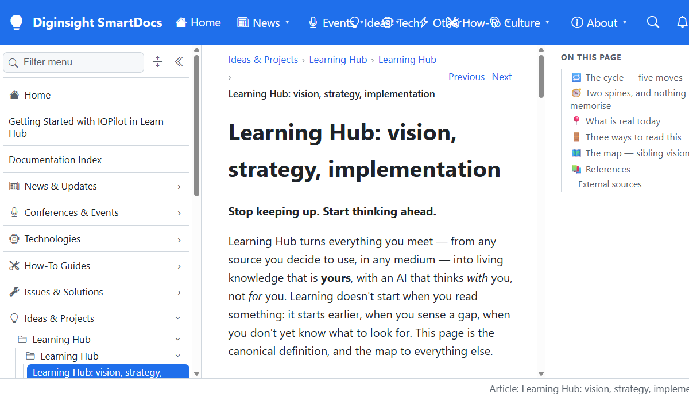

# Learning Hub: vision, strategy, implementation

**Stop keeping up. Start thinking ahead.**

Learning Hub turns everything you meet — from any source you decide to use, in any medium — into living
knowledge that is **yours**, with an AI that thinks *with* you, not *for* you. Learning doesn't start when
you read something: it starts earlier, when you sense a gap, when you don't yet know what to look for.
[Watch that happen once](01-what-it-feels-like.md), or read on — this page is the canonical definition, and
the map to everything else.

## 🔁 The cycle — five moves

- **Gather** — reach your information wherever you decide it lives, in any medium — including what you didn't know to look for.
- **Keep** — nothing is read once and discarded; every worthwhile piece joins a store you control.
- **Enrich** — each piece is *developed*, not merely stored: analysed, connected to what you already know, checked for gaps and stale facts.
- **Learn in context** — the AI thinks *with* you: it pushes back on weak claims, opens lines you hadn't considered, and hands your gaps back as the next question.
- **Think ahead** — fresh information becomes implications *for you*, and your knowledge gaps surface before they bite.

**It is a cycle, not a pipeline:** *Think ahead* produces the next *Gather*.

## 🧭 Two spines, and nothing else to memorise

The **cycle of five moves** is the user-facing spine. The **three layers** below are the builder-facing
spine. Every other named scheme in this folder is a mapping onto one of those two.

| Layer | Verb | What it is |
|---|---|---|
| **Rendering** | *deliver* | **Diginsight SmartDocs** renders Markdown → HTML on demand and builds navigation at runtime — no build step, content is live the moment it lands. Consumed as an external building block, not owned. |
| **Self-update loop** | *develop and keep* | The prompts, agents and engine that turn many sources into governed Markdown and then keep it current — one loop for creation *and* maintenance, under human governance. |
| **Storage** | *hold* | Where the content physically lives. One storage target per instance today; several at once — authenticated or not — is the target design. |

> 📖 The full picture — the diagram, the three self-update loops, and the graded implementation status — is
> [Architecture: one system in three layers](02-architecture.md).

## 📍 What is real today

Rendering and storage are **built and live**. The self-update loop is **built** on its content side and
**design-strong** for its machinery. Every component is graded individually in the
[implementation table](02-architecture.md#-current-implementation).

**And this page is its own proof.** This article is itself a Learning Hub article: governed by the metadata
contract it describes, served by the renderer it specifies, kept current by the loop it defines.

## 🚪 Three ways to read this

- **2 minutes** — you are done. This page is the whole idea.
- **I want to use it** — [The thing you didn't know to look for](01-what-it-feels-like.md), then [Using Learning Hub for learning technologies](../01-learning-hub-overview/02-using-learning-hub-for-learning-technologies.md).
- **I want to understand or build it** — [Architecture](02-architecture.md) → [Own your learning loop](../05-own-your-learning-loop.md) → [Concept and principles](../01-learning-hub-overview/01-learning-hub-introduction.md) → [Platform and consumers](../04-platform-and-consumers.md) → [Documentation taxonomy](../02-documentation-taxonomy/01-learning-hub-documentation-taxonomy.md) → [Automated content lifecycle](../03-automated-content-lifecycle/01-automated-content-lifecycle-with-prompts-agents-and-mcp.md).

That is the intended **reading order**; the sidebar is ordered by filename, so the two differ.

---

## 🗺️ The map — sibling visions

Chapters *inside* this folder are in the reading paths above. *Outside* it sit nine sibling visions that
read like separate projects but are one system — the self-update loop:

- **Machinery** — [Self-updating engine](../../self-updating-engine/20260622.01-self-updating-engine-vision.md) · [One engine, many streams](../../self-updating-engine/00-one-engine-many-streams.md) · [Autonomous streams](../../autonomous-streams/autonomous-streams.md) · [TuneIQ](../../tuneiq/01-tuneiq-design.md) · [Cost control](../../prompt-engineering-and-azure-openai-cost-control/20260503.01-slidescontent.md)
- **Streams** (one engine, per-domain config) — [article writing](../../self-updating-article-writing/20260428.01-vision.v1.md) · [prompt engineering](../../self-updating-prompt-engineering/20260531.01-vision.md) · [research](../../self-updating-research/01.000-vision.v1.md)
- **Product** — [IQPilot](../../iqpilot/01-iqpilot-overview.md), the content-quality tool

---

## 📚 References

Internal chapters are listed in [Three ways to read this](#-three-ways-to-read-this) and the map above.

### External sources

**[The Reverse Information Paradox](https://snscratchpad.com/posts/reverse-information-paradox/)** 📒 [Community]
Names Control / Capability / Choice / Cost / Compound and the trust-boundary argument the Hub's economic frame borrows.

**[Diátaxis](https://diataxis.fr/)** 📗 [Verified Community]
The documentation framework the Hub's content taxonomy extends.

<!--
validations:
  grammar: {status: "not_run", last_run: null}
  readability: {status: "not_run", last_run: null}
article_metadata:
  filename: "00-learning-hub.md"
  created: "2026-07-20"
  status: "canonical-master"
-->
