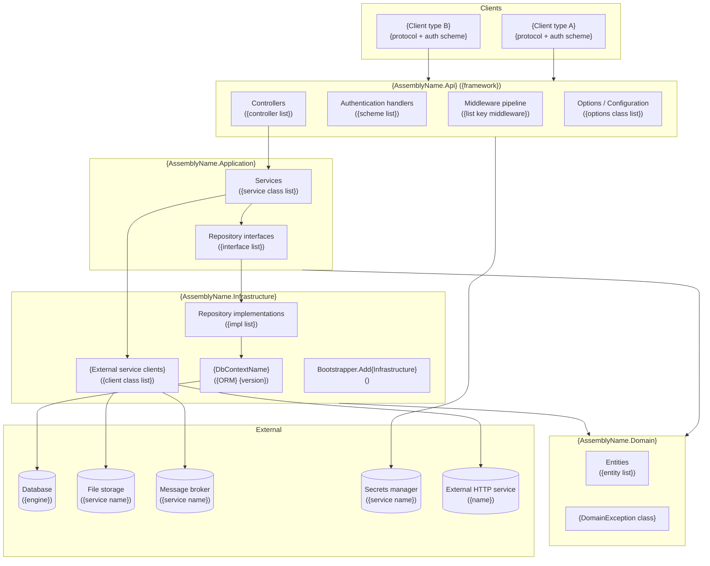

# Documentation Design — Architecture

> Criteria, templates, and quality gates for the **Architecture** section of the documentation site.
> Covers: `architecture/logical-architecture.md`, `architecture/overview.md`, `architecture/project-structure.md`.
>
> Part of the Documentation Manager Design Guide series → [Index](00.documentationmanager.design.md)

---

## Table of Contents

1. [Purpose and Audience](#1-purpose-and-audience)
2. [Source Artifacts to Read](#2-source-artifacts-to-read)
3. [Architecture Overview Page](#3-architecture-overview-page)
4. [Logical Architecture Page](#4-logical-architecture-page)
5. [Project Structure Page](#5-project-structure-page)
6. [Diagram Criteria](#6-diagram-criteria)
7. [Templates](#7-templates)
8. [Quality Gates](#8-quality-gates)

---

## 1. Purpose and Audience

The Architecture section answers the question: **"How is this system structured, and why?"**

| Audience | What they need from this section |
|----------|----------------------------------|
| Developer onboarding | Understand which project does what; where to add new code |
| Architect reviewing | Verify dependency direction, detect violations; assess pattern choices |
| Security reviewer | Understand the trust boundary between layers; identify where auth is enforced |
| Operations | Understand the deployment units and how they relate to the running components |

The Architecture section is **logical** — it describes the code structure, not the physical deployment topology. Physical topology lives in [Infrastructure](02.design-infrastructure.md).

---

## 2. Source Artifacts to Read

Read all of these before writing any architecture page:

| Artifact | What to extract |
|----------|----------------|
| All `.sln` / `.slnx` files | Solution name, included projects, project types |
| All `.csproj` files | Target framework, `<ProjectReference>` entries, key `<PackageReference>` entries |
| `Program.cs` / `Startup.cs` (all projects) | Service registrations (`AddScoped`, `AddSingleton`, `AddTransient`), middleware pipeline (`app.Use*`), configuration bindings |
| All `*Controller.cs` files | Controller names, route prefixes, auth attributes |
| All repository interface files (`I*Repository.cs`) | Interface names, method signatures, which DbContext entities they use |
| All `DbContext` files | `DbSet<T>` properties, entity relationships |
| Service registrations in Bootstrapper files | Which implementations are registered for which interfaces |
| Docker files (`Dockerfile`, `docker-compose.yml`) | Services defined, inter-service dependencies |
| All project-to-project references | Dependency graph |

---

## 3. Architecture Overview Page

**File:** `docs/architecture/overview.md`

### Criteria

1. **One-paragraph summary** — what the system does and its primary technical approach (e.g., "REST API built on ASP.NET Core Clean Architecture")
2. **High-level component diagram** (Mermaid `graph TD` or `C4Context`) — shows all discovered components and their relationships at the solution level. Not the same as the logical layer diagram — this is higher-level and includes external systems.
3. **Component summary table** — one row per discovered component:
   - Component name
   - Type (API, Frontend, CLI, Function, Database project)
   - Tech stack
   - Brief purpose
   - Link to detail page
4. **Link to `logical-architecture.md`** for the layer-level view
5. **Link to `components/overview.md`** for per-component detail

### What NOT to include

- Endpoint lists (belong in `api/` reference)
- Per-environment resource names (belong in `infrastructure/`)
- Security posture (belongs in `security/`)

---

## 4. Logical Architecture Page

**File:** `docs/architecture/logical-architecture.md`

This is the most important architecture page. It shows the **full dependency chain** from external callers through all code layers to persistence and external services.

### Criteria — required elements

#### 4.1 Layer diagram (mandatory)

A Mermaid `graph TD` (or `graph LR`) diagram that satisfies all of these:

- **Shows every component** discovered in the repository (not just the main API)
- **Shows all client types** at the top — distinguish by: auth scheme used, transport protocol, firmware version (if relevant)
- **Shows all code layers** as subgraphs:
  - Host / API layer: controllers, middleware, options/config
  - Application layer: services, use cases, CQRS handlers (if applicable)
  - Domain layer: entities, value objects, domain exceptions, domain services
  - Infrastructure layer: repository implementations, DbContext, external service clients, message producers
- **Shows all external systems** at the bottom:
  - Databases (type: SQL Server, PostgreSQL, Cosmos DB, etc.)
  - Message brokers (Event Hubs, Service Bus, etc.)
  - Blob / file storage
  - Key Vault / secrets manager
  - External HTTP services
  - Identity providers (Entra ID, etc.)
- **Labels edges** with the protocol or mechanism (HTTP, gRPC, AMQP, SQL, Key Vault SDK, etc.)
- **Labels each subgraph** with the assembly/project name and framework version
- **Authentication mechanism** shown on each client→API edge (e.g., "JWT Bearer", "HMAC `amx`", "credentials in URL")

#### 4.2 Clean Architecture / layer rules table (mandatory if Clean Architecture is used)

If the system follows Clean Architecture, Onion Architecture, or Hexagonal Architecture, include a table:

| Layer | Project | Allowed dependencies | Disallowed |
|-------|---------|---------------------|------------|
| Domain | `{project}` | None | Everything else |
| Application | `{project}` | Domain | Infrastructure, Host |
| Infrastructure | `{project}` | Domain, Application | Host |
| Host / API | `{project}` | All inner layers | — |

If the system does not follow Clean Architecture, document the actual dependency structure and note any violations observed.

#### 4.3 Design patterns table

| Pattern | Where used | Purpose |
|---------|------------|---------|
| Repository | `I*Repository` interfaces + Infrastructure implementations | Abstracts data access; allows swapping providers |
| Options pattern | `IOptions<T>` bindings in Application / Api | Type-safe configuration binding |
| CQRS | _(if applicable)_ | Separates reads from writes |
| Mediator | _(if applicable, e.g., MediatR)_ | Decouples controllers from service logic |
| _(Add discovered patterns)_ | | |

Only document patterns that are actually in use. Do not invent patterns from the architecture name alone.

#### 4.4 Cross-cutting concerns

Document each cross-cutting concern as a brief bullet:

- **Authentication** — which middleware handles it, where it is registered
- **Authorization** — attribute-based, policy-based, or role-based; where policies are defined
- **Error handling** — global exception handler / filter; error response shape
- **Logging** — logging framework, structured fields, log levels per environment
- **Telemetry** — Application Insights, distributed tracing, what is captured
- **Validation** — input validation (model binding, FluentValidation, etc.)
- **Configuration** — how config is loaded per environment (Key Vault, environment variables, `appsettings*.json`)

#### 4.5 Request flow (optional — include for complex multi-step flows only)

If the system has a request lifecycle that is non-obvious (e.g., request goes through authentication middleware → rate limiter → controller → mediator → service → repository → external service → back), add a `sequenceDiagram` showing the full lifecycle for one representative request.

Only add this if the flow is genuinely complex and would surprise a developer reading the code for the first time. Skip for standard CRUD flows.

### Criteria — formatting rules

- Use Mermaid subgraph labels that match actual assembly names (e.g., `ABB.Ability.ApiDevice.Api`)
- Use node labels that show the class names (comma-separated if multiple fit, e.g., `CTRL["Controllers\nAdminController | PublisherController"]`)
- Every external system is a terminal node (no outgoing arrows)
- Arrows point from caller to callee — same direction as code dependency

---

## 5. Project Structure Page

**File:** `docs/architecture/project-structure.md`

### Criteria

1. **Solution structure** — list all `.sln` / `.slnx` files with their purpose
2. **Project inventory table** — one row per project:

   | Project | Type | Target framework | Purpose |
   |---------|------|-----------------|---------|
   | `{AssemblyName}` | Library / Console / Web API / Function / Test | `net10.0` etc. | One-sentence description |

3. **Folder layout** — for each project, list the key folders with their purpose (Controllers, Services, Repositories, Domain, Infrastructure, etc.)
4. **Test project mapping** — which test project covers which production project

---

## 6. Diagram Criteria

All architecture diagrams must satisfy these constraints:

| Constraint | Rule |
|-----------|------|
| Complexity limit | >12 nodes → split into focused sub-diagrams |
| Node labels | Match actual class/project names, not invented labels |
| External systems | Always shown — never omit databases, storage, or external APIs |
| Authentication edges | Always labeled with the scheme name |
| Direction | `graph TD` (top-down) for layer diagrams; `graph LR` (left-right) for pipeline/flow |
| Subgraphs | One per assembly/project; labeled with assembly name and framework |

When the full layer diagram exceeds 12 nodes, produce:
1. A simplified overview diagram (max 8 nodes, high-level components only)
2. Focused sub-diagrams for each bounded area (e.g., "Application + Domain layer detail")

---

## 7. Templates

### 7.1 `architecture/overview.md` template

```markdown
# Architecture overview

{One-paragraph description of the system and its primary technical approach.}

## At a glance

{Mermaid component diagram — all components and external systems, high level}

## Components

| Component | Type | Stack | Purpose | Detail |
|-----------|------|-------|---------|--------|
| `{Name}` | API / Frontend / CLI / Function | `{framework}` | {purpose} | [→ {name}](../components/{slug}.md) |

## Layer model

This system follows **{Clean Architecture / Layered / Modular Monolith}**. 
See [Logical architecture](logical-architecture.md) for the full layer diagram.

## Key design decisions

| Decision | Rationale |
|----------|-----------|
| {Decision} | {Why} |

<!-- Source: {key files read} -->
```

### 7.2 `architecture/logical-architecture.md` template

```markdown
# Logical architecture

{One-paragraph description: which layers exist, what patterns are used, what the dependency direction rules are.}

## Layer diagram



## {Architecture style} layers

{Description of the architecture style (Clean Architecture, Layered, etc.) and its dependency rules.}

| Layer | Project | Allowed dependencies | Disallowed |
|-------|---------|---------------------|------------|
| Domain | `{project}` | None | Everything else |
| Application | `{project}` | Domain | Infrastructure, Host |
| Infrastructure | `{project}` | Domain, Application | Host |
| Host / API | `{project}` | All inner layers | — |

## Design patterns

| Pattern | Where used | Purpose |
|---------|------------|---------|
| Repository | `I*Repository` + Infrastructure | Abstracts data access |
| Options | `IOptions<T>` bindings | Type-safe config |

## Cross-cutting concerns

- **Authentication:** {middleware class}, registered in `{file}`
- **Authorization:** {policy names}, defined in `{file}`
- **Error handling:** {exception filter / middleware}, returns `{error shape}`
- **Logging:** {framework}, structured with `{key fields}`
- **Telemetry:** {service}, captures `{what}`
- **Validation:** {approach}
- **Configuration:** {loading strategy per environment}

<!-- Source: {key files read for this page} -->
```

### 7.3 `architecture/project-structure.md` template

```markdown
# Project structure

## Solutions

| Solution file | Purpose |
|--------------|---------|
| `{SolutionName}.sln` | {purpose} |

## Projects

| Project | Type | Framework | Purpose |
|---------|------|-----------|---------|
| `{Name}` | {type} | `{target}` | {purpose} |

## Test coverage

| Test project | Covers |
|-------------|--------|
| `{TestProject}` | `{ProductionProject}` |

<!-- Source: .sln files, .csproj files -->
```

---

## 8. Quality Gates

Before the Architecture section is considered complete, verify:

| Check | Pass condition |
|-------|---------------|
| Layer diagram exists | `architecture/logical-architecture.md` contains at least one `mermaid` block |
| All components shown | Every component in the Component Registry appears in the layer diagram |
| All external systems shown | Every database, storage, message broker, and external API is a terminal node |
| Clean Architecture violations flagged | If any project references violate the layer rules, they are documented |
| Dependency direction correct | Arrows in the diagram point from caller to callee (same direction as code `using`) |
| Design patterns documented | At least the Repository pattern is documented if interfaces exist |
| Cross-cutting concerns complete | Auth, error handling, and logging are all documented |
| Source anchors present | Each section has a `<!-- Source: ... -->` comment naming the key files read |
| Internal links valid | Links to `components/overview.md`, `api/overview.md`, `infrastructure/overview.md` resolve |
