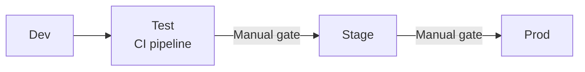

# Documentation Design — Infrastructure

> Criteria, templates, and quality gates for the **Infrastructure** section of the documentation site.
> Covers: `infrastructure/overview.md`, `infrastructure/{environment}.md` / `physical-architecture.md`.
>
> Part of the Documentation Manager Design Guide series → [Index](00.documentationmanager.design.md)

---

## Table of Contents

1. [Purpose and Audience](#purpose-and-audience)
2. [Source Artifacts to Read](#source-artifacts-to-read)
3. [Infrastructure Overview Page](#infrastructure-overview-page)
4. [Per-Environment Page](#per-environment-page)
5. [Azure Icon and Visual Conventions](#azure-icon-and-visual-conventions)
6. [Sensitive Value Handling](#sensitive-value-handling)
7. [Templates](#templates)
8. [Quality Gates](#quality-gates)

---

## 1. Purpose and Audience

The Infrastructure section answers: **"Where does this system run, and what Azure resources does it use per environment?"**

| Audience | What they need from this section |
|----------|----------------------------------|
| Developer | Base URLs per environment; connection string format (not the value); Key Vault secret names |
| Operations | Resource names, resource groups, SKUs, certificate thumbprints; naming conventions |
| Architect | How environments differ; shared vs. isolated resources; scale and redundancy |
| Security | Identity assignments (managed identity, App Registrations); network access controls; certificate lifecycle |

Infrastructure documentation is always **environment-specific** — a table that compares all environments side by side is preferred over duplicated per-environment pages when the differences are small.

---

## 2. Source Artifacts to Read

| Artifact | What to extract |
|----------|----------------|
| Bicep / ARM / Terraform files (all) | Resource type, name, SKU/tier, location; parameters used per environment |
| `*.bicepparam` / `*.tfvars` / parameter JSON files | Per-environment values: resource names, SKUs, replica counts |
| Pipeline variable groups / YAML variable files | Environment-specific URLs, resource group names, connection string formats (never actual values) |
| `appsettings.{environment}.json` | Connection string format keys, App Insights connection string key, Key Vault URI |
| Key Vault references in config | Secret names; which environment uses which vault |
| Azure DNS / Front Door configuration (if in IaC) | Public endpoints, custom domains, certificate binding |
| `README.md` / `avm/` module files | Environment tiers, naming conventions |
| Azure Icon Registry | Load from `.github/agents/documentation-manager.v4.agent.md` — use local SVG paths, never CDN |

---

## 3. Infrastructure Overview Page

**File:** `docs/infrastructure/overview.md`

### Criteria

1. **One-paragraph summary** — how many environments exist, what Azure subscription model is used, whether there is a shared resource tier
2. **Environment summary table** — one row per environment, using Azure icons (Pattern A — 18px):

   | Environment | Purpose | Resource group | Region | Key differences |
   |-------------|---------|---------------|--------|-----------------|
   | Dev | Developer sandbox | `{rg-name}` | {region} | Single replica, no TLS cert |
   | Test | CI pipeline target | `{rg-name}` | {region} | Automated test suite runs here |
   | Stage | Pre-production | `{rg-name}` | {region} | Mirror of prod; lower SKU |
   | Prod | Live workload | `{rg-name}` | {region} | HA, TLS, backup enabled |

3. **Naming convention table** — document the pattern for all resource types:

   | Resource type | Pattern | Example |
   |---------------|---------|---------|
   | App Service | `{prefix}-{env}-{service}` | `company-test-servicea` |
   | SQL Server | `{prefix}-{env}-sql` | `company-prod-sql` |
   | _(etc.)_ | | |

4. **Promotion flow diagram** — Mermaid `flowchart LR` showing the path from code commit to production. Read the CI/CD pipelines to determine actual stages and gates.

5. **Shared resources section** (if applicable) — resources shared across environments (e.g., a single Azure Container Registry, a shared Log Analytics workspace)

6. **Links to per-environment detail pages** (or note that detail is on `physical-architecture.md` if combined)

---

## 4. Per-Environment Page

**File:** `docs/infrastructure/{environment}.md` OR combined `docs/infrastructure/physical-architecture.md`

Use a single `physical-architecture.md` when environments are similar and the per-environment differences fit in comparison columns. Create separate per-environment pages only when environments have significantly different resource topologies.

### Criteria — resource map table

The resource map table is the centerpiece of this page. It lists **every Azure resource** discovered in IaC files or configuration, with Azure icons.

Format (Pattern A — icon in table row, 18px):

```markdown
| Resource | Dev | Test | Stage | Prod |
|----------|-----|------|-------|------|
|  **App Service** | `{dev-name}` · `{sku}` | `{test-name}` · `{sku}` | `{stage-name}` · `{sku}` | `{prod-name}` · `{sku}` |
```

Rules:
- Every resource present in at least one environment gets a row
- If a resource does not exist in an environment, use `—`
- SKU / tier is always shown (e.g., `B1`, `Standard_S1`, `P1v3`)
- Resource name is always shown; resource group shown if different per environment
- **Never show connection strings, passwords, or secrets** — show the Key Vault secret name instead

### Criteria — per-resource sections

After the resource map table, add a `###` section for each **non-trivial resource** (any resource that requires configuration explanation beyond name + SKU):

```markdown
###  {Resource type}: {resource name}

Brief description of this resource's role in the system.

| Property | Dev | Test | Stage | Prod |
|----------|-----|------|-------|------|
| Name | `{dev}` | `{test}` | `{stage}` | `{prod}` |
| SKU | {sku} | {sku} | {sku} | {sku} |
| Region | {region} | ... | ... | ... |
| {Key property} | {value} | ... | ... | ... |
```

This section heading uses Pattern B — icon at 22px inline with the heading.

### Required per-resource sections (mandatory if resource exists)

| Resource type | Mandatory additional content |
|---------------|------------------------------|
| App Service / Container App | Slot names; minimum instances; scale rules if defined |
| SQL Server / Managed DB | Login type (SQL auth / Entra); backup retention; firewall rule summary |
| Key Vault | Access policy type (RBAC / Vault access policies); which identities have access; cert renewal frequency |
| Application Insights | Connection string key (not value); sampling rate if configured |
| Service Bus / Event Hubs | Namespace SKU; topic/queue names (from IaC or config); consumer group names |
| Storage Account | Container names used by the application; access tier; redundancy |
| Azure Container Registry | SKU; which environments pull from it |
| Front Door / API Management | Routing rules summary; rate limit policy if configured |

### Criteria — certificate thumbprints section

If the system uses certificates (TLS client certs, signing certs, MTLS), add a dedicated section:

```markdown
## Certificate configuration

| Certificate | Purpose | Thumbprint (sample) | Renewal frequency | Environment |
|-------------|---------|---------------------|-------------------|-------------|
| `{cert-name}` | {TLS / MTLS / signing} | `{first-8-chars}…` | {annual / manual} | {envs} |
```

**Never show full thumbprints** in documentation — show first 8 characters + `…`. Full thumbprints are obtainable from Key Vault by authorized operators.

**Rationale:** Thumbprint excerpts give operations teams enough to identify the correct certificate without exposing a value that could aid impersonation reconnaissance.

### Criteria — configuration surface

Add a brief table showing where configuration is sourced per environment:

| Config key category | Dev source | Prod source |
|---------------------|------------|-------------|
| Connection strings | `appsettings.dev.json` | Key Vault secret `{name}` |
| API keys | `appsettings.dev.json` | Key Vault secret `{name}` |
| App Insights | `appsettings.json` | `appsettings.prod.json` |

---

## 5. Azure Icon and Visual Conventions

The infrastructure pages use the Microsoft Azure Architecture Icon pack, stored **locally** under `docs/assets/icons/azure/`. Never use CDN URLs — they break offline builds and create external dependencies.

### Icon registry

Read the full icon registry from the v4 agent file (`.github/agents/documentation-manager.v4.agent.md`, section "Azure Icon Registry"). It maps resource type → local SVG path.

If a resource type does not have an icon in the registry, use the generic Azure resource icon or omit the icon for that row. Do not use CDN URLs as a fallback.

### Usage patterns

**Pattern A — table rows (18px):** Used in resource map tables.

```html
 **{Resource name}**
```

**Pattern B — section headings (22px):** Used in `###` section headings for per-resource sections.

```html
###  {Resource type}: `{resource-name}`
```

The relative path `../assets/icons/azure/` assumes the doc page is one folder deep under `docs/`. Adjust the `../` prefix if the file is nested differently (e.g., `../../assets/` for two levels deep).

---

## 6. Sensitive Value Handling

Infrastructure documentation regularly encounters sensitive values. Apply these rules without exception:

| Value type | Rule |
|------------|------|
| Connection strings | Never show the full string. Show the key name and note it is in Key Vault or config. Show the format with a placeholder: `Server={host};Database={db};...` |
| Passwords / secrets | Never show. Reference the Key Vault secret name. |
| API keys | Never show. Reference the Key Vault secret name or environment variable name. |
| Storage account keys | Never show. Reference RBAC role assignment or managed identity instead if used. |
| Certificate thumbprints | Show first 8 characters + `…` only. |
| App registration client secrets | Never show. Note that client secret rotation interval is N months. |
| Managed identity client IDs | Safe to show (public GUID, not a credential). |
| Subscription / tenant IDs | Safe to show. |
| Resource names / resource group names | Safe to show. |

If a configuration file contains a real secret value (e.g., a developer's local `appsettings.json`), do not quote that value in documentation. Reference only the key name.

---

## 7. Templates

### 7.1 `infrastructure/overview.md` template

```markdown
# Infrastructure overview

{One-paragraph summary of the environment topology and Azure subscription model.}

## At a glance

| Environment | Purpose | Resource group | Region |
|-------------|---------|---------------|--------|
| Dev | Developer testing | `{rg}` | {region} |
| Test | CI pipeline | `{rg}` | {region} |
| Stage | Pre-production | `{rg}` | {region} |
| Prod | Live workload | `{rg}` | {region} |

## Promotion flow



## Naming conventions

| Resource type | Pattern | Example |
|---------------|---------|---------|
| App Service | `{pattern}` | `{example}` |

## Shared resources

{List any resources shared across environments, or state "Each environment is fully isolated."}

## Per-environment detail

- [Dev](dev.md) — {brief note}
- [Test](test.md) — {brief note}
- [Stage](stage.md) — {brief note}
- [Prod](prod.md) — {brief note}

<!-- Source: avm/main.bicepparam files, devops/pipelines/ -->
```

### 7.2 `infrastructure/physical-architecture.md` template (combined page)

```markdown
# Physical architecture

{One-paragraph summary.}

## Resource map

| Resource | Dev | Test | Stage | Prod |
|----------|-----|------|-------|------|
|  **App Service** | `{name}` · `{sku}` | `{name}` · `{sku}` | `{name}` · `{sku}` | `{name}` · `{sku}` |
|  **SQL Database** | `{name}` | `{name}` | `{name}` | `{name}` |
|  **Key Vault** | `{name}` | `{name}` | `{name}` | `{name}` |
|  **Application Insights** | `{name}` | `{name}` | `{name}` | `{name}` |

---

###  App Service: `{name}`

{Description of the App Service's role.}

| Property | Dev | Test | Stage | Prod |
|----------|-----|------|-------|------|
| Name | `{dev}` | `{test}` | `{stage}` | `{prod}` |
| SKU | {sku} | {sku} | {sku} | {sku} |
| Min instances | {n} | {n} | {n} | {n} |
| Managed identity | {yes/no} | | | |

###  Key Vault: `{name}`

| Property | Dev | Test | Stage | Prod |
|----------|-----|------|-------|------|
| Name | `{dev}` | `{test}` | `{stage}` | `{prod}` |
| Access model | {RBAC / vault policies} | | | |
| Consumers | {identities} | | | |

## Certificate configuration

| Certificate | Purpose | Thumbprint | Renewal | Environments |
|-------------|---------|------------|---------|-------------|
| `{name}` | {purpose} | `{first8}…` | {interval} | {envs} |

## Configuration sources

| Category | Dev | Prod |
|----------|-----|------|
| Connection strings | `appsettings.dev.json` | Key Vault `{secret-name}` |
| API keys | `appsettings.dev.json` | Key Vault `{secret-name}` |

<!-- Source: avm/main.bicep, avm/main.*.bicepparam -->
```

---

## 8. Quality Gates

Before the Infrastructure section is considered complete, verify:

| Check | Pass condition |
|-------|---------------|
| All environments covered | Resource map has a column for every environment found in IaC parameter files |
| All resources shown | Every resource in IaC / config has a row in the resource map table |
| Azure icons present | Every resource row has an icon using a local path (no CDN URL) |
| No secrets exposed | Zero connection string values, passwords, API keys, or full thumbprints in any page |
| Naming convention documented | At least 3 resource types in the naming convention table |
| Per-resource sections for non-trivial resources | App Service, SQL, Key Vault, App Insights all have `###` sections |
| Promotion flow diagram present | `infrastructure/overview.md` has a `flowchart LR` diagram |
| Source anchors present | Each page has `<!-- Source: ... -->` comments naming the IaC files read |
| Internal links valid | Links to `architecture/logical-architecture.md`, `security/overview.md` resolve |
