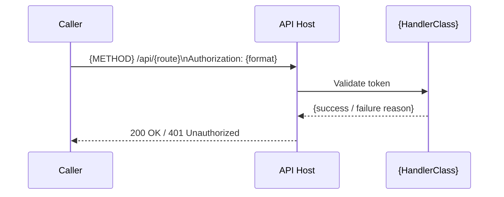
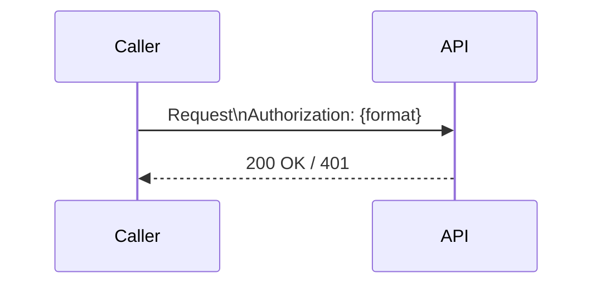

# Documentation Design — Security

> Criteria, templates, and quality gates for the **Security** section of the documentation site.
> Covers: `security/overview.md`, `security/posture.md`, `security/posture.internal.md`.
>
> Part of the Documentation Manager Design Guide series → [Index](00.documentationmanager.design.md)

---

## Table of Contents

1. [Purpose and Audience](#1-purpose-and-audience)
2. [Information Disclosure Model](#2-information-disclosure-model)
3. [Source Artifacts to Read](#3-source-artifacts-to-read)
4. [Security Overview Page](#4-security-overview-page)
5. [Security Posture Page](#5-security-posture-page)
6. [Internal Security Detail File](#6-internal-security-detail-file)
7. [Legacy Compatibility Classification](#7-legacy-compatibility-classification)
8. [Templates](#8-templates)
9. [Quality Gates](#9-quality-gates)

---

## 1. Purpose and Audience

The Security section answers: **"How does this system authenticate callers, authorize access, and protect sensitive data?"**

Two distinct reader types are served:

| Audience | Page | What they need |
|----------|------|---------------|
| Integrating developer | `security/overview.md` | How to authenticate; what schemes exist; which scheme to use for new integrations |
| Security reviewer / auditor | `security/posture.md` | Current posture per security area; known gaps; mitigation status |
| Operations (internal, not in nav) | `security/posture.internal.md` | Rotation procedures, actual secret names, certificate management details |

---

## 2. Information Disclosure Model

Security documentation uses a three-file model. This is **mandatory** — never collapse all security information into a single public page.

| File | In nav? | Content | Linkable from other pages? |
|------|---------|---------|--------------------------|
| `security/overview.md` | Yes | Auth schemes, authorization model, access control per component. No exploit paths, no secret names. | Yes |
| `security/posture.md` | Yes | Posture status per area (✅/⚠️/❌), known gaps described at the category level (e.g., "rate limiting not configured"). No configuration values, no bypass details. | Yes |
| `security/posture.internal.md` | **Never** | Rotation schedules, exact Key Vault secret names, certificate thumbprints, known vulnerability details with mitigations. | **Never** — not linked from any page |

### Enforcement rules

- `posture.internal.md` must **never** appear in `mkdocs.yml nav:`
- No other page may link to `posture.internal.md`
- If `posture.internal.md` is found in nav or linked from another page, remove it and log a warning
- The posture internal file is not created by the agent — only the `overview.md` and `posture.md` are produced by the documentation run. The `posture.internal.md` is written by the security team manually and the agent must not overwrite it.

---

## 3. Source Artifacts to Read

| Artifact | What to extract |
|----------|----------------|
| All `*AuthenticationHandler.cs` files | Scheme name, header name, what is validated (token format, signature, expiry) |
| All `*AuthorizationHandler.cs` / `*AuthorizationFilter.cs` files | Policy name, what it checks (claim, role, header) |
| `Program.cs` / `Startup.cs` | `AddAuthentication()` and `AddAuthorization()` registrations; middleware order |
| `appsettings*.json` — `Authentication` section | Scheme names, token expiry, issuer, audience (never the actual secrets) |
| CORS configuration | `AddCors()` / `app.UseCors()` — allowed origins, methods, headers |
| HTTP header middleware | Security headers added (HSTS, X-Frame-Options, X-Content-Type-Options, CSP) |
| Rate limiting middleware | Policies, limits, client identification |
| TLS configuration | Certificate binding, minimum TLS version |
| Input validation | Model validation attributes, FluentValidation, anti-forgery tokens |
| Password hashing | `PasswordHasher<T>`, BCrypt, PBKDF2 usage |
| Telemetry configuration | Application Insights — what is captured, what is masked/excluded |
| HTTPS / HSTS middleware | `app.UseHttpsRedirection()`, `app.UseHsts()` |

---

## 4. Security Overview Page

**File:** `docs/security/overview.md`

### 4.1 Authentication schemes

Document **every authentication scheme** discovered. Present them in this order:
1. **Recommended / current** schemes first (the scheme new integrations should use)
2. **Legacy** schemes last (deprecated but still supported)

Never omit a legacy scheme — a caller using it needs to know it is supported and should eventually migrate.

For each scheme, include:

```markdown
### {Scheme name}

{One-paragraph description of what this scheme is and who uses it.}

| Property | Value |
|----------|-------|
| Header | `Authorization: {format}` |
| Token type | {JWT / HMAC signature / API key / credentials in URL} |
| Validated by | `{HandlerClass}` |
| Token expiry | {N minutes / N hours / none} |
| Recommended for | {new integrations / legacy firmware / internal services} |

#### Authentication flow


```

### 4.2 Authorization model

After documenting all schemes, add a section on authorization:

1. **Authorization strategy** — attribute-based, policy-based, role-based, or resource-based
2. **Policy definitions** — table of all named policies: policy name, requirement, where defined
3. **Per-component access control** — table showing which components require which auth:

   | Component | Auth required | Scheme | Anonymous endpoints |
   |-----------|---------------|--------|-------------------|
   | API Host | Yes | `amx` HMAC + legacy | `/health`, `/swagger` |
   | Admin Panel BFF | Yes | {scheme} | None |
   | CRL Checker Function | N/A | Managed identity | Internal trigger |

### 4.3 Legacy compatibility note

If the system supports legacy authentication schemes for backward compatibility, add a `!!! warning` admonition noting this is intentional:

```markdown
!!! warning "Legacy scheme"
    **Legacy compatibility:** The `{scheme}` scheme is maintained for backward compatibility with {firmware version / client version}. It is not a security gap. See [Security posture](posture.md) for the classification rationale.
```

This prevents security reviewers from flagging legacy schemes as unmitigated vulnerabilities.

---

## 5. Security Posture Page

**File:** `docs/security/posture.md`

### Mandatory first element

The very first element on this page (immediately after the H1 title) must be:

```markdown
!!! warning "Disclaimer"
    This page describes the security posture of this system for documentation purposes.
    It does not constitute a formal security assessment. For penetration testing results,
    vulnerability details, or operational procedures, contact the security team directly.
```

### At-a-glance status table

Immediately after the disclaimer, before any other sections:

| Area | Status | Notes |
|------|--------|-------|
| Secrets management | ✅ / ⚠️ / ❌ | {brief note — no exploit detail} |
| Authentication | ✅ / ⚠️ / ❌ | |
| Authorization | ✅ / ⚠️ / ❌ | |
| TLS / HSTS | ✅ / ⚠️ / ❌ | |
| CORS | ✅ / ⚠️ / ❌ | |
| HTTP security headers | ✅ / ⚠️ / ❌ | |
| Rate limiting | ✅ / ⚠️ / ❌ | |
| Input validation | ✅ / ⚠️ / ❌ | |
| Password hashing | ✅ / ⚠️ / ❌ | |
| Telemetry / PII | ✅ / ⚠️ / ❌ | |
| Certificate management | ✅ / ⚠️ / ❌ | |

Status legend:
- ✅ Implemented and meets good practice
- ⚠️ Partially implemented or has known gaps
- ❌ Not implemented or critical gap

### Required per-area sections

Document each area in this **fixed order** — never reorder. Each section is brief (3–8 lines):

1. **Secrets management** — where secrets are stored (Key Vault / environment variables / config files); any hardcoded values found; rotation status
2. **Authentication** — link to `security/overview.md` for the full scheme list; note if any endpoints are unauthenticated
3. **Authorization** — link to `security/overview.md`; note if any authorization gaps exist
4. **TLS / HTTPS** — minimum TLS version; HTTPS redirection; HSTS max-age
5. **CORS** — allowed origins policy; note if wildcard (`*`) is used and whether it is acceptable
6. **HTTP security headers** — which headers are set (X-Frame-Options, X-Content-Type-Options, Referrer-Policy, CSP); which are missing
7. **Rate limiting** — whether rate limiting is configured; if not, note that it is not configured (not a silent omission)
8. **Input validation** — model binding validation; FluentValidation; any known missing validation
9. **Password hashing** — algorithm and cost factor if passwords are stored; N/A if no passwords
10. **Telemetry and PII** — what Application Insights captures; whether PII is masked or excluded
11. **Certificate management** — certificate types in use; expiry monitoring; rotation procedure reference (link to `posture.internal.md` without making it clickable — just note it exists for authorized readers)

### Status determination rules

Assign status based on evidence from code:

| Area | ✅ Criteria | ⚠️ Criteria | ❌ Criteria |
|------|-------------|-------------|------------|
| Secrets | Key Vault used; no hardcoded secrets | Mix of KV and config files | Secrets in config files or committed code |
| TLS | HTTPS redirect + HSTS configured | HTTPS redirect only | HTTP allowed in production config |
| CORS | Explicit allowed origins list | Wildcard with justification | Wildcard with no justification or `AllowAnyOrigin()` |
| Rate limiting | Policy configured and applied | Not configured | Not configured + public endpoint handling sensitive data |
| Input validation | Model validation + FluentValidation | Model validation only | No input validation |

---

## 6. Internal Security Detail File

**File:** `security/posture.internal.md`

This file is **written by the security team, not the documentation agent.** The agent must:
- Never create this file
- Never overwrite this file
- Never read this file to extract content for public pages
- Never add it to `mkdocs.yml nav:`
- Never link to it from any other page

If the agent discovers this file exists during a file scan, acknowledge its existence in the session log but do not process it.

---

## 7. Legacy Compatibility Classification

Legacy authentication schemes require classification to distinguish "required backward compatibility" from "genuine security gap". Use this table when documenting auth schemes in both `overview.md` and `posture.md`:

| Type | Description | Posture treatment | Documentation treatment |
|------|-------------|------------------|------------------------|
| **Required backward compatibility** | Scheme is still needed because deployed clients cannot be updated (e.g., firmware) | ✅ with note "maintained by design" | `!!! warning "Legacy compatibility"` admonition |
| **Transitional** | Scheme is being phased out; migration in progress | ⚠️ with migration timeline | Note the migration path and target scheme |
| **Deprecated** | Scheme is scheduled for removal; no active clients | ⚠️ with removal timeline | `!!! danger "Deprecated"` admonition |
| **Unintended** | Scheme was not intentionally retained; may be removable | ❌ or ⚠️ | Flag for team review; do not label as "required" |

**Rule:** Never mark a legacy scheme as ❌ if it is classified as "Required backward compatibility." Doing so generates false alarms that erode trust in the security posture report.

---

## 8. Templates

### 8.1 `security/overview.md` template

```markdown
# Security overview

{One-paragraph summary: how many auth schemes exist, authorization strategy, key security controls.}

## Authentication schemes

### {Scheme 1 — current/recommended}

{Description.}

| Property | Value |
|----------|-------|
| Header | `Authorization: {format}` |
| Token type | {type} |
| Validated by | `{HandlerClass}` |
| Token expiry | {N minutes} |
| Recommended for | {new integrations} |

#### Authentication flow



<!-- Source: {HandlerClass} in {file-path} -->

---

### {Scheme 2 — legacy}

!!! warning "Legacy compatibility"
    **Legacy compatibility:** Maintained for {reason}. New integrations should use {Scheme 1}.

{Description.}

| Property | Value |
|----------|-------|
| Header | `{header}` |
| Token type | {type} |
| Validated by | `{HandlerClass}` |
| Status | Legacy — maintained for backward compatibility |

<!-- Source: {HandlerClass} in {file-path} -->

---

## Authorization

{Describe the authorization strategy.}

| Policy | Requirement | Defined in |
|--------|-------------|-----------|
| `{PolicyName}` | {requirement} | `{file-path}` |

## Per-component access control

| Component | Auth required | Scheme | Anonymous |
|-----------|---------------|--------|-----------|
| API Host | Yes | {scheme} | `/health` |
```

### 8.2 `security/posture.md` template

```markdown
# Security posture

!!! warning "Disclaimer"
    This page describes the security posture of this system for documentation purposes.
    It does not constitute a formal security assessment.

## At a glance

| Area | Status | Notes |
|------|--------|-------|
| Secrets management | ✅ | All secrets in Key Vault |
| Authentication | ✅ | `amx` HMAC; legacy scheme maintained by design |
| Authorization | ✅ | Policy-based |
| TLS / HTTPS | ✅ | HTTPS redirect + HSTS configured |
| CORS | ✅ | Explicit allowed origins list |
| HTTP security headers | ⚠️ | X-Frame-Options set; CSP missing |
| Rate limiting | ❌ | Not configured |
| Input validation | ✅ | Model validation + FluentValidation |
| Password hashing | N/A | No user passwords |
| Telemetry / PII | ✅ | Application Insights; PII excluded from traces |
| Certificate management | ✅ | Key Vault managed; annual renewal |

## Secrets management

{Description of how secrets are managed. No actual secret names.}

## Authentication

See [Security overview](overview.md) for the full list of authentication schemes.

{Note any unauthenticated endpoints and whether they are intentional.}

## Authorization

See [Security overview](overview.md) for policy definitions.

{Note any known gaps.}

## TLS / HTTPS

- HTTPS redirect: {configured / not configured}
- HSTS: {max-age=N; includeSubDomains / not configured}
- Minimum TLS version: {1.2 / 1.3 / not enforced}

## CORS

- Policy: {explicit origins / wildcard}
- Allowed origins: {list or "configured per environment"}
- Allowed methods: {GET, POST, etc.}

## HTTP security headers

| Header | Configured | Value |
|--------|-----------|-------|
| `X-Frame-Options` | ✅ | `DENY` |
| `X-Content-Type-Options` | ✅ | `nosniff` |
| `Referrer-Policy` | ⚠️ | Not set |
| `Content-Security-Policy` | ❌ | Not configured |

## Rate limiting

{Describe rate limiting policy or note it is not configured.}

## Input validation

{Describe validation approach.}

## Password hashing

{Describe algorithm + cost factor, or state N/A.}

## Telemetry and PII

{Describe what Application Insights captures and what is excluded.}

## Certificate management

Certificate details and rotation procedures are documented in the internal security reference (available to authorized personnel).

<!-- Source: Program.cs, all *AuthenticationHandler.cs, appsettings.json -->
```

---

## 9. Quality Gates

Before the Security section is considered complete, verify:

| Check | Pass condition |
|-------|---------------|
| All auth schemes documented | Every `AuthenticationHandler` found in code has a section in `security/overview.md` |
| Scheme ordering correct | Recommended schemes before legacy schemes |
| Sequence diagram per scheme | Every scheme has a `sequenceDiagram` in its section |
| Legacy schemes classified | Every legacy scheme has a `!!! warning "Legacy compatibility"` or `!!! danger "Deprecated"` admonition |
| `posture.md` disclaimer first | `!!! warning "Disclaimer"` is the first element after the H1 |
| `posture.md` at-a-glance table | Status table with ✅/⚠️/❌ for all 11 areas |
| Per-area sections in fixed order | Secrets → Auth → AuthZ → TLS → CORS → Headers → Rate Limiting → Input Validation → Password → Telemetry → Certs |
| `posture.internal.md` not in nav | Verified absent from `mkdocs.yml` |
| No exploit paths documented | No pages describe how to bypass a security control |
| No actual secret values | Zero config values, tokens, or passwords in any public page |
| Source anchors present | Every scheme section has `<!-- Source: {HandlerClass} in {path} -->` |
