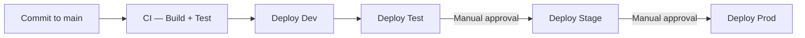

# Documentation Design — DevOps

> Criteria, templates, and quality gates for the **DevOps** section of the documentation site.
> Covers: `deployment/`, `testing/overview.md`.
>
> **Getting Started** (`getting-started/`) has its own dedicated guide: [02.design-getting-started.md](02.design-getting-started.md)
>
> Part of the Documentation Manager Design Guide series → [Index](00.documentationmanager.design.md)

---

## Table of Contents

1. [Purpose and Audience](#purpose-and-audience)
2. [Source Artifacts to Read](#source-artifacts-to-read)
3. [Pipeline Documentation](#pipeline-documentation)
4. [Infrastructure Provisioning Page](#infrastructure-provisioning-page)
5. [Testing Overview Page](#testing-overview-page)
6. [Templates](#templates)
7. [Quality Gates](#quality-gates)

---

## 1. Purpose and Audience

The DevOps section answers two questions:

1. **"How do I run this system locally?"** (Getting Started — for developers)
2. **"How does code get to production?"** (Deployment — for DevOps engineers and operations)

| Audience | Pages they need |
|----------|----------------|
| DevOps / Release engineer | `deployment/overview.md`, `deployment/pipelines/` |
| Operations | `deployment/infrastructure-provisioning.md` |
| QA | `testing/overview.md` |

> Developer onboarding (`getting-started/`) is covered by [02.design-getting-started.md](02.design-getting-started.md).

---

## 2. Source Artifacts to Read

| Artifact | What to extract |
|----------|----------------|
| `README.md` files (root, per-component) | Setup instructions, prerequisites, quick-start commands |
| `.sln` / `.slnx` files | Which projects are in the solution |
| `package.json` (frontend projects) | `scripts` section: start, build, test, lint commands |
| `*.csproj` files | Target framework → minimum .NET SDK version |
| `docker-compose.yml` | Services, port mappings, environment variables, dependency start order |
| `Dockerfile` (all) | Base images, multi-stage build steps, exposed ports, entry point |
| Pipeline YAML files (all — `devops/pipelines/`, `.github/workflows/`, `azure-pipelines.yml`) | Trigger conditions, stages, steps, gates, variable groups, artifact names |
| IaC files (`avm/`, `infra/`, `terraform/`) | IaC technology; what resources it provisions; how parameterized |
| `appsettings.*.json` | Which environment-specific config file exists per environment |
| Test project `*.csproj` files | Test framework (xUnit, NUnit, MSTest); target framework |
| `*.RunSettings` files | Test run configuration |

---

## 3. Pipeline Documentation

### 3.1 Deployment overview page (`deployment/overview.md`)

Criteria:
1. **Pipeline inventory table** — every CI/CD pipeline found:

   | Pipeline | File | Trigger | Purpose | Deploys to |
   |----------|------|---------|---------|-----------|
   | `{name}` | `{file-path}` | {branch push / PR / manual} | {purpose} | {environments} |

2. **Environment promotion flow diagram** — Mermaid `flowchart LR` showing the full promotion path with gate types. Read all pipeline files to determine the actual stages and approval gates:

   ```mermaid
   flowchart LR
       COMMIT[Code commit] --> CI[CI pipeline\nbuild + test]
       CI --> DEV[Dev\nauto-deploy]
       DEV --> TEST[Test\nauto-deploy]
       TEST --> STAGE[Stage\nmanual gate]
       STAGE --> PROD[Prod\nmanual gate]
   ```

3. **Branching strategy** — main branches and their purposes (main/trunk, release/*, feature/*)

### 3.2 Per-pipeline pages (`deployment/pipelines/{pipeline-name}.md`)

One page per pipeline. Required sections:

1. **Trigger conditions** — when it runs (push to branch, PR, manual, schedule)
2. **Stage diagram** — Mermaid showing the stage sequence:

   ```mermaid
   flowchart LR
       TRIGGER[Trigger] --> BUILD[Build & Test]
       BUILD --> STAGE_A[Deploy to {env}]
       STAGE_A -->|Manual approval| STAGE_B[Deploy to {env}]
   ```

3. **Stages table** — one row per stage:

   | Stage | Runs on | Steps | Conditions | Artifacts |
   |-------|---------|-------|-----------|-----------|
   | Build | `ubuntu-latest` | `dotnet build`, `dotnet test` | Always | Build artifacts |
   | Deploy Test | `ubuntu-latest` | `az webapp deploy` | On main branch | — |

4. **Variable groups** — which Azure DevOps variable groups (or GitHub environments) are referenced
5. **Artifacts** — what the pipeline produces (NuGet package, Docker image, ZIP deploy package)
6. **Rollback** — how to roll back (manual redeploy of previous artifact, IaC revert)

### 3.3 Infrastructure provisioning page (`deployment/infrastructure-provisioning.md`)

Criteria:
1. **IaC technology** — Bicep / ARM / Terraform / Pulumi + version
2. **What it provisions** — brief list of resource types created
3. **How to run** — commands to deploy infrastructure per environment

   ```bash
   # Deploy to Test environment
   az deployment group create \
     --resource-group {rg-name} \
     --template-file avm/main.bicep \
     --parameters avm/main.test.bicepparam
   ```

4. **Parameters** — table of key parameters that differ per environment (no secret values)
5. **State management** — where Terraform state is stored (if Terraform); if Bicep/ARM: note that state is implicit in Azure

---

## 4. Infrastructure Provisioning Page

See Section 3.3 above. For detailed resource documentation, this page links to `infrastructure/physical-architecture.md`.

---

## 5. Testing Overview Page

**File:** `testing/overview.md`

Criteria:
1. **Test project inventory** — table of all test projects:

   | Project | Framework | Type | Covers |
   |---------|-----------|------|--------|
   | `{TestProject}` | xUnit / NUnit / MSTest | Unit / Integration / E2E | `{production-project}` |

2. **How to run tests** — commands:

   ```bash
   # All tests
   dotnet test

   # Specific project
   dotnet test {TestProject}/{TestProject}.csproj

   # With coverage
   dotnet test --collect:"XPlat Code Coverage"
   ```

3. **Test configuration** — any required setup (test database, environment variables for integration tests)
4. **HTTP test files** — note that `testing/http-tests/` contains REST Client test files for manual API testing; link to the folder

---

## 6. Templates

> Getting Started templates are in [02.design-getting-started.md](02.design-getting-started.md) → Section 8.

### 6.1 `deployment/overview.md` template

```markdown
# Deployment overview

## Pipelines

| Pipeline | Trigger | Purpose | Deploys to |
|----------|---------|---------|-----------|
| `{name}` | {trigger} | {purpose} | {environments} |

## Promotion flow



## Branching strategy

| Branch | Purpose |
|--------|---------|
| `main` | Trunk — auto-deploys to Dev and Test |
| `release/*` | Release candidates — deploys to Stage and Prod |

## Rollback

{Describe the rollback procedure — e.g., "Re-run the previous pipeline run targeting the previous artifact version."}

<!-- Source: devops/pipelines/ YAML files -->
```

### 6.2 `deployment/pipelines/{name}.md` template


```markdown
# Pipeline: `{pipeline-name}`

<!-- Source: {pipeline-file-path} -->

{One-paragraph description of what this pipeline does.}

## Trigger

{Describe what triggers this pipeline.}

## Stage flow

```mermaid
flowchart LR
    TRIGGER[Trigger] --> BUILD[Build & Test]
    BUILD --> DEPLOY[Deploy to {env}]
```

## Stages

| Stage | Agent | Steps | Conditions | Artifacts |
|-------|-------|-------|-----------|-----------|
| Build | `ubuntu-latest` | `dotnet build`, `dotnet test` | Always | Build artifacts |
| Deploy | `ubuntu-latest` | `az webapp deploy` | On `main` | — |

## Variable groups

| Group | Used in stage | Contains |
|-------|--------------|---------|
| `{group-name}` | Deploy | Connection strings, app settings |

## Artifacts

{Describe what the pipeline produces.}

## Rollback

{Describe how to roll back.}
```

---

## 7. Quality Gates

Before the DevOps section is considered complete, verify:


| Check | Pass condition |
|-------|---------------|
| Getting Started pages present | Four pages exist and are linked — see [02.design-getting-started.md](02.design-getting-started.md) quality gates |
| Pipeline inventory complete | All pipeline YAML files found are listed in `deployment/overview.md` |
| Promotion flow diagram present | `deployment/overview.md` has a `flowchart LR` diagram |
| Per-pipeline pages present | One page per pipeline with stage diagram |
| IaC provisioning page present | `deployment/infrastructure-provisioning.md` has run commands |
| No secret values in commands | No passwords or API keys in any command line examples |
| Testing overview present | `testing/overview.md` lists all test projects with run commands |
| Source anchors present | Pipeline pages have `<!-- Source: {pipeline-file} -->` comments |
| Internal links valid | Links to `infrastructure/physical-architecture.md`, `configuration/settings-reference.md` resolve |
