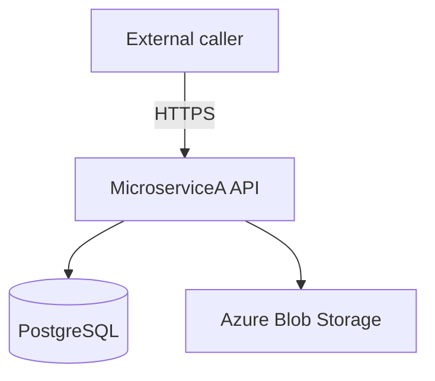
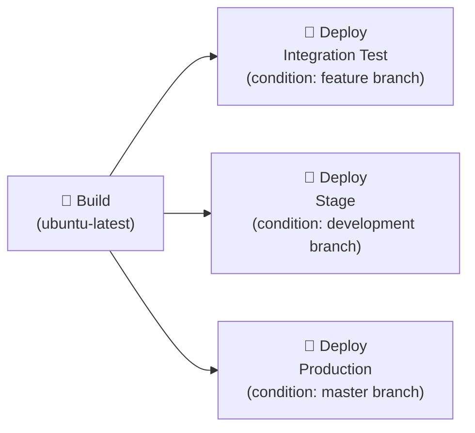
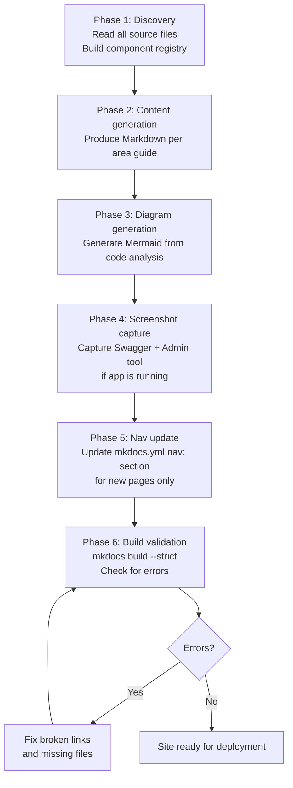

# Documentation Design — Static Site Generation and Deployment

> Criteria, procedures, and quality gates for **building, branding, and deploying** the MkDocs
> documentation site as a password-protected Azure Static Web App.
> This document is the authoritative reference for the documentation site's technical implementation.
>
> Part of the Documentation Manager Design Guide series → [Index](00.documentationmanager.design.md)

---

## Table of contents

1. [Purpose and scope](#1-purpose-and-scope)
2. [Repository layout for the site](#2-repository-layout-for-the-site)
3. [mkdocs.yml — authoritative configuration](#3-mkdocsyml--authoritative-configuration)
4. [Mermaid diagram support](#4-mermaid-diagram-support)
5. [Images and site assets](#5-images-and-site-assets)
6. [branding and theming](#6-branding-and-theming)
7. [Authentication and authorization](#7-authentication-and-authorization)
8. [Build procedure](#8-build-procedure)
9. [Deployment pipeline](#9-deployment-pipeline)
10. [Manual deployment procedure](#10-manual-deployment-procedure)
11. [Agent guidance — generating the site](#11-agent-guidance--generating-the-site)
12. [Quality gates](#12-quality-gates)

---

## 1. Purpose and scope

This design document governs the complete lifecycle of the MicroserviceA documentation static site:

| Phase | Governed by this document |
|-------|--------------------------|
| Content authoring | Source: `docs/` folder; format: Markdown with MkDocs Material extensions |
| Local preview | `mkdocs serve` — live reload at `http://127.0.0.1:8000` |
| Site build | `mkdocs build` — outputs to `deploy/microservicea/` |
| Branding | Material theme, CSS overrides, logo, Azure icon pack |
| Diagrams | Mermaid (inline fenced code blocks, agent-generated) |
| Screenshots | Agent-captured PNG/SVG files stored in `docs/assets/screenshots/` |
| Authentication | Azure Static Web Apps built-in auth with Microsoft Entra ID |
| Deployment | Azure DevOps pipeline → Azure Static Web App |

### What this document does NOT cover

- The content of individual documentation pages (covered by [01–09 area guides](00.documentationmanager.design.md#0-companion-area-guides))
- Application deployment (covered by [deployment/overview.md](../docs/deployment/overview.md) and [deployment/runbook.md](../docs/deployment/runbook.md))
- IaC for Azure resources (covered by `avm/`)

---

## 2. Repository layout for the site

```
MicroserviceA.repo/
├── mkdocs.yml                    # Site configuration — single source of truth
├── staticwebapp.config.json      # Azure SWA auth + routing rules
├── index.html                    # Root redirect to /microservicea/
├── docs/                         # Markdown source files
│   ├── index.md                  # Home page
│   ├── assets/
│   │   ├── logo.svg          # logo (SVG) — header + favicon
│   │   ├── icons/
│   │   │   ├── index.md          # Azure icon catalog (agent tooling reference)
│   │   │   └── azure/            # 705 Microsoft Azure Architecture Icons (local SVGs)
│   │   └── screenshots/
│   │       ├── api/              # Agent-captured Swagger UI screenshots
│   │       └── components/       # Admin tool and component screenshots
│   ├── stylesheets/
│   │   └── branding.css      # color overrides for Material theme
│   └── js/
│       ├── mermaid-init.js       # Mermaid initialization (document$ aware)
│       └── nav-full-sidebar.js   # Full sidebar collapse/expand behavior
├── deploy/
│   └── microservicea/                # Built site output (gitignored; pipeline artifact)
└── devops/
    ├── pipelines/
    │   └── doc-deploy.yml        # Trigger definition — per-environment targets
    └── templates/
        ├── staticWebApp.yml      # Build + deploy template
        └── stages/
            └── staticWebApp.deploy.yml  # Per-environment deployment stage
```

### Key files the agent must NOT modify

| File | Reason |
|------|--------|
| `staticwebapp.config.json` | Auth/routing rules — security-critical; managed by ops |
| `index.html` | Root redirect — managed by ops |
| `docs/js/nav-full-sidebar.js` | Complex JS behavior — already tested and stable |
| `docs/js/mermaid-init.js` | Mermaid bridge — already tested and stable |
| `docs/stylesheets/branding.css` | Brand identity — only update with explicit approval |
| `mkdocs.yml` nav: section | Nav tree — changes require review (see [Nav Tree Governance](00.documentationmanager.design.md#8-nav-tree-governance)) |

---

## 3. mkdocs.yml — authoritative configuration

The following is the **validated** `mkdocs.yml` configuration in use for MicroserviceA. The agent must use this as the canonical reference when adding new pages or regenerating `mkdocs.yml`.

### Site identity block

```yaml
site_name: MicroserviceA Documentation
site_description: Documentation for the MicroserviceA Web API project
site_author: Development Team
site_url: https://your-swa.azurestaticapps.net/microservicea/
site_dir: deploy/microservicea
dev_addr: 127.0.0.1:8000
```

**Rules:**
- `site_dir` must be `deploy/microservicea` — the pipeline picks up the `deploy/` directory as the artifact root
- `site_url` must include the `/microservicea/` suffix — the SWA mounts the site at this path prefix
- Never change `dev_addr` — reserved for local preview

### Theme block

```yaml
theme:
  name: material
  logo: assets/logo.svg
  favicon: assets/logo.svg

  palette:
    - scheme: default
      primary: indigo       # PRIMARY #1565C0
      accent: purple        # ACCENT #7C4DFF
      toggle:
        icon: material/brightness-7
        name: Switch to dark mode
    - scheme: slate
      primary: red
      accent: deep purple
      toggle:
        icon: material/brightness-4
        name: Switch to light mode

  features:
    - navigation.instant       # SPA-style navigation — required for document$ JS hooks
    - navigation.tracking      # Updates URL hash on scroll
    - navigation.tabs          # Top navbar for top-level sections
    - navigation.tabs.sticky   # Tab bar stays pinned while scrolling
    - navigation.indexes       # overview.md files act as section index pages
    - toc.follow               # Right-hand TOC scrolls with the page
    - content.code.copy        # Copy button on all code blocks
    - content.code.select      # Select button on all code blocks
    - search.suggest           # Search autocomplete
    - search.highlight         # Highlights search terms on the results page
```

**Features NOT to add:**

| Feature | Reason to avoid |
|---------|----------------|
| `navigation.sections` | Renders top-level groups as flat bold headers — breaks sidebar indentation |
| `navigation.expand` | Forces all sections open simultaneously — sidebar looks flat and overwhelming |

### Markdown extensions block

```yaml
markdown_extensions:
  - admonition
  - tables
  - toc:
      permalink: true
  - pymdownx.superfences:
      custom_fences:
        - name: mermaid
          class: mermaid
          format: !!python/name:pymdownx.superfences.fence_code_format
  - pymdownx.tabbed:
      alternate_style: true
  - pymdownx.highlight:
      anchor_linenums: true
  - pymdownx.inlinehilite
  - pymdownx.details
  - pymdownx.emoji:
      emoji_index: !!python/name:material.extensions.emoji.twemoji
      emoji_generator: !!python/name:material.extensions.emoji.to_svg
  - attr_list
  - md_in_html
```

**Critical:** `fence_code_format` (not `fence_div_format`) is required for Mermaid. Material's content pipeline escapes raw `<div>` output; `fence_code_format` produces `<pre class="mermaid"><code>` which `mermaid-init.js` then converts correctly.

### Extra assets block

```yaml
extra_css:
  - stylesheets/branding.css

extra_javascript:
  - https://unpkg.com/mermaid@10/dist/mermaid.min.js
  - js/mermaid-init.js
  - js/nav-full-sidebar.js
```

**Rules:**
- Mermaid is loaded from a CDN (`unpkg.com`) — pinned to major version `@10`
- Load order is critical: CDN script must precede `mermaid-init.js`
- `nav-full-sidebar.js` must load last

---

## 4. Mermaid diagram support

All architecture, flow, and sequence diagrams in the documentation site use Mermaid inline code blocks. The documentation agent generates these diagrams from source code analysis.

### Syntax

All diagrams are written as fenced Mermaid code blocks:

````markdown

````

### Supported diagram types

| Diagram type | Use for | Mermaid keyword |
|-------------|---------|----------------|
| Component diagram | Architecture overview, logical architecture | `graph TD` / `graph LR` |
| Sequence diagram | Request flows, auth flows | `sequenceDiagram` |
| Flowchart | Pipeline stages, deployment flows, decision trees | `flowchart LR` / `flowchart TD` |
| Class diagram | Domain models, entity relationships | `classDiagram` |
| Entity relationship | Database schema | `erDiagram` |
| Gitflow | Branching strategy | `gitGraph` |

### How Mermaid rendering works

The site uses a two-step initialization pattern because `navigation.instant` (SPA mode) bypasses `DOMContentLoaded`:

1. `mermaid-init.js` subscribes to Material's `document$` observable — fires on every page navigation including the initial load
2. On each navigation:
   - `mermaid.initialize({ startOnLoad: false, theme: "default" })` configures the renderer
   - All `<pre class="mermaid"><code>` elements (produced by `fence_code_format`) are converted to `<div class="mermaid">`
   - `mermaid.run()` renders all converted elements

**If Mermaid diagrams are not rendering, check:**

| Symptom | Cause | Fix |
|---------|-------|-----|
| Diagram shows raw text | `fence_div_format` used instead of `fence_code_format` | Change to `fence_code_format` in `mkdocs.yml` |
| Diagram renders on first load only | `DOMContentLoaded` used in JS | Use `document$.subscribe()` |
| Diagram not rendering at all | `mermaid.min.js` loaded after `mermaid-init.js` | Check load order in `extra_javascript` |

### Agent guidance for generating diagrams

- Generate diagrams from evidence (code analysis), never speculatively
- Use `graph TD` for component/architecture diagrams — top-down layout reads better for layered systems
- Use `flowchart LR` for pipeline/promotion flows — left-right reads better for sequential stages
- Include node labels in square brackets `[...]` with human-readable names
- Keep diagram node count ≤ 20 — larger diagrams are unreadable; split into linked sub-diagrams
- For the logical architecture diagram, show ALL discovered components (see [03.design-architecture.md](03.design-architecture.md))

---

## 5. Images and site assets

### Asset organization

```
docs/assets/
├── logo.svg                    # wordmark SVG (header + favicon)
├── icons/
│   ├── index.md                    # Azure icon catalog — agent lookup file
│   └── azure/                      # 705 Microsoft Azure Architecture Icons
│       └── svg/
│           ├── app-services/
│           ├── databases/
│           ├── general/
│           ├── monitor/
│           ├── security/
│           ├── storage/
│           └── ...                 # 29 categories total
└── screenshots/
    ├── api/                        # Swagger UI endpoint screenshots
    └── components/                 # Admin tool, CLI, and component UI screenshots
```

### Azure icon usage in documentation

The Azure icon pack contains 705 SVG files organized into 29 categories. Use the icon catalog at `docs/assets/icons/index.md` to find the correct SVG path for any Azure resource type.

**Pattern A — inline 18px icon (in tables, headings, labels):**

```html
App Service
```

**Pattern B — standalone resource card:**

```html
<figure style="display:inline-flex; align-items:center; gap:8px; margin:4px 0">
  
  <figcaption><strong>PostgreSQL Flexible Server</strong><br>
  <small>sku: GP_Gen5_2</small></figcaption>
</figure>
```

**Rules:**
- Always use the **local SVG path** — never CDN URLs for Azure icons
- Relative path depth must match the file's location in `docs/` (`../../assets/` from a 2-level-deep page)
- Always include `alt` text
- Pre-registered icons (in the v4 agent registry): App Services, Application Insights, PostgreSQL Server, Event Hubs, Key Vaults, Resource Groups, SQL Database, Storage Accounts, Subscriptions

### Screenshots — agent capture procedure

The documentation agent captures screenshots of:
- Swagger UI endpoint pages (one per controller)
- Admin tool pages (main dashboard, key management screens)
- CLI help output (rendered as code blocks or screenshots)

**Storage convention:**
```
docs/assets/screenshots/api/{ControllerName}-swagger.png
docs/assets/screenshots/components/admin-tool-{page-slug}.png
```

**Reference in Markdown:**
```markdown

```

**Rules:**
- Screenshot filenames use lowercase-kebab-case
- Screenshots must be captured at 1280×800 viewport — consistent scale across all pages
- If a screenshot cannot be captured (app not running), use a Mermaid diagram as fallback and add: `<!-- screenshot-pending: capture when app is running -->`
- Never use placeholder images — either a real screenshot or a diagram, never a colored box

---

## 6. branding and theming

The theme is built on top of MkDocs Material. All customizations are additive — they override Material defaults without replacing the base theme.

### Color palette

| Token | Value | Used for |
|-------|-------|---------|
| Primary | `#1565C0` | Primary color, header background, link hover, admonition borders |
| Primary Dark | `#0D47A1` | Navigation tabs background |
| Primary Light | `#64B5F6` | Hover states |
| Accent | `#7C4DFF` | Accent color, code highlights |
| Accent Light | `#B388FF` | Accent (dark mode) |

### CSS customizations (`docs/stylesheets/branding.css`)

Key overrides applied by `branding.css`:

| Element | Override |
|---------|---------|
| Header background | `#1565C0` (Red) |
| Tab bar background | `#0D47A1` (Red Dark) |
| Sidebar section separators | `1px solid` dividers between top-level sections |
| Active nav label | `position: static` — prevents floating over sections above |
| Active/hover link color | `#1565C0` |
| Search result highlight | Red underline |
| Code copy button hover | Red |
| Back-to-top button | Red background |
| Footer | Dark (`#1a1a1a` / `#111111`) |

**Do not modify** `branding.css` without explicit request. CSS `!important` rules are intentional — they override Material's JavaScript inline style injections.

### Logo

The logo is stored as an SVG at `docs/assets/logo.svg`. It renders at `height: 28px` in the header (set by `branding.css`).

```svg
<svg xmlns="http://www.w3.org/2000/svg" viewBox="0 0 120 40" role="img" aria-label="Logo">
  <rect width="120" height="40" fill="#1565C0" rx="2"/>
  <text x="60" y="30" font-family="Arial, Helvetica, sans-serif"
        font-size="26" font-weight="900" fill="#FFFFFF"
        text-anchor="middle" letter-spacing="3">LOGO</text>
</svg>
```

---

## 7. Authentication and authorization

The documentation site is protected by Microsoft Entra ID (Azure AD) authentication, enforced by Azure Static Web Apps built-in auth. No additional authentication code exists in the documentation itself — auth is entirely at the hosting layer.

### How it works

```
Browser → Azure Static Web App → Route: /microservicea/*
                                          ↓
                                 allowedRoles: [authenticated]
                                          ↓
                         (unauthenticated) → 401 → 302 redirect
                                          ↓
                         /.auth/login/aad?post_login_redirect_uri=/microservicea/
                                          ↓
                         Microsoft Entra ID login (Org tenant)
                                          ↓
                         Token validated → user role: authenticated
                                          ↓
                         Access granted → /microservicea/ served
```

### `staticwebapp.config.json` — authoritative configuration

```json
{
  "trailingSlash": "auto",
  "auth": {
    "identityProviders": {
      "azureActiveDirectory": {
        "registration": {
          "openIdIssuer": "https://login.microsoftonline.com/{TENANT_ID}/v2.0",
          "clientIdSettingName": "AZURE_CLIENT_ID",
          "clientSecretSettingName": "AZURE_CLIENT_SECRET"
        },
        "login": {
          "loginParameters": ["response_type=code id_token", "scope=openid profile email"]
        }
      }
    }
  },
  "routes": [
    {
      "route": "/",
      "redirect": "/microservicea/",
      "statusCode": 302
    },
    {
      "route": "/microservicea/*",
      "allowedRoles": ["authenticated"]
    }
  ],
  "responseOverrides": {
    "401": {
      "statusCode": 302,
      "redirect": "/.auth/login/aad?post_login_redirect_uri=/microservicea/"
    }
  }
}
```

**Security notes:**
- `AZURE_CLIENT_ID` and `AZURE_CLIENT_SECRET` are environment variables in the Azure SWA resource — never stored in the repository
- The `openIdIssuer` is tenant-specific — uses the organization's Entra tenant ID
- The `401 → 302` override ensures unauthenticated users are automatically redirected to login (no error page shown)
- All content under `/microservicea/*` requires the `authenticated` role — there is no public content

### Adding role-based access control (future)

If the site needs to expose different content to different roles (e.g., internal team vs. read-only partners):

1. Add custom roles to `staticwebapp.config.json` under `allowedRoles`
2. Provision an Azure Functions API for the `/.auth/roles` endpoint (SWA custom role assignment)
3. Document the role mapping in the ops runbook

Do not implement role-based content filtering at the Markdown level — all content gating must happen at the hosting layer.

### Logout

Users can log out by navigating to `/.auth/logout`. Add a logout link to the documentation site footer if needed:

```markdown
[Sign out](/.auth/logout)
```

---

## 8. Build procedure

### Prerequisites

| Tool | Minimum version | Install |
|------|----------------|---------|
| Python | 3.11 | `pyenv install 3.11` or system package manager |
| pip | latest | `python -m pip install --upgrade pip` |
| mkdocs-material | latest stable | `pip install mkdocs-material` |

**Full install command:**

```bash
pip install mkdocs mkdocs-material
```

No additional plugins are required for the current configuration.

### Local preview

```bash
# From the repository root
mkdocs serve
```

The site is available at `http://127.0.0.1:8000`.

**⚠️ Hard-refresh after config changes:** `navigation.instant` uses a service worker that caches pages aggressively. Always use **Ctrl+Shift+R** (Windows/Linux) or **Cmd+Shift+R** (macOS) after changing CSS, JS, or `mkdocs.yml`.

### Production build

```bash
# From the repository root
mkdocs build
```

Output is written to `deploy/microservicea/` (configured as `site_dir` in `mkdocs.yml`).

After building, copy the SWA configuration files:

```bash
cp staticwebapp.config.json deploy/
cp index.html deploy/   # root redirect from / to /microservicea/
```

The final `deploy/` directory structure:

```
deploy/
├── staticwebapp.config.json    # Auth + routing rules
├── index.html                  # Root redirect
└── microservicea/                  # Built MkDocs site
    ├── index.html
    ├── assets/
    ├── api/
    ├── architecture/
    └── ...
```

### Build validation

After building, verify:

- [ ] `deploy/microservicea/` directory exists and is non-empty
- [ ] `deploy/staticwebapp.config.json` is present
- [ ] `deploy/index.html` is present
- [ ] At least one Mermaid diagram renders correctly in the built HTML (search for `class="mermaid"` in any page's HTML)
- [ ] No broken links in the build output (`mkdocs build --strict` for warnings-as-errors)

```bash
# Run strict build to catch broken links and missing files
mkdocs build --strict
```

---

## 9. Deployment pipeline

### Pipeline file

**Trigger definition:** `devops/pipelines/doc-deploy.yml`  
**Build + deploy template:** `devops/templates/staticWebApp.yml`  
**Deploy stage template:** `devops/templates/stages/staticWebApp.deploy.yml`

### Trigger conditions

The pipeline triggers on pushes to any of these branches when the following paths change:

| Branch | Target environment |
|--------|-------------------|
| `feature` / `feature` or `feature/*` | Integration Test |
| `development` or `hotfix/*` | Stage |
| `master` | Production |

**Path filters** — pipeline only runs when these paths change:

```yaml
paths:
  include:
    - docs/**
    - mkdocs.yml
    - staticwebapp.config.json
    - index.html
```

### Pipeline stages



Each deploy stage is conditional — only the stage matching the source branch executes.

### Build stage steps

| Step | Action |
|------|--------|
| 1 | Checkout repository |
| 2 | Setup Python 3.11 |
| 3 | `pip install mkdocs mkdocs-material` |
| 4 | `mkdocs build` |
| 5 | Copy `staticwebapp.config.json` and `index.html` to `deploy/` |
| 6 | Publish `deploy/` as pipeline artifact `docs-site` |

### Deploy stage steps (per environment)

| Step | Action |
|------|--------|
| 1 | Download artifact `docs-site` |
| 2 | Setup Node.js 18.x |
| 3 | `npm install -g @azure/static-web-apps-cli` |
| 4 | `az staticwebapp deploy` (via Azure CLI task) with the environment's service connection |

### Environment targets

| Internal name | Display name | Azure subscription | SWA resource | Resource group |
|---------------|-------------|-------------------|-------------|----------------|
| `IntTest` | Integration.Test | `{Subscription-Dev}` | `{swa-name}-test-01` | `{project-rg}-test` |
| `Stage` | Stage | `{Subscription-Dev}` | `{swa-name}-stage-01` | `{project-rg}-stage` |
| `Prod` | Prod | `{Subscription-Prd}` | `{swa-name}-prod-01` | `{project-rg}-prod` |

### Required pipeline variables / service connections

| Variable / Connection | Used in | Notes |
|-----------------------|---------|-------|
| `AZURE_CLIENT_ID` | SWA runtime (not pipeline) | Set in SWA app settings |
| `AZURE_CLIENT_SECRET` | SWA runtime (not pipeline) | Set in SWA app settings |
| `{Subscription-Dev}` | Pipeline service connection | Deploy to test + stage |
| `{Subscription-Prd}` | Pipeline service connection | Deploy to prod |

---

## 10. Manual deployment procedure

Use this procedure when the pipeline is unavailable or for emergency hotfixes to documentation.

### Prerequisites

- Azure CLI installed: `az --version`
- Azure Static Web Apps CLI installed: `npm install -g @azure/static-web-apps-cli`
- Authenticated to Azure: `az login`
- Access to the target subscription

### Step 1 — Build the site

```bash
# From repository root
pip install mkdocs mkdocs-material
mkdocs build
cp staticwebapp.config.json deploy/
cp index.html deploy/
```

### Step 2 — Retrieve the deployment token

```bash
# Get the deployment token for the target SWA
az staticwebapp secrets list \
  --name <static-web-app-name> \
  --resource-group <resource-group> \
  --query "properties.apiKey" -o tsv
```

| Environment | `<static-web-app-name>` | `<resource-group>` |
|-------------|------------------------|-------------------|
| Integration Test | `{swa-name}-test-01` | `{project-rg}-test` |
| Stage | `{swa-name}-stage-01` | `{project-rg}-stage` |
| Production | `{swa-name}-prod-01` | `{project-rg}-prod` |

### Step 3 — Deploy

```bash
# Deploy using SWA CLI
swa deploy ./deploy \
  --deployment-token <TOKEN_FROM_STEP_2> \
  --env production
```

Or via Azure CLI:

```bash
az staticwebapp deploy \
  --name <static-web-app-name> \
  --resource-group <resource-group> \
  --source ./deploy \
  --token <TOKEN_FROM_STEP_2>
```

### Step 4 — Verify

1. Navigate to the site URL
2. Confirm the login redirect works (you are sent to Microsoft login)
3. Log in with an org account
4. Confirm the home page loads
5. Confirm at least one Mermaid diagram renders
6. Confirm the navigation tabs are visible and functional

### Rollback procedure

Azure Static Web Apps retains deployment history. To revert to a previous deployment:

```bash
# List recent deployments
az staticwebapp environment list \
  --name <static-web-app-name> \
  --resource-group <resource-group>

# Redeploy the previous artifact via the Azure DevOps pipeline:
# 1. Navigate to Pipelines → doc-deploy → Run history
# 2. Find the last good run
# 3. Re-run the deploy stage only (not the build stage)
```

There is no in-place rollback via CLI for SWA — the recommended procedure is to re-trigger the pipeline for the last known-good commit.

---

## 11. Agent guidance — generating the site

This section describes what the documentation agent must do when producing or updating the documentation site. It complements the content criteria in area guides [01–09](00.documentationmanager.design.md#0-companion-area-guides).

### What the agent produces

| Output | Location | Notes |
|--------|----------|-------|
| Markdown pages | `docs/**/*.md` | Content per area guides |
| Mermaid diagrams | Inline in Markdown | Generated from code analysis |
| Screenshots | `docs/assets/screenshots/` | Captured via browser automation |
| `mkdocs.yml` nav update | Root `mkdocs.yml` | Only the `nav:` section — never touch other sections |

### Step-by-step site generation workflow



### Mermaid diagram generation rules

1. **Always generate from evidence** — read the actual source code, `*.csproj` references, `Program.cs` registrations, controller routes, and IaC files before drawing any component
2. **No speculative nodes** — if a component is not found in the source, it does not appear in any diagram
3. **Use canonical names** — component names in diagrams must match their names in `mkdocs.yml` nav
4. **Test diagram syntax** before including in a page — malformed Mermaid silently shows raw text

### Screenshot capture rules

When the application is running locally:

1. Navigate to `http://localhost:{port}/swagger` — capture each controller's expanded section
2. Navigate to the Admin tool frontend — capture each key management screen
3. Save to `docs/assets/screenshots/{category}/{name}.png`
4. Reference in the corresponding documentation page

When the application is not running:

1. Generate a Mermaid sequence diagram as a substitute
2. Add the HTML comment `<!-- screenshot-pending: capture when app is running at {url} -->`
3. Do not leave a broken image reference

### Nav tree update rules

When adding new documentation pages:

1. **Do not reorder** existing nav entries
2. **Add new entries** in the correct section (per the area guide for that content type)
3. **Use relative paths** from `docs/` — no leading slash
4. **Add a section index** (`overview.md`) for any new folder
5. **Do not add** `posture.internal.md` to the nav — it must never appear in the nav tree
6. After updating `mkdocs.yml`, run `mkdocs build --strict` to verify no broken links

### Asset path rules

| Context | Relative path from file to assets |
|---------|----------------------------------|
| `docs/index.md` | `assets/` |
| `docs/api/*.md` | `../assets/` |
| `docs/api/controllers/*.md` | `../../assets/` |
| `docs/architecture/*.md` | `../assets/` |
| `docs/infrastructure/*.md` | `../assets/` |

**Rule:** Always compute the relative depth from the Markdown file to `docs/assets/` — never use absolute paths or `site_url`-prefixed paths in Markdown image references.

---

## 12. Quality gates

Before considering the documentation site ready for deployment, all items below must pass.

### Build quality gates

- [ ] `mkdocs build --strict` completes with zero warnings and zero errors
- [ ] `deploy/microservicea/` directory is non-empty
- [ ] `deploy/staticwebapp.config.json` is present and valid JSON
- [ ] `deploy/index.html` is present

### Content quality gates

- [ ] Every page listed in `mkdocs.yml` nav exists as a file in `docs/`
- [ ] No page has a broken internal link (verified by strict build)
- [ ] No page references an image that does not exist in `docs/assets/`
- [ ] All Mermaid blocks use valid syntax (no raw text output in built HTML)
- [ ] `security/posture.internal.md` is NOT in `mkdocs.yml` nav and is NOT linked from any page

### Branding quality gates

- [ ] logo renders in the header at 28px height
- [ ] Header background is Red (`#1565C0`)
- [ ] Tab bar background is Red Dark (`#0D47A1`)
- [ ] Light/dark mode toggle works
- [ ] branding CSS is loaded (`branding.css` appears in page `<head>`)

### Authentication quality gates (verify on deployed site)

- [ ] Navigating to the site root redirects to `/microservicea/`
- [ ] Navigating to `/microservicea/` without authentication redirects to Microsoft login
- [ ] After login with a valid org account, the documentation loads
- [ ] After login with an external (non-org) account, access is denied
- [ ] The `/.auth/logout` endpoint signs the user out

### Diagram quality gates

- [ ] At least one Mermaid diagram renders on the Architecture overview page
- [ ] The logical architecture diagram includes all discovered components
- [ ] No diagram contains more than 20 nodes (split into sub-diagrams if needed)
- [ ] All diagrams render after SPA navigation (navigate away and back — diagram must re-render)

---

## References

**[MkDocs Material documentation](https://squidfunk.github.io/mkdocs-material/)** 📘 [Official]  
Complete reference for all theme features, plugins, and Markdown extensions. Use for theme configuration and extension options.

**[Azure Static Web Apps — Authentication and authorization](https://learn.microsoft.com/en-us/azure/static-web-apps/authentication-authorization)** 📘 [Official]  
Microsoft Learn documentation for SWA built-in auth, custom roles, and `staticwebapp.config.json` reference.

**[Azure Static Web Apps CLI](https://azure.github.io/static-web-apps-cli/)** 📘 [Official]  
Reference for the `swa deploy` command used in manual deployment.

**[Mermaid documentation](https://mermaid.js.org/intro/)** 📗 [Verified Community]  
Syntax reference for all Mermaid diagram types. Use when authoring or debugging diagram syntax.

**[pymdownx.superfences — MkDocs Material](https://facelessuser.github.io/pymdown-extensions/extensions/superfences/)** 📗 [Verified Community]  
Explains `fence_code_format` vs `fence_div_format` — critical for correct Mermaid rendering in Material theme.

**[Microsoft Azure Architecture Icons](https://learn.microsoft.com/en-us/azure/architecture/icons/)** 📘 [Official]  
Official source for the Azure icon pack used in infrastructure documentation. The local copy at `docs/assets/icons/azure/` was downloaded from this source.

<!--
validations:
  grammar: {status: "not_run", last_run: null}
  readability: {status: "not_run", last_run: null}

article_metadata:
  filename: "10.design-static-site.md"
-->
