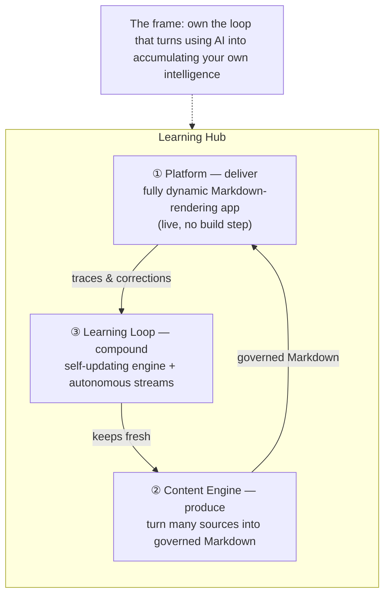

# Learning Hub: vision, strategy, implementation, and next steps

> **Read this first.** This is the canonical definition of the Learning Hub. Each sibling vision under
> [06.00-idea/](../) is a **chapter** of the picture drawn here — this page is the map that ties them together.

## Table of contents

- [📌 What the Learning Hub is](#-what-the-learning-hub-is)
- [🧭 Vision — why](#-vision--why)
- [🏗️ Strategy — the three layers](#️-strategy--the-three-layers)
- [👥 Audiences and interaction surfaces](#-audiences-and-interaction-surfaces)
- [⚙️ Current implementation](#️-current-implementation)
- [🚀 Next steps](#-next-steps)
- [🗺️ The map — sibling visions as chapters](#️-the-map--sibling-visions-as-chapters)
- [📚 References](#-references)

---

## 📌 What the Learning Hub is

The Learning Hub is **one system in three layers**, over **one frame**:

| Layer | Verb | One-line definition |
|---|---|---|
| **① Platform** | *deliver* | A **fully dynamic Markdown-rendering application** that renders Markdown → HTML on demand and builds navigation at runtime — **no build step**, content is live the moment it lands. |
| **② Content Engine** | *produce* | The prompts and agents that **turn many sources into governed Markdown** — learning notes, article writing, prompt engineering, and generated reference / documentation / validation content. |
| **③ Learning Loop** | *compound* | The **self-updating engine and autonomous streams** that keep the corpus fresh and compound the owner's judgment, under human governance. |

Over all three sits **one frame** — *own the loop* — the economic rationale that the value of using AI
is the **learning exhaust** (prompts, corrections, graded verdicts), and the Hub keeps that exhaust inside
a trust boundary the owner controls. See [Own your learning loop](../own-your-learning-loop/01-own-your-learning-loop-overview.md).

> **Ten folders, three ideas.** The sibling folders under [06.00-idea/](../) can read like ten separate
> projects. They are not — each is a component of one of the three layers above. The
> [map](#️-the-map--sibling-visions-as-chapters) shows which is which.

---

## 🧭 Vision — why

Every time you use an AI model you produce **learning exhaust** — the prompts, the tool calls, the graded
verdicts, and above all the *corrections* you make when the model is wrong. That exhaust is the accumulated
judgment about what you value and how you measure "good," and by default it flows outward to whoever owns the
model. The Learning Hub's bet is to **keep it**: own the loop that generates the exhaust, hold it inside a
governed trust boundary, and let each cycle compound your own *particular intelligence* rather than someone
else's model.

The frame is architecture, not ideology, and it is indifferent to who owns it: the same design serves a
single learner or a community that shares and grows the knowledge together. The full argument — Control,
Capability, Choice, Cost, Compound — lives in
[Own your learning loop](../own-your-learning-loop/01-own-your-learning-loop-overview.md), grounded in the
[Reverse Information Paradox](../../01.00-news/20260716.01-reverse-paradox/overview.md).

---

## 🏗️ Strategy — the three layers

### ① Platform — deliver

The Learning Hub is delivered as a **fully dynamic Markdown-rendering application** (`src/Learn.Web`). It
renders Markdown → HTML **on demand at request time** and builds its navigation **at runtime** from the live
content hierarchy. There is **no build step and no static output** — publishing collapses to *"make the
Markdown available."* Content comes from the filesystem (development) or object storage (production), chosen
by configuration, so the same application serves a local clone or a hosted corpus without code changes.

Because a page is a pure function of *its own* Markdown plus a shared shell, the platform is **producer- and
source-agnostic**: any Markdown, from any origin, renders live. That property is what lets the platform serve
audiences far beyond a single learner (see [Audiences](#-audiences-and-interaction-surfaces) and the
[Platform and consumers](04-platform-and-consumers.md) chapter).

### ② Content Engine — produce

The Content Engine is the set of prompts and agents that turn raw material into **governed Markdown** —
Markdown carrying the Hub's dual-metadata contract (identity frontmatter + validation tracking) and passing
its quality model. Today it covers **article writing** and **prompt engineering** (create, validate,
cross-reference, gap-analyse, publish-gate). Its productized name is **IQPilot** — "a quality assurance tool
for written content, like a linter for documentation." The same engine generalizes to **generated content**:
reference documentation from code, documentation sites from a whole repository, and validation reports —
each simply another Markdown producer the platform renders (see [Platform and consumers](04-platform-and-consumers.md)).

- Concept and taxonomy: [Learning Hub introduction](01-learning-hub-overview/01-learning-hub-introduction.md) · [Documentation taxonomy](02-documentation-taxonomy/01-learning-hub-documentation-taxonomy.md)
- The content lifecycle: [Automated content lifecycle](03-automated-content-lifecycle/01-automated-content-lifecycle-with-prompts-agents-and-mcp.md)
- The product: [IQPilot overview](../iqpilot/01-iqpilot-overview.md)

### ③ Learning Loop — compound

The Learning Loop is the machinery that keeps the corpus fresh and compounds judgment: the
[self-updating engine](../self-updating-engine/20260622.01-self-updating-engine-vision.md) (a portable
**Detect → Assess → Propose → Execute** loop with a risk-calibrated autonomy gradient and metadata-guarded
changes) and the [autonomous streams](../autonomous-streams/autonomous-streams.md) that instantiate it per
domain. There is **one engine and many streams**, not four separate systems — see
[One engine, many streams](../self-updating-engine/00-one-engine-many-streams.md). The
[cost-control strategy](../prompt-engineering-and-azure-openai-cost-control/20260503.01-slidescontent.md)
and [TuneIQ](../tuneiq/01-tuneiq-design.md) (which tunes the customization stack from real sessions) round
out the loop.

---

## 👥 Audiences and interaction surfaces

The platform is **producer-agnostic**: produce governed Markdown in *any* surface and it renders live.

| Interaction surface | Who produces here | Example |
|---|---|---|
| **The live site** | Readers and authors | Browse, search, read; the site is a first-class surface, not just a publish target |
| **The editor (VS Code)** | Authors and agents | Write and validate Markdown next to the content |
| **AI assistants (e.g. GitHub Copilot)** | Prompts, agents, skills | Create/validate/generate Markdown from chat |
| **Autonomous streams** | Background loops | Detect → propose → execute edits that go live immediately |

And the audiences generalize well beyond the solo learner — a **documentation manager**, a **validation
manager**, and **app-dev doc generation** are all just Markdown producers the platform renders. The
generalized consumer model is the [Platform and consumers](04-platform-and-consumers.md) chapter.

---

## ⚙️ Current implementation

| Layer | Component | Status |
|---|---|---|
| ① Platform | Dynamic Markdown-rendering app (`src/Learn.Web`), runtime navigation, filesystem/blob source | **Built & live** |
| ② Content Engine | Article-writing + prompt-engineering prompts/agents; dual-metadata contract; validation caching | **Built** (IQPilot productization ongoing) |
| ② Content Engine | Generated docs / validation consumers (documentation-manager, validation-manager) | **Design** — external patterns generalized, not yet hosted |
| ③ Learning Loop | Self-updating engine, autonomy gradient, metadata guards | **Design-strong**; partly wired |
| ③ Learning Loop | Autonomous streams on the live source | **Design** |
| ③ Learning Loop | TuneIQ session capture and analysis | **Design**; capture partly wired |

The platform layer is the concrete outcome of the markdown-first migration — see the
[progressive-build recap](../../src/docs/90.%20Issues/202607/20270711.02-progressive-build/overview.md)
for how the retired static-site build became this live renderer.

---

## 🚀 Next steps

**Documentation (this repo) — in progress**

1. This canonical master (Vision / Strategy / Implementation / Next steps + the three-layer map).
2. [Platform and consumers](04-platform-and-consumers.md) — the platform and its generalized audiences.
3. Rescope IQPilot and TuneIQ to name the live site as a first-class surface.
4. [One engine, many streams](../self-updating-engine/00-one-engine-many-streams.md) — fold the self-updating trio under one engine.

**Capability (roadmap)**

5. **Multi-source content** — let the renderer host a generated documentation tree (runtime rendering replaces a static build). → [Design spec: live documentation hosting](../../src/docs/90.%20Issues/202607/20270720.01-learninghub-stratreview/overview.md).
6. **Validation dashboards** — render validation catalog / progress Markdown as live views.
7. **Private mirror** — authenticated, authorized rendering of the non-public knowledge tree (the trust boundary made real).
8. **Streams on the live source** — wire autonomous streams to the same content source the site reads, so detect → propose → execute edits go live immediately.

---

## 🗺️ The map — sibling visions as chapters

| Layer | Chapter (sibling vision) | Role |
|---|---|---|
| Frame | [Own your learning loop](../own-your-learning-loop/01-own-your-learning-loop-overview.md) | The economic rationale over all three layers |
| ① Platform | [Platform and consumers](04-platform-and-consumers.md) | The dynamic renderer and its generalized audiences |
| ② Content Engine | [Learning Hub introduction](01-learning-hub-overview/01-learning-hub-introduction.md) | The knowledge-development concept |
| ② Content Engine | [Documentation taxonomy](02-documentation-taxonomy/01-learning-hub-documentation-taxonomy.md) | The seven content categories |
| ② Content Engine | [Automated content lifecycle](03-automated-content-lifecycle/01-automated-content-lifecycle-with-prompts-agents-and-mcp.md) | Research → develop → create → review → publish |
| ② Content Engine | [IQPilot](../iqpilot/01-iqpilot-overview.md) | The productized content-quality tool |
| ③ Learning Loop | [Self-updating engine](../self-updating-engine/20260622.01-self-updating-engine-vision.md) | The portable Detect → Assess → Propose → Execute machinery |
| ③ Learning Loop | [One engine, many streams](../self-updating-engine/00-one-engine-many-streams.md) | Folds the self-updating-* domains into one engine |
| ③ Learning Loop | [Autonomous streams](../autonomous-streams/autonomous-streams.md) | The runtime instances of the engine |
| ③ Learning Loop | [TuneIQ](../tuneiq/01-tuneiq-design.md) | Tunes the customization stack from real sessions |
| ③ Learning Loop | [Cost control](../prompt-engineering-and-azure-openai-cost-control/20260503.01-slidescontent.md) | Token / context / billing discipline |

---

## 📚 References

### Internal references

- [Own your learning loop](../own-your-learning-loop/01-own-your-learning-loop-overview.md) — the frame (Control / Capability / Choice / Cost / Compound).
- [Platform and consumers](04-platform-and-consumers.md) — the platform layer and generalized audiences.
- [Self-updating engine vision](../self-updating-engine/20260622.01-self-updating-engine-vision.md) — the machinery of the Learning Loop.
- [Learning Hub introduction](01-learning-hub-overview/01-learning-hub-introduction.md) — the founding concept.

### External sources

**[The Reverse Information Paradox](https://snscratchpad.com/posts/reverse-information-paradox/)** 📒 [Community]
The essay that names Control / Capability / Choice / Cost / Compound and the trust-boundary argument the frame borrows.

**[Diátaxis](https://diataxis.fr/)** 📗 [Verified Community]
The documentation framework the Hub's content taxonomy extends.

<!--
validations:
  grammar: {status: "not_run", last_run: null}
  readability: {status: "not_run", last_run: null}
article_metadata:
  filename: "00-learning-hub.md"
  created: "2026-07-20"
  status: "canonical-master"
-->
