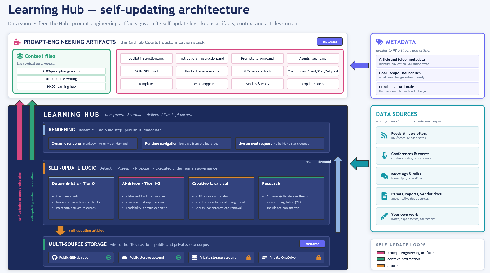

# Learning Hub: vision, strategy, implementation

> **Read this first.** This is the canonical definition of the Learning Hub. Each sibling vision under
> [06.00-idea/](../../) is a **chapter** of the picture drawn here — this page is the map that ties them together.

## Table of contents

- [🧭 Vision — what it is and why](#-vision--what-it-is-and-why)
- [🏗️ How it works — one system in three layers](#️-how-it-works--one-system-in-three-layers)
- [👥 Audiences and interaction surfaces](#-audiences-and-interaction-surfaces)
- [⚙️ Current implementation](#️-current-implementation)
- [🚀 Next steps](#-next-steps)
- [🗺️ The map — sibling visions as chapters](#️-the-map--sibling-visions-as-chapters)
- [📚 References](#-references)

---

## 🧭 Vision — what it is and why

Most learning is **consume-and-forget**: you read an article, watch a talk, skim a paper — and the
understanding fades. The Learning Hub replaces that with **develop-and-keep**. It turns the information you
meet into a **living body of knowledge you own and that keeps getting richer**, and pairs it with an AI that
learns your goals — so that learning stops being a race to keep up and becomes a way to **think ahead**.

It rests on five moves:

- **<mark>Gather</mark>** — bring what you learn from many sources into one place: feeds, papers, transcripts, event
  proceedings, and your own notes, normalized into a single corpus.
- **<mark>Keep</mark>** — nothing is read once and discarded; every worthwhile piece becomes part of a growing store you
  control.
- **<mark>Enrich</mark>** — with AI's help, each piece is *developed*, not merely stored: analysed, connected to what you
  already know, organised for clarity, checked for gaps and stale facts, and kept fresh. Learning does not
  stop at the first read.
- **<mark>Learn in context</mark>** — the Hub is a **place to learn**. *You* do the active thinking — critical analysis
  and creative development — while *AI works alongside you*, gathering, curating, developing, and validating.
  The corpus itself becomes the context that makes both your questions and the AI's help sharper.

- **<mark>Think ahead</mark>** — Gathering, keeping, and enriching aren't about a tidy archive; they're about
**foresight**. As the corpus grows and the AI learns your goals, your scope, and how you reason, the Hub helps
you get *in front* of the flow: it turns fresh news and information into implications for **you**, surfaces
what matters early, and exposes your **knowledge gaps** before they bite. Each cycle leaves you thinking
further ahead — not just better informed. That compounding foresight is the Learning Hub's core value.

**Why keep it close.** The judgment you generate while learning — your corrections, your standards, your
sense of what "good" looks like — is itself valuable, and by default it flows outward to whoever owns the
model you used. The Learning Hub is built so that value stays inside a boundary *you* control, free to
compound. This economic case — *own your loop* — is argued in
[Own your learning loop](../05-own-your-learning-loop.md), which adapts its
vocabulary (Control, Capability, Choice, Cost, Compound, and the "information exhaust" it keeps) from the
[Reverse Information Paradox](../../../01.00-news/20260716.01-reverse-paradox/overview.md) essay. It is the
*rationale* for owning the Hub — not the whole of what the Hub is.

> **Nine folders, three layers.** The sibling folders under [06.00-idea/](../../) can read like nine separate
> projects. They are not — each is a component of one of the three layers described next. The
> [map](#️-the-map--sibling-visions-as-chapters) shows which is which.

---

## 🏗️ How it works — one system in three layers

The Learning Hub delivers that vision as **one system in three layers**, fed by **many sources** and governed
throughout by **metadata carried on the content itself**:

| Layer | Verb | One-line definition |
|---|---|---|
| **① Platform** | *deliver* | A **fully dynamic Markdown-rendering application** that renders Markdown → HTML on demand and builds navigation at runtime — **no build step**, content is live the moment it lands. |
| **② Content Engine** | *produce* | The prompts and agents that **turn many sources into governed Markdown** — learning notes, article writing, prompt engineering, and generated reference / documentation / validation content. |
| **③ Learning Loop** | *compound* | The **self-updating engine and autonomous streams** that keep the corpus fresh and compound the owner's judgment, under human governance. |

Two elements in the diagram are **not** layers — they cut across all three:

- **Sources** are the raw material the Content Engine normalises. Feeds, newsletters, conference catalogs,
  meeting transcripts, papers, and your own corrections all enter the *same* pipeline; none of them is a
  special case with its own bespoke machinery. That generality is the `generalized-content-engine` principle.
- **The metadata spine** is what makes the Hub governable rather than merely stored. Folder metadata drives
  navigation, article dual metadata carries identity and validation state, and vision metadata carries the
  **invariants** — `goal`, `scope`, `boundaries`, and the `principles:` block with each principle's priority
  and rationale. The self-updating engine reads exactly this metadata to decide what it may change. One
  vocabulary governs navigation, quality tracking, and self-update alike.

### ① Platform — deliver

The Learning Hub is delivered as a **fully dynamic Markdown-rendering application** (`src/Learn.Web`). It
renders Markdown → HTML **on demand at request time** and builds its navigation **at runtime** from the live
content hierarchy. There is **no build step and no static output** — publishing collapses to *"make the
Markdown available."* Content comes from the filesystem (development) or object storage (production), chosen
by configuration, so the same application serves a local clone or a hosted corpus without code changes.

Because a page is a pure function of *its own* Markdown plus a shared shell, the platform is **producer- and
source-agnostic**: any Markdown, from any origin, renders live. That property is what lets the platform serve
audiences far beyond a single learner (see [Audiences](#-audiences-and-interaction-surfaces) and the
[Platform and consumers](../04-platform-and-consumers.md) chapter).

### ② Content Engine — produce

The Content Engine takes **many source channels** and normalises them into one pipeline: **feeds and
newsletters** (RSS/Atom, release notes, monitored sites), **conference and event material** (session
catalogs, slides, proceedings — a flagship channel with its own ingestion path from catalog discovery
through transcripts and summaries to navigation wiring), **meetings and talks** (transcripts, recordings,
notes), **deep sources** (papers, industry reports, vendor documentation), and **your own work** (notes,
experiments, and the corrections you make when a model is wrong). Non-public material among these is
resolved from an external mirror and read in place — never copied into the public repository.

What comes out is **governed Markdown** — Markdown carrying the Hub's dual-metadata contract (identity
frontmatter + validation tracking) and passing
its quality model. Today it covers **article writing** and **prompt engineering** (create, validate,
cross-reference, gap-analyse, publish-gate). Its productized name is **IQPilot** — "a quality assurance tool
for written content, like a linter for documentation." The same engine generalizes to **generated content**:
reference documentation from code, documentation sites from a whole repository, and validation reports —
each simply another Markdown producer the platform renders (see [Platform and consumers](../04-platform-and-consumers.md)).

- Concept and taxonomy: [Learning Hub introduction](../01-learning-hub-overview/01-learning-hub-introduction.md) · [Documentation taxonomy](../02-documentation-taxonomy/01-learning-hub-documentation-taxonomy.md)
- The content lifecycle: [Automated content lifecycle](../03-automated-content-lifecycle/01-automated-content-lifecycle-with-prompts-agents-and-mcp.md)
- The product: [IQPilot overview](../../iqpilot/01-iqpilot-overview.md)

### ③ Learning Loop — compound

The Learning Loop is the machinery that keeps the corpus fresh and compounds judgment: the
[self-updating engine](../../self-updating-engine/20260622.01-self-updating-engine-vision.md) (a portable
**Detect → Assess → Propose → Execute** loop with a risk-calibrated autonomy gradient and metadata-guarded
changes) and the [autonomous streams](../../autonomous-streams/autonomous-streams.md) that instantiate it per
domain. There is **one engine and many streams**, not four separate systems — see
[One engine, many streams](../../self-updating-engine/00-one-engine-many-streams.md). The
[cost-control strategy](../../prompt-engineering-and-azure-openai-cost-control/20260503.01-slidescontent.md)
and [TuneIQ](../../tuneiq/01-tuneiq-design.md) (which tunes the customization stack from real sessions) round
out the loop.

---

## 👥 Audiences and interaction surfaces

The platform is **producer-agnostic**: produce governed Markdown in *any* surface and it renders live.

| Interaction surface | Who produces here | Example |
|---|---|---|
| **The live site** | Readers and authors | Browse, search, read; the site is a first-class surface, not just a publish target |
| **The editor (VS Code)** | Authors and agents | Write and validate Markdown next to the content |
| **AI assistants (e.g. GitHub Copilot)** | Prompts, agents, skills | Create/validate/generate Markdown from chat |
| **Autonomous streams** | Background loops | Detect → propose → execute edits that go live immediately |

And the audiences generalize well beyond the solo learner — a **documentation manager**, a **validation
manager**, and **app-dev doc generation** are all just Markdown producers the platform renders. The
generalized consumer model is the [Platform and consumers](../04-platform-and-consumers.md) chapter.

---

## ⚙️ Current implementation

| Layer | Component | Status |
|---|---|---|
| ① Platform | Dynamic Markdown-rendering app (`src/Learn.Web`), runtime navigation, filesystem/blob source | **Built & live** |
| ② Content Engine | Article-writing + prompt-engineering prompts/agents; dual-metadata contract; validation caching | **Built** (IQPilot productization ongoing) |
| ② Content Engine | Generated docs / validation consumers (documentation-manager, validation-manager) | **Design** — external patterns generalized, not yet hosted |
| ③ Learning Loop | Self-updating engine, autonomy gradient, metadata guards | **Design-strong**; partly wired |
| ③ Learning Loop | Autonomous streams on the live source | **Design** |
| ③ Learning Loop | TuneIQ session capture and analysis | **Design**; capture partly wired |

The platform layer is the concrete outcome of the markdown-first migration — see the
[progressive-build recap](../../../src/docs/90.%20Issues/202607/20270711.02-progressive-build/overview.md)
for how the retired static-site build became this live renderer.

---

## 🚀 Next steps

**Documentation (this repo) — in progress**

1. This canonical master (Vision / How it works / Implementation / Next steps + the three-layer map).
2. [Platform and consumers](../04-platform-and-consumers.md) — the platform and its generalized audiences.
3. Rescope IQPilot and TuneIQ to name the live site as a first-class surface.
4. [One engine, many streams](../../self-updating-engine/00-one-engine-many-streams.md) — fold the self-updating trio under one engine.

**Capability (roadmap)**

5. **Multi-source content** — let the renderer host a generated documentation tree (runtime rendering replaces a static build). → [Design spec: live documentation hosting](../../../src/docs/90.%20Issues/202607/20270720.01-learninghub-stratreview/overview.md).
6. **Validation dashboards** — render validation catalog / progress Markdown as live views.
7. **Private mirror** — authenticated, authorized rendering of the non-public knowledge tree (the trust boundary made real).
8. **Streams on the live source** — wire autonomous streams to the same content source the site reads, so detect → propose → execute edits go live immediately.

---

## 🗺️ The map — sibling visions as chapters

| Layer | Chapter (sibling vision) | Role |
|---|---|---|
| Frame | [Own your learning loop](../05-own-your-learning-loop.md) | The economic rationale over all three layers |
| ① Platform | [Platform and consumers](../04-platform-and-consumers.md) | The dynamic renderer and its generalized audiences |
| ② Content Engine | [Learning Hub introduction](../01-learning-hub-overview/01-learning-hub-introduction.md) | The knowledge-development concept |
| ② Content Engine | [Using Learning Hub for learning technologies](../01-learning-hub-overview/02-using-learning-hub-for-learning-technologies.md) | The practical how-to for technology learning |
| ② Content Engine | [Documentation taxonomy](../02-documentation-taxonomy/01-learning-hub-documentation-taxonomy.md) | The seven content categories |
| ② Content Engine | [Automated content lifecycle](../03-automated-content-lifecycle/01-automated-content-lifecycle-with-prompts-agents-and-mcp.md) | Research → develop → create → review → publish |
| ② Content Engine | [IQPilot](../../iqpilot/01-iqpilot-overview.md) | The productized content-quality tool |
| ③ Learning Loop | [Self-updating engine](../../self-updating-engine/20260622.01-self-updating-engine-vision.md) | The portable Detect → Assess → Propose → Execute machinery |
| ③ Learning Loop | [One engine, many streams](../../self-updating-engine/00-one-engine-many-streams.md) | Folds the self-updating-* domains into one engine |
| ③ Learning Loop | [Self-updating: article writing](../../self-updating-article-writing/20260428.01-vision.v1.md) | Stream configuration — published-article freshness, claims, per-dimension review |
| ③ Learning Loop | [Self-updating: prompt engineering](../../self-updating-prompt-engineering/20260531.01-vision.md) | Stream configuration — prompts, agents, skills, instructions, context files |
| ③ Learning Loop | [Self-updating: research](../../self-updating-research/01.000-vision.v1.md) | Stream configuration — research briefs and their sources |
| ③ Learning Loop | [Autonomous streams](../../autonomous-streams/autonomous-streams.md) | The runtime instances of the engine |
| ③ Learning Loop | [TuneIQ](../../tuneiq/01-tuneiq-design.md) | Tunes the customization stack from real sessions |
| ③ Learning Loop | [Cost control](../../prompt-engineering-and-azure-openai-cost-control/20260503.01-slidescontent.md) | Token / context / billing discipline |

---

## 📚 References

### Internal references

- [Own your learning loop](../05-own-your-learning-loop.md) — the frame (Control / Capability / Choice / Cost / Compound).
- [Platform and consumers](../04-platform-and-consumers.md) — the platform layer and generalized audiences.
- [Self-updating engine vision](../../self-updating-engine/20260622.01-self-updating-engine-vision.md) — the machinery of the Learning Loop.
- [Learning Hub introduction](../01-learning-hub-overview/01-learning-hub-introduction.md) — the founding concept.

### External sources

**[The Reverse Information Paradox](https://snscratchpad.com/posts/reverse-information-paradox/)** 📒 [Community]
The essay that names Control / Capability / Choice / Cost / Compound and the trust-boundary argument the frame borrows.

**[Diátaxis](https://diataxis.fr/)** 📗 [Verified Community]
The documentation framework the Hub's content taxonomy extends.

<!--
validations:
  grammar: {status: "not_run", last_run: null}
  readability: {status: "not_run", last_run: null}
article_metadata:
  filename: "00-learning-hub.md"
  created: "2026-07-20"
  status: "canonical-master"
-->
