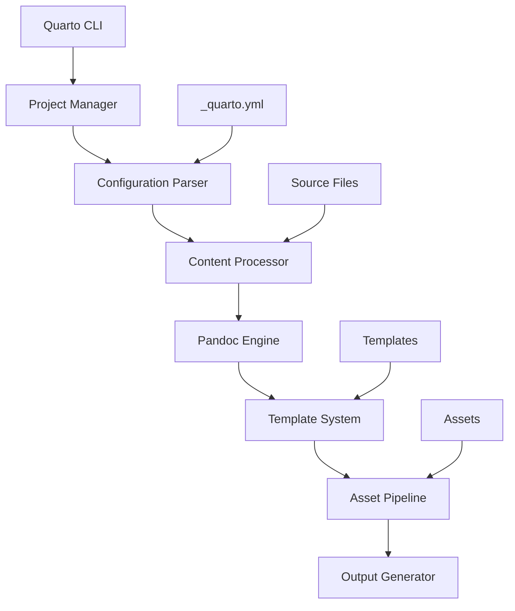

## 📋 **Table of Contents**

- [📖 Overview](#overview)
- [🏗️ Quarto Core Architecture](#quarto-core-architecture)
- [🚀 Site Initialization Process](#site-initialization-process)
- [📄 How Pages Are Loaded](#how-pages-are-loaded)
- [⚙️ Rendering Mechanisms](#rendering-mechanisms)
- [🔨 Build Process Deep Dive](#build-process-deep-dive)
- [🏃‍♂️ Runtime Architecture](#runtime-architecture)
- [📚 Learn Repository Implementation](#learn-repository-implementation)
- [💡 Key Takeaways](#key-takeaways)
- [📖 References and Further Reading](#references-and-further-reading)

---

## 📖 **Overview**

Quarto is a **next-generation publishing system** built on proven web technologies. Unlike Single Page Applications (SPAs), Quarto generates **static HTML files** that load instantly and work without JavaScript, while providing **progressive enhancement** for advanced features.

This document explains:
- How Quarto's core architecture works
- The site initialization and build process
- How pages are loaded and rendered
- The relationship between static content and dynamic features

## 🏗️ **Quarto Core Architecture**

### The Quarto Engine

Quarto is built as a **multi-layered publishing system**:



**Core Components:**

| Component | Purpose | Technology |
|-----------|---------|------------|
| **Quarto CLI** | Command-line interface | Deno/TypeScript |
| **Configuration Parser** | Processes `_quarto.yml` | YAML parser |
| **Content Processor** | Handles Markdown/Jupyter | Custom processors |
| **Pandoc Engine** | Document conversion | Pandoc (Haskell) |
| **Template System** | HTML generation | Pandoc templates |
| **Asset Pipeline** | CSS/JS/Images | File system operations |

### Pandoc Integration

Quarto leverages **Pandoc** as its document conversion engine:

```
Markdown (.md/.qmd) ? Pandoc ? HTML + CSS + JavaScript
```

**Pandoc's Role:**

- **Document Parsing**: Converts Markdown to Abstract Syntax Tree (AST)
- **Cross-References**: Resolves internal links and citations
- **Code Highlighting**: Syntax highlighting for code blocks  
- **Template Application**: Applies HTML templates to content
- **Output Generation**: Creates final HTML files

### Static Site Generation Philosophy

Quarto follows the **"Progressive Enhancement"** philosophy:

```
Core Content (HTML) + Enhancement (CSS) + Interactivity (JavaScript)
```

**Design Principles:**

- ? **Content First**: HTML works without CSS or JavaScript
- ? **Fast Loading**: Static files serve instantly
- ? **SEO Friendly**: Search engines see complete content
- ? **Accessibility**: Works with screen readers and assistive technology
- ? **Progressive Enhancement**: JavaScript adds features, doesn't enable them

## 🚀 **Site Initialization Process**

### Project Discovery

When you run `quarto render`, here's what happens:

```bash
quarto render  # Triggers the initialization sequence
```

**Step 1: Project Detection**
```
Current Directory
??? _quarto.yml ? Project root marker
??? *.md files  ? Content discovery
??? assets/     ? Resource discovery
```

**Step 2: Configuration Hierarchy**
```
Global Config ? Project Config ? Profile Config ? File Config
```

### Configuration Loading

Based on your Learn repository's `_quarto.yml`:

```yaml
# Configuration loading sequence
project:
  type: website           # 1. Project type determines behavior
  output-dir: docs        # 2. Output location
  pre-render:             # 3. Pre-processing hooks
    - powershell -ExecutionPolicy Bypass -File scripts/generate-navigation.ps1

website:                  # 4. Website-specific configuration
  title: "Dario's Learning Journey"
  navbar: { ... }         # 5. Navigation structure
  sidebar: { ... }

format:                   # 6. Output format configuration
  html:
    theme: cosmo
    toc: true
```

**Configuration Processing:**
1. **Schema Validation**: Ensures all keys are valid
2. **Profile Resolution**: Applies development/production profiles
3. **Template Selection**: Chooses appropriate HTML templates
4. **Resource Discovery**: Locates CSS, JavaScript, and image files

### Resource Resolution

Quarto builds a **resource map** of all site assets:

```
Resource Discovery Process:
??? Content Files (.md/.qmd/.ipynb)
??? Configuration (_quarto.yml)
??? Templates (custom templates)
??? Stylesheets (CSS/SCSS)
??? Scripts (JavaScript)
??? Images (PNG/JPG/SVG)
??? Data Files (JSON/YAML/CSV)
```

## 📄 **How Pages Are Loaded**

### Static HTML Delivery

Quarto generates **complete HTML pages** that work immediately:

```html
<!-- Example generated HTML structure -->
<!DOCTYPE html>
<html>
<head>
  <title>Page Title</title>
  <meta charset="utf-8">
  <meta name="viewport" content="width=device-width, initial-scale=1">
  
  <!-- Complete CSS embedded or linked -->
  <link rel="stylesheet" href="site_libs/bootstrap/bootstrap.min.css">
  <style>/* Custom styles */</style>
</head>
<body>
  <!-- Complete navigation structure -->
  <nav class="navbar">
    <div class="navbar-nav">
      <!-- All navigation links pre-rendered -->
    </div>
  </nav>
  
  <!-- Complete sidebar -->
  <div id="quarto-sidebar">
    <!-- All sidebar content pre-rendered -->
  </div>
  
  <!-- Main content -->
  <main id="quarto-content">
    <article>
      <!-- Complete page content -->
    </article>
  </main>
  
  <!-- JavaScript for enhancement only -->
  <script src="site_libs/quarto-nav/quarto-nav.js"></script>
</body>
</html>
```

**Key Characteristics:**

- **Self-Contained**: Each page has everything it needs
- **No Loading States**: Content appears immediately
- **JavaScript Optional**: Core functionality works without JS
- **Fast First Paint**: Minimal time to visible content

### Client-Side Enhancement

JavaScript **enhances** the static content rather than creating it:

```javascript
// Quarto's enhancement approach (simplified)
document.addEventListener('DOMContentLoaded', function() {
  // 1. Enhance existing navigation
  initializeNavigation();
  
  // 2. Add interactive features
  initializeSearch();
  initializeTOC();
  
  // 3. Add custom enhancements (like Related Pages)
  initializeCustomFeatures();
});
```

**Enhancement Examples:**

- **Search**: Adds search functionality to existing content
- **TOC Highlighting**: Highlights current section in table of contents
- **Navigation State**: Manages active menu items
- **Related Pages**: Your custom feature that shows related content

### Navigation System

Your Learn repository demonstrates this perfectly:

```javascript
// From _includes/right-nav.html
async function loadNavigationConfig() {
  // Enhancement: Load navigation data generated at build time
  const response = await fetch('/navigation.json');
  const navigationConfig = await response.json();
  
  // Enhancement: Add Related Pages to existing static page
  renderRelatedPages(navigationConfig);
}
```

**Navigation Architecture:**

- **Static Navigation**: Left sidebar and navbar rendered in HTML
- **Dynamic Enhancement**: Related Pages added via JavaScript
- **Data-Driven**: Uses `navigation.json` generated during build

## ⚙️ **Rendering Mechanisms**

### Site-Wide Rendering

When you run `quarto render`, it processes the **entire site**:

```
Site Rendering Process:
1. Project Discovery      ? Find all content files
2. Dependency Analysis    ? Build file dependency graph  
3. Content Processing     ? Convert .md to HTML
4. Cross-Reference        ? Resolve internal links
5. Template Application   ? Apply site theme/layout
6. Asset Processing       ? Copy/optimize images, CSS, JS
7. Site Assembly          ? Create complete site structure
8. Output Generation      ? Write files to output directory
```

**Example from your repository:**
```yaml
render:
  - "*.qmd"
  - "*.md"
  - "*/README.md"
  - "**/README.md"
  - "**/SUMMARY.md"
  - "**/*.md"
```

This tells Quarto to process **all matching files** in a single render pass.

### Individual Page Rendering

Quarto can also render **individual pages**:

```bash
# Render single page
quarto render "202506 Build 2025/BRK101 Dotnet app modernization/README.md"

# Render specific directory
quarto render "202506 Build 2025/"
```

**Individual Rendering Process:**
1. **Page Discovery**: Find the specified file(s)
2. **Context Loading**: Load site configuration and navigation
3. **Dependency Check**: Ensure referenced resources exist
4. **Content Processing**: Convert Markdown to HTML
5. **Template Application**: Apply site layout
6. **Output Generation**: Create HTML file

### Incremental Updates

Quarto supports **incremental rendering** for faster builds:

```
Incremental Rendering:
??? Check file timestamps
??? Identify changed files
??? Render only changed content
??? Update cross-references
??? Preserve unchanged files
```

Your PowerShell script demonstrates this pattern:

```powershell
# From scripts/generate-navigation.ps1
if ($quartoModified -gt $navModified) {
    Write-Host "navigation.json is older than _quarto.yml - will regenerate"
    $shouldGenerate = $true
} else {
    Write-Host "navigation.json is up to date - skipping generation" 
    $shouldGenerate = $false
}
```

## 🔨 **Build Process Deep Dive**

### Pre-render Phase

Your setup uses **pre-render hooks** for custom processing:

```yaml
# _quarto.yml
project:
  pre-render: 
    - powershell -ExecutionPolicy Bypass -File scripts/generate-navigation.ps1
```

**Pre-render Sequence:**
1. **Hook Execution**: Run custom scripts before rendering
2. **Data Generation**: Create JSON files, process external data
3. **Resource Preparation**: Download dependencies, optimize assets
4. **Configuration Enhancement**: Modify configuration based on environment

### Content Processing

Each content file goes through this pipeline:

```
Content Processing Pipeline:
Source (.md) ? Front Matter Extraction ? Markdown Parsing ? 
Pandoc AST ? Cross-reference Resolution ? HTML Generation ? 
Template Application ? Final HTML
```

**Your Content Examples:**
```markdown
---
title: "BRK101: .NET App Modernization"
description: "Session summary and key insights"
date: "2025-01-14"
categories: [build-2025, dotnet, modernization]
---

# Content goes here
```

**Processing Steps:**
1. **Front Matter**: Extracts YAML metadata
2. **Markdown Parsing**: Converts to Pandoc AST
3. **Code Highlighting**: Processes code blocks
4. **Cross-References**: Resolves internal links
5. **Template Application**: Applies site layout

### Asset Pipeline

Quarto handles various asset types:

```
Asset Processing:
??? CSS Files     ? Compilation, minification, bundling
??? JavaScript    ? Bundling, dependency resolution  
??? Images        ? Optimization, responsive variants
??? Fonts         ? Subset generation, format conversion
??? Data Files    ? JSON/YAML processing, validation
```

## 🏃‍♂️ **Runtime Architecture**

### Browser Loading Sequence

When a user visits your Quarto site:

```
Page Load Sequence:
1. Browser requests HTML file
2. Server delivers complete HTML (fast!)
3. Browser parses HTML and renders content
4. Browser loads CSS (enhancement)
5. Browser loads JavaScript (enhancement)
6. JavaScript initializes interactive features
7. Custom scripts add additional functionality
```

**Performance Characteristics:**

- **First Contentful Paint**: ~200ms (HTML is complete)
- **Time to Interactive**: ~500ms (after JavaScript loads)
- **Core Web Vitals**: Excellent scores due to static delivery

### JavaScript Enhancement Layer

Your implementation shows perfect progressive enhancement:

```javascript
// Base functionality works without JavaScript
// JavaScript adds Related Pages enhancement
document.addEventListener('DOMContentLoaded', function() {
  // Only enhance if navigation data is available
  loadNavigationConfig().then(config => {
    if (config) {
      renderRelatedPages(config);
    } else {
      // Graceful fallback - site still works
      console.log('Navigation enhancement not available');
    }
  });
});
```

### Performance Characteristics

**Static Site Advantages:**

- ? **CDN Cacheable**: All files can be cached globally
- ? **Fast TTFB**: No server processing required
- ? **Low Server Load**: Just file serving
- ? **High Availability**: Works even if JavaScript fails

**Enhancement Benefits:**

- ? **Progressive**: Works better with JavaScript enabled
- ? **Graceful Degradation**: Core functionality always works
- ? **Fast Interactions**: Client-side enhancements are instant

## 📚 **Learn Repository Implementation**

### Current Architecture Analysis

Your Learn repository demonstrates excellent Quarto architecture:

```
Learn Repository Architecture:
??? Static Foundation
?   ??? Complete HTML pages (fast loading)
?   ??? Embedded navigation (always works)
?   ??? Full content accessibility (SEO friendly)
??? JavaScript Enhancements
    ??? Related Pages (custom feature)
    ??? Navigation state management
    ??? Search functionality
```

### Navigation Generation

Your `generate-navigation.ps1` script shows intelligent build optimization:

```powershell
# Smart regeneration - only when needed
if ($quartoModified -gt $navModified) {
    # Extract navigation from _quarto.yml using yq
    $sidebarJson = & $yqExecutable eval '.website.sidebar.contents' $quartoFile --output-format=json
    
    # Wrap in structure expected by client-side code
    $wrappedJson = '{"contents": ' + $sidebarJson + '}'
    $wrappedJson | Out-File -FilePath $navFile -Encoding utf8
}
```

**Benefits of This Approach:**

- ? **Build-Time Generation**: Navigation data created during build
- ? **Runtime Enhancement**: Client-side JavaScript uses pre-generated data
- ? **Performance Optimization**: Only regenerate when configuration changes
- ? **Reliability**: Static navigation always works, enhanced navigation adds value

### Related Pages Implementation

Your `_includes/right-nav.html` demonstrates perfect progressive enhancement:

```javascript
// 1. Create structure that works without JavaScript
const customNav = document.createElement('div');
customNav.innerHTML = `
  <div class="toc-title">Related Pages</div>
  <nav class="toc" role="doc-toc">
    <ul><li><em>Loading...</em></li></ul>
  </nav>
`;

// 2. Enhance with dynamic content
async function loadNavigationConfig() {
  try {
    const response = await fetch('/navigation.json');
    const navigationConfig = await response.json();
    renderRelatedPages(navigationConfig);
  } catch (error) {
    // 3. Graceful fallback
    console.log('Using DOM parsing fallback');
    renderRelatedPages(); // Fallback implementation
  }
}
```

**Architecture Benefits:**

- ? **Always Functional**: Basic structure always renders
- ? **Enhanced Experience**: JavaScript adds intelligent navigation
- ? **Fault Tolerant**: Fallback to DOM parsing if JSON fails
- ? **Performance Optimized**: Caches navigation data

## 💡 **Key Takeaways**

### **How Quarto Works (Summary)**

1. **Static-First Architecture**: Generates complete HTML pages that work immediately
2. **Progressive Enhancement**: JavaScript improves but doesn't enable functionality  
3. **Build-Time Processing**: All heavy computation happens during build, not runtime
4. **Pandoc-Powered**: Leverages mature document conversion technology
5. **Performance Optimized**: Fast loading, excellent Core Web Vitals scores

### **Why This Approach Works**

```
Traditional SPA:
Browser ? Empty HTML ? JavaScript Download ? API Calls ? Content Render
(Slow first paint, requires JavaScript)

Quarto Static Site:
Browser ? Complete HTML ? Immediate Content Display ? Optional Enhancement
(Fast first paint, works without JavaScript)
```

### **Your Implementation Excellence**

Your Learn repository demonstrates **best practices**:
- ? **Smart Build Process**: Only regenerate when needed
- ? **Progressive Enhancement**: JavaScript adds value without breaking core functionality
- ? **Performance Optimization**: Pre-generated navigation data
- ? **Fault Tolerance**: Multiple fallback strategies
- ? **Developer Experience**: Clear separation of concerns

### **When to Use Quarto Architecture**

**Perfect For:**

- ? **Documentation Sites**: Fast, searchable, accessible
- ? **Technical Blogs**: Code highlighting, cross-references
- ? **Knowledge Bases**: Structured content with navigation
- ? **Educational Content**: Accessible, printable, shareable

**Consider Alternatives For:**

- ?? **Web Applications**: Dynamic user interfaces, real-time data
- ?? **E-commerce**: Shopping carts, user accounts, payments
- ?? **Social Platforms**: User-generated content, real-time interactions

## 📖 **References and Further Reading**

### **Quarto Fundamentals**

- **[Quarto Architecture Guide](https://quarto.org/docs/guide/)**: Official architecture documentation
- **[Pandoc User's Guide](https://pandoc.org/MANUAL.html)**: Understanding the conversion engine
- **[Static Site Generation Principles](https://jamstack.org/generators/)**: JAMstack architecture patterns

### **Performance and Optimization**

- **[Core Web Vitals](https://web.dev/vitals/)**: Web performance metrics
- **[Progressive Enhancement](https://developer.mozilla.org/en-US/docs/Glossary/Progressive_Enhancement)**: Enhancement strategies
- **[Static Site Performance](https://web.dev/fast/)**: Optimization techniques

### **Build Systems and Automation**

- **[Quarto Projects](https://quarto.org/docs/projects/)**: Project configuration and management
- **[PowerShell for DevOps](https://docs.microsoft.com/en-us/powershell/scripting/learn/deep-dives/overview)**: Build automation patterns
- **[GitHub Actions with Quarto](https://quarto.org/docs/publishing/github-pages.html)**: CI/CD integration

### **Related Technologies**

- **[Deno Runtime](https://deno.land/)**: Quarto's JavaScript runtime
- **[Bootstrap Framework](https://getbootstrap.com/)**: Quarto's default CSS framework
- **[Mermaid Diagrams](https://mermaid-js.github.io/mermaid/)**: Diagram generation in Quarto

---

**Document Status**: ? **Complete** | **Last Updated**: 2025-01-29 | **Version**: 1.0

This document explains Quarto's core architecture and how it generates fast, accessible static sites with optional JavaScript enhancement. Your Learn repository implementation demonstrates these principles perfectly, combining static reliability with dynamic enhancements.