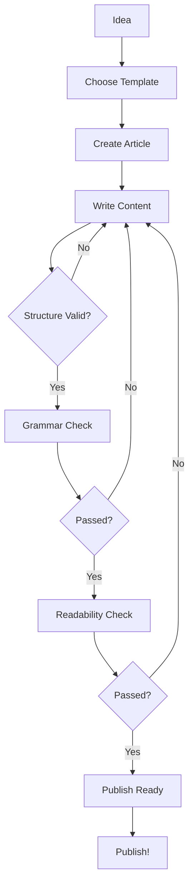
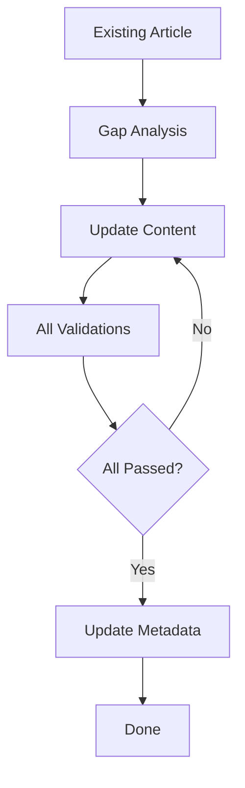

# IQPilot Getting Started

## Table of Contents

- [Prerequisites](#prerequisites)
- [Installation](#installation)
- [Quick Start](#quick-start)
- [Core Concepts](#core-concepts)
- [Using IQPilot](#using-iqpilot)
- [MCP Tools Reference](#mcp-tools-reference)
- [Workflows](#workflows)
- [Configuration](#configuration)
- [Use Cases](#use-cases)
- [Troubleshooting](#troubleshooting)

## Prerequisites

### Required

✅ **Visual Studio Code** (v1.85.0 or later)  
Download: https://code.visualstudio.com/

✅ **GitHub Copilot** (Active subscription)  
- GitHub Copilot extension installed in VS Code
- Logged in with GitHub account that has Copilot access

✅ **.NET 8.0 SDK**  
Download: https://dotnet.microsoft.com/download/dotnet/8.0

### Optional but Recommended

📦 **Git** - For version control and repository management  
📦 **PowerShell** - For running automation scripts (Windows: pre-installed)  
📦 **Quarto/Jekyll/Hugo/MkDocs** - If you're using a static site generator

## Installation

### Step 1: Verify Prerequisites

```powershell
# Check .NET version
dotnet --version  # Should show 8.0.x

# Check VS Code version
code --version  # Should show 1.85.0 or later

# Verify GitHub Copilot
# Open VS Code → Extensions → Search "GitHub Copilot" → Should show "Installed"
```

### Step 2: Add IQPilot to Your Repository

There are two ways to add IQPilot to your documentation repository:

#### Option A: From Template (Recommended for New Projects)

```bash
# Clone IQPilot template repository
git clone https://github.com/diginsight/iqpilot.git iqpilot

cd your-docs
```

#### Option B: Add to Existing Repository

```bash
cd your-existing-docs

# Create IQPilot structure
mkdir -p .iqpilot/{config,templates,prompts,logs}
mkdir -p .github/{prompts,templates,instructions}
mkdir -p .copilot/{context,scripts,mcp-servers/iqpilot}
```

Download configuration files:
- `.iqpilot/config.default.json` - Framework defaults
- `.iqpilot/config.json` - Your site-specific configuration

### Step 3: Build IQPilot MCP Server

```powershell
# Navigate to IQPilot source
cd src/IQPilot

# Build the MCP server
dotnet build --configuration Release

# Copy to MCP servers directory
Copy-Item bin/Release/net8.0/* .copilot/mcp-servers/iqpilot/ -Recurse

# Verify installation
ls .copilot/mcp-servers/iqpilot/iqpilot.exe  # Should exist
```

### Step 4: Configure GitHub Copilot

Create or update `.github/copilot-instructions.md`:

```markdown
# GitHub Copilot Instructions for [Your Site Name]

## IQPilot Integration

This repository uses IQPilot for AI-assisted content development.

### Dual Metadata Structure
- Top YAML: Document properties (title, author, date)
- Bottom YAML in HTML comment: article additional metadata
- Never modify top YAML with validation prompts
- Always update bottom YAML after validation

### Editorial Standards
[Your specific standards here]
```

### Step 5: Reload VS Code

Press `Ctrl+Shift+P` → Type "Developer: Reload Window" → Enter

### Step 6: Verify Installation

Open GitHub Copilot Chat and try:

```
@workspace Are IQPilot tools available?
```

Copilot should recognize IQPilot tools and describe them.

## Quick Start

### Your First Article

1. **Create article from template:**

```markdown
# Open Copilot Chat
Ask: "Create a new technical article about Docker containers"

# IQPilot will:
# 1. Use article template
# 2. Generate initial content
# 3. Initialize metadata structure
```

2. **Write your content** (or let Copilot assist)

3. **Validate as you write:**

```
# In Copilot Chat:
"Run structure validation on this article"
"Check grammar and readability"
"Analyze for content gaps"
```

4. **Pre-publish check:**

```
"Run publish-ready check"
```

5. **Publish!** Your article is validated and ready.

### Rename an Article

IQPilot automatically syncs metadata when you rename files:

1. Right-click article in Explorer → Rename (or press F2)
2. Type new name
3. Press Enter

✅ IQPilot automatically updates `article_metadata.filename` in bottom YAML  
✅ Last modified timestamp updated  
✅ File watching logged

## Core Concepts

### 1. Dual Metadata Architecture

Every article has **two metadata blocks**:

#### Top YAML (Visible, For Rendering)

```yaml
---
title: "Article Title"
author: "Your Name"
date: "2025-11-22"
categories: [tech, tutorial]
description: "SEO-friendly description"
---
```

**Purpose:** Used by Quarto/Jekyll/Hugo for site generation  
**Modified by:** You (manually)  
**Visibility:** Visible in source, used for rendering

#### Bottom YAML (Hidden, For Validation)

```html
<!-- 
---
validations:
  grammar:
    last_run: "2025-11-22"
    outcome: "passed"
  readability:
    flesch_score: 65.2
    grade_level: 9
article_metadata:
  filename: "article.md"
  word_count: 1500
  last_updated: "2025-11-22"
cross_references:
  related_articles:
    - "related-article-1.md"
---
-->
```

**Purpose:** Tracks validation results, analytics, cross-references  
**Modified by:** IQPilot validation tools + FileWatcherService  
**Visibility:** **Completely hidden** when article is rendered (wrapped in HTML comment)

### 2. MCP Tools

IQPilot provides **16 specialized tools** via Model Context Protocol:

| Category | Tools | Count |
|----------|-------|-------|
| Metadata | get, update, validate | 3 |
| Validation | grammar, readability, structure, all | 4 |
| Content | create, analyze_gaps, find_related, publish_ready | 4 |
| Workflow | article_creation, review, series_planning | 3 |

Tools are invoked naturally through Copilot chat - no need to remember exact names.

### 3. Event Coordination

IQPilot watches for file changes from multiple sources:

```
.NET FileSystemWatcher → EventCoordinator ← VS Code Extension
                              ↓
                    Deduplication (500ms window)
                              ↓
                    MetadataManager (sync metadata)
```

This ensures metadata stays synchronized without double-processing events.

### 4. Configuration-Driven Behavior

All IQPilot behavior is controlled by `.iqpilot/config.json`:

```json
{
  "site": { "name": "Your Docs", "type": "documentation" },
  "validation": {
    "readability": { "targetGradeLevel": 9 }
  },
  "templates": { "directory": ".iqpilot/templates" }
}
```

This allows IQPilot to work with **any documentation repository** - it's a tool that adapts to your needs, not a framework you must conform to.

## Using IQPilot

### Interacting with IQPilot

IQPilot tools are accessed through **GitHub Copilot Chat**. There are three ways to interact:

#### Method 1: Natural Language (Recommended)

Simply describe what you want in natural language:

```
Check this article for grammar errors
```

```
Analyze readability of current file
```

```
Validate the structure and find any gaps
```

Copilot will recognize the intent and invoke appropriate IQPilot tools.

#### Method 2: Explicit Tool Requests

Request specific tools by name:

```
Run the grammar validation tool on this article
```

```
Use the publish-ready tool to check if this is ready
```

```
Run structure validation
```

#### Method 3: Workflow Commands

Use workflow-level commands for guided processes:

```
Guide me through creating a new article
```

```
Start article review workflow for this file
```

```
Help me plan an article series about [topic]
```

### Common Tasks

#### Creating Content

**Start a New Article:**
```
Create a new how-to guide about [topic]
```

IQPilot will:
1. Select appropriate template (how-to-template.md)
2. Generate initial structure
3. Fill in metadata blocks
4. Suggest outline based on topic

**From Existing Outline:**
```
Convert this outline into a full article:
- Introduction
- Prerequisites
- Steps
- Troubleshooting
```

#### Validating Content

**Quick Grammar Check:**
```
Check grammar and spelling
```

**Comprehensive Validation:**
```
Run all validations on this article
```

This runs:
- Grammar & spelling
- Readability analysis
- Structure validation
- Outputs detailed report

**Target Audience Validation:**
```
Check if this article is appropriate for intermediate developers
```

#### Analyzing Content

**Find Content Gaps:**
```
What's missing from this article?
```

IQPilot analyzes:
- Missing sections (prerequisites, examples, troubleshooting)
- Incomplete explanations
- Missing code examples for technical content
- Lack of visual aids for complex topics

**Discover Related Articles:**
```
Find articles related to this topic
```

IQPilot searches:
- Same categories/tags
- Similar keywords
- Cross-references
- Topic clusters

#### Pre-Publication

**Publish-Ready Check:**
```
Is this article ready to publish?
```

Comprehensive check includes:
- ✅ All validations passed
- ✅ Metadata complete
- ✅ Structure valid
- ✅ References present
- ✅ Code examples tested (if applicable)

Returns detailed checklist with pass/fail for each criterion.

### Working with Metadata

#### View Metadata

```
Show me the article additional metadata
```

Returns parsed bottom YAML with:
- Validation history
- Quality metrics
- Cross-references
- Analytics data

#### Update Metadata Manually

Rarely needed (IQPilot auto-updates), but available:

```
Update metadata: set word count to 2500
```

#### Validate Metadata Structure

```
Check if metadata structure is valid
```

Validates:
- Required sections present
- Field types correct
- Timestamps valid
- No orphaned fields

### File Watching

IQPilot automatically watches for file changes:

**What's Monitored:**
- ✅ File renames
- ✅ File moves
- ✅ File creates
- ✅ File deletes

**What's Synchronized:**
- ✅ `article_metadata.filename` updated on rename
- ✅ `article_metadata.last_updated` timestamp
- ✅ Related cross-references updated

**No Manual Action Required** - Everything happens automatically!

## MCP Tools Reference

### Metadata Tools

#### `iqpilot/metadata/get`
**Purpose:** Retrieve metadata from article  
**Usage:** `"Show metadata for this file"`  
**Returns:** JSON with validations, article_metadata, cross_references

#### `iqpilot/metadata/update`
**Purpose:** Update specific metadata fields  
**Usage:** `"Update metadata field X to Y"`  
**Arguments:** 
- `filePath`: Article file path
- `updates`: Dictionary of field updates

#### `iqpilot/metadata/validate`
**Purpose:** Validate metadata structure  
**Usage:** `"Validate metadata structure"`  
**Returns:** `{ valid: true/false, errors: [...] }`

### Validation Tools

#### `iqpilot/validate/grammar`
**Purpose:** Check grammar, spelling, punctuation  
**Usage:** `"Check grammar"`  
**Returns:** 
```json
{
  "passed": true/false,
  "issues_found": 3,
  "issues": ["Issue 1", "Issue 2"],
  "timestamp": "2025-11-22T10:30:00Z"
}
```

#### `iqpilot/validate/readability`
**Purpose:** Analyze readability metrics  
**Usage:** `"Check readability"`  
**Returns:**
```json
{
  "passed": true/false,
  "metrics": {
    "flesch_score": 65.3,
    "grade_level": 9.2,
    "target_flesch_min": 60,
    "target_grade_max": 10
  }
}
```

#### `iqpilot/validate/structure`
**Purpose:** Validate document structure  
**Usage:** `"Validate structure"`  
**Checks:**
- TOC present
- Required sections (Introduction, Conclusion, References)
- Heading hierarchy valid
- No heading level skips

#### `iqpilot/validate/all`
**Purpose:** Run all validations  
**Usage:** `"Run all validations"`  
**Returns:** Combined results from grammar, readability, structure

### Content Tools

#### `iqpilot/content/create`
**Purpose:** Create new article from template  
**Usage:** `"Create new article about [topic]"`  
**Arguments:**
- `templateName`: article, howto, tutorial, etc.
- `title`: Article title
- `author`: Author name
- `outputPath`: Where to create file

#### `iqpilot/content/analyze_gaps`
**Purpose:** Identify missing content  
**Usage:** `"What's missing from this article?"`  
**Returns:**
```json
{
  "gaps": [
    "Missing practical examples",
    "No troubleshooting section",
    "Missing visual aids"
  ],
  "suggestions": [
    "Add code examples",
    "Include common error scenarios"
  ]
}
```

#### `iqpilot/content/find_related`
**Purpose:** Find related articles  
**Usage:** `"Find related articles"`  
**Returns:**
```json
{
  "related": [
    {
      "filePath": "related-article.md",
      "title": "Related Topic",
      "similarity": 0.85
    }
  ]
}
```

#### `iqpilot/content/publish_ready`
**Purpose:** Comprehensive pre-publish check  
**Usage:** `"Is this ready to publish?"`  
**Returns:**
```json
{
  "ready": true/false,
  "validations": { /* all validation results */ },
  "metadata": { "valid": true/false },
  "checklist": [
    { "item": "Grammar check", "passed": true },
    { "item": "Readability check", "passed": true },
    { "item": "Structure validation", "passed": true },
    { "item": "Metadata complete", "passed": true }
  ]
}
```

### Workflow Tools

#### `iqpilot/workflow/article_creation`
**Purpose:** Guided article creation workflow  
**Usage:** `"Guide me through creating an article"`  
**Steps:**
1. Select template
2. Initialize metadata
3. Create initial structure
4. Validate as you write
5. Pre-publish check

#### `iqpilot/workflow/review`
**Purpose:** Guided review workflow  
**Usage:** `"Review this article"`  
**Steps:**
1. Structure validation
2. Grammar check
3. Readability analysis
4. Publish readiness check

#### `iqpilot/workflow/series_planning`
**Purpose:** Plan multi-article series  
**Usage:** `"Help me plan a series about [topic]"`  
**Returns:**
- Existing related articles
- Suggested topics for series
- Prerequisites and dependencies
- Recommended order

## Workflows

### New Article Workflow



**Commands:**
1. `"Create new article about [topic]"` → Template + structure
2. Write content (with Copilot assistance)
3. `"Validate structure"` → Check organization
4. `"Check grammar"` → Fix language issues
5. `"Check readability"` → Adjust complexity
6. `"Run publish-ready check"` → Final validation
7. Commit and publish!

### Content Review Workflow



**Commands:**
1. `"Analyze gaps in this article"` → Identify missing content
2. Update based on recommendations
3. `"Run all validations"` → Comprehensive check
4. Fix any issues
5. `"Update last reviewed date"` → Mark as current

### Series Planning Workflow

1. `"Plan article series about [topic]"` → Get suggestions
2. Review existing related articles
3. Identify gaps in coverage
4. Create outline for series
5. Generate articles one by one
6. `"Validate series consistency"` → Check prerequisites, progression

## Configuration

### Site Configuration

`.iqpilot/config.json` - Your site-specific settings:

```json
{
  "site": {
    "name": "Your Documentation Site",
    "type": "documentation",  // or "learning", "wiki", "blog"
    "author": "Your Name",
    "repository": "https://github.com/you/repo",
    "editorialStandards": ".github/copilot-instructions.md"
  }
}
```

### Validation Configuration

```json
{
  "validation": {
    "grammar": {
      "enabled": true,
      "autoFix": false
    },
    "readability": {
      "enabled": true,
      "targetGradeLevel": 9,
      "fleschScoreMin": 60,
      "fleschScoreMax": 80
    },
    "structure": {
      "enabled": true,
      "requireTOC": true,
      "requireIntroduction": true,
      "requireConclusion": true,
      "requireReferences": true
    },
    "facts": {
      "enabled": true,
      "requireSources": true
    }
  }
}
```

### Template Configuration

```json
{
  "templates": {
    "directory": ".iqpilot/templates",
    "useDefaults": true,
    "customTemplates": [
      {
        "name": "api-reference",
        "file": "api-reference-template.md",
        "description": "API endpoint documentation"
      }
    ]
  }
}
```

### Workflow Configuration

```json
{
  "workflows": {
    "autoValidateOnSave": true,
    "autoSyncMetadata": true,
    "requirePublishCheck": true
  }
}
```

### File Patterns

```json
{
  "filePatterns": {
    "articles": "**/*.md",
    "exclude": [
      "**/node_modules/**",
      "**/README.md",
      "**/.git/**"
    ]
  }
}
```

## Use Cases

### 1. Technical Documentation Repository

**Scenario:** Product documentation with API references, tutorials, and guides

**IQPilot Setup:**
```json
{
  "site": { "type": "documentation" },
  "validation": {
    "structure": { "requireTOC": true },
    "facts": { "requireSources": true }
  },
  "templates": {
    "customTemplates": [
      { "name": "api-endpoint", "file": "api-template.md" },
      { "name": "sdk-guide", "file": "sdk-template.md" }
    ]
  }
}
```

**Workflow:**
1. Create API docs from template
2. Validate code examples work
3. Check cross-references to related endpoints
4. Ensure prerequisites documented
5. Publish-ready check before deployment

### 2. Online Learning Platform

**Scenario:** Tutorial series for learning programming

**IQPilot Setup:**
```json
{
  "site": { "type": "learning" },
  "validation": {
    "readability": { "targetGradeLevel": 8 },
    "understandability": { "enabled": true }
  },
  "workflows": {
    "seriesValidation": true
  }
}
```

**Workflow:**
1. Plan series with prerequisite tracking
2. Create tutorials from template
3. Validate understandability for beginners
4. Check progressive complexity
5. Validate series consistency

### 3. Internal Company Wiki

**Scenario:** Team knowledge base with procedures, troubleshooting, best practices

**IQPilot Setup:**
```json
{
  "site": { "type": "wiki" },
  "validation": {
    "grammar": { "autoFix": true },
    "structure": { "requireTOC": false }
  },
  "workflows": {
    "autoValidateOnSave": true
  }
}
```

**Workflow:**
1. Quick capture with issue template
2. Auto-validate on save
3. Find related internal docs
4. Tag for discovery
5. Review cycle every 6 months

### 4. Personal Knowledge Base

**Scenario:** Research notes, conference summaries, idea development

**IQPilot Setup:**
```json
{
  "site": { "type": "personal" },
  "validation": {
    "structure": { "requireReferences": false },
    "readability": { "enabled": false }
  },
  "templates": {
    "customTemplates": [
      { "name": "conference-notes", "file": "conference-template.md" },
      { "name": "research-idea", "file": "idea-template.md" }
    ]
  }
}
```

**Workflow:**
1. Quick capture during conference
2. Gap analysis to identify incomplete thoughts
3. Connect related ideas
4. Evolve notes into full articles
5. Publish externally when ready

### 5. Customer-Facing Support Docs

**Scenario:** Product wiki, FAQs, troubleshooting guides for customers

**IQPilot Setup:**
```json
{
  "site": { "type": "support" },
  "validation": {
    "readability": { "targetGradeLevel": 7 },
    "facts": { "requireSources": false },
    "understandability": { "targetAudience": "non-technical" }
  }
}
```

**Workflow:**
1. Create from FAQ or issue template
2. Validate for non-technical audience
3. Check readability (target: grade 7)
4. Ensure step-by-step instructions clear
5. Publish-ready with customer lens

## Troubleshooting

### IQPilot Tools Not Available

**Symptom:** Copilot doesn't recognize IQPilot tools

**Solutions:**
1. Verify MCP server built: `ls src/IQPilot/bin/Release/net8.0/iqpilot.exe`
2. Check GitHub Copilot connected: Status bar should show Copilot icon
3. Reload VS Code: `Ctrl+Shift+P` → "Developer: Reload Window"
4. Check logs: `.iqpilot/logs/iqpilot.log`

### Metadata Not Syncing

**Symptom:** Filename field in bottom YAML not updated after rename

**Solutions:**
1. Check FileWatcher running: Look for process `iqpilot.exe`
2. Verify file is `*.md`: Only Markdown files monitored
3. Check metadata format: Must be in HTML comment `<!-- \n---\nYAML\n---\n-->`
4. Review logs: `.iqpilot/logs/iqpilot.log` for errors

### Validation Results Not Updating

**Symptom:** Bottom YAML shows old validation results

**Solutions:**
1. Ensure validation completed: Check Copilot chat for results
2. Verify bottom YAML exists: Look for HTML comment at end of file
3. Check file permissions: Ensure IQPilot can write to file
4. Manual update: `"Update metadata for last validation"`

### Build Errors

**Symptom:** `dotnet build` fails

**Solutions:**
1. Restore packages: `dotnet restore`
2. Clean build: `dotnet clean && dotnet build`
3. Check .NET version: `dotnet --version` (must be 8.0+)
4. Review error messages for missing dependencies

### Slow Performance

**Symptom:** Validation takes too long

**Solutions:**
1. Check file size: Large files take longer
2. Disable auto-validate on save if too frequent
3. Run specific validations instead of "all"
4. Check system resources: Ensure sufficient CPU/memory

## Next Steps

Now that you understand how to use IQPilot, explore:

- **[IQPilot Implementation Details](03.%20IQPilot%20Implementation%20details.md)** - Deep dive into architecture and file structure
- **[IQPilot Overview](01.%20IQPilot%20overview.md)** - Review core concepts and philosophy

## Summary

**Installation:**
1. Prerequisites: VS Code + GitHub Copilot + .NET 8
2. Build MCP server: `dotnet build`
3. Configure: `.iqpilot/config.json`
4. Reload VS Code

**Usage:**
- Interact via natural language in Copilot chat
- 16 MCP tools for validation, content, workflows
- Automatic metadata sync on file changes
- Configuration-driven for any repository type

**Key Features:**
- Dual metadata (visible + hidden)
- Comprehensive validation suite
- Intelligent content analysis
- Guided workflows
- Repository-agnostic tool design

**Common Commands:**
- `"Check grammar"` - Grammar validation
- `"Run all validations"` - Comprehensive check
- `"What's missing?"` - Gap analysis
- `"Is this ready to publish?"` - Pre-publish check
- `"Find related articles"` - Discovery

**The Tool Mindset:**
Use IQPilot like you use ESLint or test runners - invoke when you need quality checks, configure to your standards, integrate into your workflow. It's there when you need it, transparent when you don't.

Start creating high-quality content with IQPilot today! 🚀

---

<!-- 
---
validations:
  grammar:
    last_run: "2025-11-22"
    model: "claude-sonnet-4"
    tool: "manual-review"
    outcome: "passed"
    issues_found: 0
  readability:
    last_run: "2025-11-22"
    model: "claude-sonnet-4"
    tool: "manual-review"
    outcome: "passed"
    flesch_score: 58.5
    grade_level: 11
  structure:
    last_run: "2025-11-22"
    model: "claude-sonnet-4"
    tool: "manual-review"
    outcome: "passed"
    has_toc: true
    has_introduction: true
    has_conclusion: true
    has_references: false

article_metadata:
  filename: "02. IQPilot Getting started.md"
  created_date: "2025-11-22"
  last_updated: "2025-11-22"
  word_count: 4200
  estimated_reading_time: "21 min"
  article_type: "tutorial"

cross_references:
  related_articles:
    - "01. IQPilot overview.md"
    - "03. IQPilot Implementation details.md"
  topics:
    - "installation"
    - "configuration"
    - "mcp tools"
    - "workflows"
    - "validation"
---
-->
