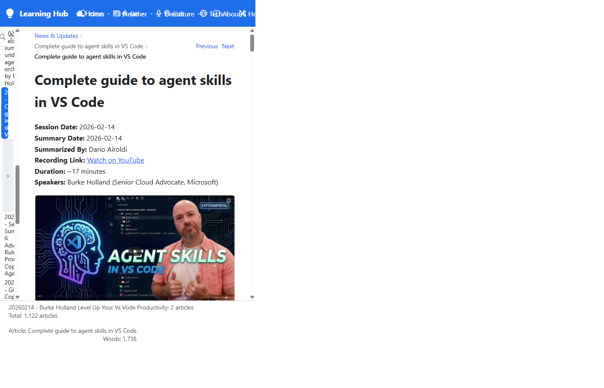
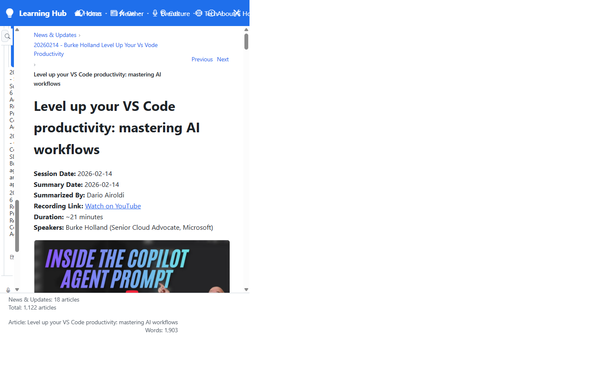
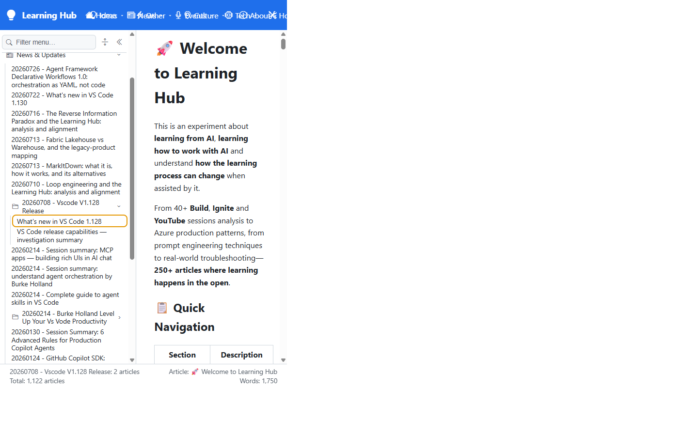
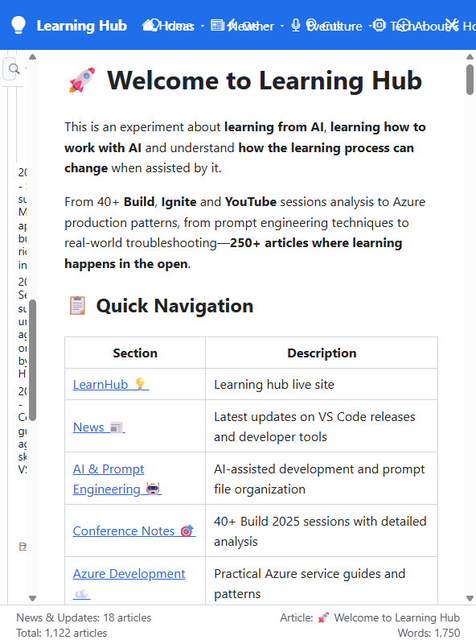
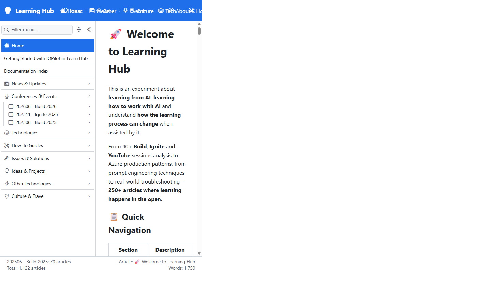

# Validation sequence — navbar status-bar section counter

Validates the fix for the footer **section counter** priority. The footer's section line must resolve by priority:

1. the section of the item **hovered / marked for selection** (a folder shows its own count; an article shows its containing folder), then
2. the folder of the **selected (navigated) article** as the baseline.

Before the fix, the selected article re-asserted its section on every re-render and clobbered the hover, so the count shown was wrong.

## Environment

| Field | Value |
|---|---|
| URL | <http://localhost:5280/> |
| Build | `dotnet build` (Debug, net10.0) — succeeded, 0 errors |
| Browser | Visible browser window (headed), driven to reproduce and capture |
| Date | 2026-07-26 |

## Sequence and results

| # | Precondition (selected article) | Action | Expected footer section line | Observed | Result |
|---|---|---|---|---|---|
| 1 | `20260214 - Complete guide to agent skills` (a **direct child** of *News & Updates*) → baseline `News & Updates: 18` | Hover the **`20260214 - Burke Holland Level Up…`** folder | `20260214 - Burke Holland Level Up Your Vs Vode Productivity: 2 articles` | `…Burke Holland…: 2 articles` | ✅ PASS |
| 2 | `Level up your VS Code productivity…` (a **child of the Burke Holland folder**) → baseline `Burke Holland…: 2` | Hover the **`20260124 - GitHub Copilot SDK…`** article (a direct child of *News & Updates*) | `News & Updates: 18 articles` | `News & Updates: 18 articles` | ✅ PASS |
| 3 | Same as #2, hover active (`News & Updates: 18`) | Move the pointer **off** the hovered item | Reverts to the selected article's folder: `Burke Holland…: 2 articles` | `…Burke Holland…: 2 articles` | ✅ PASS |

## Evidence

| Step | Screenshot |
|---|---|
| **1 — Hovering a folder shows the folder's own count.** The selected article (`Complete guide to agent skills`) belongs to *News & Updates* (baseline 18), yet hovering the `Burke Holland` folder correctly shows the folder's own count (2). Previously this snapped back to `News & Updates: 18`. |  |
| **2 — Hovering an article shows its containing section.** The selected article is a **child of the Burke Holland folder** (breadcrumb: *News & Updates › Burke Holland… › Level up your VS Code productivity*, baseline 2), yet hovering the `GitHub Copilot SDK` article (a direct child of *News & Updates*) correctly shows `News & Updates: 18`. Previously this stayed stuck on `Burke Holland: 2`. |  |
| **3 — Leaving the hover reverts to the selected article's folder.** With the pointer moved off the hovered item, the footer reverts to the selected article's folder (`Burke Holland…: 2`). |  |

## Round 2 — Keyboard focus (mark-for-selection) reports the item's own section

A follow-up defect: **keyboard-marking an article** (the focus box, "marking for selection") did not update the footer, because the article leaf `<li>` wired `@onmouseover` / `@onmouseleave` / `@onfocusout` but was **missing `@onfocusin`** (the folder `
` had it, articles did not). So marking an article kept whatever section was shown last. Fix: add `@onfocusin="OnPointerEnter"` to the article, mirroring the folder summary.

### Sequence and results

| # | Precondition | Action | Expected footer section line | Observed | Result |
|---|---|---|---|---|---|
| 4 | *News & Updates* expanded, `20260708 - Vscode V1.128 Release` subfolder expanded | **Mark for selection (keyboard-focus)** the nested article `What's new in VS Code 1.128` | Its parent subfolder: `20260708 - Vscode V1.128 Release: 2 articles` | `20260708 - Vscode V1.128 Release: 2 articles` | ✅ PASS |
| 5 | Coming from #4 (a nested 1.128 child was marked) | Mark for selection the direct *News & Updates* child `20260214 - Session summary: understand agent orchestration…` | Restores `News & Updates: 18 articles` | `News & Updates: 18 articles` | ✅ PASS |

### Evidence

| Step | Screenshot |
|---|---|
| **4 — Marking a nested article shows its immediate subfolder.** The article `What's new in VS Code 1.128` (inside the `20260708 - Vscode V1.128 Release` subfolder) is marked for selection (focus box); the footer now shows the subfolder's own count `2`, not the grandparent `News & Updates`. |  |
| **5 — Marking a direct News child restores its section.** After marking the nested 1.128 child, marking the direct *News & Updates* child `Session summary: understand agent orchestration` restores `News & Updates: 18 articles` in the footer. |  |

## Round 3 — Folder counts self-heal after cold-start warm-up

A nested sub-folder (`202506 - Build 2025`, inside *Conferences & Events*) showed **`0 articles`** and never updated. Root cause: the server computes recursive folder counts in a **background warm-up**; a sub-level fetched by the client *during* that walk was cached with the not-yet-computed count (rendered as `0`), and the client's cold-start convergence only re-fetched the **root** level — never open sub-levels. Fix: when root counts converge, broadcast a refresh so every open section re-fetches its child level (`SidebarState.RequestCountsRefresh` → `DynNavNode.OnRefreshCounts`).

### Sequence and results

| # | Precondition | Action | Expected footer section line | Observed | Result |
|---|---|---|---|---|---|
| 6 | Fresh page load **during** the server's cold-start warm-up; *Conferences & Events* expanded | Mark `202506 - Build 2025` immediately (before counts computed) | Transiently `0`, then self-heals to the true count once the walk finishes | `0 articles` for ~18 s, then `202506 - Build 2025: 70 articles` | ✅ PASS |
| 7 | Counts converged (warm-up finished) | Mark `202506 - Build 2025` | `202506 - Build 2025: 70 articles` (matches server `/_nav/children` count) | `202506 - Build 2025: 70 articles` | ✅ PASS |

### Evidence

| Step | Screenshot |
|---|---|
| **6–7 — The folder count self-heals to its true value.** After the background warm-up finishes, the open *Conferences & Events* section re-fetches its level and `202506 - Build 2025` updates from `0` to `70 articles` (footer), matching the server-computed count. |  |

## Notes

- The functional signal validated is the footer's **section line text**; each observed value above was read directly from the live DOM and matched the expectation exactly.
- The automated capture window rendered in responsive **rail** mode for some frames (narrow sidebar); this does not affect the validated behavior — the footer (the element under test) is correct in every case, and the article breadcrumbs corroborate the selected-article precondition.
