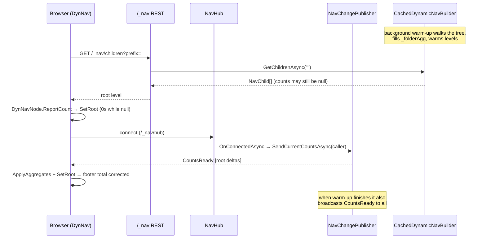
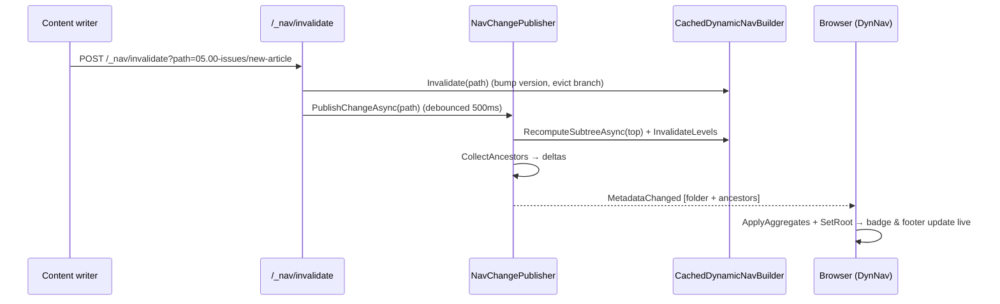

# Navigation pane load and status-bar update — specification

This document specifies how the Learn.Web navigation pane is built and kept up to date, and how
the footer status-bar article total is updated. It covers four flows:

1. How files and folders are fetched **server-side**.
2. How files and folders are fetched **client-side**.
3. How the navigation data is **received from the server to the client**.
4. How the **status bar is updated** when folder metadata is received.

## Table of contents

- [Components at a glance](#components-at-a-glance)
- [1. Server-side fetch of files and folders](#1-server-side-fetch-of-files-and-folders)
- [2. Client-side fetch of files and folders](#2-client-side-fetch-of-files-and-folders)
- [3. Transport: server → client](#3-transport-server--client)
- [4. Status-bar update on folder metadata](#4-status-bar-update-on-folder-metadata)
- [End-to-end sequences](#end-to-end-sequences)
- [Key types](#key-types)
- [Failure and edge cases](#failure-and-edge-cases)
- [Conclusion](#conclusion)

---

## Components at a glance

| Layer | Component | Responsibility |
|---|---|---|
| Content source | [FileSystemContentSource](src/Learn.Web/ContentSources/FileSystemContentSource.cs) / [BlobContentSource](src/Learn.Web/ContentSources/BlobContentSource.cs) (wrapped by [CachedContentSource](src/Learn.Web/ContentSources/CachedContentSource.cs)) | Enumerate one storage level; read a file's leading frontmatter |
| Nav builder | [DynamicNavBuilder](src/Learn.Web/Navigation/DynamicNavBuilder.cs) | Build one menu level; compute recursive folder aggregates |
| Nav cache | [CachedDynamicNavBuilder](src/Learn.Web/Navigation/CachedDynamicNavBuilder.cs) | SmartCache decorator; version; warm-up; path-scoped invalidation |
| REST API | [NavEndpoints](src/Learn.Web/Endpoints/NavEndpoints.cs) | `/_nav/children`, `/_nav/version`, `/_nav/index`, `/_nav/invalidate` |
| Live push (server) | [NavHub](src/Learn.Web/Navigation/NavHub.cs) + [NavChangePublisher](src/Learn.Web/Navigation/NavChangePublisher.cs) | SignalR hub broadcasting absolute folder aggregates |
| Live push (client) | [NavHubClient](src/Learn.Web.Client/NavHubClient.cs) | WASM SignalR client; raises `MetadataChanged` / `CountsReady` |
| Client provider | [HttpNavProvider](src/Learn.Web.Client/HttpNavProvider.cs) | Fetch one level per prefix; in-memory task cache; apply pushed aggregates |
| UI (tree) | [DynNav](src/Learn.Web.Client/Layout/DynNav.razor.cs) + [DynNavNode](src/Learn.Web.Client/Layout/DynNavNode.razor.cs) | Render the tree; report subtree counts upward |
| UI (footer) | [MainLayout](src/Learn.Web.Client/Layout/MainLayout.razor.cs) + [NavStats](src/Learn.Web.Shared/Navigation/NavStats.cs) | Render and aggregate the status-bar total |

The same [INavProvider](src/Learn.Web.Shared/Navigation/INavProvider.cs) abstraction is used during
server prerender (in-process, no HTTP) and in the browser (HTTP), so the tree renders identically in
both phases.

---

## 1. Server-side fetch of files and folders

### 1.1 Content enumeration (one level at a time)

The lowest layer is [IContentLister](src/Learn.Web.Shared/Navigation/IContentLister.cs), implemented
by the active content source:

- `ListChildrenAsync(prefix)` returns the immediate children of a folder as
  `ChildEntry(Name, IsFolder, Path)` — **one level only**, never recursive.
- `ReadHeadAsync(key)` reads only the **leading frontmatter/header** of a file (not a full download),
  so classification is cheap.

In development the source is [FileSystemContentSource](src/Learn.Web/ContentSources/FileSystemContentSource.cs)
(reads the local repo clone with an OWASP path-traversal guard); in production it is
[BlobContentSource](src/Learn.Web/ContentSources/BlobContentSource.cs). Both are wrapped by
[CachedContentSource](src/Learn.Web/ContentSources/CachedContentSource.cs).

### 1.2 Building one menu level

[DynamicNavBuilder](src/Learn.Web/Navigation/DynamicNavBuilder.cs) turns raw children into menu
nodes on demand. `GetChildrenAsync(prefix)` → `BuildLevelAsync(prefix)`:

1. List the level via `lister.ListChildrenAsync(prefix)`.
2. Skip excluded names and root infrastructure folders (`src`, `deploy`, `99.00-temp`, …) via
   [NavRules](src/Learn.Web.Shared/Navigation/NavRules.cs).
3. For each **folder**: read its optional `metadata.yml` ([FolderMeta](src/Learn.Web.Shared/Navigation/FolderMeta.cs));
   honor `hidden`; classify it with `ClassifyFolderAsync`.
4. For each **markdown file** (non-index): read the head, parse frontmatter
   ([FrontMatter](src/Learn.Web.Shared/Navigation/FrontMatter.cs)), honor `hidden`, resolve the title.
5. Sort (numeric-prefix group, then explicit `metadata.yml` order, then name), insert **Home** at the
   root, return `NavChild[]`.

`ClassifyFolderAsync` decides each folder's shape:

- **Section** — has sub-folders or more than one article → renders with a chevron and an article count.
- **Collapsed single link** — exactly one article (or only an index/readme) → renders as one article link.
- **Nothing** — no publishable content.

### 1.3 Recursive folder counts (the aggregate that feeds the badge and the footer)

A section's `ArticleCount` is the **recursive** number of articles in its subtree. This is not known
from a single level, so `DynamicNavBuilder` keeps a `_folderAgg` dictionary
`prefix → (Count, Latest)` filled by a tree walk:

- `GetIndexAsync()` → `WalkAsync("")` walks the **whole tree**, filling every `_folderAgg` entry.
- `RecomputeSubtreeAsync(prefix)` → `WalkAsync(prefix)` walks **one branch** only (used after a change).

`ClassifyFolderAsync` reads `_folderAgg` (via `FolderAggregate`) to override the `metadata.yml`
count seed with the true computed value. **Until the walk has run, a section's count is the
`metadata.yml` seed or `null`** — this is the crux of the cold-start behaviour in flow 4.

### 1.4 Caching, versioning, and startup warm-up

[CachedDynamicNavBuilder](src/Learn.Web/Navigation/CachedDynamicNavBuilder.cs) decorates the builder
with Diginsight SmartCache:

- Levels are keyed `ContentPathCacheKey("nav-level", prefix)`; the index is keyed `("nav-index", "")`.
- Racing misses are coalesced (cache-stampede protection).
- `Invalidate(path)` bumps a monotonic `Version` and evicts just the affected branch; `InvalidateLevels()`
  drops cached levels **without** bumping the version (so warm-up can rebuild them with computed counts).
- `WarmAllLevelsAsync()` pre-warms every level so expand-all is instant.

Startup warm-up runs in the background ([Program.cs](src/Learn.Web/Program.cs)):

```text
GetIndexAsync()      → whole-tree walk fills _folderAgg
InvalidateLevels()   → drop levels cached with null counts during the walk
WarmAllLevelsAsync() → rebuild every level with the computed counts
PublishCountsReadyAsync() → push the now-correct root counts to connected clients
```

---

## 2. Client-side fetch of files and folders

### 2.1 The provider abstraction

The UI depends only on [INavProvider](src/Learn.Web.Shared/Navigation/INavProvider.cs)
(`GetChildrenAsync`, `RefreshChildrenAsync`, `GetIndexAsync`):

- During **server prerender**, an in-process provider wraps `CachedDynamicNavBuilder` directly — no HTTP.
- In the **browser (WASM)**, [HttpNavProvider](src/Learn.Web.Client/HttpNavProvider.cs) calls the REST API.

### 2.2 HttpNavProvider

- `GetChildrenAsync(prefix)` GETs `/_nav/children?prefix=…` and caches the **in-flight Task** per prefix,
  so the sidebar and both top-bar halves that request the same level during the initial render share
  **one** HTTP request (WASM is single-threaded, so a plain dictionary is safe).
- `RefreshChildrenAsync(prefix)` drops the cached task so the next call re-hits the origin.
- `GetIndexAsync()` GETs `/_nav/index` (the flattened article list, used for menu search).
- `ApplyAggregates(deltas)` updates already-loaded levels **in place with no HTTP**: any cached child
  whose `Prefix` matches a delta gets its `ArticleCount` / `LatestArticleUtc` replaced (records copied
  with `with`). This is the live, poll-free update path used by flow 3.

### 2.3 When the tree loads

- [DynNav.OnInitializedAsync](src/Learn.Web.Client/Layout/DynNav.razor.cs) fetches the root level
  (`GetChildrenAsync("")`) and, in the browser, connects the hub client.
- [DynNavNode](src/Learn.Web.Client/Layout/DynNavNode.razor.cs) lazily fetches a section's child level
  only when it is expanded (or auto-opened along the active route).

---

## 3. Transport: server → client

Two channels carry navigation data, with distinct jobs.

### 3.1 REST — the navigation tree

[NavEndpoints](src/Learn.Web/Endpoints/NavEndpoints.cs):

| Endpoint | Purpose |
|---|---|
| `GET /_nav/children?prefix=` | One built menu level as `NavChild[]`. Fire-and-forget warms +3 deeper levels. |
| `GET /_nav/version` | The monotonic nav version (clients drop their cache when it changes). |
| `GET /_nav/index` | The flattened article index for menu search. |
| `POST /_nav/invalidate?path=` | Invalidate a branch (or all) **and** trigger a live aggregate push. |

### 3.2 SignalR — live folder aggregates (poll-free)

Absolute folder counts are pushed over the [NavHub](src/Learn.Web/Navigation/NavHub.cs) at
`/_nav/hub`. Contracts live in [NavHubContracts.cs](src/Learn.Web.Shared/Navigation/NavHubContracts.cs):

- `MetadataChanged` — after a content change: the changed folder **plus each ancestor** up to the root.
- `CountsReady` — after startup warm-up: every root section's aggregate.
- Each item is a `NavAggregateDelta(Prefix, ArticleCount, LatestUtc, Author)` carrying the **absolute**
  recursive count (the client replaces, never accumulates).

[NavChangePublisher](src/Learn.Web/Navigation/NavChangePublisher.cs) (singleton) owns the push logic:

- `PublishChangeAsync(path)` is called by `/_nav/invalidate`; it **debounces 500 ms** so a burst of
  writes collapses into one recompute + broadcast.
- `FlushAsync` recomputes only the changed branch (`RecomputeSubtreeAsync` per top segment) — far
  cheaper than a whole-tree walk — then collects the changed folder + ancestor deltas and broadcasts
  `MetadataChanged`.
- `PublishCountsReadyAsync()` broadcasts `CountsReady` to all clients once warm-up finishes.
- `SendCurrentCountsAsync(caller)` sends the current root counts to a **single** client.

**On-connect snapshot (important).** The warm-up `CountsReady` broadcast only reaches clients that
are *already* connected. A browser typically connects **after** warm-up (its SignalR connection is
established once the WASM app boots), so it would miss that one broadcast. To close that gap,
`NavHub.OnConnectedAsync` calls `SendCurrentCountsAsync(Clients.Caller)` so **every** client receives
the current counts on connect — before, during, or after warm-up.

The WASM [NavHubClient](src/Learn.Web.Client/NavHubClient.cs) connects with automatic reconnect and
re-raises `MetadataChanged`, `CountsReady`, and `Reconnected` as .NET events for the UI.

---

## 4. Status-bar update on folder metadata

The footer renders `Total: {n} articles` from [MainLayout](src/Learn.Web.Client/Layout/MainLayout.razor.cs),
which reads [NavStats](src/Learn.Web.Shared/Navigation/NavStats.cs) — a per-circuit aggregator. Until
at least one root has reported, it shows `…`.

`NavStats.TotalArticles` is simply **the sum of the latest count reported per root section**. Re-reporting
a root replaces its previous contribution (idempotent — never double-counts). Roots are reported through
two paths:

### 4.1 Menu-driven reporting (as the tree renders)

Each `DynNavNode.ReportCount()` computes its recursive subtree count and pushes it to its parent
(`OnCounted`):

- **Collapsed** section → trusts the server aggregate: `Node.ArticleCount ?? 0`.
- **Expanded** section → sums the counts its children reported.
- Leaf article → `1` (or `0` for non-article links such as Home).

Root nodes' `OnCounted` is wired to `DynNav.OnRootCounted` → `NavStats.SetRoot`, so the footer total
fills in as the tree loads. `SetRoot` debounces a burst of updates into one `Changed` event (50 ms
quiet window).

### 4.2 Push-driven update (when folder metadata is received)

When `MetadataChanged` or `CountsReady` arrives, `DynNav.OnAggregatesPushed` runs:

1. `HttpNavProvider.ApplyAggregates(deltas)` — replace the cached counts on matching nodes (no HTTP).
2. Re-read the root level from the provider cache.
3. For every **root-level** delta, call `NavStats.SetRoot(prefix, label, …)` **directly** — so the
   footer total updates **even when the tree is collapsed / not rendered**.
4. `Sidebar.RequestCountsRefresh()` nudges open sections to re-read their now-updated cached counts.
5. `StateHasChanged()`.

On reconnect, `DynNav.OnHubReconnected` re-pulls the root level from the origin
(`RefreshChildrenAsync("")`) and refreshes counts, covering any push missed while offline.

### 4.3 The section line

The status-bar section line (`{Section}: {n} articles`) is resolved by priority in `NavStats`:
the hovered/keyboard-focused item's section (`SetHoverSection`) overrides the selected article's
section (`SetSelectedSection`). This is independent of the total but shares the same aggregator.

---

## End-to-end sequences

### Cold start (page load → counts ready)



### Content change (add/remove an article)



---

## Key types

| Type | Where | Meaning |
|---|---|---|
| `ChildEntry(Name, IsFolder, Path)` | [IContentLister.cs](src/Learn.Web.Shared/Navigation/IContentLister.cs) | Raw storage child (one level) |
| `NavChild(Text, Route, Prefix, Icon, IsSection, HasChildren, …, ArticleCount, LatestArticleUtc)` | [IContentLister.cs](src/Learn.Web.Shared/Navigation/IContentLister.cs) | One built menu node |
| `NavLeaf(Text, Route, Path, Date, Author)` | [IContentLister.cs](src/Learn.Web.Shared/Navigation/IContentLister.cs) | Flattened article for search |
| `NavAggregateDelta(Prefix, ArticleCount, LatestUtc, Author)` | [NavHubContracts.cs](src/Learn.Web.Shared/Navigation/NavHubContracts.cs) | Absolute pushed folder aggregate |
| `FolderArticleStats(Count, LatestUtc, LatestAuthor)` | [NavStats.cs](src/Learn.Web.Shared/Navigation/NavStats.cs) | A node's recursive count for the footer |
| `NavHubContract` | [NavHubContracts.cs](src/Learn.Web.Shared/Navigation/NavHubContracts.cs) | Hub route + method names |

---

## Failure and edge cases

- **Counts show `0` / `Total: 2` after startup.** The client fetched the root level before warm-up
  populated `_folderAgg`, so sections reported `ArticleCount ?? 0`, and the one warm-up `CountsReady`
  broadcast was missed because the browser connected afterwards. Resolved by the on-connect snapshot
  in `NavHub.OnConnectedAsync` (§3.2).
- **Open sub-section stuck at a stale count.** Push deltas update the cached level, and
  `Sidebar.RequestCountsRefresh()` makes open sections re-read; a reconnect re-pulls from origin.
- **Burst of writes.** `PublishChangeAsync` debounces 500 ms, and only the changed branch is
  recomputed (`RecomputeSubtreeAsync`), not the whole tree.
- **Hub unavailable.** The tree still renders from the REST fetch; counts converge on the next
  successful connect/reconnect.

---

## Conclusion

The navigation pane is built **one level at a time** on the server from the live content hierarchy,
cached per path, and served either in-process (prerender) or over `/_nav/children` (browser).
Recursive folder counts are computed by a background tree walk and then kept current by a
**debounced, branch-scoped** SignalR push (`MetadataChanged`) plus a **connect-time snapshot** and a
warm-up broadcast (`CountsReady`). The footer status-bar total is the idempotent sum of per-root
counts held in `NavStats`, updated both as the menu renders and whenever folder aggregates are
pushed — so it stays correct without any client polling.

<!--
validations:
  grammar: {status: "not_run", last_run: null}
  readability: {status: "not_run", last_run: null}
  link_check: {status: "not_run", last_run: null}

article_metadata:
  filename: "overview.md"
  type: "specification"
-->
