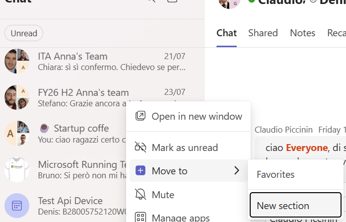

please add ellipsis menu to articles and folders 
then 
add "Add to favorites" menu (similar to the Home folder)

when adding an article to the favorites => it should be shown under the favorites folder (as a link, into the favorites ellipses menu you can add 'Go to article' and -  'Remove from Favorites')

then add a Favorites folder to the Favorites the whole folder should be visible under the favorites 

