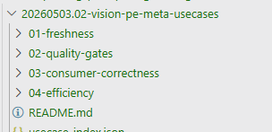

# Issue: PE-meta use cases have no reliability dimension

> **Status:** Analysis complete — fix plan ready
> **Severity:** HIGH — systemic gap in the use-case catalog vs. the stated vision goal
> **Date:** 2026-05-24
> **Component:** Self-updating prompt engineering (pe-meta) — use-case catalog and dimension model
> **Framework target:** [`20260523.01-vision.v13.md`](../../../../06.00-idea/self-updating-prompt-engineering/20260523.01-vision.v13.md), [`20260503.02-vision-pe-meta-usecases/`](../../../../06.00-idea/self-updating-prompt-engineering/20260503.02-vision-pe-meta-usecases/), [`05.07-pe-meta-dimension-catalog.md`](../../../../.copilot/context/00.00-prompt-engineering/05.07-pe-meta-dimension-catalog.md)

---

## 📝 The seed question

> Use cases include the checks for freshness, quality, consumer correctness and efficiency.
> However the vision document explains as main goal for self-updating prompt engineering includes **reliability**.
>
> What dimensions are dedicated to reliability validation?
> Can it be feasible to identify a set of use cases focused on validating reliability for prompt engineering artifacts?



---

## 🔎 The gap

### 1. Terminology mismatch — vision says *reliability*, README says *robustness*

The [v13 vision goal](../../../../06.00-idea/self-updating-prompt-engineering/20260523.01-vision.v13.md) consistently uses **"reliability"**:

> "maintains PE artifacts at peak **reliability, effectiveness, and efficiency** — with the maximum degree of autonomy that assessed risk allows"

The word *robustness* never appears in the vision. It surfaces only in the use-case [README.md](../../../../06.00-idea/self-updating-prompt-engineering/20260503.02-vision-pe-meta-usecases/README.md) and in [`05.07-pe-meta-dimension-catalog.md`](../../../../.copilot/context/00.00-prompt-engineering/05.07-pe-meta-dimension-catalog.md) as a `--dim` alias bound to **consumer-correctness** dimensions (D5, D6, D16, D18 — boundaries + consistency + adherence + coverage).

That overload is misleading. In standard software engineering, *robustness* means resistance to perturbation and graceful degradation — a **reliability** property of the self-update process, not an adherence property of consumers.

### 2. Reliability is treated as a property of each use case — never as the subject of one

Every existing UC contains a `## Reliability analysis` section that scores *itself*. But there is **no use case whose subject is the reliability of the PE system or the self-update process**.

The current 4-folder map:

| Folder | Vision-goal pole served |
|---|---|
| `01-freshness` | cross-cutting (drives all three poles) |
| `02-quality-gates` | effectiveness (guidance quality) |
| `03-consumer-correctness` | effectiveness (adherence) |
| `04-efficiency` | efficiency |

**Reliability has no folder.** The vision explicitly distinguishes two reliability surfaces in the goal section:

- *the self-update process itself must be reliable* — "detecting the same drift consistently when run twice"
- *the artifacts must reliably serve their declared purpose*

Neither is currently the explicit subject of any UC.

### 3. Vision points with no dedicated use case

Walking the vision, these are explicitly in scope yet have no UC and no dimension in [`05.07-pe-meta-dimension-catalog.md`](../../../../.copilot/context/00.00-prompt-engineering/05.07-pe-meta-dimension-catalog.md):

| # | Vision anchor | What's missing |
|---|---|---|
| R1 | **Loop stability** — convergence and oscillation detection (`scope.covers`) | No UC verifies the system doesn't flip an artifact back and forth across runs |
| R2 | **R-L2 self-correction** — multi-pass validation invariant | No UC asserts "every committed change had ≥1 independent validation pass" |
| R3 | **Reproducibility / determinism** — Key Definitions: "produces consistent, predictable outcomes across invocations" | No UC runs the same command twice on unchanged inputs and diffs outputs |
| R4 | **Regression protection** — Validate step: "confirm proposed changes don't regress existing behavior" | No UC enforces before/after behavioral snapshots on autonomous changes |
| R5 | **Metadata-guarded change protocol** — pre-change block + post-change reconciliation (boundary in vision header) | No UC verifies the closed feedback loop fires on every change |
| R6 | **Fail-closed on infrastructure staleness** — "CRITICAL severity, never cached, never skipped" (boundary) | No UC tests that this boundary actually blocks |
| R7 | **Boundary actionability** — guidance-quality property 6: "can the model verify 'am I within scope?'" | No UC red-teams runtime self-constraint enforcement |
| R8 | **Rollback safety** — R-S6 tier-scoped group snapshots | No UC validates snapshot/rollback exercises succeed |
| R9 | **Autonomy-threshold calibration** — R-G3 progressive learning from outcome log | No UC audits the autonomy gradient against actual outcome data |
| R10 | **Conflict-resolution table** — R-L1 vs R-P1, R-S3 vs R-L4, R-G1 vs R-L2, … | No UC verifies the documented precedence rules are applied at runtime |
| R11 | **Namespace-prefix enforcement** — `pe-` portability boundary | No UC scans for unprefixed artifacts that would clash on port |
| R12 | **Low-risk autonomy rule** — command identity MUST NOT override risk classification | No UC checks that `--mode plan` defaults never silently gate a low-risk change |

---

## 🎯 Resolution outline

Three coordinated workstreams.

| # | Layer | File | Change |
|---|---|---|---|
| 1 | Vision | [`20260523.01-vision.v13.md`](../../../../06.00-idea/self-updating-prompt-engineering/20260523.01-vision.v13.md) | Explicitly enumerate the goal-trio mapping (reliability ↔ effectiveness ↔ efficiency) onto the 5-folder use-case catalog; deprecate the misleading "robustness" alias |
| 2 | Use cases | [`20260503.02-vision-pe-meta-usecases/`](../../../../06.00-idea/self-updating-prompt-engineering/20260503.02-vision-pe-meta-usecases/) | Add fifth folder `05-reliability/` with P0/P1/P2 use cases covering R1–R12; update README, JSON index, and dimension-group shortcuts |
| 3 | pe-meta | [`05.07-pe-meta-dimension-catalog.md`](../../../../.copilot/context/00.00-prompt-engineering/05.07-pe-meta-dimension-catalog.md) and `.github/prompts/00.09-pe-meta/*` | Add reliability dimensions (D28–D35), add `--dim reliability` group, rename `--dim robustness` → `--dim adherence` (keep alias for back-compat one release), update applicability matrix |

### Naming after fix

| Dimension | Folder | `--dim` alias |
|---|---|---|
| Freshness | `01-freshness` | `--dim freshness` |
| Quality (guidance) | `02-quality-gates` | `--dim quality` |
| Adherence | `03-consumer-correctness` | `--dim adherence` *(was `robustness`)* |
| **Reliability** | **`05-reliability`** *(new)* | **`--dim reliability`** |
| Efficiency | `04-efficiency` | `--dim optimize` |

### Proposed `05-reliability/` contents

```text
05-reliability/
  README.md
  p0-01-process-reproducibility.md          # R3 — same input twice → same output diff
  p0-02-regression-protection.md            # R4 — before/after snapshot enforcement on autonomous changes
  p0-03-metadata-guard-enforcement.md       # R5 + R6 — pre/post-change protocol + fail-closed boundaries
  p1-01-loop-stability-audit.md             # R1 — oscillation / convergence detection from outcome log
  p1-02-multipass-validation-invariant.md   # R2 — every commit had ≥1 independent pass
  p1-03-rollback-exercise.md                # R8 — tier-scoped snapshot/restore drill
  p1-04-boundary-actionability-redteam.md   # R7 — agent self-constraint stress test
  p2-01-autonomy-calibration-audit.md       # R9 — outcome-log → gradient threshold check
  p2-02-conflict-resolution-coverage.md     # R10 — rationale precedence verification
  p2-03-portability-boundary-scan.md        # R11 — namespace prefix + generic-name detection
  p2-04-mode-vs-risk-decoupling-check.md    # R12 — command default mode must not gate low-risk changes
```

---

## 🔬 Root-cause analysis

The use-case catalog was assembled bottom-up from observed pain points (staleness, contradictions, token bloat) — not top-down from the vision's goal trio. As a result:

1. Three of the four folders all serve the **effectiveness** pole (quality, adherence) or are cross-cutting (freshness). Only one folder serves a distinct pole (efficiency).
2. The **reliability** pole of the goal trio has no representation — even though the vision dedicates explicit scope to it (Loop stability, R-L2, R-S6, R-G3, key-definition "Reliable", boundary actionability).
3. The word "robustness" got bound to the wrong cluster, suppressing the gap by making it look filled.

---

## ✅ Resolution status

- [x] Analysis complete
- [x] Vision update applied (workstream 1)
- [x] Use-case catalog extended (workstream 2)
- [x] pe-meta dimension catalog + prompts updated (workstream 3)
- [x] Validation: every R1–R12 anchor has at least one UC entry in `05-reliability/`
- [x] Validation: `--dim reliability` resolves to D28–D35 (or chosen IDs) in the catalog
- [x] Validation: `--dim robustness` shows deprecation notice and redirects to `--dim adherence`

---

## 📎 Plan files

1. [01.01 — Vision update plan](01.01-visionupdate-plan.md) — light: explicit goal-trio↔folder mapping, deprecate `robustness` alias
2. [01.02 — Use-cases update plan](01.02-use-cases-update-plan.md) — main work: scaffold `05-reliability/`, update README and JSON index
3. [01.03 — pe-meta update plan](01.03-pe-meta-update-plan.md) — dimension catalog + `--dim` group changes

---

## 🎓 Lessons learned

- **Catalog assembly must be traced back to vision goals.** A bottom-up catalog will silently miss any goal pole that doesn't generate frequent pain.
- **Aliases hide gaps.** Binding `--dim robustness` to an adherence cluster made the reliability gap invisible at the option-taxonomy layer.
- **"Reliability analysis" as a UC self-property is not a substitute for reliability as a UC subject.** The former measures the UC; the latter validates the system.
