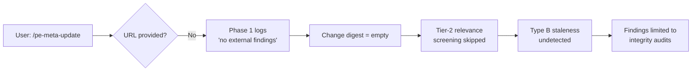

# Sub-issue analysis — Why `--mode apply --scope context` produced only a thin structural pass

**Parent issue:** [20260525.03-staleness-review/overview.md](../overview.md)
**Sub-issue ID:** `02-pe-meta-update-not-processing-full-context-review`
**Date reported:** 2026-05-29
**Reporter:** Dario Airoldi
**Status:** Open — analysis only, no fixes yet
**Severity:** High (the pipeline's primary design goal — catching Type B staleness — is not implemented)

---

## 📋 Table of contents

- [🎯 Problem statement](#-problem-statement)
- [📋 What the run actually did](#-what-the-run-actually-did)
- [🏗️ What the vision says it should have done](#%EF%B8%8F-what-the-vision-says-it-should-have-done)
- [🔬 The gap — missing analyses, mapped to vision sections](#-the-gap--missing-analyses-mapped-to-vision-sections)
- [💡 Why each gap allowed only thin findings](#-why-each-gap-allowed-only-thin-findings)
- [🧭 Investigation strategies the pipeline should support](#-investigation-strategies-the-pipeline-should-support)
- [📌 Recommendations](#-recommendations)
- [📚 References](#-references)

---

## 🎯 Problem statement

The 2026-05-27 invocation:

```text
/pe-meta-update --mode apply --scope context
```

was expected to perform a **full context review** that, given the considerable AI-platform churn over the prior weeks (VS Code 1.107+, Copilot SDK, MCP advances, Microsoft Foundry releases, new model families from OpenAI / Anthropic / Google / Meta), would surface substantive coverage gaps, role-clarity issues, model-specific guidance updates, and new-feature integration opportunities into `.copilot/context/`.

It did not. The run produced 7 findings, **all in the structural / consistency / staleness-stamp dimensions** (missing frontmatter, broken cross-references, stale inventory tables, two orphan placeholder folders, 30-day-old `last_updated:` stamps). Phase 1 logged a single decisive line:

> "Phase 1 (external sources): No new release-notes URL provided. Last external monitor: VS Code 1.117 (2026-04-27). No new external findings — internal state used for audits."

This is the smoking gun, but the underlying error is **conceptual**, not just a missing wire. The orchestrator silently inverted the right default:

| Invocation shape | Vision-intended behavior | Actual behavior |
|---|---|---|
| `/pe-meta-update` (no params) | **Full review** of every in-scope artifact at deep tier, against the complete monitored-sources catalog | Minimal integrity pass against internal state only |
| Recurring / scheduled call | **Incremental review** — deltas since `last_review_timestamp`, screened via change digest | (Same minimal pass — no distinction made) |
| User-supplied strategy (`--since`, `--area`, `--subject`, `--source`, …) | **Narrow** the default review to the requested slice | (Only `--scope` is honored; other strategies don't exist yet) |

The correct default is **maximal**: do everything, on every artifact, against every monitored source. Strategies *subtract* from that default to make runs cheaper, targeted, or recurring. The pipeline does the opposite — it does almost nothing unless the user provides a URL, and even then only narrows further by `--scope`.

---

## 📋 What the run actually did

Mapped against the 8-phase pipeline:

| Phase | Behavior in this run | Vision-expected behavior |
|---|---|---|
| 0 — Inventory + dependency map | ✅ Inventoried 51 `.md` files | ✅ Matches |
| 1 — Source research | 🟡 Logged "no URL provided"; no `fetch_webpage` calls; no change-digest produced | ❌ Should have queried monitored platform / model / ecosystem sources autonomously and produced a structured change digest |
| 2 — Structure audit | ✅ Caught missing frontmatter, orphan folders | 🟡 Only the inventory subset of the organizational pass ran |
| 3 — Consistency audit | ✅ Caught broken cross-refs, stale tables | 🟡 Internal-only; no comparison against external standards |
| 4 — Content audit | ✅ Caught 30-day staleness stamps, token budgets | ❌ Did not run Tier-2 relevance screening (because change digest was empty) — the very check that catches Type B staleness |
| 5 — Approval | ✅ Presented changelist | ✅ Matches |
| 6 — Apply | 🟡 Applied 3 files; deferred 1 (S2) | ✅ Matches |
| 7 — Regression test | ✅ Code-fence-aware re-scan | ✅ Matches |
| 8 — Report + log | ✅ Updated `05.04-meta-review-log.md` | ✅ Matches |

**Net effect:** the run executed an **integrity-audit pipeline**, not a **vision-aligned self-update pipeline**.

---

## 🏗️ What the vision says it should have done

From [20260523.01-vision.v13.md](../../../../../../06.00-idea/self-updating-prompt-engineering/20260523.01-vision.v13.md), four mandates apply to *any* broad-trigger invocation (and `--scope context` over 51 files qualifies as a broad trigger):

### 1. Detect — five trigger sources, autonomous monitoring

Vision § Detect requires the system to **autonomously monitor** five trigger sources:

| Signal | Source | What it indicates |
|---|---|---|
| Platform event | VS Code / Copilot release notes, changelog feeds | New YAML fields, features, deprecations |
| Model event | Provider release notes, model catalogs (OpenAI / Anthropic / Google / Meta) | Capability shifts — re-evaluate model-specific guidance |
| Ecosystem event | Trusted sources (Microsoft, Copilot SDK, MCP servers, recognized specialists) | Adoption / incorporation candidates |
| Internal event | File-system watcher / git hook | Scope dependent checks |
| Scheduled | Time-based interval | Catch what event triggers missed |

These triggers feed **incremental** reviews — they say "something changed; investigate the delta." A manual `/pe-meta-update` with no parameters is a **different shape of request**: it is a deliberate ask for a *full* sweep across the entire monitored-sources catalog, regardless of which triggers have or have not fired. The orchestrator should:

- treat parameter-less invocations as "full review against the full catalog";
- treat scheduled / hook-fired invocations as incremental against `last_review_timestamp`;
- treat user-supplied strategies (date, area, subject, source, consumer) as filters that *narrow* the full default.

In this run the orchestrator did none of the three — it produced a thin internal-only pass independent of the invocation shape.

### 2. Assess — research phase, full vs incremental

Vision § Assess → Assessment depth requires:

> "Research phase (once per invocation) — Gathers what's changed since the last review: platform releases, ecosystem events, model updates, tooling/infrastructure changes, vision/governance changes, outcome history, and internal modifications. Produces a structured **change digest** (~500 tokens) that all subsequent screening checks reference."

That paragraph describes the **incremental** mode — "what's changed since the last review" — used by recurring or trigger-fired runs. The companion mode for parameter-less invocations is a **full research sweep**: walk the *entire* monitored-sources catalog (not the delta), build a complete current-state snapshot, and screen every in-scope artifact against it. The output of a full sweep is not a 500-token delta digest; it is a richer reference corpus that subsequent audits compare against.

The change digest is the **input** to Tier-2 relevance screening — the mechanism designed specifically to catch **Type B staleness** (artifacts that pass all integrity checks but are semantically obsolete because the world moved on). The vision explicitly calls Type B "the primary motivating concern."

This run produced neither a delta digest nor a full snapshot. Tier-2 was therefore skipped per design — meaning the failure mode the vision was built to catch was the failure mode that occurred, regardless of which research mode (full or incremental) should have run.

### 3. Organizational pass before per-artifact pass

Vision § Assess → Assessment ordering mandates:

> "For broad triggers (platform releases, ecosystem changes, scheduled reviews), assessment follows a two-pass sequence. **Organizational pass.** Before evaluating individual artifact quality, evaluate the artifact set as a system: role clarity, dependency structure, layer correctness, coverage and redundancy."

The organizational pass is the **only step** that can answer questions like:

- "Do we have a context file for X new platform capability?" (coverage gap)
- "Does context file A's role still make sense after capability Y was added?" (role clarity)
- "Should this rule live in instruction or context layer after the layer redefinition in 2026-04-28?" (layer correctness)
- "Is there redundancy between X and Y now that one absorbed part of the other's scope?" (redundancy)

None of these were asked. Phases 2-4 ran straight per-artifact structural checks.

### 4. Guidance-first review mode

Vision § Assess → Three review modes defines:

| Mode | Question it answers |
|---|---|
| Individual | "Is this artifact structurally and strategically correct?" |
| Dependency-aware | "Does this artifact + dependencies produce reliable behavior?" |
| **Guidance-first** | **"Do artifacts that load this guidance actually implement it?"** |

For a `--scope context` review, guidance-first is the **most informative mode** — it answers whether the consumer agents/prompts/skills actually use what each context file teaches, and whether each context file has consumers at all (otherwise it is dead weight). The orchestrator has no implementation of this mode.

---

## 🔬 The gap — missing analyses, mapped to vision sections

The table below cross-walks every analysis the vision requires against its implementation status:

| # | Required analysis | Vision section | Implementation status | Symptom in this run |
|---|---|---|---|---|
| **G1** | Autonomous platform-event monitoring (VS Code, Copilot release feeds) | Detect — Platform event | ❌ Not wired. No monitored-sources registry. No `pe-self-update.config.json` exists. | Phase 1 fell back to "no URL provided" |
| **G2** | Autonomous model-event monitoring (OpenAI / Anthropic / Google / Meta catalogs) | Detect — Model event | ❌ Not wired. No model-catalog fetcher. | No model-specific guidance refresh proposed |
| **G3** | Autonomous ecosystem-event monitoring (Microsoft skills, MCP servers, Copilot SDK, Foundry) | Detect — Ecosystem event | ❌ Not wired. No ecosystem registry. | No adoption / incorporation candidates surfaced |
| **G4** | Change-digest production (structured ~500-token summary of what changed since `last_review_timestamp`) | Assess — Research phase | ❌ Not implemented. `pe-meta-researcher` produces a "report" but not a structured digest with the seven required categories (platform / model / ecosystem / tooling / vision-governance / outcome-history / internal-modifications). | Tier-2 had no input to screen against |
| **G5** | `last_review_timestamp` per source, with maximum staleness window (default 90 days) | Assess — Research phase | ❌ Not persisted. `05.04-meta-review-log.md` tracks "Last Apply-Mode Run File Manifest" but not per-source review timestamps. | Cannot compute "what changed since" |
| **G6** | Tier-2 relevance screening (compare artifact scope to change digest) | Assess — Informed screening | ❌ Skipped by design when digest empty — and digest is always empty because G4 is missing. | Type B staleness undetected |
| **G7** | Organizational pass on broad triggers (role clarity, coverage gaps, layer correctness, redundancy) | Assess — Assessment ordering | 🟡 Partially. Phase 2 does inventory + orphan detection; full organizational checks (role overlap, coverage gap analysis, layer correctness) are not run. | No coverage-gap findings; no role-overlap findings |
| **G8** | Guidance-first review mode (per consumer enumeration) | Assess — Three review modes | ❌ Not implemented in orchestrator. | Cannot answer "is context file X actually used?" |
| **G9** | Dependency-aware review mode (target + dependency chain) | Assess — Three review modes | 🟡 Partial. Dependency map loaded in Phase 0, but assessment runs per-file not per-chain. | No chain-coherence findings |
| **G10** | Artifact-type-aware quality requirements (construction invariants for guidance files) | Assess — Artifact-type-aware routing | 🟡 Partial. Generic content checks run; the 6-property construction invariants (clarity, non-redundancy, non-contradiction, completeness, prioritization, actionability) are not applied as a gate. | No construction-invariant findings on context files |
| **G11** | Trust-and-fit evaluation for ecosystem artifacts (R-G2) | Assess — trust model | ❌ Not invoked because G3 produces no candidates. | No adoption recommendations |
| **G12** | Adherence verification (does artifact implement rules it references?) | Assess — Guidance adherence verification | ❌ Not implemented. | The "validator checks 2 of 3 ref types" failure class cannot be detected |
| **G13** | Quality-chain assessment (R-S10 — bottom-up, dependency-quality-ceiling-aware) | Assess — Quality chain assessment | ❌ Not implemented. | All artifacts assessed at same depth regardless of layer |
| **G14** | Coupling-typed dependency weighting (behavioral / structural / informational / cosmetic) | Vision § R-S2 + Risk classification | 🟡 Partial. Dependency map uses counts, not coupling types. | Risk ranking uses severity only, not coupling weight |
| **G15** | Outcome-history feedback (`outcome-log.jsonl`, R-G3) | Vision § R-G3 | ❌ Not wired. No outcome log exists in `.copilot/temp/` or `state.path`. | No learning from prior decisions |

**Net pattern:** every gap concentrates on **the Detect layer and the Assess-research phase**. Phases 2-4 (Structure / Consistency / Content) are reasonably well-implemented as integrity audits, but they execute *as if Phase 1 always returned empty* — which it does, because Phase 1 only runs when a URL is provided.

---

## 💡 Why each gap allowed only thin findings

Three causal chains explain why the only findings produced were structural / consistency / staleness-stamp:

### Chain 1 — No external signal → no Tier-2 → no Type B detection



The vision's intent — "investigate authoritative sources autonomously as a default behavior" (vision § The goal) — is contradicted by the orchestrator's actual flow, which makes external research conditional on user-provided URLs.

### Chain 2 — No organizational pass → no coverage-gap detection

The user's `--scope context` invocation is a **broad trigger** (entire context category, 51 files). The vision is explicit:

> "For broad triggers (platform releases, ecosystem changes, scheduled reviews), assessment follows a two-pass sequence. **Organizational pass.** ... Organizational findings are addressed before the per-artifact pass begins."

The orchestrator does not gate Phase 2-4 on a prior organizational pass. Phase 2's "Structure Audit" performs the inventory portion only — it does not ask "does the current set of context files cover everything the system needs?". That question requires the change digest from Phase 1 (to know what *should* be covered) and a comparison against the artifact set's declared scopes.

### Chain 3 — No guidance-first mode → no consumer-adherence detection

`--scope context` should naturally trigger guidance-first mode because context files are guidance artifacts. The orchestrator has no mode parameter — it implicitly runs individual mode for every artifact. The failure class "5 of 8 validators miss a rule from the priority matrix" (vision § Three review modes) is invisible to the current pipeline.

---

## 🧭 Investigation strategies the pipeline should support

The missing piece in today's orchestrator is a **strategy layer** between "the user invoked the command" and "the audits run." A strategy answers three orthogonal questions:

1. **Breadth** — full or incremental?
2. **Slice** — over what subset of artifacts and sources?
3. **Depth / mode** — what kind of investigation per artifact?

The default `/pe-meta-update` (no parameters) should resolve to **breadth=full, slice=all, depth=organizational-then-deep-per-artifact**. Every strategy below is a *named subtraction* from that default.

### Breadth strategies (full vs incremental)

| Strategy | Trigger | Behavior |
|---|---|---|
| **Full sweep** | `/pe-meta-update` (no params) — default | Walk the entire monitored-sources catalog; build a complete current-state snapshot; screen every in-scope artifact against it at deep tier |
| **Incremental** | `--incremental`, scheduled cron, or git-hook fired | Compute delta since per-source `last_review_timestamp`; produce ~500-token change digest; Tier-2 screen only artifacts whose scope intersects the digest |
| **Catch-up** | `--catch-up` (max-staleness exceeded) | Like incremental but for a long lookback window; auto-fall-back to full when delta > N entries |

### Slice strategies (narrow the default)

These are composable filters (any combination, AND-merged). A run with no slice strategy = entire catalog.

| Strategy | Example | Narrows by | When useful |
|---|---|---|---|
| **Temporal** | `--since 2026-04-01`, `--between 2026-04-01..2026-05-15` | Time window on both sides (artifacts modified in window AND external changes in window) | "What needs updating since the April platform release" |
| **Area** | `--area context`, `--area .copilot/context/01.00-article-writing/` | Folder or scope subtree | Targeted audit after localized rework |
| **Subject** | `--subject "tool composition"`, `--subject "validation caching"` | Match against frontmatter `scope:` / `goal:` / `domain:` / keywords across artifacts AND source feeds | "Re-evaluate anything that touches MCP composition" |
| **Source-driven** | `--source <URL or feed-id>` | Single external release — compute impact graph and audit only artifacts intersecting it | "VS Code 1.107 dropped; what's affected?" |
| **Artifact-driven** | `--artifact <path>` | Single file + its dependency neighborhood (consumers + dependencies, N hops) | Investigating a specific piece |
| **Consumer-up** | `--consumer @pe-meta-researcher`, `--consumer /pe-meta-update` | Start from a consumer; walk its entire guidance chain | "Is the chain feeding this agent coherent?" |
| **Concern-driven** | `--concern <issue-id>`, `--concern "model-guidance"` | Re-investigate the artifact set surfaced by a prior issue or category | Re-validating a known weakness after intervention |
| **Dimension** | `--dim freshness\|quality\|adherence\|reliability\|optimize` (already exists) | Which quality dimensions to evaluate | Focused quality drill-down |

### Depth / mode strategies

| Strategy | Auto-select rule | What it changes |
|---|---|---|
| **Organizational pass** | Always for full sweeps and broad `--area` | System-level: role clarity, coverage gaps, layer correctness, redundancy |
| **Per-artifact — individual** | Default for narrow slices | Structural and strategic correctness of one file |
| **Per-artifact — dependency-aware** | Auto-select for `--scope agents\|prompts\|skills` | Target + dependency chain reliability |
| **Per-artifact — guidance-first** | Auto-select for `--scope context\|instructions\|templates\|snippets` | Whether consumers actually implement what the guidance teaches |
| **Adherence verification** | Optional `--adherence`, auto-on in full sweeps | Sample N consumers per guidance artifact; verify referenced rules are checked |
| **Source-impact (forward)** | Auto for `--source` | Walk *outward* from a change to find affected artifacts |
| **Coverage-gap (inverse)** | Auto for full sweeps and `--subject` | Walk *outward* from current artifact set to find topics that exist in the world but not in our catalog |

### How invocations resolve (worked examples)

| Invocation | Breadth | Slice | Depth |
|---|---|---|---|
| `/pe-meta-update` | Full | All artifacts, all sources | Organizational → per-artifact (mode auto by layer) → adherence |
| `/pe-meta-update --incremental` | Incremental | Whatever the digest intersects | Tier-2 screen → deep on hits |
| `/pe-meta-update --since 2026-04-01` | Full within window | Artifacts modified in window + external changes in window | Organizational on the slice → per-artifact deep |
| `/pe-meta-update --area context` | Full within area | `.copilot/context/**` + all sources | Organizational → guidance-first per artifact → adherence |
| `/pe-meta-update --subject "model-specific guidance"` | Full within subject | Artifacts and external sources matching the subject | Per-artifact deep + coverage-gap |
| `/pe-meta-update --source <VS Code 1.107 URL>` | Full impact-only | Artifacts intersecting source-impact graph | Source-impact mode |
| `/pe-meta-update --consumer /pe-meta-update` | Full chain | This prompt + its dependencies + their dependencies | Dependency-aware deep + adherence |
| `/pe-meta-update --concern 20260525.03` | Full | Artifact set surfaced by concern | Per-artifact deep + adherence |

### Strategy resolution rules (orchestrator logic)

1. If no slice strategy provided → slice = **all artifacts + all monitored sources**.
2. If no breadth strategy provided → breadth = **full** for interactive invocation, **incremental** for scheduled / hook-fired invocation.
3. Slice strategies compose with AND. Multiple values within one strategy (`--area context --area instructions`) compose with OR.
4. Depth/mode is auto-derived from slice + layer of in-scope artifacts; an explicit `--mode-review` overrides.
5. Conflicts (e.g., `--incremental --since`) resolve in favor of the more explicit strategy and log a notice.
6. Strategy resolution is the **first thing logged** by Phase 0 — so a reader of the run report can see exactly what shape of investigation was promised before audits ran.

---

## 📌 Recommendations

Recommendations are deliberately scoped to **closing the analysis gap**, not to defining the full implementation. They are listed in dependency order — earlier items unblock later ones.

### R0 — Invert the default and add the strategy layer (unblocks everything else)

This is the conceptual fix that precedes all wiring work:

1. Change the orchestrator's default contract — `/pe-meta-update` with no parameters means **full review of all in-scope information**, not minimal pass.
2. Introduce **breadth** (`full` / `incremental` / `catch-up`) as an explicit first-class concept, separate from slice (`--area`, `--subject`, `--source`, …) and depth (`--mode-review`, `--dim`).
3. Implement the strategy resolution rules listed in the previous section in Phase 0 and log the resolved strategy as the first line of the run report.
4. Make incremental mode auto-selected only when fired by scheduled triggers or git hooks; manual invocations default to full unless `--incremental` is explicit.

Without R0 every later recommendation runs against the wrong default and produces the same thin findings.

### R1 — Define the monitored-sources registry (unblocks G1, G2, G3)

Create `pe-self-update.config.json` at repo root (per vision § Per-repo integration model) with:

- `monitored_sources.platform[]` — VS Code release notes, GitHub Copilot release notes, MCP spec changelog
- `monitored_sources.model[]` — OpenAI / Anthropic / Google / Meta model catalogs and release feeds
- `monitored_sources.ecosystem[]` — Microsoft AI skills repo, Foundry releases, Copilot SDK releases, trusted specialist registries
- `state.namespace`, `state.path` — required guardrails
- `lookback.default_days: 90`

### R2 — Implement the change-digest contract (unblocks G4, G5, G6)

Extend [pe-meta-researcher.agent.md](../../../../../../.github/agents/00.09-pe-meta/pe-meta-researcher.agent.md) to produce a structured digest (template under `.github/templates/00.00-prompt-engineering/`) with the seven required sections (platform / model / ecosystem / tooling / vision-governance / outcome-history / internal-modifications). Persist `last_review_timestamp` per source under `<state.path>/triggers/`.

Update [pe-meta-update.prompt.md](../../../../../../.github/prompts/00.09-pe-meta/pe-meta-update.prompt.md) Phase 1 to **always** delegate to `@pe-meta-researcher` with the monitored-sources registry — not conditionally on a user-provided URL. Treat user URLs as **additional** sources, not as the **only** source.

### R3 — Wire Tier-2 relevance screening into Phases 2-4 (unblocks G6 once R2 lands)

In each audit phase Research substep, add a step: "For each in-scope artifact, compare its `scope.covers:` against the change digest. If intersection is non-empty, escalate to deep pass with the digest entries as input."

### R4 — Add the organizational pass as Phase 1.5 (unblocks G7)

Before Phase 2 in broad-trigger invocations (`--scope` covering a full category, or no `--scope`), run an Organizational Pass that asks the four vision questions: role clarity, dependency structure, layer correctness, coverage-and-redundancy. Produce findings at the **system** level, not the file level.

### R5 — Implement review modes (unblocks G8, G9)

Add a `--mode-review individual|dep-aware|guidance-first` option (or auto-select: guidance-first for `--scope context`, dep-aware for `--scope agents`/`prompts`/`skills`). Each mode changes what the deep-pass examines.

### R6 — Add the six-property construction invariant gate for context files (unblocks G10)

When a finding proposes a context-file change, validate against: clarity, non-redundancy, non-contradiction, completeness, prioritization, actionability. Block (or escalate) changes that violate any property.

### R7 — Stand up the outcome log (unblocks G15)

Append every autonomous and approved decision to `<state.path>/outcome-log.jsonl` with: timestamp, finding ID, classification, autonomy level, outcome, user override (if any). Feed into Phase 1's "outcome history" digest section over time.

### R8 — Add adherence verification as an opt-in check (G12)

When `--scope context` runs in guidance-first mode, sample N consumers per context file (or all, when N≤10) and verify that the rules referenced via `📖` are actually checked in the consumer's behavior / checklist. Flag adherence gaps as HIGH-severity findings.

---

## 📚 References

**Vision and pipeline:**
- 📘 [20260523.01-vision.v13.md](../../../../../../06.00-idea/self-updating-prompt-engineering/20260523.01-vision.v13.md) — sections: The goal § Priority, ⚙️ The rationale (R-L4, R-S1, R-S9, R-S10, R-G1, R-G2, R-G3), 🏗️ The vision § Detect, § Assess (Assessment ordering, Research phase, Tier-2 screening, Three review modes, Artifact-type-aware routing)
- 📘 [pe-meta-update.prompt.md](../../../../../../.github/prompts/00.09-pe-meta/pe-meta-update.prompt.md) v2.0.0 — Phase 1 description, `--skip external` semantics
- 📘 [pe-meta-researcher.agent.md](../../../../../../.github/agents/00.09-pe-meta/pe-meta-researcher.agent.md) v2.1.1 — Always Do (fetch_webpage by default), Trust Model
- 📘 [05.04-meta-review-log.md](../../../../../../.copilot/context/00.00-prompt-engineering/05.04-meta-review-log.md) — current persistence model (no per-source timestamps)

**Run artifacts that triggered this analysis:**
- 📒 [Parent issue overview.md](../overview.md) — full account of the 2026-05-27 run
- 📒 [phase-5-changelist-20260527.md](../../../../../../.copilot/temp/pe-meta-state/phase-5-changelist-20260527.md) — the actual findings produced (showing the thin scope)

**Sibling sub-issues in the same staleness-review folder:**
- 🔗 [01-scope-dept-can-mix/](../01-scope-dept-can-mix/) — `--scope` vs `--dim` interaction
- 🔗 [03-pe-meta-update-applied-to-all-pe-contexts/](../03-pe-meta-update-applied-to-all-pe-contexts/) — full-PE-context scope variant
- 🔗 [04-pe-meta-update-plan-behavior/](../04-pe-meta-update-plan-behavior/) — `--mode plan` behavior

