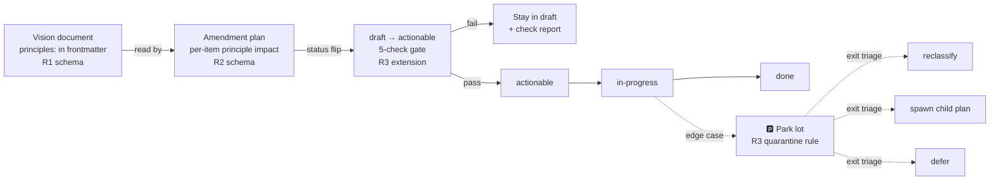

# Sub-issue analysis — Vision-amendment plans absorb scope-expansions silently; no principles, no actionability gate

**Parent issue:** [20260525.03-staleness-review/overview.md](../overview.md)
**Sub-issue ID:** `05-vision-usecase-plan-rules`
**Date reported:** 2026-05-31
**Reporter:** Dario Airoldi
**Status:** Open — analysis only, no fixes yet
**Severity:** Medium (process-level; high turn-cost during execution, drift pressure on vision boundaries)

---

## 📋 Table of contents

- [🎯 Problem statement](#-problem-statement)
- [📋 What actually happened in v14 → v15](#-what-actually-happened-in-v14--v15)
- [🔬 Root causes](#-root-causes)
- [💡 Why existing PE artifacts did not catch it](#-why-existing-pe-artifacts-did-not-catch-it)
- [📌 Proposed rules](#-proposed-rules)
- [🧪 Worked example — v14 → v15 under the new rules](#-worked-example--v14--v15-under-the-new-rules)
- [⚠️ Open questions and decisions](#%EF%B8%8F-open-questions-and-decisions)
- [📚 References](#-references)

---

## 🎯 Problem statement

Vision documents and their amendment plans currently exhibit a recurring failure mode:

> A plan opens with a single, well-scoped trigger. During planning (and again during execution), adjacent concerns surface — gaps the author notices while specifying the change, edge cases the user surfaces while reviewing, prerequisites discovered while implementing. **These concerns are absorbed into the active plan rather than triaged.** The goal section inflates from one rule to many. Downstream plans (use cases, implementation) mirror the bloat. Execution becomes a long turn-by-turn loop where the user repeatedly catches and corrects scope creep that should have been caught at plan creation time.

Two compounding harms result:

1. **Interaction cost.** Each scope-expansion item caught mid-execution requires the user to interrupt, re-anchor the plan, and re-validate downstream artifacts. A plan that should have taken one focused pass becomes many partial passes.
2. **Vision drift.** When a scope-expansion item happens to touch the vision's invariants (portability, command-family-agnosticism, single-source-of-truth, …), it can land without anyone explicitly noticing — because there is no declared list of invariants to check against. The vision narrows or loses genericity without an audit trail.

The pattern is **not** specific to one author or one vision. It is a **structural gap** in how the PE infrastructure governs vision amendments: there is no forcing function that requires the amendment author to declare which boundaries the change preserves, which it touches, and what downstream artifacts will land each goal item.

---

## 📋 What actually happened in v14 → v15

The originating trigger for v15 was a single rule:

> *When a resolved scope spans ≥ 2 semantic domains, propose a per-domain split before applying.*

That rule is one rationale (R-P10), one new phase (Phase 0b), one consent token (`bundle=accept`). It is generic, repo-portable, and command-family-agnostic.

By the time the three plans landed, the v15 amendment carried **five orthogonal concerns**. Each surfaced during planning or execution and was bolted onto the same plan instead of triaged.

| # | Concern | Original trigger? | What it actually is |
|---|---|---|---|
| 1 | R-P10 + Phase 0b (propose-split on multi-domain scope) | ✅ Yes | Orchestration gate — the actual ask |
| 2 | **3-tier metadata-first domain resolution** (declared `domain:` → `pe-domain-map.yaml` → `unknown`) | ❌ No | Domain *detection* algorithm — a separate spec surfaced because Phase 0b needed a definition |
| 3 | **Phase 0a CF-05 artifact-type/path consistency check** | ❌ No | A different gate entirely (path vs prompt-name); surfaced from a user's mis-invocation incident |
| 4 | **Seed-footprint vs dependency-footprint + `bundle=cross-domain-deps` + per-dep-domain specialized analysis lenses** | ❌ No | A carve-out from R-P10 covering `--deps full`, plus a new reviewer-behavior spec |
| 5 | `domain:` becoming REQUIRED on all PE artifact types | ❌ No | A metadata-contract amendment |

### Symptoms produced by the absorption

| Symptom | Where visible |
|---|---|
| Plan 01's goal grew from one rule to **10 enumerated items** | [01-vision-update-plan.md § Goal](../03-pe-meta-update-applied-to-all-pe-contexts/01-vision-update-plan.md) (items 1–10) |
| Plan 02 mirrored the bloat (new `bundle_disposition` field, new `scope_mechanism` field, specialized-lens subsections, 4 new quick-start rows) | [02-usecases-update-plan.md § Exit criteria](../03-pe-meta-update-applied-to-all-pe-contexts/02-usecases-update-plan.md) |
| Plan 03 had to implement all of it at once across 31 `.prompt.md` files (3 waves) + 2 helper docs + parser tests for every edge case | [03-pe-meta-update-plan.md § Exit criteria](../03-pe-meta-update-applied-to-all-pe-contexts/03-pe-meta-update-plan.md) |
| "Vision is repo-agnostic" invariant got reinforced **defensively** mid-flight — visible evidence that the boundary was under threat from a path-based proposal that would have broken portability | Plan 01 § Goal item 2 ("Domain is a content property declared in artifact metadata — NOT a path property") |
| Plan execution required many short interactive turns to keep the original goal coherent | Conversation transcripts for plan-03 wave 1, 2, 3 application |

The originating goal survived. The boundary held. But it held **because the user manually caught drift**, not because any artifact forced the question.

### A simpler way to see the same pattern

The v14 → v15 amendment shipped **one rule + four others piggybacked on the same ride**. Of the four:

- #2 was a *prerequisite* (Phase 0b needs a domain definition) — should have been resolved first as its own micro-amendment, OR explicitly tagged as a prerequisite in the plan.
- #3 was *unrelated* (CF-05 is a path/name gate, not a domain gate) — surfaced from a separate user incident; deserved its own plan.
- #4 was a *carve-out* (cross-domain-deps weakens R-P10) — should have been a follow-up amendment once R-P10 was in place, with its own justification.
- #5 was an *invariant-touching contract change* (metadata schema) — should have required explicit consent against the metadata contract document, not slipped in as a footnote.

None of these required the same authoring pass as the originating trigger. They got absorbed because nothing in the current process said "stop, this is a different change."

---

## 🔬 Root causes

Five structural gaps explain why scope expansion is invisible by default.

### G1 — No declared vision principles (with priorities)

The PE vision document contains many statements; some are **defining principles** (the vision *is* this rule), others are **strategic choices** (a chosen approach to honor a principle, swappable), others are **operational details** (current examples, current naming). The vision body does not distinguish them, and there is no frontmatter block where they are declared.

Consequence: an amendment author has no machine-checkable list of "what this vision considers untouchable." Drift on a principle is indistinguishable from a routine edit on an operational detail. The boundary check defaults to author judgment, which defaults to "ship it."

### G2 — No scope-delta gate on amendment plans

[plan-execution.instructions.md](../../../../../../.github/instructions/plan-execution.instructions.md) validates goal alignment and step-actionability before execution. It does NOT validate **scope provenance per goal item** — i.e., whether each item traces back to the original trigger, or was introduced mid-plan from an adjacent concern.

Consequence: a plan that originally proposed one rule can grow to ten goal items without any artifact noticing the divergence. The author can't easily separate "in scope" from "expansion" because there is no tagging convention.

### G3 — Edge cases surfaced during execution mutate the active plan

When a new concern surfaces during plan execution ("but wait — what about positional invocations with `--deps full`?"), it is currently *added to the active plan's goal list* rather than parked. The plan that started actionable becomes non-actionable mid-execution, and the user has to re-validate the now-expanded scope.

Consequence: every discovery becomes scope creep instead of a triaged follow-up. The user pays the interaction cost for each mutation.

### G4 — No coverage-closure check between vision plans and downstream artifacts

Plan 02 (use cases) and Plan 03 (implementation) absorb whatever Plan 01 added, but there is no pre-execution check that:

- every Plan 01 goal item has a named downstream landing (or is explicitly declared `vision-only: no-downstream`)
- every Plan 02 / Plan 03 row traces back to a Plan 01 goal item (no orphans)

Consequence: items can be silently dropped (Plan 01 added it, Plan 03 forgot it) or silently added (Plan 03 introduces a contract Plan 01 never specified). Both are drift; neither is detected mechanically.

### G5 — Plan lifecycle has no explicit `draft → actionable` transition

Plans today have a `status:` field (`todo` / `in-progress` / `done`) but no `draft` status. Authoring and validation collapse into a single state, so there is no natural moment at which a one-time gate can fire.

Consequence: ambiguity, missing coverage, and silent scope expansion are caught turn-by-turn during execution (when fixing them is expensive) instead of once at the start of execution (when fixing them is cheap).

---

## 💡 Why existing PE artifacts did not catch it

The PE infrastructure has artifacts that *touch* this problem but do not solve it. Mapping the gap against current capability:

| Existing artifact | What it does | Why it does not catch scope expansion |
|---|---|---|
| [plan-execution.instructions.md](../../../../../../.github/instructions/plan-execution.instructions.md) | Validates goal clarity, step alignment, pre-execution conditions | Has no concept of "scope provenance" per goal item; cannot tell which items trace to the original trigger |
| [plan-marking.instructions.md](../../../../../../.github/instructions/plan-marking.instructions.md) | Defines suffix notation (`✅ done` / `🟡 todo` / `📌 next steps`) | Operates on completion state of items, not on inclusion/exclusion of items |
| [pe-meta-adherence.prompt.md](../../../../../../.github/prompts/00.09-pe-meta/pe-meta-adherence.prompt.md) | Audits whether artifacts implement rules they reference | Audits **after** plans land; does not gate plan authoring |
| [pe-meta-update.prompt.md](../../../../../../.github/prompts/00.09-pe-meta/pe-meta-update.prompt.md) Phase 0b | Gates multi-domain scope at orchestrator invocation | Gates **invocation-time** scope, not **planning-time** scope |
| [04.05-pe-meta-invocation-gates.md](../../../../../../.copilot/context/00.00-prompt-engineering/04.05-pe-meta-invocation-gates.md) | Defines CF-05 + Phase 0b algorithm | Authority document for invocation behavior; silent on plan authoring |
| Vision documents | Define rationales and rules | No frontmatter principles block; no priority discrimination among statements |

**Net pattern:** all existing artifacts operate downstream of plan authoring. The earliest forcing function in today's pipeline is "execute the plan" — which is too late, because the plan's scope is already fixed.

---

## 📌 Proposed rules

Three artifacts, each small and focused. The proposal preserves the existing plan-marking and plan-execution conventions and adds discipline on top — no rewrites.

### R1 — Declare vision principles in frontmatter with discrete priorities

**New artifact:** `.github/instructions/vision-frontmatter.instructions.md` (`applyTo` glob matching vision document paths).

Defines a `principles:` block schema for vision-document frontmatter. Three priority levels:

| Priority | Meaning | Amendment friction |
|---|---|---|
| **P0 — core principle** | Defines what the vision *is*. Touching it produces a different vision. | New vision version (e.g. v15 → v16); explicit "amending a core principle" consent line; changelog entry |
| **P1 — strategic choice** | A chosen approach to honor the P0 principles. Swappable if a better one emerges. | Justification line in the amendment plan; recorded in changelog; same-version amendment OK |
| **P2 — operational detail** | Examples, current naming, current state. Changes freely. | No special ceremony; tracked in normal changelog |

P0 must be **rare** — typically 3–7 items per vision, strictly the ones that define it. If everything ends up P0, the gate is dead. Example schema:

```yaml
principles:
  - id: portable
    statement: "Rules must not depend on folder layout; content properties live in metadata"
    priority: P0
  - id: command-family-agnostic
    statement: "Rules apply uniformly to every /pe-meta-* command"
    priority: P0
  - id: metadata-first-domain
    statement: "Domain is resolved from declared metadata, not derived from paths"
    priority: P1
```

Authored **once** when the vision is created (or bootstrapped at the next amendment). The vision body remains unannotated; the frontmatter is the single source for principles.

### R2 — Force amendment plans to declare scope-delta, principle-impact, and coverage promise

**New artifact:** `.github/instructions/vision-amendment.instructions.md` (`applyTo` glob matching vision-amendment plan files).

Requires every vision-amendment plan goal section to contain:

1. **Trigger restatement** — verbatim one-sentence copy of the original trigger at the top of § Goal.
2. **Per-item scope tag** — every goal item tagged exactly once: `[in-scope: original]` (traces to the trigger), `[scope-expansion: needs-own-plan]` (surfaced mid-plan, deserves its own amendment), or `[vision-only: no-downstream]` (a clarification/definition refinement landing only in the vision).
3. **Per-item principle impact** — each item lists which principle IDs (from the vision's `principles:` block) it preserves and which it touches. Each P0 touch requires an explicit consent line; each P1 touch requires a justification line.
4. **Per-item coverage promise** — each `[in-scope]` item names at least one downstream artifact (use case file, implementation prompt, consumer doc) that will land it. Coverage promises are checked at the actionability gate (R3) for existence on disk or a spawned sibling plan.

### R3 — Extend plan lifecycle with a `draft → actionable` gate

**Extension to:** [plan-execution.instructions.md](../../../../../../.github/instructions/plan-execution.instructions.md).

Adds an explicit lifecycle:

```
draft  →  actionable  →  in-progress  →  done
         ▲
         └─ 5-check gate fires here, once
```

In `status: draft` the author can write freely (including `[scope-expansion]` tags, ambiguous phrasing, incomplete coverage). Flipping `status:` from `draft` to `actionable` runs five checks; failing any check refuses the transition.

| # | Check | What it verifies |
|---|---|---|
| 1 | **Clarity** | § Goal opens with a one-sentence verbatim restatement of the original trigger. Every goal item is a complete, testable assertion (no "improve X", no "consider Y") |
| 2 | **Non-ambiguity** | Every goal item names exactly one outcome — no compound items joined by "and also", no trailing "etc." or "…" |
| 3 | **Scope discipline** | Every goal item carries one of `[in-scope]` / `[scope-expansion]` / `[vision-only]`. Zero `[scope-expansion]` items remain in the active goal list (each moved out: reclassified, spawned to a sibling plan, or parked in `## 🅿️ Park lot`) |
| 4 | **Coverage promise** | Every `[in-scope]` item names at least one downstream artifact (or is `[vision-only]`). Named artifacts either exist on disk or have their own spawned plan |
| 5 | **Principle impact** *(vision-amendment plans only)* | Every goal item lists which principles (by id) it preserves and touches. Each P0 touch carries an explicit consent line; each P1 touch carries a justification line |

Also adds the **park-lot rule:** edge cases surfaced during execution go to a `## 🅿️ Park lot` section at the bottom of the plan and are triaged at exit (reclassify in-scope / spawn child plan / defer). They MUST NOT mutate the active goal list. This is the rule that closes G3.

### How the three artifacts fit together



---

## 🧪 Worked example — v14 → v15 under the new rules

Replaying the v14 → v15 amendment with the proposed rules in place:

| Concern | Tag at plan-authoring | Principle impact | Disposition |
|---|---|---|---|
| #1 — R-P10 + Phase 0b (propose-split) | `[in-scope: original]` | Preserves: `command-family-agnostic`, `portable`. Touches: none beyond adding a new gate. | ✅ Stays as the v15 amendment |
| #2 — 3-tier metadata-first domain resolution | `[scope-expansion: needs-own-plan]` → moved to its own micro-amendment (or declared as a prerequisite resolved first) | Touches: `metadata-first-domain` (P1) — justification line required | Resolved before #1 lands, OR shipped as a sibling amendment |
| #3 — Phase 0a CF-05 artifact-type/path check | `[scope-expansion: needs-own-plan]` → spawn `04-phase-0a-hardening-plan.md` | Touches: no P0; introduces new gate (P1 justification) | Own plan, own version bump if it lands separately |
| #4 — Seed vs dependency footprint + `cross-domain-deps` + specialized lenses | `[scope-expansion: needs-own-plan]` → spawn `05-cross-domain-deps-carveout-plan.md`, deferred to v16 | Carve-out from R-P10 — explicit follow-up | Deferred; documented in Park lot at end of v15 plan |
| #5 — `domain:` REQUIRED on all PE artifact types | `[scope-expansion: needs-own-plan]` → touches metadata contract (P0 — explicit consent required) | Touches `single-source-of-truth` for metadata schema | Own plan; explicit consent line; new metadata-contract version |

Net effect: Plan 01 (v14 → v15) carries **one** goal item instead of ten. Plan 02 and Plan 03 each cover one vision item, in one focused pass each, with mechanical coverage verification. Each plan execution becomes deterministic instead of requiring user-as-drift-detector for ten parallel concerns.

The four scope-expansion items still land — but each lands as its own focused plan, against its own principle impact, with its own consent trail. Nothing is lost; everything is auditable.

---

## ⚠️ Open questions and decisions

Decisions the reader needs to make before this analysis becomes a plan.

### Q1 — MUST or SHOULD on the `principles:` block?

Should R1 treat the `principles:` block as **MUST** (every vision must declare it; plans against principle-less visions are rejected at the gate) or **SHOULD** (the gate runs only if principles are present; otherwise falls back to scope + coverage checks only)?

| Option | Pro | Con |
|---|---|---|
| **MUST** | Cleaner. Forces every vision to be auditable for drift. No silent fallback. | Bootstrap burden — every existing vision must declare principles before its next amendment. |
| **SHOULD** | Gentler migration. Existing visions remain amendable without disruption. | Visions that never declare principles stay drift-prone indefinitely. |

Recommendation: **SHOULD** for the first release; promote to MUST after a defined grace window (e.g. 90 days) so the rule has teeth without a sudden break.

### Q2 — Are use-case and implementation plans subject to the same actionability gate?

R3 defines the gate for any plan, but only check #5 (principle impact) is vision-amendment-specific. The other four checks (clarity, non-ambiguity, scope discipline, coverage promise) apply to **any** plan.

| Option | Pro | Con |
|---|---|---|
| Apply checks 1–4 to all plans | Consistent. Catches scope creep on use-case and implementation plans too. | Slightly higher friction on routine plans. |
| Apply checks 1–4 only to vision-amendment plans | Lowest friction. | Use-case/implementation plans can still drift (the v14 → v15 cascade showed Plan 02 and Plan 03 inheriting the bloat). |

Recommendation: apply checks 1–4 to all plans; only #5 conditional on plan kind.

### Q3 — Does the actionability gate run automatically on save, or on explicit ask?

| Option | Pro | Con |
|---|---|---|
| On save (when frontmatter `status:` flips `draft → actionable`) | Caught at the moment the author makes the decision. No way to forget. | Requires either a hook or the agent reading the file change. |
| On explicit ask ("is this plan actionable?") | Lower mechanical complexity. | Easy to skip — the author may flip the status without running the check. |

Recommendation: **both**. The agent offers the check when it sees the status flip; the author can also ask explicitly at any time. The check itself is the same routine in either entry point.

### Q4 — Bootstrap order for the PE vision's `principles:` block

If the recommendations land, the PE vision needs its `principles:` declared as a one-time bootstrap. Candidate P0 items, drawn from the existing vision body:

| Candidate id | Statement | Priority candidate |
|---|---|---|
| `portable` | Rules must not depend on folder layout; content properties live in metadata | P0 |
| `command-family-agnostic` | Rules apply uniformly to every `/pe-meta-*` command | P0 |
| `invocation-shape-agnostic` | Rules apply uniformly across token / path-set / positional / default-all scope shapes | P0 |
| `single-source-of-truth` | Normative rules live in the vision; downstream artifacts cite, never duplicate | P0 |
| `metadata-first-content-properties` | Content properties (like domain) are declared in metadata, not derived from paths | P1 (strategy honoring `portable`) |
| `default-full-invocation` | Parameter-less invocations default to a full review (R-P8) | P1 |

The list above is a starting point, not a decision. The bootstrap must be authored by the vision owner (Dario), not generated.

---

## 📚 References

**Plans and conventions:**
- 📘 [plan-execution.instructions.md](../../../../../../.github/instructions/plan-execution.instructions.md) — current pre-execution validation; target of R3 extension
- 📘 [plan-marking.instructions.md](../../../../../../.github/instructions/plan-marking.instructions.md) — current suffix notation; unchanged by this proposal
- 📘 [pe-prompts.instructions.md](../../../../../../.github/instructions/pe-prompts.instructions.md) — applies to prompt files; complementary to R2

**Vision and the v14 → v15 case study:**
- 📗 [20260531.01-vision.md](../../../../../../06.00-idea/self-updating-prompt-engineering/20260531.01-vision.md) — current vision; candidate for `principles:` bootstrap (Q4)
- 📗 [20260531.01-vision.changelog.md](../../../../../../06.00-idea/self-updating-prompt-engineering/20260531.01-vision.changelog.md) — v15 entry; shows the absorbed scope as it landed
- 📒 [01-vision-update-plan.md](../03-pe-meta-update-applied-to-all-pe-contexts/01-vision-update-plan.md) § Goal items 1–10 — primary evidence of the absorbed scope
- 📒 [02-usecases-update-plan.md](../03-pe-meta-update-applied-to-all-pe-contexts/02-usecases-update-plan.md) § Exit criteria — downstream bloat evidence
- 📒 [03-pe-meta-update-plan.md](../03-pe-meta-update-applied-to-all-pe-contexts/03-pe-meta-update-plan.md) § Exit criteria — implementation-tier bloat evidence (33 files, 3 waves, mid-stream architectural refactor)

**Adjacent context:**
- 📘 [04.05-pe-meta-invocation-gates.md](../../../../../../.copilot/context/00.00-prompt-engineering/04.05-pe-meta-invocation-gates.md) — invocation-time gate (Phase 0a + Phase 0b); contrast: operates on invocations, not on plans
- 📘 [pe-instruction-files.instructions.md](../../../../../../.github/instructions/pe-instruction-files.instructions.md) — schema rules for new instruction files (R1, R2)
- 📘 [pe-context-files.instructions.md](../../../../../../.github/instructions/pe-context-files.instructions.md) — schema rules if any of the proposed artifacts grow a companion context file
