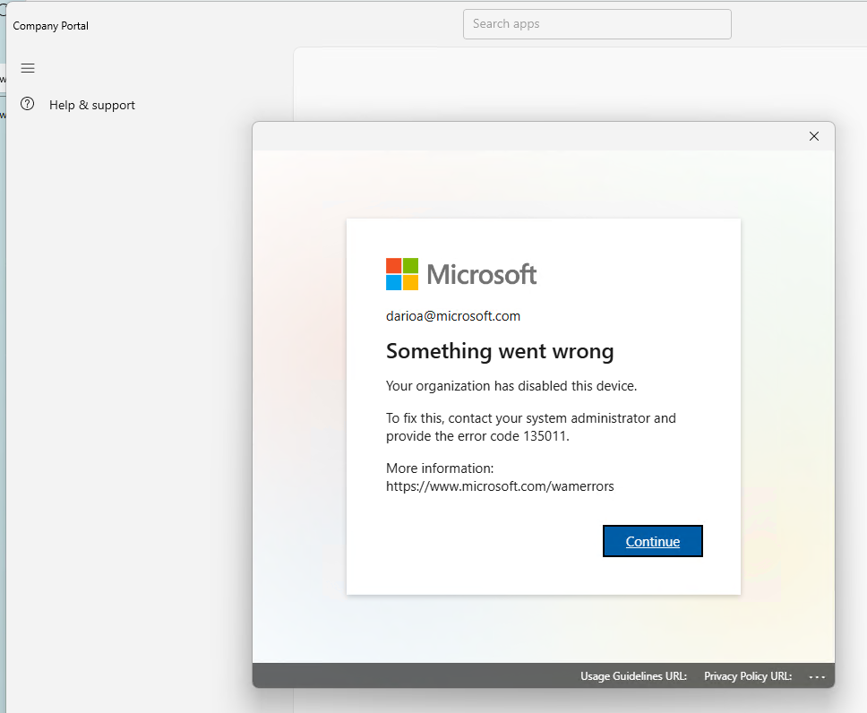

# ISSUE: Interactive auth fails with disabled device (AADSTS135011) - 20260601

Date: **01 Jun 2026**<br>
Author: **Dario Airoldi**

## Table of Contents

- [📝 DESCRIPTION](#-description)
- [ℹ️ CONTEXT INFORMATION / REPRO STEPS](#ℹ️-context-information--repro-steps)
- [🔍 ANALYSIS](#-analysis)
- [🛠️ RESOLUTION](#️-resolution)
- [➕ ADDITIONAL INFORMATION](#-additional-information)
- [📚 REFERENCES](#-references)

## 📝 DESCRIPTION

Interactive authentication against Microsoft Entra ID (formerly Azure AD) fails with the WAM (Web Account Manager) dialog:

```text
Something went wrong
Your organization has disabled this device.
To fix this, contact your system administrator and
provide the error code 135011.
```



The error code **135011** maps to the Entra STS code **`AADSTS135011`** — *"Device used during the authentication is disabled."*

## ℹ️ CONTEXT INFORMATION / REPRO STEPS

- The user signs in interactively with a work/school account on a Windows device that was previously joined or registered to a Microsoft Entra tenant.
- Authentication reaches Entra ID, MFA may succeed, then the dialog appears and the sign-in is blocked.
- The same account can sign in successfully from a different device, which confirms the block is **device-scoped, not user-scoped**.

## 🔍 ANALYSIS

### What the error means

When a Windows device is Entra-joined, Entra-registered, or hybrid-joined, Entra ID issues it a **Primary Refresh Token (PRT)**. The PRT is what enables single sign-on for all apps on that device. Its validity depends on the device object being active in Entra ID.

`AADSTS135011` is returned when the device object exists in the tenant directory but its **`accountEnabled`** flag is set to `false`. The PRT cannot be issued, so every interactive sign-in that requires the device identity fails — regardless of the user.

Common causes:

1. An administrator (or the user themselves, via the **My Apps** portal) explicitly disabled the device.
2. A stale-device cleanup policy disabled it after inactivity.
3. For **hybrid-joined** devices: the on-premises AD computer account was disabled, removed from the sync OU, or removed from the sync scope, which propagated to Entra ID via Entra Connect.
4. A duplicate device object exists and the active one was disabled by mistake.

### Who is "the administrator"?

The dialog isn't talking about a Windows local admin or a Microsoft personal-account admin. It means the **admin of the Entra ID tenant** that owns the work/school account you're signing in with. Concretely:

- If the account looks like `you@contoso.onmicrosoft.com` or `you@contoso.com` → the admin is the **IT admin of the `contoso` tenant** (typically holds the **Global Administrator**, **Cloud Device Administrator**, or **Intune Administrator** role).
- If the tenant was created by you (e.g., a personal Microsoft 365 / Developer / Family tenant) → **you are the admin**, and you can fix it yourself in the Entra admin center.
- If you don't know the tenant, you can discover it by inspecting the UPN domain of the signed-in account, or by visiting `https://myaccount.microsoft.com` from a working device — the tenant name and contact admin are surfaced there.

## 🛠️ RESOLUTION

Three resolution paths, depending on what access you have.

### Path A — You are an admin of the tenant (re-enable the device)

1. Sign in to the [Microsoft Entra admin center](https://entra.microsoft.com) with an account that has **Global Administrator**, **Cloud Device Administrator**, or **Intune Administrator** role.
2. Go to **Identity** > **Devices** > **All devices**.
3. Filter by the user name or the device name. Note the **Device ID** (object ID) and confirm **Enabled = No**.
4. Select the device, then select **Enable** on the command bar.
5. On the affected device, sign out and sign back in. PRT issuance can take up to an hour to propagate; if it doesn't recover, run `dsregcmd /forcerecovery` from an elevated command prompt (Entra-joined devices only) and sign in through the dialog that appears.

For hybrid-joined devices, also verify on-premises AD: the matching computer account must be **enabled** and in an OU that's in the Entra Connect sync scope, otherwise the next sync cycle will disable the Entra device again.

### Path B — You are not an admin (collect info, then contact the admin)

Provide the admin with:

- Your UPN (the work/school email you tried to sign in with).
- The **device name** (run `hostname` in a terminal).
- The **Device ID** (run `dsregcmd /status` in an elevated command prompt and copy the `DeviceId` value under the **Device State** section).
- The error code: **135011 / AADSTS135011**.
- The approximate time of the failed sign-in (helps locate the entry in Entra **Sign-in logs**).

Find the admin via `https://myaccount.microsoft.com` > **Organizations** (lists the tenant and admin contact), or via your company's IT help desk.

### Path C — Device is unrecoverable (re-register / re-join)

If the device object was deleted (not just disabled) or the admin asks you to start fresh:

```powershell
# Run elevated. Removes the current Entra join/registration state.
dsregcmd.exe /leave

# Verify
dsregcmd.exe /status
# Expect AzureAdJoined : NO  and  WorkplaceJoined : NO
```

Then re-register the account from **Settings > Accounts > Access work or school > Connect**, and complete the sign-in flow. The device gets a fresh object in Entra ID, enabled by default.

### Verification

After any of the above, the following should succeed:

- `dsregcmd /status` reports `AzureAdJoined : YES` and `AzureAdPrt : YES`.
- Interactive sign-in to a tenant resource (e.g., `https://portal.azure.com`) completes without the 135011 dialog.

## ➕ ADDITIONAL INFORMATION

- Disabling a device **does not** sign the user out of existing sessions immediately. Revocation can take **up to one hour** to propagate to issued tokens.
- For lost/stolen devices, prefer **wipe** over **disable** if the device is Intune-enrolled — disabling only blocks future PRT issuance, it doesn't remove already-cached tokens or local data.
- The link shown in the dialog (`https://www.microsoft.com/wamerrors`) is a generic WAM diagnostics page and rarely gives device-specific guidance for 135011.

## 📚 REFERENCES

- [Microsoft Entra authentication and authorization error codes — AADSTS135011](https://learn.microsoft.com/entra/identity-platform/reference-error-codes#aadsts-error-codes) 📘 [Official]<br>
  Authoritative mapping of `AADSTS135011` to *"Device used during the authentication is disabled."*

- [Microsoft 365 Apps activation error: "Your organization has disabled this device"](https://learn.microsoft.com/troubleshoot/microsoft-365-apps/activation/your-organization-disabled-this-device) 📘 [Official]<br>
  Step-by-step admin and end-user troubleshooting for the same dialog, including `dsregcmd /leave`, `dsregcmd /forcerecovery`, and BrokerPlugin cache reset.

- [Microsoft Entra device management FAQ — "Your organization has disabled the device"](https://learn.microsoft.com/entra/identity/devices/faq#i-see-the-device-record-under-the-user-info-and-i-see-the-state-as-registered-am-i-set-up-correctly-to-use-conditional-access) 📘 [Official]<br>
  Explains how PRT validity depends on device state and enumerates the four common scenarios that disable a device.

- [Re-enable a device that was disabled — Microsoft Entra admin center steps](https://learn.microsoft.com/entra/identity/devices/faq#i-disabled-or-deleted-my-device,-but-the-local-state-on-the-device-says-it's-registered-what-should-i-do) 📘 [Official]<br>
  Admin procedure to re-enable an Entra device and per-join-type recovery commands (`dsregcmd /forcerecovery`, `dsregcmd /leave`).

- [Troubleshoot Primary Refresh Token (PRT) issues on Windows devices](https://learn.microsoft.com/entra/identity/devices/troubleshoot-primary-refresh-token) 📘 [Official]<br>
  Deep dive on PRT lifecycle, event log diagnostics, and AADSTS error correlation — useful when re-enabling the device alone doesn't restore SSO.

- [Microsoft Q&A — Need to re-enable a device that was accidentally disabled](https://learn.microsoft.com/answers/a/12750984) 📒 [Community]<br>
  Real-world thread on the exact 135011 dialog, useful for the user-side perspective when not the admin.
