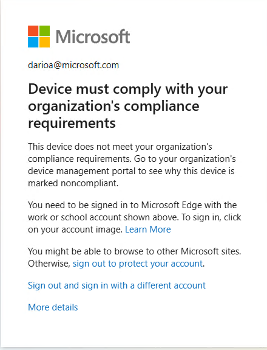

# ISSUE: After `dsregcmd /leave`, device is only Workplace-Registered and blocked as non-compliant - 20260601

Date: **01 Jun 2026**<br>
Author: **Dario Airoldi**

| Field | Value |
|---|---|
| Status | Diagnosed — resolution depends on device ownership |
| Severity | High (sign-in blocked, productivity impact) |
| Component | Microsoft Entra ID device join / Intune compliance |
| Affected device | `surfacepx0425a` (Windows, Microsoft corp tenant `72f988bf-…`) |
| Related | [01-overview.md](01-overview.md) — preceding `AADSTS135011` issue |

## Table of Contents

- [📝 DESCRIPTION](#-description)
- [ℹ️ CONTEXT INFORMATION / REPRO STEPS](#ℹ️-context-information--repro-steps)
- [🔍 ANALYSIS](#-analysis)
- [🛠️ RESOLUTION](#️-resolution)
- [✔️ RESOLUTION STATUS](#️-resolution-status)
- [🎓 LESSONS LEARNED](#-lessons-learned)
- [➕ ADDITIONAL INFORMATION](#-additional-information)
- [📚 REFERENCES](#-references)

## 📝 DESCRIPTION

After running `dsregcmd /leave` to recover from the earlier `AADSTS135011` failure (see [01-overview.md](01-overview.md)) and re-adding the work account, interactive sign-in is now blocked by Conditional Access with:

```text
This device does not meet your organization's
compliance requirements. Go to your organization's
device management portal to see why this device is
marked noncompliant.
```



Mitigations attempted before diagnosis:

- Installed all pending Windows updates.
- Enabled BitLocker and encrypted the system drive.
- Checked the device entry in the Entra admin center — shown as **compliant**.

The local sign-in dialog still reports non-compliant, so the **device-local Conditional Access verdict disagrees with the portal view**.

## ℹ️ CONTEXT INFORMATION / REPRO STEPS

1. Earlier failure: `AADSTS135011` ("Device used during the authentication is disabled") on the same device — documented in [01-overview.md](01-overview.md).
2. As a recovery step, ran elevated:

   ```powershell
   dsregcmd.exe /leave
   dsregcmd.exe /status   # confirmed AzureAdJoined : NO, WorkplaceJoined : NO
   ```

3. Re-added the work account via **Settings > Accounts > Access work or school > Connect**, signing in at the top of the dialog with the corp UPN.
4. Enabled BitLocker locally and ran Windows Update to full.
5. Attempted interactive sign-in to a tenant resource → blocked by the compliance dialog above.

### Evidence — current `dsregcmd /status`

```text
+----------------------------------------------------------------------+
| Device State                                                         |
+----------------------------------------------------------------------+
             AzureAdJoined : NO
          EnterpriseJoined : NO
              DomainJoined : NO
               Device Name : surfacepx0425a

+----------------------------------------------------------------------+
| User State                                                           |
+----------------------------------------------------------------------+
                    NgcSet : NO
           WorkplaceJoined : YES
          WorkAccountCount : 1
             WamDefaultSet : NO

+----------------------------------------------------------------------+
| SSO State                                                            |
+----------------------------------------------------------------------+
                AzureAdPrt : NO
       AzureAdPrtAuthority : NO

+----------------------------------------------------------------------+
| Work Account 1                                                       |
+----------------------------------------------------------------------+
         WorkplaceDeviceId : 59dd8df2-e2a8-412c-a5f7-1df0c4cf62a8
 DeviceCertificateValidity : [ 2026-06-01 14:10:46 UTC -- 2036-06-01 14:40:46 UTC ]
         WorkplaceTenantId : 72f988bf-86f1-41af-91ab-2d7cd011db47
       WorkplaceTenantName : Microsoft
           WorkplaceMdmUrl : https://enrollment.manage-beta.microsoft.com/EnrollmentServer/Discovery.svc
                    NgcSet : NO

+----------------------------------------------------------------------+
| Ngc Prerequisite Check                                               |
+----------------------------------------------------------------------+
            IsDeviceJoined : NO
             IsUserAzureAD : NO
            DeviceEligible : NO
              PreReqResult : WillNotProvision
```

## 🔍 ANALYSIS

### What the status output proves

| Indicator | Value | Meaning |
|---|---|---|
| `AzureAdJoined` | **NO** | Device is **not** Entra-joined |
| `WorkplaceJoined` | **YES** | Device is only **Entra-registered** (a BYOD-style "Add work account" state) |
| `AzureAdPrt` | NO | No Primary Refresh Token issued — expected for Registered-only devices; required for corp SSO |
| `WorkplaceMdmUrl` | `enrollment.manage-beta.microsoft.com` | Intune enrollment endpoint advertised, but full MDM enrollment under `MdmUrl` is absent |
| `DeviceCertificateValidity` | issued at 14:10 UTC the same day | Re-registration happened just now → this is the current state, not stale data |
| `Ngc PreReqResult` | `WillNotProvision` | Windows Hello cannot provision because the device isn't AAD-joined |

### Root cause

The recovery step succeeded in leaving the previous (disabled) device object, but the re-add was performed with the wrong join type. The **"Connect" button at the top of the Add work account flow** produces *Workplace-Registered* — a lightweight BYOD state intended for personal devices accessing corp data through MAM-protected apps. The link at the bottom of the same dialog — **"Join this device to Azure Active Directory"** — is what produces *Entra-Joined*.

Microsoft corp Conditional Access policies require **Entra-Joined + Intune-Compliant** for full sign-in. A Workplace-Registered device:

- does **not** receive a Primary Refresh Token,
- is **not** auto-enrolled in Intune,
- is **never evaluated** by the compliance policies applied to corp devices, and therefore
- is treated as **non-compliant** by Conditional Access regardless of local hardening.

### Why the portal "looks compliant"

The compliant record visible in the Entra admin center is almost certainly the **previous device object** — the one that was disabled and triggered [01-overview.md](01-overview.md). After `dsregcmd /leave`, the prior object remains in the tenant directory; the re-add created a **new** object (the `WorkplaceDeviceId` value `59dd8df2-…` reflects the new Registered identity). Conditional Access evaluates the *current* device's verdict, not the historical one.

### Why post-hoc hardening did not help

- BitLocker enabled locally is not the same as **BitLocker recovery key escrowed to Entra/Intune**. Even on a properly Joined device, escrow is required to satisfy compliance.
- Windows Update brings the OS in line with patch-level policy items, but those items are only evaluated once Intune has enrolled the device — which has not happened here.

## 🛠️ RESOLUTION

Two divergent paths depending on device ownership. **Establish which one applies before acting** — manual join of a corp device can leave it half-enrolled and harder to recover than the original `AADSTS135011`.

### Path A — Device is corporate-issued (recommended for `surfacepx0425a`)

The hostname pattern suggests a corp-imaged Surface. The supported recovery is **not** manual join.

1. Do not perform further `dsregcmd` operations.
2. Open a ticket with MSHelp / the device's owning team and request **Autopilot reset** or re-imaging.
3. Provide the ticket with: hostname (`surfacepx0425a`), `WorkplaceDeviceId` (`59dd8df2-e2a8-412c-a5f7-1df0c4cf62a8`), `WorkplaceTenantId` (`72f988bf-…`), the timestamps from the failed sign-in, and a reference to the preceding `AADSTS135011` ticket.

### Path B — Device is personally-owned and policy permits Entra Join

1. Leave the current Registered state:

   ```powershell
   # Elevated
   dsregcmd /leave
   dsregcmd /status   # expect WorkplaceJoined : NO and AzureAdJoined : NO
   ```

2. Sign out of Windows and back in.
3. **Settings > Accounts > Access work or school > Connect**. In the dialog, **do not** sign in at the top. Click the link near the bottom:

   > **Join this device to Azure Active Directory**

4. Complete sign-in + MFA + organization terms. Allow the post-join reboot / lock-screen re-sign-in.
5. Verify:

   ```powershell
   dsregcmd /status
   # Expect:
   #   AzureAdJoined : YES
   #   AzureAdPrt    : YES
   #   TenantName    : Microsoft
   #   MdmUrl        : https://manage.microsoft.com/...    (NOT WorkplaceMdmUrl)
   ```

6. Wait ~10 minutes, then force an Intune sync: **Settings > Accounts > Access work or school > [Microsoft] > Info > Sync**.
7. Escrow the BitLocker recovery key (Intune compliance requires it):

   ```powershell
   $KeyID = (Get-BitLockerVolume -MountPoint "C:").KeyProtector |
            Where-Object { $_.KeyProtectorType -eq 'RecoveryPassword' } |
            Select-Object -ExpandProperty KeyProtectorId

   BackupToAAD-BitLockerKeyProtector -MountPoint "C:" -KeyProtectorId $KeyID
   ```

   If no `RecoveryPassword` protector exists yet:

   ```powershell
   Add-BitLockerKeyProtector -MountPoint "C:" -RecoveryPasswordProtector
   ```

8. Open the **Company Portal** app → **Devices** → this device → **Check device settings**. The verdict will list the specific failing policy item, if any remain.

### Path C — Personal device, policy forbids Entra Join

If the corp tenant disallows personal-device Join, full sign-in is not achievable. Use only **MAM-protected apps** (Outlook mobile, Teams, Edge with the corp work profile) over the existing Workplace-Registered state. No further local action recovers the blocked sign-in.

## ✔️ RESOLUTION STATUS

**Status:** Diagnosed, resolution pending choice of path.

Verification checklist (apply after the chosen path completes):

- [ ] `dsregcmd /status` reports `AzureAdJoined : YES` (Path A or B)
- [ ] `dsregcmd /status` reports `AzureAdPrt : YES`
- [ ] `MdmUrl` populated (not just `WorkplaceMdmUrl`)
- [ ] BitLocker `RecoveryPassword` protector present **and** escrowed to Entra
- [ ] Company Portal shows the device as **Compliant** with no outstanding items
- [ ] Interactive sign-in to a tenant resource (e.g., `https://portal.azure.com`) succeeds without the compliance dialog

Follow-up actions:

- [ ] If Path A: track the MSHelp ticket through Autopilot reset and re-validate.
- [ ] Clean up the stale, disabled device object from the original failure (Entra admin center > Devices) once recovery is confirmed — keeps the directory tidy and avoids future duplicate-device confusion.

## 🎓 LESSONS LEARNED

- The **"Connect"** button and the **"Join this device to Azure Active Directory"** link in the Add-work-account dialog produce **fundamentally different device states**. Only the latter satisfies corp Conditional Access. The UI affordances are easy to confuse under time pressure.
- `dsregcmd /leave` is a **one-way door** on managed devices: leaving is easy, rejoining correctly without IT involvement is not. Prefer Path A's documented recovery (Autopilot / IT ticket) over manual `/leave` on any device that is, or might be, corp-issued — even when the original symptom (`AADSTS135011`) feels like it warrants self-service.
- The Entra admin center "Compliant" badge always refers to a **specific device object**. After any join/leave cycle, the badge may apply to a prior object that no longer represents the running device. Always cross-check `WorkplaceDeviceId` / `DeviceId` from `dsregcmd /status` against the object inspected in the portal.
- BitLocker compliance in Intune requires **key escrow**, not just encryption. Local `manage-bde` reports are insufficient evidence of compliance.

## ➕ ADDITIONAL INFORMATION

- `NgcSet : NO` and `PreReqResult : WillNotProvision` in the status output are **consequences**, not causes — Windows Hello for Business will not provision on a Registered-only device. Both clear automatically once the device is properly Entra-joined.
- The `enrollment.manage-beta.microsoft.com` URL in `WorkplaceMdmUrl` is the Intune **beta** enrollment service. Its presence simply reflects that the corp tenant publishes the MDM Terms-of-Use URL to Registered devices; it does **not** indicate enrollment has completed.
- Conditional Access typically takes **up to 1 hour** to re-evaluate a device's compliance state after a sync. Sign out and back in after waiting, rather than retrying immediately.

## 📚 REFERENCES

- [How it works: Device registration — Entra-joined vs. Workplace-registered vs. Hybrid](https://learn.microsoft.com/entra/identity/devices/device-registration-how-it-works) 📘 [Official]<br>
  Authoritative comparison of the three device join states and which Conditional Access scenarios each one supports.

- [Microsoft Entra joined devices](https://learn.microsoft.com/entra/identity/devices/concept-directory-join) 📘 [Official]<br>
  Defines the Entra-Joined state and its prerequisites for Intune auto-enrollment and PRT issuance.

- [Conditional Access: Require compliant or hybrid-joined device](https://learn.microsoft.com/entra/identity/conditional-access/concept-conditional-access-grant#require-device-to-be-marked-as-compliant) 📘 [Official]<br>
  Explains the grant control that produces the "device does not meet your organization's compliance requirements" dialog.

- [`dsregcmd` command reference](https://learn.microsoft.com/entra/identity/devices/troubleshoot-device-dsregcmd) 📘 [Official]<br>
  Field-by-field guide to interpreting `dsregcmd /status` output — directly applicable to the evidence captured above.

- [Use Intune to manage BitLocker recovery keys](https://learn.microsoft.com/mem/intune/protect/encrypt-devices#save-bitlocker-recovery-keys-for-azure-ad-joined-devices) 📘 [Official]<br>
  Documents the BitLocker key escrow requirement for Intune compliance and the `BackupToAAD-BitLockerKeyProtector` cmdlet usage.

- [Enroll Windows devices automatically using Group Policy / Autopilot](https://learn.microsoft.com/mem/intune/enrollment/quickstart-setup-auto-enrollment) 📘 [Official]<br>
  Reference for the supported corp-device path (Path A) and why manual join of corp devices is discouraged.

- [Why a previously disabled device may need full re-registration](https://learn.microsoft.com/entra/identity/devices/faq#i-disabled-or-deleted-my-device-but-the-local-state-on-the-device-says-its-registered-what-should-i-do) 📘 [Official]<br>
  Background that ties this issue back to the preceding `AADSTS135011` symptom in [01-overview.md](01-overview.md).
