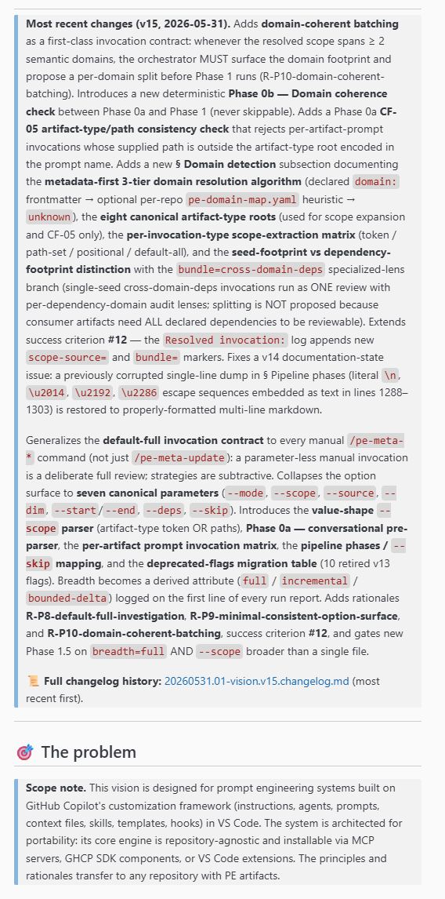

# ISSUE: Vision "Most recent changes" block grows unbounded across versions - 20260601

Date: **01 Jun 2026** 
Author: **Dario Airoldi**

## Table of Contents

- [📝 DESCRIPTION](#-description)
- [ℹ️ CONTEXT INFORMATION / REPRO STEPS](#ℹ️-context-information--repro-steps)
- [🔍 ANALYSIS](#-analysis)
- [🛠️ RESOLUTION](#️-resolution)
- [➕ ADDITIONAL INFORMATION](#-additional-information)
- [📚 REFERENCES](#-references)

## 📝 DESCRIPTION

The `**Most recent changes (vN, YYYY-MM-DD).**` blockquote that opens every vision document in [self-updating-prompt-engineering/](../../../../../06.00-idea/self-updating-prompt-engineering/) accretes detail every version and quickly becomes unreadable. In [20260531.01-vision.md](../../../../../06.00-idea/self-updating-prompt-engineering/20260531.01-vision.md), this block reached **~440 words across two dense paragraphs** — large enough to push the actual vision content below the fold and to compete with the `## 🎯 The problem` section for the reader's first attention.

The block's purpose is a TLDR for orientation. Its content was effectively duplicating the canonical changelog in the sibling [20260531.01-vision.changelog.md](../../../../../06.00-idea/self-updating-prompt-engineering/20260531.01-vision.changelog.md), defeating the single-source-of-truth principle and inflating the vision document's token footprint.

## ℹ️ CONTEXT INFORMATION / REPRO STEPS

| Field | Value |
|---|---|
| **Affected document** | [20260531.01-vision.md](../../../../../06.00-idea/self-updating-prompt-engineering/20260531.01-vision.md) |
| **Block location** | Immediately before `## 🎯 The problem` |
| **Measured size (before)** | ~440 words across 2 paragraphs |
| **Scope-note size** | ~60 words |
| **Sibling changelog** | [20260531.01-vision.changelog.md](../../../../../06.00-idea/self-updating-prompt-engineering/20260531.01-vision.changelog.md) (carries full history) |
| **Governing instruction file** | [vision-frontmatter.instructions.md](../../../../../.github/instructions/vision-frontmatter.instructions.md) v1.2.0 |

**To reproduce:**

1. Open [20260531.01-vision.md](../../../../../06.00-idea/self-updating-prompt-engineering/20260531.01-vision.md) in a Markdown preview.
2. Observe the `## Table of contents` heading, then scroll down past it.
3. Note that the `**Most recent changes (v15, 2026-05-31).**` blockquote occupies more vertical space than `## 🎯 The problem` plus `## 💡 The goal` combined.
4. Compare with the sibling changelog file — every sentence in the block is already restated there with equal or greater detail.

## 🔍 ANALYSIS

### Root cause

The TLDR block has no declared size budget. Each version's author tends to:

- Restate every notable change from the version (instead of headline-level highlights only).
- Stack the new version's summary on top of the previous version's summary, doubling the block at every release.
- Embed embedded escape-sequence detail, restoration notes, and per-section deltas that belong in the changelog.

Without a mechanical cap tied to a stable reference point on the page (the scope note), the block grows monotonically across versions even when individual authors apply restraint.

### Why this matters

| Concern | Impact |
|---|---|
| **Readability** | The block competes with `## 🎯 The problem` for the reader's first attention. Readers who land on the vision want the vision, not a release-note digest. |
| **Single source of truth** | Restating changelog content in the vision body violates the same principle the vision itself declares (`single-source-of-truth` P0). |
| **Token footprint** | Every consumer artifact that loads the vision via context budget pays for the bloat. |
| **Maintenance drift** | Two locations describing the same change (block + changelog) drift in wording across edits. |

### Why "twice the scope-note word count"

The scope note is a stable, version-invariant anchor that already exists at the top of every vision body. Its size reflects how much prose the document tolerates for orientation content. A 2× factor:

- Gives authors enough room for genuine highlights without being a one-liner.
- Is mechanically checkable — both blocks live in the same document; word count is deterministic.
- Scales with the vision's own verbosity preferences (a more concise scope note implies a more concise changes block).
- Provides a floor for documents with no scope note (the rule falls back to 80 words, the upper end of typical scope-note size).

### Existing governance

The rule was already authored in [vision-frontmatter.instructions.md](../../../../../.github/instructions/vision-frontmatter.instructions.md) v1.2.0 (dated 2026-06-01) under `### Most recent changes block — size cap`. The v15 vision document predates the rule's application and therefore still violated it at the time this issue was filed.

## 🛠️ RESOLUTION

### Step 1 — Confirm the rule exists in the instruction file (✅ done)

Verified that [vision-frontmatter.instructions.md](../../../../../.github/instructions/vision-frontmatter.instructions.md) v1.2.0 already encodes the cap under § `Body Conventions` › `Most recent changes block — size cap`:

- 2× scope-note word count when scope note present.
- 80-word fallback when absent.
- Excludes the bold lead-in and the trailing changelog-link line from the count.
- Overflow MUST be moved to the sibling changelog file.

No instruction-file edit was required.

### Step 2 — Apply the cap to v15 (✅ done)

Trimmed the v15 block from ~440 words (2 paragraphs) to ~108 words (1 paragraph), under the 120-word ceiling implied by the ~60-word scope note. The new block reads:

> **Most recent changes (v15, 2026-05-31).** Adds **domain-coherent batching** (R-P10): multi-domain scopes propose a per-domain split via the new non-skippable **Phase 0b — Domain coherence check**, with a **CF-05 artifact-type/path consistency check** in Phase 0a. Formalizes the **metadata-first 3-tier domain resolution algorithm** (declared `domain:` → optional `pe-domain-map.yaml` → `unknown`), the **eight canonical artifact-type roots**, and the **seed-vs-dependency footprint distinction** with the `bundle=cross-domain-deps` specialized-lens branch. Generalizes the **default-full invocation contract** to every `/pe-meta-*` command and collapses the surface to **seven canonical parameters** (`--mode`, `--scope`, `--source`, `--dim`, `--start`/`--end`, `--deps`, `--skip`). Adds Phase 0a conversational pre-parser, per-artifact prompt matrix, and pipeline/`--skip` mapping. Bootstraps the `principles:` block (additive). Adds rationales **R-P8/R-P9/R-P10** and success criterion **#12**.

All removed detail was verified to be already present in [20260531.01-vision.changelog.md](../../../../../06.00-idea/self-updating-prompt-engineering/20260531.01-vision.changelog.md) — no information was lost.

### Verification (✅ done)

| Check | Result |
|---|---|
| Block word count (excluding lead-in and link tail) | ~108 words ✅ |
| Ceiling (2 × ~60-word scope note) | ~120 words ✅ |
| All trimmed detail preserved in sibling changelog | ✅ |
| Headline-level highlights still surface every major v15 amendment family | ✅ |
| Quality-checklist item in `vision-frontmatter.instructions.md` satisfied | ✅ |

## ➕ ADDITIONAL INFORMATION

- The rule applies to **every future vision version**, not just v15. Authors of v16+ MUST recompute the cap against the then-current scope note and trim before publishing.
- When the scope note itself is rewritten and shrinks, the rule requires the changes block to be re-trimmed in the same edit (encoded in the instruction file).
- The cap is a **hard ceiling, not a writing-style preference** — authors who need more room MUST move detail into the changelog rather than expand the block.
- Multi-paragraph blocks are allowed only if the total word count still respects the cap. In practice, single-paragraph form is strongly recommended at the 80–120 word range.
- This issue does NOT propose mechanical enforcement (linting). The cap is currently a SHOULD/MUST in the instruction file and is checked manually during vision authoring and during `/pe-meta-update` runs that touch the vision.

## 📚 REFERENCES

- [vision-frontmatter.instructions.md](../../../../../.github/instructions/vision-frontmatter.instructions.md) 📘 [Repo] 
  Authoritative source for the cap rule (v1.2.0, § `Body Conventions` › `Most recent changes block — size cap`).

- [20260531.01-vision.md](../../../../../06.00-idea/self-updating-prompt-engineering/20260531.01-vision.md) 📒 [Repo] 
  The vision document where the cap was first applied (block trimmed from ~440 to ~108 words).

- [20260531.01-vision.changelog.md](../../../../../06.00-idea/self-updating-prompt-engineering/20260531.01-vision.changelog.md) 📒 [Repo] 
  Sibling canonical changelog that carries the full v15 amendment history — the destination for content overflowing the cap.

- [vision-amendment.instructions.md](../../../../../.github/instructions/vision-amendment.instructions.md) 📘 [Repo] 
  Consumer of the `principles:` block; complements the body-convention rules in `vision-frontmatter.instructions.md`.

- [documentation.instructions.md](../../../../../.github/instructions/documentation.instructions.md) 📘 [Repo] 
  Base layer that all Markdown files (including vision documents) inherit from.