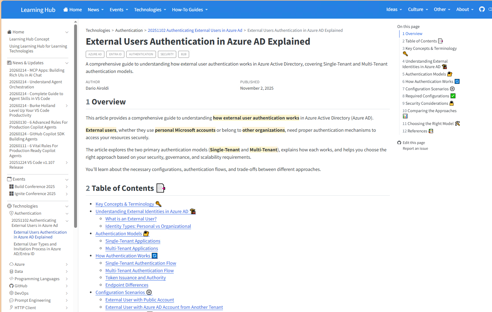

---
# Quarto Metadata
title: "Issue: Trailing heading emojis are hard to read in TOC and sidebar"
author: "Dario Airoldi"
date: "2026-06-04"
categories: [issue, theming, article-writing, accessibility, quarto]
description: "Article H2 headings place their emoji at the end of the line (## Title 🔑). When Quarto renders these in the narrow 'On this page' sidebar and the in-page Table of Contents, the emoji lands at a variable horizontal position, wraps away from its text, and reads with low visibility. Leading emojis (## 🔑 Title) fix this and already match the repo's article-writing standard."
draft: true
---

# Issue Report

**Issue Title:** Trailing heading emojis (`## Title 🔑`) are low-visibility and misalign in the TOC and "On this page" sidebar

**Date Reported:** 2026-06-04
**Reporter:** Dario Airoldi
**Status:** Investigated — fix proposed

| Field | Value |
|---|---|
| **Severity** | Low (readability / visual polish) |
| **Component** | Article H2 headings · Quarto right-nav (`On this page`) · in-page Table of Contents |
| **Framework / Tooling** | Quarto HTML render |
| **Symptom surface** | Any article using trailing-emoji headings (observed in the External Users Authentication article) |
| **Affected branch** | `main` |

---

## 📑 Table of Contents

- [📝 Observation](#-observation)
- [🔍 Context information](#-context-information)
- [🔬 Analysis](#-analysis)
- [⚖️ Options compared](#️-options-compared)
- [✅ Proposed alternative](#-proposed-alternative)
- [🚀 Next steps](#-next-steps)

---

## 📝 Observation

Emojis don't look very appealing at the right end of the line, and they're not very visible.
Moving them to the left side of the line would make them more visible and appealing.



In the screenshot, both the main-content H2 headings and the right-hand **On this page**
navigation carry their emoji **after** the text — for example, *Key Concepts & Terminology 🔑*
and *Understanding External Identities in Azure AD 🏗*.

---

## 🔍 Context information

The article in the screenshot is
[01-external-users-authentication-in-azure-ad-explained.md](../../../../03.00-tech/01.01-authentication/20251102-authenticating-external-users-in-azure-ad/01-external-users-authentication-in-azure-ad-explained.md).
Its H2 headings place the emoji at the **end** of the line:

```markdown
## Key Concepts & Terminology 🔑
## Understanding External Identities in Azure AD 🏗
## Authentication Models 🔐
## How Authentication Works 🔄
## Configuration Scenarios ⚙️
## Required Configurations ✅
## Security Considerations 🔒
## Comparing the Approaches 📊
## Choosing the Right Model 🛠
## References 📚
```

Quarto reuses each heading's text **verbatim** in three places: the main content, the in-page
**Table of Contents**, and the right-hand **On this page** sidebar. So whatever position the
emoji takes in the source is repeated in every surface.

> **Important:** The repository's own writing standard already requires the **opposite** of
> what this article does. The article-writing instruction mandates a *leading* emoji on every
> H2 (`## 🎯 Section title`). This article predates or violates that rule, which is why the
> emojis ended up trailing.

---

## 🔬 Analysis

Why trailing emojis read poorly, especially in the navigation panes:

1. **Variable horizontal position.** A trailing emoji sits at column *(length of the heading)*,
   so every heading's icon lands at a different spot. The eye can't scan a straight column of
   icons; it has to jump left-to-right across each full line first.

2. **Wrapping detaches the emoji from its text.** The **On this page** sidebar and the in-page
   TOC are narrow. When a long heading wraps, the trailing emoji is pushed onto a second line,
   visually separated from the words it belongs to (clearly visible for *Understanding External
   Identities in Azure AD 🏗* and *Comparing the Approaches 📊* in the screenshot).

3. **Low visibility / weak "icon" value.** An icon is most useful as a fixed-position visual
   anchor the reader can lock onto. Pushed to the far right at an unpredictable position, the
   emoji loses that anchoring value and just looks like trailing punctuation.

4. **Numbered-section interference.** Quarto prepends section numbers (`5 Authentication
   Models 🔐`). With numbers on the left and emoji on the right, the line has visual weight at
   both ends and nothing to anchor the middle.

5. **Standard inconsistency.** Because the repo standard is leading-emoji, trailing-emoji
   articles also render differently from every compliant article, breaking visual consistency
   across the site.

---

## ⚖️ Options compared

| Option | Example | Visibility | TOC / sidebar alignment | Wrap behavior | Matches repo standard |
|---|---|---|---|---|---|
| **A. Trailing emoji** (current) | `## Key Concepts & Terminology 🔑` | Low — variable far-right position | Poor — no icon column | Emoji detaches onto next line | ❌ No |
| **B. Leading emoji** (recommended) | `## 🔑 Key Concepts & Terminology` | High — fixed left anchor | Strong — forms a vertical icon rail | Emoji stays with its text | ✅ Yes |
| **C. No emoji** | `## Key Concepts & Terminology` | None | Clean but flat | N/A | ❌ No (standard requires emoji) |
| **D. Leading emoji + separator** | `## 🔑 — Key Concepts & Terminology` | High | Strong, but extra glyph adds noise | Stays with text | ⚠️ Partial |

**How the two main options look stacked in the sidebar:**

Trailing (current — icons scattered, hard to track):

```text
Key Concepts & Terminology        🔑
Understanding External
  Identities in Azure AD       🏗
Authentication Models            🔐
How Authentication Works       🔄
Configuration Scenarios          ⚙️
```

Leading (proposed — icons form a clean left rail):

```text
🔑  Key Concepts & Terminology
🏗  Understanding External Identities in Azure AD
🔐  Authentication Models
🔄  How Authentication Works
⚙️  Configuration Scenarios
```

---

## ✅ Proposed alternative

**Adopt Option B — leading emoji** (`## 🔑 Key Concepts & Terminology`).

It's the strongest choice on every axis that matters here:

- **Best readability and appeal.** The emoji becomes a fixed-position icon at the start of each
  line, forming a clean vertical rail in both the in-page TOC and the **On this page** sidebar.
  The eye can scan icons down a column instead of hunting across each line.
- **No wrap detachment.** Because the emoji leads the text, it always stays attached to its
  heading even when the line wraps in a narrow pane.
- **Zero new rules.** This is already the repository standard — the article-writing instruction
  requires every H2 to start with a relevant emoji. Fixing the article makes it *compliant*
  rather than introducing a new convention.

Concrete change for the affected article (move each emoji from the end to the start):

```markdown
## 🔑 Key Concepts & Terminology
## 🏗 Understanding External Identities in Azure AD
## 🔐 Authentication Models
## 🔄 How Authentication Works
## ⚙️ Configuration Scenarios
## ✅ Required Configurations
## 🔒 Security Considerations
## 📊 Comparing the Approaches
## 🛠 Choosing the Right Model
## 📚 References
```

The in-page **Table of Contents** list items in that article (which mirror the heading text)
should be updated the same way so the leading-emoji style is consistent end to end.

---

## 🚀 Next steps

- Move the H2 emojis to the leading position in
  [01-external-users-authentication-in-azure-ad-explained.md](../../../../03.00-tech/01.01-authentication/20251102-authenticating-external-users-in-azure-ad/01-external-users-authentication-in-azure-ad-explained.md). (🟡 todo)
- Update that article's hand-written Table of Contents list items to match. (🟡 todo)
- Sweep the rest of the site for other trailing-emoji headings and bring them into line with the
  leading-emoji standard. (📌 next steps)