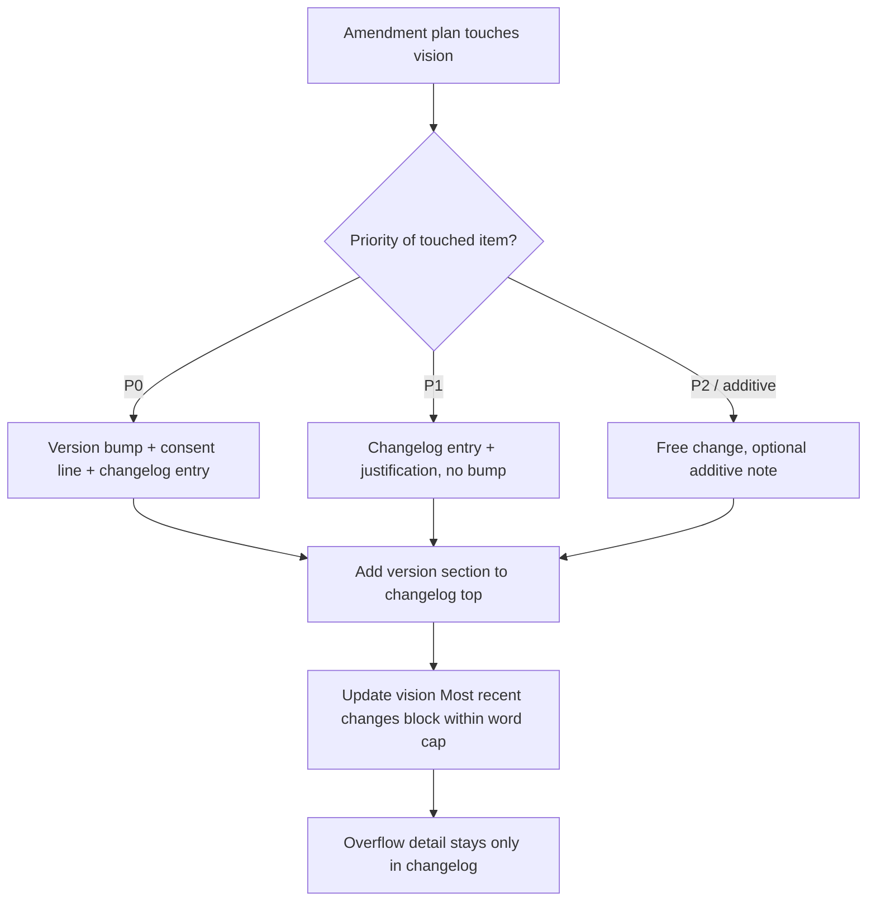
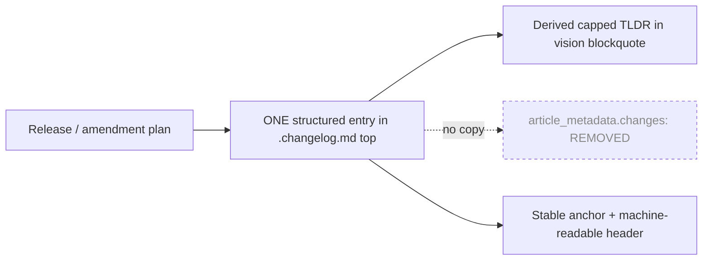

# Changelog management for the self-updating PE vision

## 🎯 Why this analysis exists

The self-updating PE vision ([20260531.01-vision.md](../../../../../../06.00-idea/self-updating-prompt-engineering/20260531.01-vision.md)) keeps its history in a sibling changelog ([20260531.01-vision.changelog.md](../../../../../../06.00-idea/self-updating-prompt-engineering/20260531.01-vision.changelog.md)). While reviewing how that split works, a concrete redundancy surfaced — the vision still carries a parallel `article_metadata.changes:` history that the dedicated changelog file made obsolete — and a broader set of structural, content-discipline, and governance gaps became visible.

This document records the current model, enumerates every identified issue with a proposed solution, and defines a target state in which the changelog becomes a first-class, validatable artifact rather than a hand-maintained free-prose log.

---

## 📋 How changelog management works today

The vision uses a **vision + sibling changelog** split governed by [vision-frontmatter.instructions.md](../../../../../../.github/instructions/vision-frontmatter.instructions.md) and [vision-amendment.instructions.md](../../../../../../.github/instructions/vision-amendment.instructions.md):

| Element | Role | Authority |
|---|---|---|
| Vision body **"Most recent changes"** blockquote | Capped TLDR of the latest release + `📜 Full changelog history:` link | Mandated + word-capped by `vision-frontmatter.instructions.md` |
| Sibling **`*.changelog.md`** | Full per-version canonical history, newest-first, `status: living` | The authoritative source |
| Bottom **`article_metadata.changes:`** array | A second full per-version history embedded in vision metadata | **No schema authority** — legacy accretion |

**Entry triggers** (from the amendment rules): a **P0** principle/scope touch requires a version bump + consent line + changelog entry; a **P1** touch requires a changelog entry + justification (no bump); **P2/additive** changes are free; **deferrals** record their reason in the changelog.

**Entry shape** (observed in the file): version heading (`## v15.6 — 2026-06-12`, descending) → bold one-line summary with companion-plan + motivating-issue links → itemized `V1/V2…` changes tagging each priority touch → closing accounting line ("No P0 touched", version bump, parked work).

---

## 🔎 Findings

### F1 — Redundant `article_metadata.changes:` history in the vision (`single-source-of-truth`, HIGH)

The vision carries changelog data in **three** places. With the dedicated `.changelog.md` extracted, the bottom `article_metadata.changes:` array (vision lines ~2287+, holding v15.5, v15.0–v15.4, v14, v12, v11, v10, v9.1…) is dead weight:

- **Not in the schema.** [02-dual-yaml-metadata.md](../../../../../../.copilot/context/90.00-learning-hub/02-dual-yaml-metadata.md) defines `article_metadata` with `filename`, `created`, `last_updated`, `version`, `status`, `content_type`, `word_count`, etc. — there is **no `changes:` field**. It predates the changelog extraction.
- **Already drifted.** The block stops at **v15.5** while the changelog (and vision `version:`) is at **v15.6** — proof the duplicate is not being kept in sync.
- **Costs every load.** Each release would have to be written twice; the block consumes tokens and attention on every read for zero canonical value.

**Fix:** delete `article_metadata.changes:` from the vision; migrate any salvageable v9.1–v12 detail into the changelog's *Earlier versions* section (or an archive file).

### F2 — No rule forbids the duplication, so it can regress (governance gap, MEDIUM)

`vision-frontmatter.instructions.md` mandates the capped blockquote + changelog link and caps the blockquote size, but **never states** that per-version history must live *only* in the changelog. The redundancy slipped in because no rule closes that door.

**Fix:** add a rule — *"per-version history lives ONLY in the sibling `.changelog.md`; vision frontmatter/metadata MUST NOT carry a parallel `changes:` list."*

### F3 — Inconsistent version-heading grain in the changelog (consistency, MEDIUM)

Headings mix grains (`## v15.6`, `## v15`, `## v13.1`, `## v14`) while entry bodies use three-part SemVer (`15.6.0`, `15.0.2`). Headings are neither uniformly sortable nor uniformly anchor-able.

**Fix:** standardize on full SemVer + date headings, e.g. `## v15.6.0 — 2026-06-12`.

### F4 — The `## v15` section is a catch-all bucket (structure, MEDIUM)

It holds v15.0.2 **plus** several "additive — no version bump" sub-releases that carry their *own* embedded dates (2026-06-01). These are effectively separate releases crammed under one heading, breaking the "one heading per version, newest-first" model and defeating deep-linking.

**Fix:** give each dated sub-release its own anchor-able heading (or a clearly nested, dated sub-entry convention).

### F5 — No stable anchors / entry IDs; cross-references are title-fragile (reference integrity, HIGH)

Downstream prompts deep-link by **section title** — e.g. [pe-meta-update.prompt.md](../../../../../../.github/prompts/00.09-pe-meta/pe-meta-update.prompt.md) emits CF-05 messages pointing to *"vision v15 changelog § Historical: v13 → v14 deprecated flag map"*. Rename that heading and every rejection message breaks silently.

**Fix:** adopt stable heading IDs / an explicit anchor convention for any changelog section referenced from another artifact.

### F6 — Entries mix change, implementation, and corrections without structure (content discipline, MEDIUM)

Entries interleave the actual change with inline same-day self-corrections (v15.5's *"Same-day correction… walked back as redundant"*) and "Deviation from the draft plan" notes. Valuable provenance, but it buries the headline change.

**Fix:** template each entry — **Change → Priority touch → Deviations/Corrections → Parked work** — using data already present.

### F7 — No machine-readable layer (automation gap, HIGH)

The changelog of a *metadata-driven self-updating system* is the one artifact its own machinery cannot parse — it is entirely prose. The PE engine cannot answer "what was the last P0 change?" or "which releases touched `minimal-canonical-surface`?" from its own history.

**Fix:** add a minimal structured header per entry (version, date, priority-touch P0/P1/additive, companion-plan link, P0-touched boolean) so the `/pe-meta-*` machinery can consume it.

### F8 — "No P0 touched" accounting is informal prose (auditability, MEDIUM)

The version-bump and autonomy rules depend on the P0/P1 status that each entry currently states in a closing sentence.

**Fix:** promote it to a fixed field (e.g. `Priority touch: P1 | version bump: minor`) so the version-bump rule is auditable, not narrated.

### F9 — No retention / archival policy (lifecycle gap, MEDIUM)

The changelog truncates v1–v12 into a one-paragraph *Earlier versions* note, but there is no rule for **when** compaction happens or **where** detail goes. The file will keep accreting toward v16+.

**Fix:** define a policy — *"keep full detail for the current major; archive prior majors to `*.changelog.archive.md`"* — bounding the file like the blockquote word-cap bounds the vision.

### F10 — Provenance links are unchecked (reference integrity, MEDIUM)

Every entry links to a companion plan and motivating overview under `src/docs/90. Issues/…`. Nothing validates they still resolve; broken provenance erodes the audit trail.

**Fix:** include the changelog explicitly in a link-check pass using the existing [check-links-enhanced.ps1](../../../../../../scripts/check-links-enhanced.ps1).

### F11 — The changelog file has conventions but no codified rules (governance gap, MEDIUM)

`vision-frontmatter.instructions.md` (`applyTo: 06.00-idea/**/*vision*.md`) matches `*vision*.changelog.md` by glob, but its rules only address the vision body's blockquote — never the changelog file's own structure (heading grain, entry template, newest-first ordering, retention).

**Fix:** extend that instruction file with a **"Changelog file rules"** section (or add a dedicated instruction file) covering F3–F10.

### F12 — No "Unreleased / pending" staging area (workflow, LOW)

Entries appear fully formed at release time, creating "write it all at once at the end" pressure that produces the dense multi-paragraph entries seen in F6.

**Fix:** add a Keep-a-Changelog-style `## Unreleased` section at the top so in-progress amendment plans accumulate notes before a version is cut.

### F13 — The MAJOR version is baked into the filename (file identity, MEDIUM) — ✅ done 2026-06-12

The vision and changelog filenames used to carry the major version — `20260531.01-vision.v15.md` and `20260531.01-vision.v15.changelog.md`. This duplicated the `version:` metadata attribute and forced a **file rename on every major bump** (the `old/` folder still holds a `…vision.v14.changelog.md`), which in turn broke every link and citation across the repo. The version belongs in **metadata only**; the date-prefixed stem (`20260531.01-vision`) is the stable file identity for a *living* document.

**Fix (applied):** standardized the filenames to drop the version segment:

| Was | Now |
|---|---|
| `20260531.01-vision.v15.md` | `20260531.01-vision.md` |
| `20260531.01-vision.v15.changelog.md` | `20260531.01-vision.changelog.md` |
| `20260531.01-vision.v15-further-improvements.md` | `20260531.01-vision-further-improvements.md` |

`version: "15.6.0"` stays in frontmatter as the single source of version truth. A major bump now advances metadata **in place** — no new file, no rename, history stays in the one changelog.

**Execution note (why this was not a blind find-replace).** The version *narrative* tokens (`vision v15`, `v15.4`, `15.5.0`) never contain the `.md` filename, so replacing only the literal filename strings `20260531.01-vision.v15.md` / `20260531.01-vision.v15.changelog.md` updated every file reference while leaving all historical version narratives intact. The `v13`/`v14` filenames are distinct strings and were not touched. All ~160 source references across plans, context files, the instruction set, prompts, and scripts were repointed; the renamed files' own internal links and `filename:` metadata were updated too.

---

## 🧮 Consolidated issue register

| # | Issue | Category | Severity | Proposed solution |
|---|---|---|---|---|
| F1 | Redundant `article_metadata.changes:` history | Single source of truth | **High** | Delete block; migrate salvage to changelog *Earlier versions* |
| F2 | No rule forbids the duplication | Governance | Medium | Add "history lives only in `.changelog.md`" rule |
| F3 | Inconsistent version-heading grain | Consistency | Medium | Standardize `## vX.Y.Z — YYYY-MM-DD` |
| F4 | `## v15` catch-all bucket | Structure | Medium | One anchor-able heading per dated (sub-)release |
| F5 | Title-fragile cross-references | Reference integrity | **High** | Stable heading IDs / anchor convention |
| F6 | Unstructured mixed-content entries | Content discipline | Medium | Per-entry template (Change/Priority/Deviations/Parked) |
| F7 | No machine-readable layer | Automation | **High** | Structured per-entry header for PE machinery |
| F8 | Informal "No P0 touched" accounting | Auditability | Medium | Fixed `Priority touch` / `version bump` field |
| F9 | No retention / archival policy | Lifecycle | Medium | Archive prior majors to `*.changelog.archive.md` |
| F10 | Unchecked provenance links | Reference integrity | Medium | Add changelog to link-check pass |
| F11 | Changelog conventions not codified | Governance | Medium | "Changelog file rules" instruction section |
| F12 | No "Unreleased" staging area | Workflow | Low | Add top `## Unreleased` section |
| F13 | MAJOR version baked into filename | File identity | Medium | Drop version segment; version lives in metadata only |

---

## 🔢 Does semantic versioning make sense here?

**Yes — keep SemVer, and formalize the mapping it already follows implicitly.** A vision document has real consumers (downstream prompts, context files, and plans that cite *"vision v15 § X"*), and the vision **already defines a breaking/non-breaking taxonomy** (a change is non-breaking when goal, scope, and boundaries are preserved). SemVer maps onto that taxonomy and onto the existing P0/P1/additive triggers almost one-to-one:

| SemVer bump | Trigger (existing vision taxonomy) | Example from the changelog |
|---|---|---|
| **MAJOR** (`15 → 16`) | Breaking change to goal/scope/boundaries or a **P0** principle | v14 → v15 |
| **MINOR** (`15.5 → 15.6`) | Additive / backward-compatible — **P1** principle or `scope.covers` addition, new section | v15.6.0 metadata-precedence (P1 + additive) |
| **PATCH** (`15.0.1 → 15.0.2`) | Body alignment, wording, count fixes — **no semantic change** | v15.0.2 dimension-count alignment |

This is exactly the grain the changelog already uses (`15.6.0`, `15.0.2`), so SemVer is not new ceremony — it is the **already-practiced scheme made explicit**. Two recommendations:

1. **Codify the bump rule** in the changelog-file rules (F11): MAJOR = breaking/P0-goal-scope-boundary, MINOR = additive P1/scope, PATCH = alignment. This makes the existing amendment-rule triggers (P0 → bump, P1 → entry only) precise about *which* digit moves.
2. **Keep SemVer in metadata, not the filename** (F13). SemVer's whole point is to signal compatibility to consumers — but the changelog and the `version:` field already carry that signal. Encoding the MAJOR in the filename adds nothing and forces the rename churn F13 describes. Drop it from the name; let `version:` advance in place.

**Net:** SemVer is the right scheme *and* it is the reason the filename version is redundant — the metadata version already does SemVer's job, so the filename copy is pure duplication.

---

## 🎯 Target state

- **One author target** (the changelog), **one derived summary** (the capped blockquote), **zero metadata duplication**.
- Each entry carries a **stable anchor** and a **machine-readable header** (version, date, priority-touch, P0-touched, companion plan).
- Conventions are **codified as rules** and **enforced** by link-checking and a consistency check (vision `version` ≡ changelog top heading ≡ blockquote lead-in).

The deepest point: this changelog documents a *self-updating* system but is itself maintained entirely by hand in free prose with uncodified conventions. The highest-leverage fixes are **F7** (machine-readable layer), **F8** (structured priority-touch field), and **F11** (codify conventions) — they let the PE system treat its own changelog as a first-class, validatable artifact.

---

## ✅ Proposed remediation sequence

| Step | Action | Touches | Risk |
|---|---|---|---|
| 1 | **✅ done 2026-06-12** — Removed `article_metadata.changes:` from the vision; migrated v7–v12 detail to changelog *Earlier versions (v7 – v12)* | vision + changelog | Low (non-breaking; no P0) |
| 2 | **✅ done 2026-06-12** — Added "history lives only in `.changelog.md`" + § Changelog File Rules | `vision-frontmatter.instructions.md` (v1.4.0) | Low |
| 3 | **✅ done 2026-06-12** — Normalized headings to `## vX.Y.Z — YYYY-MM-DD`; split the `## v15` bucket into v15.0.2 / v15.0.1 / v15.0.0 | changelog | Low |
| 4 | **✅ done 2026-06-12** — Added structured + machine-readable per-entry header (v15.6.0/v15.5.0 exemplars) + stable `<a id>` anchor; repointed `pe-meta-update.prompt.md` deep-links to the anchor | changelog + `pe-meta-update.prompt.md` | Medium (reference updates) |
| 5 | **✅ done 2026-06-12** — Defined retention/archival policy in § Changelog File Rules; wired the changelog into the link-check (also made the checker workspace-root portable) | instruction + `check-links-enhanced.ps1` | Low |
| 6 | **✅ done 2026-06-12** — Added `## Unreleased` staging section + convention rule | changelog + rules | Low |
| 7 | **✅ done 2026-06-12** — Standardized filenames (dropped `.v15` segment) and repointed all ~160 file references; version narratives preserved | vision + changelog + further-improvements + ~160 references | **Medium** (cross-artifact rename) |
| 8 | **✅ done 2026-06-12** — Codified the SemVer bump rule (MAJOR/MINOR/PATCH ↔ breaking/P0 · additive/P1 · alignment) in § Changelog File Rules | changelog-file rules instruction | Low |

**All eight remediation steps are complete.** The vision metadata is de-duplicated, the changelog is structurally normalized and machine-readable, the governing conventions are codified in `vision-frontmatter.instructions.md` v1.4.0, and the changelog is now part of the link-check pass.

**Follow-up surfaced by F10 (link-check wiring).** Running the now-changelog-aware link checker flagged three pre-existing broken provenance links that predate this work and point to renamed/missing targets with ambiguous correct names (so they were *not* guess-fixed, to avoid corrupting the audit trail):

- v15.0.0 § Companion plans → `02-context-updates-plan.md` (folder now holds `02-usecases-update-plan.md`)
- v15.0.0 § Companion plans → `03-prompts-updates-plan.md` (folder now holds `03-pe-meta-update-plan.md`)
- v13.1.0 § Companion issue → `20260524-pe-meta-preset-aliases-obscure-invocation-semantics.md` (folder now holds `01. overview.md` + numbered plans)

These need a human decision on the correct targets before repointing.

---

## 🔗 Related

- Sibling sub-issue: [02-dimension-coverage-grading/overview.md](../02-dimension-coverage-grading/overview.md) — dimension coverage grading
- Sibling sub-issue: [01-boudaries-redundance/overview.md](../01-boudaries-redundance/overview.md) — boundary redundancy (the v15.6 motivator)
- Authoritative changelog: [20260531.01-vision.changelog.md](../../../../../../06.00-idea/self-updating-prompt-engineering/20260531.01-vision.changelog.md)
- Governing rules: [vision-frontmatter.instructions.md](../../../../../../.github/instructions/vision-frontmatter.instructions.md), [vision-amendment.instructions.md](../../../../../../.github/instructions/vision-amendment.instructions.md)