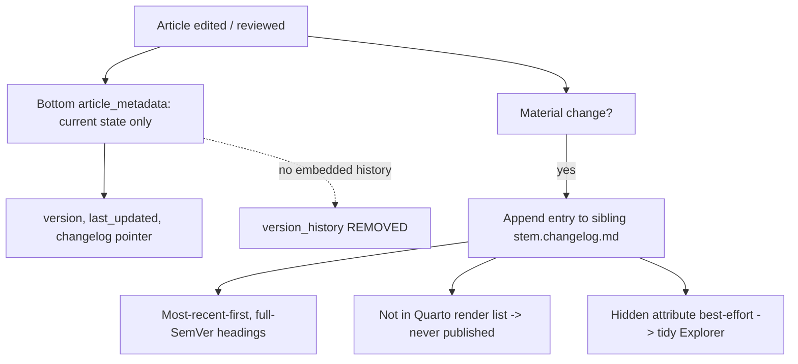

# Changelog management for markdown article metadata

## 🎯 Why this analysis exists

The sibling analysis [03-changelog-files/overview.md](../03-changelog-files/overview.md) externalized the self-updating PE vision's per-version history out of metadata and into a dedicated `*.changelog.md`. The exact same anti-pattern exists one layer down, for **ordinary markdown articles**: the article-review process embeds an accumulating history inside the bottom `article_metadata` block (`change_summary` + a `version_history:` array). That history has no schema authority, grows unbounded, drifts from the rendered article, and is not deep-linkable.

This document records the current model, the rules that produce it, the decisions taken, and the remediation applied so article history is externalized to a sibling changelog — mirroring the vision↔changelog pairing.

---

## 📋 How article change history works today

| Element | Role | Authority |
|---|---|---|
| Bottom **`article_metadata`** block | Current-state tracking (`version`, `last_updated`, `word_count`, …) | Schema: [02-dual-yaml-metadata.md](../../../../../../.copilot/context/90.00-learning-hub/02-dual-yaml-metadata.md) |
| Bottom **`article_metadata.change_summary`** | One-line summary of the latest change | **No schema authority** — emitted by the review template |
| Bottom **`article_metadata.version_history:`** array | Full per-version history embedded in metadata | **No schema authority** — emitted by the review template |
| **Review output template** Phase 7 | Writes `change_summary` + `version_history` into the bottom block on every review | [output-article-review-phases.template.md](../../../../../../.github/templates/01.00-article-writing/article-review-for-consistency-gaps-and-extensions/output-article-review-phases.template.md) |

The schema authority ([02-dual-yaml-metadata.md](../../../../../../.copilot/context/90.00-learning-hub/02-dual-yaml-metadata.md)) defines `article_metadata` with `filename`, `created`, `last_updated`, `version`, `status`, `content_type`, `subcategory`, `word_count`, `reading_time_minutes`, `primary_topic` — and **no history field**. So the review template writes history the schema never sanctioned: the same schema-vs-practice mismatch finding F1 found in the vision.

The anti-pattern is already live in the wild — roughly ten articles carry an embedded `version_history:` block today (several prompt-engineering how-tos, the mkdocs articles, a VS Code release summary).

---

## 🔎 Findings

### F-md1 — Embedded history in `article_metadata` (`single-source-of-truth`, HIGH)

Articles carry per-version history inside the bottom metadata block (`change_summary` + `version_history:`). It is not in the schema, it grows unbounded, it cannot be deep-linked, and it duplicates information that belongs in a dedicated history record. (✅ done — see Remediation.)

### F-md2 — No schema field for an external changelog (`schema-completeness`, MEDIUM)

There was no way for an article to point at a sibling changelog, and no documented convention for finding one. (✅ done — added optional `article_metadata.changelog:` field + `<stem>.changelog.md` convention fallback.)

### F-md3 — Article rules leak onto changelog files (`scope-correctness`, HIGH)

The `applyTo` globs of [documentation.instructions.md](../../../../../../.github/instructions/documentation.instructions.md) and [article-writing.instructions.md](../../../../../../.github/instructions/article-writing.instructions.md) match `*.changelog.md`. VS Code globs cannot negate, so article structure/voice rules nominally apply to changelog files — **including the existing vision changelog** (a latent bug). (✅ done — explicit carve-out clauses + dedicated `changelog-files.instructions.md`.)

### F-md4 — No rule mandating changelog creation/update (`process-governance`, MEDIUM)

Nothing required the history to be recorded anywhere durable once removed from metadata. (✅ done — `documentation.instructions.md` § Article change history makes the review process the authoritative writer; other editors SHOULD append best-effort.)

### F-md5 — Publishing and visibility (`hygiene`, LOW)

Changelog files should not publish and should be unobtrusive in the editor. (✅ resolved by design: the Quarto `render:` allow-list never lists them, so they never publish; OS hidden attribute is set best-effort, documented as local/non-versioned.)

---

## 🧭 Decisions

| Decision | Choice | Rationale |
|---|---|---|
| **Keep dual metadata** | Yes — unchanged | No architectural change; only history leaves the bottom block |
| **History location** | Sibling `<stem>.changelog.md` | Mirrors the vision↔changelog pairing |
| **Naming** | `.changelog.md` **suffix** (not dot-prefix) | Consistent with the vision changelog; dot-prefix would fight the suffix + sibling-lookup convention |
| **Hidden** | OS hidden attribute, **best-effort** | Local Explorer convenience; durable "not published" comes from the render allow-list, not the hidden bit |
| **Trigger** | **Review-process-driven** | Instruction-driven writing fires only during agent edit turns, never on manual edits, and is best-effort — granularity too inconsistent to mandate. The review step writes deterministically. |
| **Carve-out** | Changelog files exempt from article rules | A changelog is a machine-oriented history record, not a reader-facing article |
| **Rollout** | Going-forward for new/edited articles | Bulk retrofit of the in-scope articles **done** by [02-changelog-externalization-plan.md](02-changelog-externalization-plan.md) (10 articles + 88 PE artifacts = 98 files migrated) |

---

## 🛠️ Remediation sequence

| Step | Action | Touches | Status |
|---|---|---|---|
| 1 | Add optional `changelog:` field + sibling convention + "history only in sibling" rule | [02-dual-yaml-metadata.md](../../../../../../.copilot/context/90.00-learning-hub/02-dual-yaml-metadata.md) (v1.1.0) | **✅ done 2026-06-12** |
| 2 | Add § Article change history + changelog carve-out clause | [documentation.instructions.md](../../../../../../.github/instructions/documentation.instructions.md) (v1.11.0) | **✅ done 2026-06-12** |
| 3 | Add carve-out clause for voice/structure rules | [article-writing.instructions.md](../../../../../../.github/instructions/article-writing.instructions.md) (v1.5.0) | **✅ done 2026-06-12** |
| 4 | Create authority for `*.changelog.md` (naming, hidden, exemption, entry discipline) | [changelog-files.instructions.md](../../../../../../.github/instructions/changelog-files.instructions.md) (v1.0.0) | **✅ done 2026-06-12** |
| 5 | Remove embedded `change_summary`/`version_history`; add `changelog:` pointer + Phase 7b sibling-changelog write | both copies of [output-article-review-phases.template.md](../../../../../../.github/templates/01.00-article-writing/article-review-for-consistency-gaps-and-extensions/output-article-review-phases.template.md) | **✅ done 2026-06-12** |
| 6 | Document findings + decisions (this file) | this overview | **✅ done 2026-06-12** |
| 7 | Set OS hidden attribute on the existing vision changelog (consistency) | `20260531.01-vision.changelog.md` | **✅ done 2026-06-12** |

**Follow-up (✅ done / 📌 next steps).** The bulk retrofit is **complete** — [02-changelog-externalization-plan.md](02-changelog-externalization-plan.md) migrated all 98 in-scope files (10 active articles + 88 PE artifacts) from embedded `changes:` arrays to sibling `*.changelog.md` files with `changelog:` pointers. True async-on-any-change coverage (manual edits, commits) requires the background MetadataWatcher or a git pre-commit hook — deferred; the MetadataWatcher .NET source is not in this checkout. When available, flipping the trigger from review-driven to async is a one-clause addition, not a redesign.

---

## 🎯 Target state

---

## 📚 Related

- Sibling analysis (vision layer): [03-changelog-files/overview.md](../03-changelog-files/overview.md)
- Schema authority: [02-dual-yaml-metadata.md](../../../../../../.copilot/context/90.00-learning-hub/02-dual-yaml-metadata.md)
- Changelog-file rules: [changelog-files.instructions.md](../../../../../../.github/instructions/changelog-files.instructions.md)
