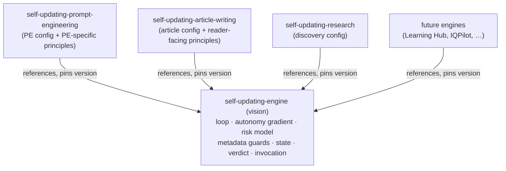

# Investigation — a common self-updating engine vision

> Investigation only. This document proposes a shared vision and a refactor path; it changes **no** existing vision. Vision edits are human-only and would each run through their own amendment plan.

## 🎯 Purpose

Three self-updating systems already live under `06.00-idea` (prompt engineering, article writing, research), and more are planned (Learning Hub automation, IQPilot, …). They all share the same core machinery — **metadata-driven decisions, an autonomy gradient, risk assessment, and risk-reduction strategies** — but that machinery currently lives **inside the prompt-engineering (PE) vision** and is *referenced* by the others. That coupling is the problem the owner flagged: article writing should be *connected but independent* from prompt engineering.

This investigation answers the two questions in the trigger:

1. **Can a common self-updating vision + logic be isolated and referenced by all engines?** — Yes. A domain-agnostic **engine vision** can own the shared loop, gradient, risk model, metadata guards, state model, and invocation contract; each domain vision becomes a thin **instantiation** that references the engine and supplies only its domain config.
2. **Does it apply to the current PE and article-writing artifacts?** — Yes, but asymmetrically: for **article writing** it is a clean win (it drops its PE references and points at the neutral engine); for **prompt engineering** it is a larger refactor (the PE vision currently *is* the de-facto engine, so the engine must be extracted from it).

### Original trigger (verbatim)

> **self-update machinery** doesn't seem a great name
> could you think it as a vision document under '06.00-idea'?
> This is very interesting as we are plan to implement a lot of self updating logic.
> So all the strategies for meta data Based decisions, authonomy gradients evaluation, risk assessment and risk reduction strategies are very interesting to apply to all the cases
>
> Please investigate the case
> - Understand how a common self updating vision and self updating logic could be isolated and referenced by all self updating engines
> - Understand if that could be applicable to current prompt engineering and article writing artifacts

## 🧭 Naming — what to call the common vision

"Self-update machinery" reads like an implementation detail, not a vision. The siblings under `06.00-idea` are named `self-updating-<domain>`, so the common one should slot into that family.

| Candidate | Reads as | Verdict |
|---|---|---|
| **`self-updating-engine`** | The portable core that domains instantiate | **Recommended** — the PE vision already uses "the engine" for exactly this portable core, so the term is established |
| `self-updating-core` | The shared kernel | Good alternative; slightly more abstract |
| `self-updating-foundations` | The shared principles | Emphasizes "vision/principles" over "machinery" |
| `self-updating-commons` | The shared layer | Fine, but less evocative |
| `autonomous-maintenance` | The capability | Drops the "self-updating" family naming |

**Recommendation:** a vision at `06.00-idea/self-updating-engine/` (e.g. `20260622.01-self-updating-engine-vision.md`). It defines **what the engine must do and why** (the vision); concrete implementations (MCP server, SDK, extension) realize it. The domain visions (`self-updating-prompt-engineering`, `self-updating-article-writing`, `self-updating-research`, future) reference it as a **versioned building block**.

## 🔭 The landscape today

| Vision | Role today | Coupling problem |
|---|---|---|
| **self-updating-prompt-engineering** (v15) | The most mature; **doubles as the de-facto engine** — portable core *and* PE specifics mixed in one document | Owns the shared machinery, so everyone references *it* instead of a neutral layer |
| **self-updating-article-writing** (v4) | Instantiation | References the PE engine throughout (two-concerns framing, "Instantiating the PE engine", `signal-dont-fix-pe`) |
| **self-updating-research** (v1) | Instantiation (discover → validate → reason) | References PE governance |
| Future (Learning Hub, IQPilot, …) | Planned instantiations | Would inherit the same coupling |

## 🧩 What is genuinely shared (the engine)

These assets are **domain-agnostic** — they hold for PE artifacts, articles, research reports, and any future self-updating target. The four the owner named are the heart of it (★).

| # | Shared asset | What it provides |
|---|---|---|
| 1 | **Detect → Assess → Propose → Execute loop** | The four-phase maintenance cycle |
| 2 | ★ **Risk-calibrated autonomy gradient** | Impact × confidence → autonomous / notify / human-approval / human-only |
| 3 | ★ **Risk assessment** | Change classification (breaking vs non-breaking), multi-dimensional impact (consistency, efficiency, behavioral compatibility, effectiveness), blast-radius / dependency analysis, quality propagation |
| 4 | ★ **Risk-reduction strategies** | Static validation, multi-pass / redundant processing, modular opt-in integration, reversibility & rollback (snapshots), iteration budget + spillover |
| 5 | ★ **Metadata-driven decisions** | Declared `goal`/`scope`/`boundaries`/`rationales`; **pre-change guard** (block changes that violate declared metadata); **post-change reconciliation**; **runtime grounding** (enforce metadata at execution; inherited-metadata staleness check) |
| 6 | **Cost discipline** | Progressive depth (research → screening → deep), the four-level cost gradient, validation caching |
| 7 | **Multidimensional processing state** | `(unit × dimension)` coverage record + source ledger; coverage-completeness guarantee |
| 8 | **Graded verdict** | `verified` / `pass-weak` / `partial` / `fail` (evidence-based); active-dimensions-follow-evidence; dimension-rule self-containment |
| 9 | **Canonical invocation contract** | A minimal parameter surface, default-full, resolved-scope echo |
| 10 | **Domain-expertise injection** | The hook by which any domain's role + authoritative sources (`domain_profile`) ground assessment |
| 11 | **Engine / integration portability seam** | The contract dividing the portable engine from per-consumer config |
| 12 | **Loop stability** | Convergence / oscillation detection |
| 13 | **Progressive learning** | Outcome log → threshold tuning |
| 14 | **Governance** | Human-only vision/principle changes; human governance + autonomous execution; staleness-avoidance-first for the engine's own infrastructure |
| 15 | **Trust-calibrated source adoption** | A trust signal for external/source evidence |

## 🧱 What stays domain-specific (the instantiations)

Each domain supplies a **config** that instantiates the engine — never re-implementing it:

| Engine hook | Prompt engineering supplies | Article writing supplies |
|---|---|---|
| **Identity** (`domain_profile`) | PE role + platform sources (VS Code, Copilot) | Documentation role + per-article technical-domain sources |
| **Quality model** | The 35-dimension catalog | Verified / reliable / **readable / understandable / logical-connection** / up-to-date |
| **Degradation forces** | Platform drift, internal drift, ecosystem evolution | Factual staleness, link rot, collection incoherence, coverage gaps, standards drift |
| **Health / freshness formula** | Validation cache + staleness signals | The 5-signal freshness score |
| **Autonomy thresholds** | Tier / blast-radius calibration | **Reader-risk** calibration |
| **Domain conventions** | N-1 structural separation, tier-by-filename, instruction-minimization, artifact namespacing | Collection (series/folder/subject/tag) integrity; MWSG / Diátaxis / WCAG |
| **Scope unit** | Artifact, artifact-type, dependency graph | Article, collection |

The pattern: **engine = the verbs (detect, assess, classify risk, guard, roll back); domain = the nouns (what an artifact is, what makes it stale, what "good" means).**

## 🏗️ Proposed structure — one engine, many instantiations

Rules of the structure:

- A domain vision references **only the engine** — never another domain vision. (This is exactly the article-writing → PE decoupling the owner asked for.)
- Each domain **pins an engine version** (a versioned building-block dependency), so an engine change is an explicit, reviewable bump for each consumer.
- The engine vision carries its own `principles:` block (the shared invariants); domain visions carry only their domain-specific principles + a declared dependency on the engine.

## 🔍 Applicability to the current artifacts

### Prompt engineering — high value, larger effort

The PE vision **already contains** almost the entire engine (it is the most mature). Extraction means **moving the domain-agnostic sections and principles into the engine vision** and leaving PE as a thinner instantiation. That is a **major** refactor and a **major** version bump to the PE vision. Mitigation: extract *by reference first* (engine vision is authored from PE's content; PE keeps the text but re-homes the canonical definition), then trim PE in a later pass — so nothing battle-tested is lost in one step.

### Article writing — clean win, resolves the decoupling

The article-writing vision currently references PE throughout. Re-pointing it at the neutral engine **removes every PE reference** (the owner's stated goal). The C1–C8 criteria just added to it — Type A/B staleness, the invocation surface, processing state, graded verdict, metadata guards, domain-expertise injection — are **mostly engine concepts**: they would move to the engine vision, and article writing would *reference* them and keep only its article-specific layer (readability, understandability, logical connection, the freshness model, reader-risk calibration, collection integrity). This also lets the P0 `signal-dont-fix-pe` principle be re-expressed neutrally (signal the engine / the owning system, not "PE").

### The instruction layer already proves the pattern

The governance instruction files — `vision-frontmatter`, `vision-amendment`, `plan-execution`, `plan-marking` — are **already domain-agnostic** and apply to every vision. That existing shared layer at the instruction tier is direct evidence that a shared layer at the *vision* tier is natural and overdue.

## 🗃️ The context layer — where the shared logic physically lives

The engine logic is not only in the PE vision; much of it is in **context files** under `.copilot/context/00.00-prompt-engineering/` (folder-metadata inheritance `00.06`, config/state `05.09`, eval-regression `05.10`, the dimension catalog, practical-effectiveness log). A full extraction would re-home the **engine-generic** context into a neutral context domain (e.g. `.copilot/context/00.10-self-updating-engine/`) referenced by all engines, while **domain-specific** context (PE artifact rules, article-writing rules) stays put. This is the larger, separable workstream — flagged here, not designed.

## 🛣️ Recommended path (phased — each phase human-approved)

| Phase | Action | Vision impact |
|---|---|---|
| **0** (this doc) | Investigation + name decision | none |
| **1** | Author `self-updating-engine` vision by extracting the domain-agnostic core from PE; declare its `principles:` block | new vision |
| **2** | Refactor PE vision → thin instantiation that references the engine + keeps PE config/principles | PE **major** bump |
| **3** | Refactor article-writing vision → instantiation referencing the engine (drops all PE references) | article-writing **major** bump |
| **4** (optional) | Research + future engines reference it; re-home engine-generic context | per-vision bumps |

Each phase is its own `*vision*plan*.md` amendment plan, gated and owner-approved.

## ⚠️ Risks and open questions

- **Extraction risk** — the PE vision is large and mature; pulling the engine out could drop nuance. *Mitigation:* author the engine from PE's text, keep PE intact until the engine is validated, then trim.
- **Versioning** — the engine gets its own SemVer; each domain pins an engine version as a building-block dependency. Define the bump-propagation rule (engine MINOR vs MAJOR → which consumers must re-review).
- **Research fit** — the research vision's loop is *Discover → Validate → Reason*, not Detect→Assess→Propose→Execute; confirm the engine abstracts cleanly over both, or whether research is a looser cousin.
- **Naming** — confirm `self-updating-engine` (vs `-core` / `-foundations`).
- **Context re-homing churn** — moving engine-generic context to a neutral domain touches many references; treat as a separate, later workstream.

## 🅿️ Park lot

- Re-homing the engine-generic **context files** to a neutral context domain → separate workstream (Phase 4).
- A neutral **implementation** (MCP server / SDK) for the engine → out of scope for the vision work.
- Reconciling the **research** vision into the engine family → confirm fit first.

## 📚 References

- **[Self-updating prompt engineering vision (v15)](../../../../../06.00-idea/self-updating-prompt-engineering/20260531.01-vision.md)** 📒 Internal — current home of the de-facto engine.
- **[Self-updating article writing vision (v4)](../../../../../06.00-idea/self-updating-article-writing/20260428.01-vision.v1.md)** 📒 Internal — the instantiation to decouple.
- **[Article-writing PE-criteria analysis](../20260621.03-article-writing-vision-update/overview.md)** 📒 Internal — the analysis that surfaced the shared machinery.
- **[Vision-frontmatter rules](../../../../../.github/instructions/vision-frontmatter.instructions.md)** 📘 Internal — the already-shared governance layer at the instruction tier.

