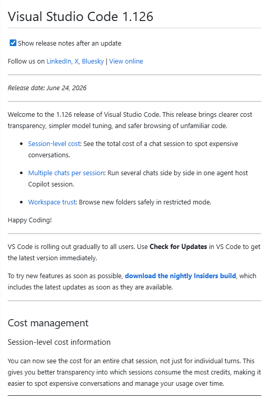

---
# Quarto Metadata
title: "Issue: VS Code 1.126 vs documented 1.123 — release watermark drift and PE impact"
author: "Dario Airoldi"
date: "2026-06-25"
categories: [issue, prompt-engineering, freshness, meta-update, vscode]
description: "VS Code 1.126 (June 24, 2026) is three releases ahead of the pe- context watermark (1.123). Investigation of the gap, the 1.126 feature impacts on the prompt-engineering context, and the pe-meta workflow needed to close it."
draft: true
---

# Issue Report

**Issue Title:** VS Code 1.126 release watermark drift — pe- context documents 1.123, content tops out at 1.122

**Date Reported:** 2026-06-25
**Reporter:** Dario Airoldi
**Status:** Open — investigation only (no artifacts mutated)

| Field | Value |
|---|---|
| **Severity** | Medium (freshness drift; no incorrect rules, but missing-coverage debt is compounding) |
| **Component** | `.copilot/context/00.00-prompt-engineering/` (PE context folder) · `pe-meta` self-update workflow |
| **Framework / Tooling** | GitHub Copilot customization · `pe-meta-review` / `pe-meta-scheduled-review` orchestrators |
| **Dimensions** | Freshness (D12-staleness, D13-source-verification); touches D2-references |
| **Documented watermark** | VS Code `1.123` (2026-06-03) |
| **Live latest** | VS Code `1.126` (2026-06-24) |

---

## 📑 Table of contents

- [📝 Description](#-description)
- [🔍 Context information](#-context-information)
- [🔬 Analysis](#-analysis)
- [⚙️ VS Code 1.126 features and their PE impact](#️-vs-code-1126-features-and-their-pe-impact)
- [🔁 Effect on the pe-meta workflow](#-effect-on-the-pe-meta-workflow)
- [✅ Recommended actions](#-recommended-actions)
- [📚 References](#-references)
- [✔️ Resolution status](#️-resolution-status)

---

## 📝 Description

The draft note that opened this issue read *"vscode 1.126 was released on 2023-06-21."* The version is right, but the date is a placeholder: VS Code **1.126** actually shipped on **June 24, 2026** — one day before this report. The real question behind the note is whether the prompt-engineering (pe-) context has fallen behind, and by how much.

It has. Two distinct watermarks tell the story:

- **Recorded release watermark:** VS Code **1.123** (set by the `freshness-20260603` run on 2026-06-03).
- **Highest version actually written into guidance content:** VS Code **1.122** (OpenTelemetry hook signals in [03.03-agent-hooks-reference.md](.copilot/context/00.00-prompt-engineering/03.03-agent-hooks-reference.md#L154), the 1M-token-context note in [02.02-context-window-and-token-optimization.md](.copilot/context/00.00-prompt-engineering/02.02-context-window-and-token-optimization.md)).

So even the **1.123** features were *logged as gaps but never absorbed* — the `freshness-20260603` entry explicitly flagged "session sync/`/chronicle`, Agents window, research agent" as out-of-dimension coverage gaps. Three more releases (**1.124, 1.125, 1.126**) have shipped since, and **1.126 deepens exactly the areas that were already flagged**.



*VS Code 1.126 release notes, the version that triggered this investigation.*

---

## 🔍 Context information

**Where the watermark lives**

| Item | Value |
|---|---|
| Machine source of truth | `<state.path>/triggers/vscode-release-notes.json` (per-source ledger `last_seen_version`) |
| Human-readable mirror | [05.04-meta-review-log.md](.copilot/context/00.00-prompt-engineering/05.04-meta-review-log.md) → "Last Processed Versions" table |
| Monitored source config | [pe-self-update.config.json](.copilot/config/pe-self-update.config.json) → `vscode-release-notes`, `version_scheme: semver`, `channel: stable` |
| Driver workflow | `pe-meta-review --source <url> --dim freshness` (release-driven) · `pe-meta-scheduled-review` (auto-detect) |

**Monitored source consulted**

| Source | Recorded watermark | Live at audit (2026-06-25) | Drift |
|---|---|---|---|
| VS Code release notes (`https://code.visualstudio.com/updates`) | 1.123 (2026-06-03) | **1.126** (2026-06-24) | 3 releases / ~3 weeks |

**Versions that came out in the meantime**

The watermark is at 1.123, so a complete freshness pass must review **three** release-note pages, not just the newest:

- `v1_124`, `v1_125` — feature deltas not yet inspected (between watermark and current).
- `v1_126` — inspected for this issue (summarized below).

---

## 🔬 Analysis

The drift is a **freshness** problem, not a **correctness** problem: nothing in the pe- context asserts a *false* rule because of 1.124–1.126. The risk is **missing coverage** — guidance that omits new agent/tool/model surfaces that consumers now expect. That debt is compounding because:

1. The 1.123 run **deferred** the net-new surfaces (Agents window, `/chronicle` session sync, research agent) as "out-of-dimension."
2. 1.126 **extends those same surfaces** (Agents window gains multiple-chats-per-session and agentic code feedback; session-level cost joins the `/chronicle` cost story).
3. A second concern surfaces in 1.126: the **VS Code docs site was restructured** (agentic docs regrouped under "Agents", editor topics under "Editor"). Any `code.visualstudio.com/docs/...` link in the pe- context — for example the monitoring-agents link in [03.03-agent-hooks-reference.md](.copilot/context/00.00-prompt-engineering/03.03-agent-hooks-reference.md#L154) — is now a **D2-references / D13-source-verification** candidate for re-validation.

---

## ⚙️ VS Code 1.126 features and their PE impact

The table introduces each 1.126 change, the pe- context file most affected, and the review dimension that should catch it.

| 1.126 feature | What it is | Most-affected PE artifact(s) | Dimension | Priority |
|---|---|---|---|---|
| **Session-level cost information** | Cost (credits) and context-window token usage for a whole chat session, not just per turn | [02.02-context-window-and-token-optimization.md](.copilot/context/00.00-prompt-engineering/02.02-context-window-and-token-optimization.md); the `/chronicle` cost-tips workflow | Content / freshness | High |
| **Unified model customization picker** | Context size and reasoning (thinking) effort merged into one picker | [03.02-model-specific-optimization.md](.copilot/context/00.00-prompt-engineering/03.02-model-specific-optimization.md); [01.06-system-parameters.md](.copilot/context/00.00-prompt-engineering/01.06-system-parameters.md) | Content | Medium |
| **Agents window — multiple chats per session** | Several chats run side by side in one agent-host session, sharing context | [01.02-prompt-assembly-architecture.md](.copilot/context/00.00-prompt-engineering/01.02-prompt-assembly-architecture.md); [01.03-file-type-decision-guide.md](.copilot/context/00.00-prompt-engineering/01.03-file-type-decision-guide.md) (Execution Contexts / Agent HQ) | Content | High (already-flagged gap) |
| **Agentic code feedback (agent-host harnesses)** | Server-side comment tools `listComments` / `resolveComments` / `addComment`; `/code-review` skill adds inline comments; PR-review integration | Tool-catalog template; [01.04-tool-composition-guide.md](.copilot/context/00.00-prompt-engineering/01.04-tool-composition-guide.md) | Tools / content | Medium |
| **Simplified model hover** | One-word capability descriptor plus deep-link config buttons | [03.02-model-specific-optimization.md](.copilot/context/00.00-prompt-engineering/03.02-model-specific-optimization.md) | Content | Low |
| **Open new folders in Restricted Mode** | `security.workspace.trust.startupPrompt` default changes `once` → `never`; new folders open in Restricted Mode | Security note only — no current PE rule depends on it | — | Low |
| **VS Code docs restructure** | Docs TOC regrouped (Agents / Editor / Languages and Runtimes / Extension Docs) | Every pe- file with a `code.visualstudio.com/docs/...` link | D2-references, D13-source-verification | Medium |
| **Deprecated features** | None this release | — | — | — |

---

## 🔁 Effect on the pe-meta workflow

The self-update machinery is built for exactly this situation, and it would flag the drift on the next run:

- **`pe-meta-scheduled-review`** — Phase 1 staleness scan, step 10, checks for "unprocessed VS Code/Copilot releases (from the Last Processed Versions table)." Running it now would auto-detect 1.124–1.126 as unprocessed.
- **`pe-meta-review --source <url> --dim freshness`** — the release-driven path. Its researcher fetches each unprocessed version's notes, the audit maps deltas to in-scope files, and (on `--mode apply`) Phase 8 advances the `vscode-release-notes` ledger `last_seen_version` to 1.126 and refreshes the mirror table.

**Discipline reminders (from repo memory) for whoever runs the apply:**

- `--mode apply` MUST materialize an on-disk plan file at the run folder before executing — do not let the plan live only in chat (recurring `plan-file=none` gap).
- A "review" must read file **bodies**, not just frontmatter — a freshness pass that only bumps `last_updated` is the shallow-sweep anti-pattern.
- Advance the watermark **only** for sources whose outcome entries are all `applied`/`skipped`; the markdown table is a mirror, never the source of truth.

---

## ✅ Recommended actions

This issue is **investigation only** — no context files were edited, because absorbing release deltas is the governed job of the `pe-meta` pipeline (plan → approval → evidence-bound apply), not a hand edit.

1. **Run the focused freshness pass** (plan first, then apply after review):

   ```text
   /pe-meta-review --source https://code.visualstudio.com/updates --dim freshness --scope .copilot/context/00.00-prompt-engineering/ --mode plan
   ```

   Scope it to the three unprocessed versions (1.124, 1.125, 1.126), not just the newest.

2. **Prioritize the compounding gaps** — Agents window (multiple chats + agentic code feedback) and the `/chronicle` cost story, since 1.123 already deferred them and 1.126 extends them.

3. **Add a reference-integrity check** for `code.visualstudio.com/docs/...` links given the 1.126 docs restructure (D2/D13).

4. **On apply**, advance the `vscode-release-notes` ledger `1.123 → 1.126` and update the "Last Processed Versions" mirror in [05.04-meta-review-log.md](.copilot/context/00.00-prompt-engineering/05.04-meta-review-log.md).

---

## 📚 References

**[VS Code 1.126 release notes](https://code.visualstudio.com/updates/v1_126)** 📘 [Official]
Source release notes for the version that triggered this issue (cost management, unified model picker, Agents window, workspace-trust changes, docs restructure). Released 2026-06-24.

**[VS Code updates index](https://code.visualstudio.com/updates)** 📘 [Official]
The monitored source (`vscode-release-notes`) in the pe-self-update config; entry point for the 1.124 and 1.125 notes still to be reviewed.

**[pe-self-update.config.json](.copilot/config/pe-self-update.config.json)** 📗 [Repo source-of-truth]
Declares the monitored sources, version schemes, and state paths the pe-meta workflow reconciles against.

**[05.04-meta-review-log.md](.copilot/context/00.00-prompt-engineering/05.04-meta-review-log.md)** 📗 [Repo source-of-truth]
Review-log history; the `freshness-20260603` entry is where the 1.123 watermark and the deferred coverage gaps were recorded.

---

## ✔️ Resolution status

**Status:** Open — investigation complete, remediation pending a `pe-meta-review --dim freshness` run.

| Step | State |
|---|---|
| Confirm documented watermark (1.123) and content ceiling (1.122). | (✅ done) |
| Confirm live latest (1.126, 2026-06-24) and the in-between versions (1.124, 1.125). | (✅ done) |
| Map 1.126 feature deltas to affected pe- context files. | (✅ done) |
| Run freshness apply to absorb 1.124–1.126 and advance the watermark. | (🟡 todo) |
| Re-validate `code.visualstudio.com/docs` reference links post-restructure. | (🟡 todo) |

<!--
validations:
  grammar: {status: "not_run", last_run: null}
  readability: {status: "not_run", last_run: null}

article_metadata:
  filename: "overview.md"
-->
