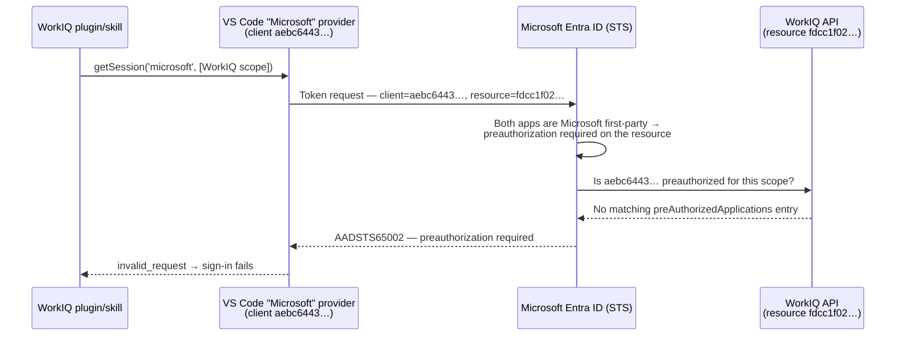

---
# Quarto Metadata
title: "Issue: WorkIQ sign-in fails — first-party preauthorization required (AADSTS65002)"
author: "Dario Airoldi"
date: "2026-06-26"
categories: [issue, authentication, entra-id, workiq, vscode]
description: "WorkIQ sign-in from VS Code fails with AADSTS65002 because VS Code ignores the Copilot CLI oauthClientId field in WorkIQ's plugin .mcp.json and falls back to its first-party client. Sign in via the Copilot CLI, pin oauth.clientId in mcp.json, or have the WorkIQ API team preauthorize VS Code's client."
draft: true
---

# Issue report

**Issue title:** WorkIQ sign-in fails with `AADSTS65002` — VS Code's first-party client isn't preauthorized on the WorkIQ API

**Date reported:** 2026-06-26 (recurred 2026-06-27)
**Reporter:** Dario Airoldi
**Status:** Open — reproduced on 2026-06-27 with the **same** first-party client (`aebc6443…`), confirming WorkIQ's own client is still not being used in VS Code. The **GitHub Copilot CLI signs in and runs WorkIQ fine** on the same machine/account, isolating the fault to VS Code. Most reliable workaround: use the Copilot CLI. Root-cause fix owned by the WorkIQ API team.

| Field | Value |
|---|---|
| **Severity** | High (sign-in is fully blocked; WorkIQ is unusable until fixed) |
| **Component** | WorkIQ Copilot plugin/skill sign-in · VS Code "Microsoft" authentication provider |
| **Error code** | `AADSTS65002` (`invalid_request`) |
| **Client app (used, failing)** | `aebc6443-996d-45c2-90f0-388ff96faa56` — Visual Studio Code first-party fallback |
| **Client app (intended)** | `ba081686-5d24-4bc6-a0d6-d034ecffed87` — WorkIQ's own public client |
| **Resource app** | `fdcc1f02-fc51-4226-8753-f668596af7f7` — WorkIQ API (first-party) |
| **Trace ID** | `cc4d353d-0563-46f2-9718-ceb660aa1700` (1st) · `81494a5c-2b37-4e93-90e1-df255a5b1700` (2nd) |
| **Correlation ID** | `eb1bf0be-8eba-4bfa-ac03-d96c04eea160` (1st) · `6b1ab423-5dd7-44b3-8a87-3a6cb533f3c6` (2nd) |
| **Timestamp** | `2026-06-26 17:29:33Z` · `2026-06-27 19:33:28Z` |

---

## 📑 Table of contents

- [📝 Description](#-description)
- [ℹ️ Context information](#ℹ️-context-information)
- [🔍 Analysis](#-analysis)
- [🛠️ Resolution](#️-resolution)
- [🚫 What does not fix it](#-what-does-not-fix-it)
- [➕ Additional information](#-additional-information)
- [📚 References](#-references)

---

## 📝 Description

Signing in to WorkIQ from VS Code fails immediately with this message:

```text
An error occurred while signing in:
invalid_request - AADSTS65002: Consent between first party application
'aebc6443-996d-45c2-90f0-388ff96faa56' and first party resource
'fdcc1f02-fc51-4226-8753-f668596af7f7' must be configured via preauthorization -
applications owned and operated by Microsoft must get approval from the API owner
before requesting tokens for that API.
Trace ID: cc4d353d-0563-46f2-9718-ceb660aa1700
Correlation ID: eb1bf0be-8eba-4bfa-ac03-d96c04eea160
Timestamp: 2026-06-26 17:29:33Z
```

The error comes from Microsoft Entra ID (the security token service), not from WorkIQ itself. The root cause is that VS Code authenticates with **the wrong OAuth client** — it falls back to its own first-party client (`aebc6443…`) instead of WorkIQ's (`ba081686…`).

**This reproduced on 2026-06-27** (new Trace/Correlation IDs in the table above) with the **same** client (`aebc6443…`) and resource (`fdcc1f02…`). That the failing client is still `aebc6443…` — never `ba081686…` — is the decisive evidence: VS Code is not using WorkIQ's pinned client at all (see [Analysis](#-analysis)). The most reliable workaround is to sign in through the **GitHub Copilot CLI**, which does honor WorkIQ's client and is **confirmed working in this environment** (same account and tenant; WorkIQ connects and its tools respond normally). A VS Code-native pin is also possible but has caveats (see [Resolution](#️-resolution)).

---

## ℹ️ Context information

- WorkIQ is a hosted **HTTP MCP server** (`https://workiq.svc.cloud.microsoft/mcp`) that VS Code connects to. Sign-in uses VS Code's built-in MCP OAuth flow against Microsoft Entra.
- WorkIQ is installed as an **auto-discovered GitHub Copilot CLI plugin** (under `~/.copilot/installed-plugins/copilot-plugins/workiq/`). VS Code loads the plugin's `.mcp.json`, but not its Copilot-CLI `oauthClientId` field — so it signs in with its built-in Microsoft provider's first-party client `aebc6443-996d-45c2-90f0-388ff96faa56`.
- The token is requested **for** the WorkIQ API resource, `fdcc1f02-fc51-4226-8753-f668596af7f7`.
- WorkIQ ships its **own** OAuth client (`ba081686-5d24-4bc6-a0d6-d034ecffed87`) for exactly this, but VS Code never applies it (the pin uses a CLI-only field) — so Entra rejects the request before any consent prompt appears.

---

## 🔍 Analysis

### What the error means

`AADSTS65002` is returned when **a Microsoft first-party client application requests a token for a Microsoft first-party resource/API, and that resource has not preauthorized the client**. The official text is:

> Consent between first party application `{applicationId}` and first party resource `{resourceId}` must be configured via preauthorization — applications owned and operated by Microsoft must get approval from the API owner before requesting tokens for that API.

The important consequence: for **first-party-to-first-party** calls, Entra ID does **not** let the normal user-consent or admin-consent flow bridge the two apps. The only thing that authorizes the call is an explicit **preauthorization** entry on the resource's app registration. Until the API owner adds it, every token request fails the same way.

### The two applications named in the message

| Role in the flow | App ID | What it is |
|---|---|---|
| **Client** | `aebc6443-996d-45c2-90f0-388ff96faa56` | Visual Studio Code — its built-in "Microsoft" sign-in provider. This is a well-known, legitimate first-party client ID baked into VS Code. |
| **Resource** | `fdcc1f02-fc51-4226-8753-f668596af7f7` | The WorkIQ backend API. It owns the scope WorkIQ asks for, and it's also a Microsoft first-party app. |

Because **both** ends are Microsoft-owned, Entra enforces the preauthorization rule.

### Why this happens with WorkIQ



The token request fails because **VS Code presents its own first-party client (`aebc6443…`) instead of WorkIQ's client**, and WorkIQ hasn't preauthorized VS Code's client for the requested scope.

**Why VS Code uses the wrong client.** WorkIQ ships with its **own** registered public OAuth client — `ba081686-5d24-4bc6-a0d6-d034ecffed87` — declared in the plugin's `.mcp.json`. The subtlety is *how* it's declared. WorkIQ is installed as a **GitHub Copilot CLI plugin** under `~/.copilot/installed-plugins/copilot-plugins/workiq/`, and VS Code **auto-discovers** Copilot CLI plugins from that folder — so VS Code *does* load WorkIQ's `.mcp.json`. But that file pins the client using **Copilot CLI field names**:

```json
{
  "mcpServers": {
    "workiq": {
      "type": "http",
      "url": "https://workiq.svc.cloud.microsoft/mcp",
      "oauthClientId": "ba081686-5d24-4bc6-a0d6-d034ecffed87",
      "oauthPublicClient": true,
      "auth": { "redirectPort": 12798 }
    }
  }
}
```

VS Code's MCP schema expresses the same setting **differently** — as an `oauth` object with a `clientId` field (`"oauth": { "clientId": "…" }`). VS Code's plugin loader understands the standard server fields (`url`, `headers`, `command`, `args`, `env`, …) but **not** the CLI's `oauthClientId` / `oauthPublicClient` / `auth` keys, so it silently ignores them. With no `oauth.clientId` it recognizes, and because WorkIQ's authorization server is Microsoft Entra (`login.microsoftonline.com`), VS Code signs in with its **built-in "Microsoft" account provider** — first-party client `aebc6443…` — which WorkIQ never preauthorized. Hence `AADSTS65002`.

The proof is in the error itself: the failing token request names client `aebc6443…`, never `ba081686…`, even though `ba081686…` is the only client in WorkIQ's `.mcp.json`. VS Code is not consuming that pin.

**Confirmed by comparison.** The same WorkIQ sign-in **succeeds in the GitHub Copilot CLI** on the same machine and account — the CLI connects, lists WorkIQ's tools, and runs queries normally (for example, retrieving last week's meetings). Because the only variable that changes between the working CLI flow and the failing VS Code flow is the **client ID presented** (`ba081686…` vs `aebc6443…`), the account, tenant, scopes, and the WorkIQ service itself are all ruled out. The fault is isolated to VS Code's client selection.

### Who can fix it

- **You (client side), right now — most reliable:** sign in through the **GitHub Copilot CLI**, which reads `oauthClientId` from WorkIQ's `.mcp.json` and presents `ba081686…`. This is **Path A** below.
- **You (client side), VS Code-native:** add a manual server to VS Code's `mcp.json` using *its* field, `oauth.clientId`, set to `ba081686…` — and disable the auto-discovered plugin server so the two don't collide. This is **Path B** below.
- **The WorkIQ API owner team (root cause):** preauthorize VS Code's client `aebc6443…` on the resource app registration (`fdcc1f02…`) so the auto-discovered plugin works for everyone with no config, and/or publish a VS Code-compatible `oauth.clientId` in the shipped config. This is **Path C / Path D** below.

---

## 🛠️ Resolution

Because the gap is the **client identity** VS Code presents — not your account, tenant, or consent — the fixes all converge on making the flow use WorkIQ's own client `ba081686…`, or on teaching the WorkIQ API to accept VS Code's `aebc6443…`.

### Path A — End user (you): sign in through the GitHub Copilot CLI (confirmed working)

WorkIQ is built for the GitHub Copilot CLI, and the CLI **does** read the `oauthClientId` field in WorkIQ's `.mcp.json`, so it presents `ba081686…` — the client WorkIQ trusts. This is **confirmed working in this environment**: the CLI connects to WorkIQ, lists its tools, and runs queries (for example, retrieving last week's meetings) with no `AADSTS65002`.

1. Open the VS Code integrated terminal.
2. Run `copilot`.
3. When prompted, complete the WorkIQ browser sign-in. Because the request now uses `ba081686…`, Entra issues the token and `AADSTS65002` does not occur.

This path sidesteps the VS Code field-mapping gap entirely and needs no configuration changes.

### Path B — End user (you): pin the client in VS Code's `mcp.json`

Make VS Code present `ba081686…` itself by declaring the server with **VS Code's** OAuth field, `oauth.clientId`. The WorkIQ plugin already auto-registers a `workiq` server, so you must avoid a name collision.

1. Disable the auto-discovered plugin server first, so two `workiq` servers don't compete: open the Extensions view (Ctrl+Shift+X), find **WorkIQ** under **Agent Plugins - Installed**, and disable it. (This also disables the WorkIQ skill text; the tools come back through the manual server below.) Alternatively, run **MCP: List Servers**, select the plugin's `workiq`, and disable it.
2. Run **MCP: Open User Configuration** from the Command Palette (Ctrl+Shift+P) to open your user `mcp.json` (or use `.vscode/mcp.json` to scope it to one workspace).
3. Add the server with an explicit `oauth.clientId`:

   ```json
   {
     "servers": {
       "workiq": {
         "type": "http",
         "url": "https://workiq.svc.cloud.microsoft/mcp",
         "oauth": {
           "clientId": "ba081686-5d24-4bc6-a0d6-d034ecffed87"
         }
       }
     }
   }
   ```

4. Save, start the server, trust it when prompted, and complete the browser sign-in. The flow now presents `ba081686…`.

> `oauth.clientId` is the **VS Code** field for choosing the OAuth client used against an HTTP MCP server — it is *not* the same key as the Copilot CLI's `oauthClientId`, which is exactly why the shipped plugin config doesn't take effect in VS Code. This works as long as WorkIQ's public client accepts VS Code's loopback redirect (`http://127.0.0.1:33418`); Entra allows any port on `localhost`/`127.0.0.1` loopback redirects for public clients.

If VS Code instead shows a **"DCR not supported"** prompt asking you to enter a client ID manually, type `ba081686-5d24-4bc6-a0d6-d034ecffed87` rather than accepting VS Code's default.

### Path C — WorkIQ API owner: add the preauthorization (the real fix)

On the WorkIQ API app registration (`fdcc1f02-fc51-4226-8753-f668596af7f7`), preauthorize VS Code's client for the requested scope:

1. In the [Microsoft Entra admin center](https://entra.microsoft.com), go to **Entra ID** > **App registrations** > the **WorkIQ API** app.
2. Select **Expose an API**.
3. Under **Authorized client applications**, select **Add a client application**.
4. Enter the VS Code client ID **`aebc6443-996d-45c2-90f0-388ff96faa56`**.
5. Under **Authorized scopes**, select the WorkIQ scope(s) the plugin requests, then select **Add application**.

The equivalent manifest change is an entry in the API's `preAuthorizedApplications` collection:

```json
"preAuthorizedApplications": [
  {
    "appId": "aebc6443-996d-45c2-90f0-388ff96faa56",
    "permissionIds": [ "<WorkIQ-scope-permission-id>" ]
  }
]
```

Preauthorized scopes suppress the consent prompt for that client, which is exactly what's required for first-party-to-first-party calls.

### Path D — WorkIQ developers: ship a VS Code-compatible client config

The shipped `.mcp.json` pins the client only with the Copilot CLI field `oauthClientId`, which VS Code ignores. Closing the gap for VS Code users means also expressing the client in VS Code's form — `"oauth": { "clientId": "ba081686…" }` — in the configuration VS Code consumes, so the right client is selected automatically without Path A or B. (Preauthorizing `aebc6443…` per Path C is the more robust fix, since it works regardless of which field a given client reads.)

### Verification

- **Path A (CLI):** the WorkIQ sign-in completes in the terminal with no `AADSTS65002`, and WorkIQ tools respond.
- **Path B (VS Code pin):** the browser sign-in completes and the WorkIQ tools load (**MCP: List Servers** → `workiq` → **Show Output** shows a successful connection). In the WorkIQ Entra **sign-in logs**, the successful request now shows client `ba081686…` instead of the failed `aebc6443…`.
- **Path C (preauth):** the original auto-discovered plugin succeeds with `aebc6443…` and no further config.

**If it still fails, report it.** Give the WorkIQ team the diagnostic IDs so they can locate the requests in the Entra sign-in logs: client `aebc6443…` (or `ba081686…`), resource `fdcc1f02…`, Trace IDs `cc4d353d-0563-46f2-9718-ceb660aa1700` / `81494a5c-2b37-4e93-90e1-df255a5b1700`, Correlation IDs `eb1bf0be-8eba-4bfa-ac03-d96c04eea160` / `6b1ab423-5dd7-44b3-8a87-3a6cb533f3c6`, timestamps `2026-06-26 17:29:33Z` / `2026-06-27 19:33:28Z`, your account UPN, and the plugin version.

---

## 🚫 What does not fix it

While VS Code is still using its first-party client (`aebc6443…`) — i.e., before you apply Path A or B — these common reflexes **won't** help, because the gap is the client identity, not your account:

- Retrying, or signing out and back in.
- Switching to a different account or tenant.
- Granting **admin consent** in your tenant (preauthorization is separate from tenant consent and can't be substituted for it here).
- Clearing the VS Code token cache or reinstalling the extension.

---

## ➕ Additional information

- The two recorded occurrences (2026-06-26 and 2026-06-27) both name client `aebc6443…` and resource `fdcc1f02…`, confirming the failure is **deterministic for this client** — not a transient outage. Retrying without changing the client will keep failing.
- The official Entra description of `AADSTS65002` adds the operative hint: *"A developer in your tenant might be attempting to reuse an App ID owned by Microsoft… They must move to another app ID they register."* Here the "right" app ID is WorkIQ's own `ba081686…`; the failure is simply VS Code presenting `aebc6443…` instead.
- The failure can be **intermittent across users**: someone whose WorkIQ flow happens to request an already-preauthorized scope succeeds, while others hit `AADSTS65002`. That points to a specific scope/client preauthorization gap rather than a total outage.
- The same `AADSTS65002` pattern appears for any tool that reuses a Microsoft first-party client (like VS Code's) to call another Microsoft first-party API that hasn't preauthorized it — it's not unique to WorkIQ.
- `aebc6443-996d-45c2-90f0-388ff96faa56` is a legitimate VS Code identity; it's also a known target of OAuth phishing, so the same client ID showing up in security tooling is expected and unrelated to this issue.

---

## 📚 References

- [Microsoft Entra authentication and authorization error codes — AADSTS65002](https://learn.microsoft.com/en-us/entra/identity-platform/reference-error-codes#aadsts-error-codes) 📘 [Official]<br>
  Authoritative description of `AADSTS65002`: consent between a first-party client and first-party resource must be configured via preauthorization.

- [How to configure an application to expose a web API — preauthorize a client](https://learn.microsoft.com/en-us/entra/identity-platform/quickstart-configure-app-expose-web-apis) 📘 [Official]<br>
  Step-by-step **Expose an API** > **Authorized client applications** > **Add a client application** flow — the exact fix the WorkIQ API owner applies.

- [Understanding the app manifest — `preAuthorizedApplications`](https://learn.microsoft.com/en-us/entra/identity-platform/reference-app-manifest) 📘 [Official]<br>
  Defines the `preAuthorizedApplications` collection that suppresses consent for listed clients and scopes (the manifest form of the fix).

- [Microsoft 365 OAuth phishing via Visual Studio Code client — Elastic detection rule](https://www.elastic.co/guide/en/security/current/prebuilt-rule-8-19-7-microsoft-365-oauth-phishing-via-visual-studio-code-client.html) 📒 [Community]<br>
  Independent confirmation that `aebc6443-996d-45c2-90f0-388ff96faa56` is the Visual Studio Code first-party application client ID.

- [VS Code — MCP configuration reference (`oauth.clientId`)](https://code.visualstudio.com/docs/agents/reference/mcp-configuration) 📘 [Official]<br>
  Documents the HTTP MCP server `oauth` object and its `clientId` field — the supported way to pin the OAuth client VS Code uses against a server (Path B).

- [VS Code — Agent plugins: MCP servers in plugins](https://code.visualstudio.com/docs/agent-customization/agent-plugins#_mcp-servers-in-plugins) 📘 [Official]<br>
  Confirms VS Code auto-discovers Copilot CLI plugins from `~/.copilot/installed-plugins/` and lists the server fields it reads (`command`, `args`, `cwd`, `env`, `envFile`, `url`, `headers`) — establishing that the CLI's `oauthClientId` is not among them.
