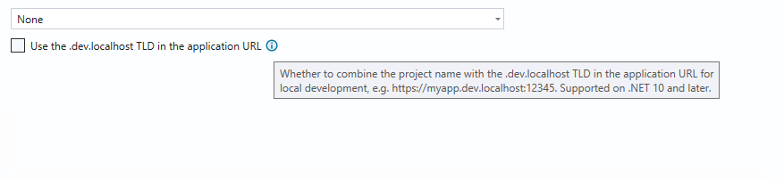

# What is a TLD, and why `.dev.localhost` for local development

In a normal internet address, the TLD (top-level domain) is the last part of the domain name:

**www.microsoft.com** → TLD = .com  
**github.io** → TLD = .io  
**gov.uk** → TLD = .uk  

In the screenshot, the option is:

"Use the **.dev.localhost** TLD in the application URL"

This is a special development-only domain suffix used on your local machine. If enabled, your application URL might become:

```text
https://myapp.dev.localhost:12345
```

instead of:

```text
https://localhost:12345
```

## Why use `.dev.localhost`?

It allows multiple local applications to have more realistic hostnames:

```text
https://frontend.dev.localhost:5001
https://api.dev.localhost:5002
https://myapp.dev.localhost:5003
```

Benefits include:

- Easier testing of multi-service applications.
- Better simulation of production domain names.
- Realistic authentication scenarios (OIDC, OAuth, cookies, CORS).
- Support for subdomain-based routing.

## The tooltip in the screenshot

The tooltip says:

Whether to combine the project name with the .dev.localhost TLD in the application URL for local development, e.g. https://myapp.dev.localhost:12345. Supported on .NET 10 and later.

This means Visual Studio/.NET can automatically generate URLs based on the project name for local development.

For example, if your project is called ContosoApi, the local URL could become:

```text
https://contosoapi.dev.localhost:7043
```

rather than:

```text
https://localhost:7043
```

This is purely for local development and doesn't require you to register a real domain.



---

## ❓ Follow-up: why `contosoapi.dev.localhost` and not `dev.contosoapi.localhost`?

DNS names are read **right-to-left**: the rightmost label is the top, and each label to its left is a child under it.

- **`contosoapi.dev.localhost`** treats `dev.localhost` as a **shared suffix** ("the dev environment"), with each service a sibling under it (`contosoapi.dev.localhost`, `frontend.dev.localhost`).
- **`dev.contosoapi.localhost`** treats `contosoapi.localhost` as the **domain** ("this one app"), with `dev`/`staging`/`prod` beneath that single app.

App-first ordering is the useful one because it **mirrors production** (`service.company.com`) and groups all your local services under one suffix — which is what lets them **share cookies/SSO** (a cookie scoped to `dev.localhost` reaches every `*.dev.localhost`), **one wildcard TLS cert** (`*.dev.localhost`), **CORS origins**, and **host-based routing**. Both orderings resolve to loopback (RFC 6761), so the difference is purely semantic grouping.

**📖 Full explanation:** [Concepts: the `.localhost` TLD and hostname ordering](../../../../03.00-tech/04.05-web-development/10.00-local-development-dns/02-concepts-localhost-tld-and-hostname-ordering.md)

