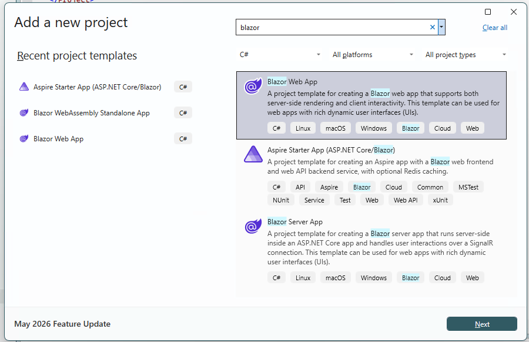
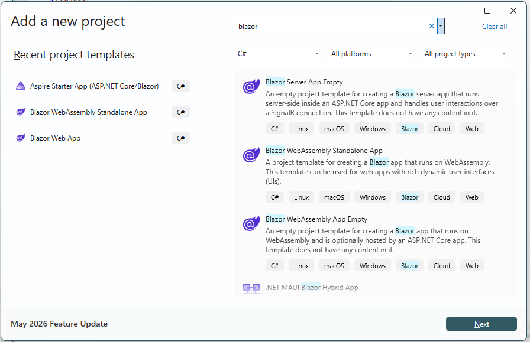
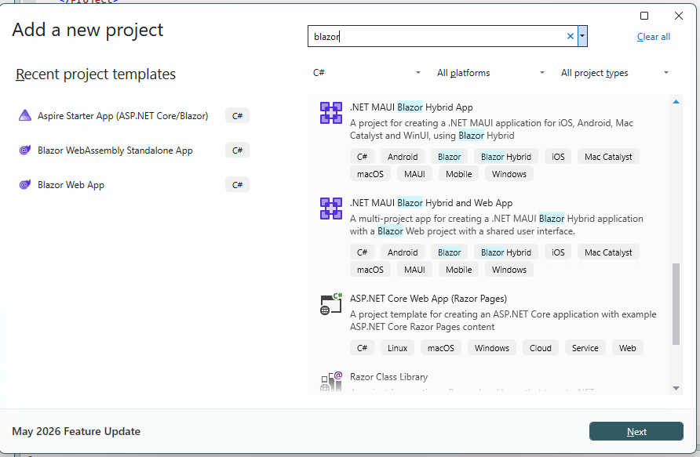
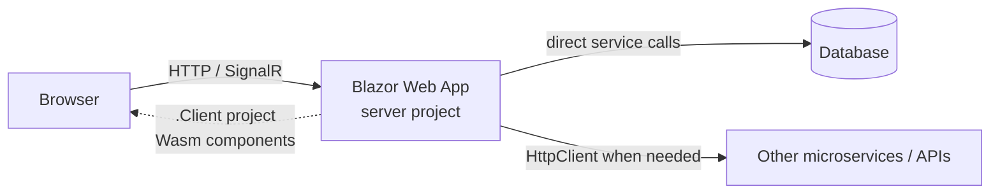
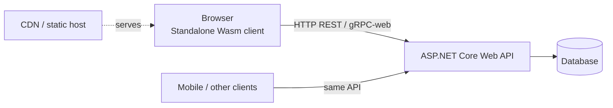

# Why is there no "Blazor WebAssembly + Web API" template?

## 🎯 Observation

Why is there no direct Visual Studio option to create Blazor WebAssembly + Web API in one project, even if that feels natural?

The short answer: that shape *used to* exist as the **Hosted Blazor WebAssembly** template (Client + Server + Shared), but Microsoft removed it from the default experience in .NET 8. The product direction moved to a single unified model — the **Blazor Web App** — where you no longer pick "UI + API" upfront. You pick a UI rendering strategy, and you add an API boundary only when you actually need one.

This article positions that decision inside the wider Blazor picture: what Blazor is, why it exists, how the templates map to real architectures, which templates are legacy, and how you're expected to build a standard "web app talking to a server" today.

---

## 🧭 What Blazor is and why it exists

Blazor is a framework for building interactive web UI with **C# and .NET instead of JavaScript**. The UI unit is the **Razor component** (`.razor`), which combines markup and C# logic.

It exists to solve a specific problem: let <mark>.NET teams build rich, interactive front ends</mark> while reusing their existing language, tooling, libraries, and — critically — sharing code between client and server.

The key idea that unlocks everything else: **the same Razor component can run in different places without being rewritten.** *Where* it runs is called its **hosting model** (or, in modern Blazor, its **render mode**).

There are three hosting models:

- **Blazor Server** — components execute on the server; the browser exchanges UI diffs over a persistent SignalR (WebSocket) connection.
- **Blazor WebAssembly (Wasm)** — components execute in the browser on a WebAssembly-based .NET runtime; no server round-trip for UI updates.
- **Blazor Hybrid** — components execute natively inside a desktop or mobile app (.NET MAUI, WPF, Windows Forms) rendered into an embedded web view.

Each model trades off differently across load time, latency, offline support, .NET API access, code privacy, and deployment. The table below summarizes the trade-offs that drive template and architecture choices.

For each model, the columns mean:

- **Initial load** — how quickly the app first becomes usable.
- **Needs a live server** — whether the running UI depends on a continuous server connection.
- **Offline / CDN** — whether it can run offline or be served as static files from a CDN.
- **Full .NET API** — whether components have unrestricted access to the .NET runtime and server resources.

| Hosting model | Initial load | Needs a live server | Offline / CDN | Full .NET API |
|---------------|-------------|--------------------|---------------|---------------|
| Blazor Server | Fast (small payload) | Yes (SignalR circuit) | No | Yes |
| Blazor WebAssembly | Slower (downloads runtime) | No (after download) | Yes | No (browser subset) |
| Blazor Hybrid | Fast (native) | No | Yes (native app) | Yes |

---

## 🔀 The .NET 8 pivot: from hosting models to render modes

Before .NET 8, you chose a hosting model *at project creation* and it applied to the whole app. That produced a template per shape: Blazor Server, standalone WebAssembly, and Hosted WebAssembly (Client + Server + Shared).

.NET 8 replaced that with the **Blazor Web App** — a single project that can mix rendering strategies **per component** through **render modes**:

- **Static SSR** — server renders HTML once, no interactivity (great for content pages).
- **Interactive Server** — interactivity over a SignalR circuit (the old "Blazor Server").
- **Interactive WebAssembly** — interactivity via client-side Wasm (the old "Blazor WebAssembly").
- **Interactive Auto** — starts as Interactive Server for a fast first paint, then transparently switches to WebAssembly once the runtime finishes downloading.

This is why the old "WASM client + API server + shared" starter no longer ships as a default: the framework no longer assumes a fixed hosting model per app, so it can't assume a fixed API boundary either. Rendering is now a per-component decision made *inside* one app, not a template you pick upfront.

When you enable a WebAssembly or Auto render mode, the Blazor Web App automatically adds a second `.Client` project for the components that must run in the browser. That `.Client` project is the modern equivalent of the old "Client" project — but it's created on demand, not baked into every template.

---

## 🗂️ Template inventory: legacy vs. current

The following table classifies the Blazor-related templates you may encounter. **Status** indicates whether the template is the current recommendation, still shipped but superseded, or removed from the default experience.

| Template (`dotnet new`) | Produces | Status (.NET 8–11) |
|-------------------------|----------|--------------------|
| `blazor` | **Blazor Web App** (single project; render modes; adds `.Client` when Wasm/Auto is selected) | ✅ **Current — recommended default** |
| `blazorwasm` | **Standalone Blazor WebAssembly** (static, CDN-deployable client-only app) | ✅ **Current — for SPA / static hosting** |
| `blazor-wasm-servicedefaults` | Aspire service-defaults library for Wasm clients | ✅ Current (helper, .NET 11) |
| `blazorwasm --hosted` (`-ho`) | **Hosted Blazor WebAssembly** (Client + Server + Shared) | 🕳️ **Legacy — removed from default; only via targeting `net7.0` or earlier** |
| `blazorserver` / `blazorserver-empty` | Blazor Server app | 🕳️ **Legacy — .NET 7 and earlier; superseded by Blazor Web App (Interactive Server)** |
| `blazorwasm-empty` | Minimal standalone Wasm | 🕳️ Legacy naming (.NET 7); folded into `blazorwasm` options |

Key takeaways:

- The only **legacy** shape that matched "WASM + Web API in one project" was **Hosted Blazor WebAssembly**, and it's intentionally gone from the default experience.
- **Blazor Server** as a distinct template is legacy; its capability lives on as the **Interactive Server** render mode inside `blazor`.
- The two templates you should reach for today are **`blazor`** (Blazor Web App) and **`blazorwasm`** (standalone WebAssembly).

---

## 🏗️ The two correct architectures for "web app talking to a server"

Your two example shapes map cleanly onto the two supported modern paths. Neither is "the API template" — because the API is now a composition choice, not a template.

### Option A — Blazor Web App (client + server in one), add APIs as needed

Create with `dotnet new blazor` (choose **Interactive Auto** or **Interactive Server**).

- One deployable app hosts both the UI and the server logic.
- Server-rendered components call data services **directly** — no REST hop, no serialization, no separate auth surface.
- WebAssembly components (in the `.Client` project) reach the server through minimal-API or controller endpoints exposed by the *same* app.
- You add calls to **additional** external servers/microservices only where the scenario demands it.

**Choose this when:** you want the modern default, the fastest path to a full-stack app, simpler auth, and the freedom to add interactivity per component. This is the recommended starting point for most new apps.

### Option B — Standalone WebAssembly client + separate ASP.NET Core Web API

Create two projects: `dotnet new blazorwasm` (the client) and `dotnet new webapi` (the backend), then put them in one solution.

- The client is a pure static site — deployable to a CDN, works offline as a PWA, no server needed to *run* the UI.
- The backend is an independent Web API (REST is the natural default; gRPC-web or SignalR also fit) that can be shared by other clients (mobile, third parties).
- Clear client/server boundary and independent scaling and deployment.

**Choose this when:** you need static/CDN hosting or offline support, a strict frontend/backend split, or a backend shared across multiple client types.

### Where the legacy shape fits

The old **Hosted Blazor WebAssembly** (Client + Server + Shared) was essentially Option B pre-wired into a single template. Today you either:

1. Compose Option B yourself (standalone Wasm + Web API + a shared class library), or
2. Adopt Option A (Blazor Web App), which is the recommended migration target from hosted WASM solutions.

---

## 🧩 So why doesn't any template "just create a REST API" for you?

Because a REST API is no longer a universal assumption. In Option A with server-side rendering, components talk to data services **directly**, so a public REST layer would be dead weight. Baking an API into the Blazor template would:

- Force an API boundary even when local server-side calls are simpler and safer.
- Imply REST is the default integration style, when gRPC-web, SignalR, or a BFF may fit better.
- Reintroduce the hosted-WASM assumption Microsoft deliberately retired.

The template team now treats **"UI rendering choice"** and **"backend boundary choice"** as *separate* decisions. If you want a REST API, you compose it: pick your Blazor UI template, add a Web API project (or endpoints) when your architecture actually calls for one.

---

## 🚀 Roadmap direction and how it's meant to be used

- **.NET 8** — Introduced the Blazor Web App and per-component render modes; retired the Hosted WebAssembly and standalone Blazor Server templates from the default experience.
- **.NET 9–10** — Refinements to render modes, static-asset fingerprinting/compression, navigation (including a `NotFound` component), and performance.
- **.NET 11** — Adds an Aspire-oriented `blazor-wasm-servicedefaults` library for wiring Wasm clients into observability and service-discovery stacks.

**How you're meant to use it today:**

1. **Default to `blazor` (Blazor Web App).** Start with Interactive Auto unless you have a specific reason not to. Let each component pick its render mode.
2. **Use `blazorwasm` (standalone) + a separate Web API** when you need static/CDN hosting, offline/PWA, or a backend shared across multiple clients.
3. **Treat Hosted WebAssembly and standalone Blazor Server templates as legacy** — migrate them toward the Blazor Web App model.
4. **Add REST/gRPC/SignalR endpoints deliberately**, only at the boundaries where a separate client or service actually needs them.

---

## 📚 References

- [ASP.NET Core Blazor hosting models](https://learn.microsoft.com/en-us/aspnet/core/blazor/hosting-models?view=aspnetcore-10.0) 📘 [Official]
- [Tooling for ASP.NET Core Blazor (template options)](https://learn.microsoft.com/en-us/aspnet/core/blazor/tooling?view=aspnetcore-10.0) 📘 [Official]
- [ASP.NET Core Blazor project structure](https://learn.microsoft.com/en-us/aspnet/core/blazor/project-structure?view=aspnetcore-10.0) 📘 [Official]
- [ASP.NET Core Blazor render modes](https://learn.microsoft.com/en-us/aspnet/core/blazor/components/render-modes?view=aspnetcore-10.0) 📘 [Official]
- [Migrate from ASP.NET Core in .NET 7 to .NET 8 (convert hosted WASM to Blazor Web App)](https://learn.microsoft.com/en-us/aspnet/core/migration/70-to-80?view=aspnetcore-10.0#convert-a-hosted-blazor-webassembly-app-into-a-blazor-web-app) 📘 [Official]
- [.NET Blog](https://devblogs.microsoft.com/dotnet/) 📗 [Verified Community]