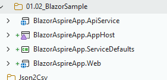
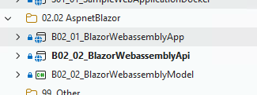

here is a new sample with blazor and aspire 

please understand how it does work and how it is defferent from a classic sample with a blazor webassembly client and API ? 

---

## Resolution (2026-07-06)

**Answer:** the Aspire sample is the *same* Blazor UI + Web API as the classic one, **plus two orchestration projects** — `AppHost` (declares and runs the resource graph) and `ServiceDefaults` (uniform telemetry, health checks, HTTP resilience, service discovery). Aspire is an **orchestration + observability layer, not a Blazor hosting model**: it changes dev-time composition and operations, not the application architecture. It's the modern, recommended envelope for multi-service/team/cloud solutions and is **orthogonal** to the Blazor app-shape choice; a single client + single API is fine without it.

- Full analysis: [research/05-analysis/aspire-orchestration-model.md](research/05-analysis/aspire-orchestration-model.md)
- Integrated article: [03.00-tech/04.05-web-development/01.00-blazor/02.01-concepts-blazor-with-aspire.md](../../../../03.00-tech/04.05-web-development/01.00-blazor/02.01-concepts-blazor-with-aspire.md)
 
 
  