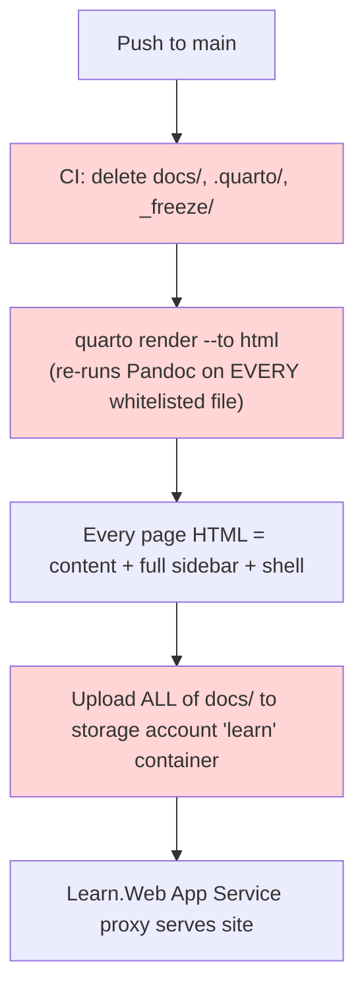
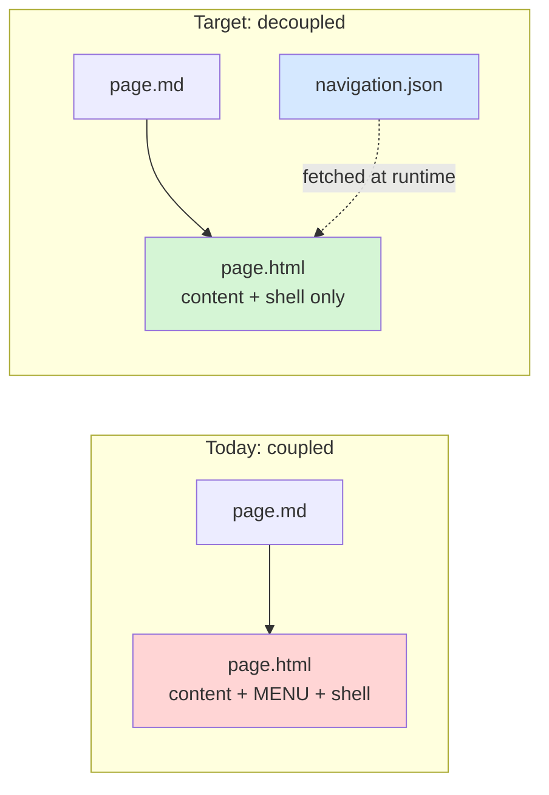

# Issue analysis

**Issue title:** Learning Hub performs a full-site render on every deploy (no incremental build)

**Date reported:** 2026-07-11  
**Reporter:** Dario Airoldi  
**Status:** Open — analysis complete; Phase 1 solution actionable ([01-issue-resolution-plan.md](01-issue-resolution-plan.md))  
**Severity:** High (developer productivity / scalability)  
**Component:** Quarto build pipeline and site navigation (CI/CD, `_quarto.yml`)  
**Framework:** Quarto 1.6.42 static site generator; GitHub Actions (self-hosted runner); Azure App Service blob-proxy serving from an Azure Storage account

---

> **⚠️ Architecture update (2026-07-15):** the `gh-pages` / GitHub Pages pipeline referenced in parts of this analysis is **disabled**. The live site is now served by the `Learn.Web` blob-proxy on Azure App Service, reading output from the `learn` container of storage account `samplestmcstitn01`; content is published by [deploy-learninghub.yml](../../../../../.github/workflows/deploy-learninghub.yml). The root causes below remain accurate — the current workflow still runs a whole-project `quarto render` and wipes caches — but the *deploy target* is blob storage, not `gh-pages`. A **markdown-first** direction that removes the build entirely is proposed in [02-markdown-first-rendering.md](02-markdown-first-rendering.md).

---

## Table of contents

- [📝 Problem statement](#-problem-statement)
- [🔍 Context information](#-context-information)
- [🔄 Reproduction steps](#-reproduction-steps)
- [🔬 In-depth analysis](#-in-depth-analysis)
- [✅ Solution](#-solution)
- [❓ Open questions and alternatives (Phase 2)](#-open-questions-and-alternatives-phase-2)
- [📚 References](#-references)

## 📝 Problem statement

The Learning Hub is a Quarto `website` project. **Every deploy performs a full render of the entire site, regardless of how little changed.** A one-word edit to a single article triggers the same work as a complete rebuild: Quarto re-runs Pandoc across the whole render whitelist, and CI uploads the entire regenerated `docs/` tree to the storage account (the historical, now-disabled `gh-pages` pipeline force-pushed the whole tree to `gh-pages` instead).

- **Expected**: an *append-mostly* documentation site should build **incrementally** — only new or modified articles compiled to HTML and dropped into `docs/` at the correct path, with the left menu updated as an independent step.
- **Current**: build cost is **O(site size) per change** instead of **O(change size)**. It already takes **tens of minutes**, and grows monotonically as articles accumulate.

**Why it matters:**

- A routine content edit takes tens of minutes to publish.
- The slow feedback loop discourages the small, frequent edits that are the natural cadence of a learning journal.
- The self-hosted runner re-renders hundreds of unchanged pages on every push.

## 🔍 Context information

| Item | Value |
|---|---|
| Repository | Learn |
| Issue folder | `src/docs/90. Issues/202607/20270711.02-progressive-build/` |
| Trigger | Build time reached "tens of minutes" as article count grew |
| Site generator | Quarto 1.6.42 (`project.type: website`) |
| Output directory | `docs/` — uploaded to storage account `samplestmcstitn01/learn` and served by the `Learn.Web` App Service blob-proxy. The legacy `gh-pages` pipeline is disabled. |
| Render whitelist size | 267 entries in `project.render` (several are `**/*.md` globs → actual page count is higher) |
| Total renderable `.md`/`.qmd` in repo | ~1,481 files |
| Native sidebar size | ≈340 lines under `website.sidebar.contents` |
| Shared shell | `header-includes.html` (521 lines), `styles.css`, `theme-light.scss`, `theme-dark.scss` |

### The moving parts

| Concern | Where it lives | Behaviour |
|---|---|---|
| Project type | [_quarto.yml](../../../../../_quarto.yml) → `project.type: website` | Site rendered as one unit; sidebar injected into every page |
| Render set | `project.render:` whitelist | 267 entries re-rendered every build |
| Left menu | `website.sidebar.contents` (≈340 lines) | Native Quarto sidebar, **baked into every output page** |
| Menu data (unused) | `navigation.json` via [scripts/generate-navigation.ps1](../../../../../scripts/generate-navigation.ps1) | Generated from the sidebar YAML, copied to `docs/` — **not consumed by the live site** |
| Shared shell | `header-includes.html`, `styles.css`, `theme-*.scss` | Injected into every page |
| CI (current) | [.github/workflows/deploy-learninghub.yml](../../../../../.github/workflows/deploy-learninghub.yml) | Wipes `docs/`, `.quarto/`, `_freeze/`, runs whole-project `quarto render`, uploads all of `docs/` via `az storage blob upload-batch`, flushes the proxy cache |
| CI (legacy, disabled) | [.github/workflows/quarto-publish.direct.yml](../../../../../.github/workflows/quarto-publish.direct.yml) | Historical `gh-pages` pipeline — wiped caches, full render, force-pushed `gh-pages`. Guarded off since 2026-07-15 |

## 🔄 Reproduction steps

1. Make a one-line edit to any single whitelisted article (for example, a typo fix in a `summary.md`).
2. Commit and push to `main`.
3. Observe the CI run of [deploy-learninghub.yml](../../../../../.github/workflows/deploy-learninghub.yml):
   - The **Render Quarto site** step deletes `docs/`, `.quarto/`, `_freeze/`, then runs `quarto render --to html` across all 267 render-list entries.
   - The **Upload** step pushes the entire regenerated `docs/` tree to the `learn` container via `az storage blob upload-batch` (the disabled legacy pipeline force-pushed to `gh-pages` instead).
4. Measure wall-clock time: it is **independent of the change size** and scales with total article count (currently tens of minutes).

**Expected (incremental):** step 3 should render only the one changed file and copy only the changed output.

### Affected code locations

| Location | Role in the issue |
|---|---|
| [.github/workflows/deploy-learninghub.yml](../../../../../.github/workflows/deploy-learninghub.yml) | Cache wipe + project-wide render + full blob upload (current). Legacy [quarto-publish.direct.yml](../../../../../.github/workflows/quarto-publish.direct.yml) did the same then force-pushed `gh-pages` (disabled) |
| [_quarto.yml](../../../../../_quarto.yml) `project.render` | 267 entries re-rendered every build |
| [_quarto.yml](../../../../../_quarto.yml) `website.sidebar` | ≈340-line menu baked into every page (Root cause 1) |
| [_quarto.yml](../../../../../_quarto.yml) `execute` | No `freeze:` configured (Root cause 4) |
| [scripts/generate-navigation.ps1](../../../../../scripts/generate-navigation.ps1) | Produces `navigation.json` the live site never consumes |

## 🔬 In-depth analysis

The full-site rebuild is caused by **four independent factors**. All four must be addressed to reach a true seconds-scale build.

### Current build flow



The three red steps scale with **site size** instead of **change size**.

### Root cause 1 — The sidebar is baked into every page

Quarto's `website.sidebar` is compiled into the HTML `<body>` of **every** rendered page, physically duplicating the ≈340-line menu into hundreds of output files. Changing one menu entry invalidates every page, and even a content-only edit regenerates that page's sidebar block. The menu is therefore **not independent** of page content today — it is embedded in it.

### Root cause 2 — CI destroys the cache before every render

The render step deletes `docs/`, `.quarto/`, and `_freeze/` before calling `quarto render`, guaranteeing a cold start on every run:

```powershell
Remove-Item -Recurse -Force .quarto -ErrorAction SilentlyContinue
Remove-Item -Recurse -Force docs -ErrorAction SilentlyContinue
Remove-Item -Recurse -Force _freeze -ErrorAction SilentlyContinue
quarto render --to html
```

### Root cause 3 — Project-mode `quarto render` re-runs Pandoc on the entire list

A project-level `quarto render` converts **all** 267 whitelist entries. There is no built-in "skip if HTML is newer than Markdown" for website projects, so the Pandoc conversion runs for every prose page each time.

### Root cause 4 — `freeze` is unset (and would not help prose anyway)

There is no `freeze:` key under `execute:`. Quarto's freeze cache is unused — and even if enabled, `freeze` caches only *computational* output (executed code cells), not the Pandoc conversion of prose. For a mostly-prose site, `freeze` alone cannot deliver incremental builds.

> **Implication of causes 3 + 4:** the only reliable way to be incremental is to **render per changed file** (not project-wide) and to **remove the whole-project coupling** (the sidebar).

### Two decisive findings

| # | Finding | Consequence |
|---|---|---|
| A | The live left menu is **100% native Quarto**, baked per page | The coupling to break for independent menu updates |
| B | `navigation.json` and `_includes/right-nav.html` **already exist but are vestigial** — generated/copied yet never fetched by the live site | Most of the client-side-menu plumbing is already built; it needs wiring, not inventing |

**Evidence for Finding B:** `navigation.json` is not fetched by `header-includes.html` or any live include; `_includes/right-nav.html` is not referenced by `_quarto.yml`; the only live references are the generator script and CI existence checks. Everything else mentioning it is documentation about the aspiration, not the running system.

### Impact assessment

| Dimension | Assessment |
|---|---|
| Correctness | Unaffected — the site renders correctly today |
| Velocity | Severely degraded — minutes per trivial edit; worsens with growth |
| Scalability | Poor — O(site size) per change instead of O(change size) |
| CI cost | High — hundreds of unchanged pages re-rendered every push |
| Risk of change | Moderate — decoupling the menu changes navigation UX and search indexing |

## ✅ Solution

Incremental build requires **two independences** to hold simultaneously:

1. **Page independence** — a page's HTML must be a pure function of *its own* Markdown plus shared CSS/JS, never of the menu or sibling pages. Then rendering page X can never invalidate page Y, so "render only what changed" is correct, not just fast.
2. **Menu independence** — the menu must live in **one** runtime-loaded artifact (`navigation.json`) so it behaves as an external "page selector": updating it replaces one file for the whole site, and updating a page never touches the menu.



### Recommended solution: a phased incremental build

The best feasible solution is **phased**, because the two independences have very different risk profiles. Page independence for content-only edits can be captured immediately with a CI change; full menu independence requires design decisions (see [Open questions](#-open-questions-and-alternatives-phase-2)).

#### Phase 1 — Change-detection build (clear, actionable → planned)

Keep the current architecture; make the pipeline incremental:

- Stop deleting `docs/`, `.quarto/`, `_freeze/` in CI.
- Compute the render set as `git diff ∩ project.render whitelist`, and render each changed file with `quarto render "<file>"`.
- Replace the orphan-branch force-push with an incremental commit that copies only changed outputs.
- Trigger a full rebuild **only** when the sidebar YAML changes (rare), to avoid stale baked-in menus.

This makes content-only edits — the common case — publish in seconds. It is fully specified in **[01-issue-resolution-plan.md](01-issue-resolution-plan.md)**.

#### Phase 2 — Decouple the menu to client-side (completes the fix; has open decisions)

Disable the native sidebar, ship `navigation.json` plus a client-side loader that renders the left menu and highlights the current page by `location.pathname`. After Phase 2, no change type except shared-asset edits touches more than the changed pages. Phase 2 carries genuine design decisions and is therefore **not yet planned** — see [Open questions and alternatives](#-open-questions-and-alternatives-phase-2).

### Target incremental pipeline (end state, after both phases)

```text
on push:
  1. baseline = x-src-sha metadata on blobs in the storage 'learn' container
     render_set = source files whose current hash != deployed blob's x-src-sha
  2. for each file in render_set:
        quarto render "<file>" --to html      # writes docs/<mirrored-path>.html
  3. if sidebar/structure changed:  regenerate navigation.json -> upload
  4. if shared assets changed (css/theme/header): FULL rebuild (rare)
  5. deploy: upload ONLY changed outputs (+ *_files/) to storage, stamp x-src-sha
  6. flush the Learn.Web proxy cache
```

Expected cost by change type after the migration:

| Change type | Work performed | Rough cost |
|---|---|---|
| Edit one article | Render 1 file + deploy diff | seconds |
| Add one article | Render 1 file + regenerate `navigation.json` + deploy diff | seconds |
| Reorder/rename menu entry | Regenerate `navigation.json`, copy 1 file | ~1 second |
| Change theme / global CSS / shared header | Full rebuild | minutes (rare) |

### Alternatives considered

| Alternative | Verdict | Why |
|---|---|---|
| Enable Quarto `freeze` only | Rejected | Caches computations, not prose Pandoc — no effect on a mostly-prose site (Root cause 4) |
| Shrink the `project.render` whitelist | Partial | Reduces constant factor but keeps O(site size) growth |
| Per-file render, keep baked-in menu (Phase 1 only) | Accepted as Phase 1 | Solves the common case; menu-structure edits still full-rebuild |
| Client-side menu + per-file render (Phase 1 + 2) | Recommended end state | Only shared-asset edits fan out; needs design decisions first |
| Switch static-site generator | Rejected | High cost; discards Quarto theming/TOC/search already in use |

## ❓ Open questions and alternatives (Phase 2)

A solution that **fully** addresses the problem (menu independence) depends on decisions that cannot be settled by inspection alone. These gate Phase 2 planning:

1. **Sidebar-disable approach** — (a) keep `project.type: website` with an emptied/disabled sidebar, or (b) render pages via a minimal non-website profile? Option (a) is less disruptive and retains `header-includes.html`/theme/CSS injection; option (b) yields the leanest pages. *Resolves by:* a one-page prototype comparing output.
2. **Site-wide search** — Quarto `search: true` builds a global index across all pages (a whole-site step). Keep a periodic/full-index rebuild, or adopt an incrementally-updatable client index such as Pagefind? *Resolves by:* a user preference on search behaviour + a Pagefind spike.
3. **Acceptable JS-dependency for navigation** — client-side menu makes navigation JS-dependent (page content stays server-rendered, so per-page SEO is unaffected). Confirm this trade is acceptable for the Hub.
4. **Baseline persistence** — the durable record of "what is already built" should be the **storage account itself** (per-blob `x-src-sha` metadata), not a marker on the self-hosted runner or `gh-pages`. This survives runner resets and self-heals. *(Superseded entirely if the markdown-first direction in [02-markdown-first-rendering.md](02-markdown-first-rendering.md) is adopted, since there is then no build to track.)*
5. **Single-file render path parity** — confirm `quarto render "<file>"` writes to the identical `docs/` path as a project render, including for whitelisted `readme.md`/`summary.md` files. *(Validated in Phase 1 as a Discovery item.)*

Once questions 1–3 are answered, a sibling plan `02-menu-decoupling-plan.md` becomes actionable.

## 📚 References

**[Quarto — Project rendering & `render` list](https://quarto.org/docs/projects/quarto-projects.html)** 📘 [Official]  
Basis for single-file vs. project render behaviour and output-path parity.

**[Quarto — Website navigation](https://quarto.org/docs/websites/website-navigation.html)** 📘 [Official]  
Documents the per-page sidebar compilation (Root cause 1).

**[Quarto — Freeze](https://quarto.org/docs/projects/code-execution.html#freeze)** 📘 [Official]  
Confirms freeze caches computations only, not prose (Root cause 4).

**[Quarto — Includes (`include-in-header`, `include-before/after-body`)](https://quarto.org/docs/authoring/includes.html)** 📘 [Official]  
Where to inject the client-side menu loader across all pages (Phase 2).

**[Pagefind — incremental static search](https://pagefind.app/)** 📗 [Verified Community]  
Candidate for replacing the whole-site Quarto search index if site-wide search must stay incremental (Open question 2).

**[03.00-tech/20.01-markdown/01-quarto/02.02-split-navigation-build.md](../../../../../03.00-tech/20.01-markdown/01-quarto/02.02-split-navigation-build.md)** 📘 [Official — internal]  
Existing in-repo design note describing the content/navigation split; superseded by this analysis with the current, evidence-based state (Findings A and B).

**[01-issue-resolution-plan.md](01-issue-resolution-plan.md)** 📘 [Internal]  
The actionable Phase 1 resolution plan derived from this analysis.

**[02-markdown-first-rendering.md](02-markdown-first-rendering.md)** 📘 [Internal]  
Proposed markdown-first direction: render Markdown on demand in the app, making Markdown the source of truth and removing the build step entirely — supersedes the phased plan if adopted.

**[deploy-learninghub.yml](../../../../../.github/workflows/deploy-learninghub.yml)** 📘 [Internal]  
The current content-deploy workflow (render + `az storage blob upload-batch` to `samplestmcstitn01/learn`), replacing the disabled `gh-pages` pipeline.

<!--
validations:
  grammar: {status: "not_run", last_run: null}
  readability: {status: "not_run", last_run: null}

article_metadata:
  filename: "00-analysis.md"
  created: "2026-07-12"
  status: "open"
  issue_type: "performance-scalability"
  supersedes: ["analysis.md", "overview.md"]
-->
