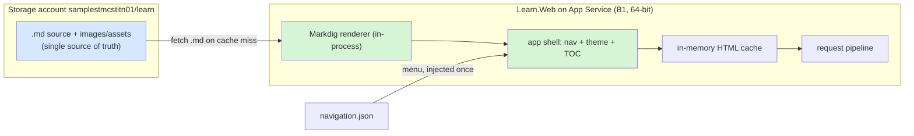
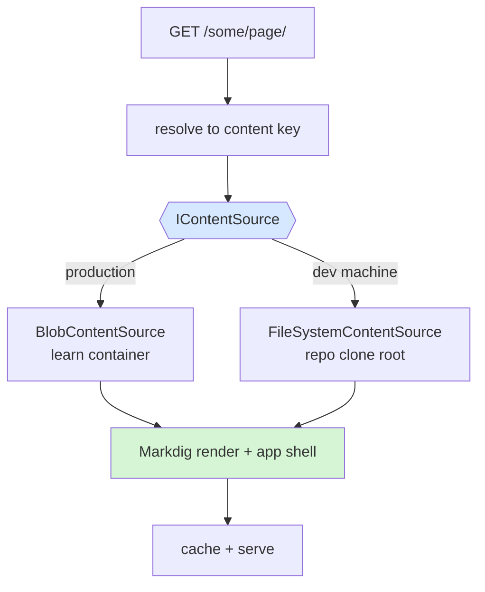

# Design: markdown-first on-the-fly rendering

> **Source discussion:** derived from [00-analysis.md](00-analysis.md) and the storage-account-as-source-of-truth direction. This document records **Option B (markdown-first lazy rendering)** and explains why it **supersedes** the phased build plan in [01-issue-resolution-plan.md](01-issue-resolution-plan.md) rather than extending it.

**Status:** Design — evidence gathered; recommended direction; not yet planned (open decisions below)  
**Date:** 2026-07-17  
**Author:** Dario Airoldi  
**Component:** `Learn.Web` blob-proxy (ASP.NET Core) + storage account `samplestmcstitn01/learn`  
**Supersedes (if adopted):** the CI change-detection build and the client-side-menu decoupling of the Phase 1/Phase 2 plan

---

## Table of contents

- [📝 Thesis](#-thesis)
- [🔬 Decisive evidence: the content is plain Markdown](#-decisive-evidence-the-content-is-plain-markdown)
- [🧭 Renderer decision: in-process Markdig, not a Quarto subprocess](#-renderer-decision-in-process-markdig-not-a-quarto-subprocess)
- [🏗️ Target architecture](#-target-architecture)
- [🔄 Request and publish flows](#-request-and-publish-flows)
- [🧩 Component responsibilities](#-component-responsibilities)
- [💻 Running on the developer machine](#-running-on-the-developer-machine)
- [⚡ Caching strategy](#-caching-strategy)
- [🔎 Search without a build step](#-search-without-a-build-step)
- [🖥️ Hosting notes (64-bit, B1)](#-hosting-notes-64-bit-b1)
- [🧾 Residual work and risks](#-residual-work-and-risks)
- [🪜 Migration path (incremental, zero big-bang)](#-migration-path-incremental-zero-big-bang)
- [🔗 Relationship to Phases 1 and 2](#-relationship-to-phases-1-and-2)
- [❓ Open decisions](#-open-decisions)
- [📚 References](#-references)

## 📝 Thesis

Make **Markdown the single source of truth** and treat HTML as a **disposable cache artifact**:

- The storage account holds the `.md` source files (plus images and assets) — not rendered HTML.
- The `Learn.Web` app renders Markdown to HTML **on demand**, at request time, in-process.
- Rendered HTML exists **only** in the app's cache; it is never a stored, versioned artifact.
- **"Publish" collapses to "upload a `.md`."** There is no build step — not in CI, not in Azure.

This removes the entire class of problems described in [00-analysis.md](00-analysis.md): there is no project-wide render, no baked-in sidebar, no `gh-pages` push, and no baseline-SHA bookkeeping, because there is no build to be incremental about.

## 🔬 Decisive evidence: the content is plain Markdown

The choice of renderer hinges on how much Quarto-specific syntax the corpus actually uses. A scan of all source content (`01.00-news/` … `90.00-travel/`, excluding generated `docs/`) shows the corpus is essentially CommonMark:

| Quarto feature | Files using it |
|---|---|
| Executable code cells (```` ```{python} ````, `{r}`, `{julia}`) | **0** |
| Callout blocks (`::: {.callout-*}`) | 1 |
| Shortcodes (``) | 2 |
| Cross-references (`@fig-`, `@tbl-`, `@sec-`) | 1 |
| Raw divs (`::: {…}`) | 2 |
| Mermaid fences (```` ```mermaid ````) | 21 |

Total renderable source is ~1,481 `.md` files plus a single `.qmd` (`index.qmd`). **Zero computational documents exist.** The only non-trivial feature at any scale is Mermaid, which renders client-side anyway.

**Consequence:** the full Quarto toolchain (Pandoc + Deno + Lua filters) is unnecessary at render time. A lightweight in-process Markdown engine covers ~99% of the corpus faithfully, and the handful of Quarto-specific files can be handled by a small extension or a one-time conversion.

## 🧭 Renderer decision: in-process Markdig, not a Quarto subprocess

| Option | Fidelity | Latency per render | Host footprint | Verdict |
|---|---|---|---|---|
| Shell out to `quarto.exe` | Full Quarto | ~1–3 s (Pandoc/Deno cold start) | Heavy toolchain on the App Service | Rejected — overkill for a zero-executable-cell corpus; puts a subprocess on the request path |
| In-process [Markdig](https://github.com/xoofx/markdig) | CommonMark + GFM + extensions | sub-ms to low-ms | Single NuGet package | **Recommended** — matches the corpus, no subprocess, trivial on B1 |

Markdig renders CommonMark, tables, and GFM natively; Mermaid becomes a `<pre class="mermaid">` block hydrated by `mermaid.js` in the shell; code highlighting moves client-side (Prism/highlight.js). The ~4 Quarto-specific files (1 callout, 2 shortcodes, 1 cross-reference, 2 raw divs) are handled by a small Markdig extension or converted once to plain Markdown.

## 🏗️ Target architecture



The defining property: a page's HTML is a **pure function of its own `.md` plus the shared shell**. Rendering one page never depends on any other page, so there is nothing to invalidate site-wide and nothing to render in bulk.

## 🔄 Request and publish flows

**Publish (author):**

```text
1. edit page.md
2. git push        (source only — no docs/, no HTML)
3. CI uploads changed *.md (+ any new images) to the 'learn' container
4. POST /_cache/invalidate  (flush the affected cache entries)
```

**Serve (reader):**

```text
GET /some/page/
  → cache hit  → serve cached HTML
  → cache miss → fetch some/page/index.md from storage
               → Markdig render body (ms)
               → wrap in app shell (nav + theme + TOC)
               → cache + serve
```

There is no render step between step 2 and a live page other than the first on-demand render, which is milliseconds.

## 🧩 Component responsibilities

| Concern | Today (Quarto build) | Markdown-first |
|---|---|---|
| Page body HTML | Pandoc at build time | Markdig in-process, on demand |
| Left menu / sidebar | Baked into every page | App shell injects it once from `navigation.json` |
| Theme (light/dark) | Baked per page | App shell (`styles.css`, `styles-callouts.css`, theme scss) |
| Table of contents | Built per page | App shell generates from headings |
| Mermaid diagrams | Quarto Lua filter | Client-side `mermaid.js` |
| Code highlighting | Build-time | Client-side Prism/highlight.js |
| Source of truth | `.md` in git → `docs/` HTML in storage | `.md` in storage |

Moving the shell into the app is the key move: it makes **menu independence automatic** (Root cause 1 in [00-analysis.md](00-analysis.md) disappears by construction — the menu is no longer part of any page artifact).

## 💻 Running on the developer machine

The same app should render either from the storage account (production) or from the **local repo clone** (developer machine). The trick is to not hardcode "storage" as the origin: the app depends on a **content-source abstraction** with two implementations. Everything above the seam — request-path resolution, Markdig rendering, the shell, and caching — is identical for both.



**The seam.** The catch-all GET currently depends directly on `BlobContainerClient` ([Program.cs](../../../../../src/Learn.Web/Program.cs)); it should depend on an interface instead:

```csharp
public interface IContentSource
{
    // null = not found. Bytes are the raw source (.md, image, css, ...).
    Task<ContentResult?> GetAsync(string contentKey, CancellationToken ct);
}
public sealed record ContentResult(byte[] Bytes, string? ContentType, string ETag);
```

| Implementation | Origin | Selected when |
|---|---|---|
| `BlobContentSource` | `learn` container (wraps today's `BlobContainerClient`) | Production / Azure |
| `FileSystemContentSource` | the local repo clone root | Developer machine |

**Selection by config.** Today's `BlobProxy` section is regrouped under `Content`. Source-specific keys move into a per-source block (`Blob` / `FileSystem`); the source-agnostic keys — the cache cap, the invalidate secret, and the not-found path, which all live *above* the seam — stay at the `Content` level so they are not duplicated per source. `Source` selects the active block, defaulting to `FileSystem` in the Development environment when a root path is set, otherwise `Blob`:

```jsonc
// appsettings.json (prod) — the current "BlobProxy" keys, regrouped under "Content"
"Content": {
  "Source": "Blob",

  // Source-agnostic (apply above the seam, to whichever source is active)
  "CacheSizeLimitBytes": 200000000,
  "NotFoundPath": "404.html",
  // Shared secret for POST /_cache/invalidate. Keep empty here; supply the real value
  // via appsettings.Testmc.local.json, Key Vault, or an App Service setting.
  "InvalidateApiKey": "",

  // Source-specific
  "Blob": {
    "AccountUri": "https://samplestmcstitn01.blob.core.windows.net",
    "ContainerName": "learn"
  }
}

// appsettings.Development.json — FileSystem source; render straight from the clone
"Content": {
  "Source": "FileSystem",
  "FileSystem": { "RootPath": "..\\..", "WatchForChanges": true }
}
```

Correspondingly, `BlobProxyOptions` becomes `ContentOptions` with nested `BlobOptions` and `FileSystemOptions`; the `Blob` block binds only when `Source` is `Blob`, so a dev machine needs no storage settings at all. (`NotFoundBlob` is renamed `NotFoundPath` since it is now resolved by whichever source is active.)

The dev path needs **no Azure credentials** for content — it bypasses the `DefaultCredentialProvider` chain entirely.

**Two dev-only wins:**

- **Live reload** — `FileSystemContentSource` attaches a `FileSystemWatcher` on `RootPath`; a saved `.md` evicts just that cache entry, so a browser refresh shows the change instantly. It is the local, automatic equivalent of the `/_cache/invalidate` endpoint, and effectively replaces `quarto preview` with a preview that renders through the **real production path**.
- **Full-site parity** — `dotnet run` in the repo serves the entire site exactly as production would, from source: what you see locally is what ships.

**Security — path-traversal guard.** `FileSystemContentSource` MUST canonicalize each resolved path with `Path.GetFullPath` and reject anything that does not start with the configured `RootPath`, so a crafted `../../` request cannot escape the clone (OWASP A01/A05). The blob source is inherently confined to its container.

## ⚡ Caching strategy

- Reuse the existing bounded in-memory LRU cache in [Program.cs](../../../../../src/Learn.Web/Program.cs) (`AddMemoryCache` with a byte `SizeLimit`).
- Key rendered HTML by the source blob's ETag/hash so an upload naturally supersedes stale output.
- `POST /_cache/invalidate` already exists and is called by the deploy; extend it to also drop the rendered-HTML entry, not only the raw-blob entry.
- On a B1 single instance the cache is per-process and volatile; a restart simply re-renders lazily (cheap with Markdig). An optional spillover cache to a `rendered/` blob prefix could survive restarts — but that reintroduces HTML artifacts, so keep it optional and clearly a cache, never source.

## 🔎 Search without a build step

Quarto builds a search index at build time; that index vanishes with the build. Markdown-first turns this into an **advantage**: the entire `.md` corpus lives in storage and is small (~1,481 files), so the app can build an in-memory full-text index at startup and refresh it on invalidation. Runtime, in-app search over Markdown replaces a lost build-time index — and it operates on the source of truth directly.

## 🖥️ Hosting notes (64-bit, B1)

- **64-bit worker:** the app is 64-bit. [deploy-learnweb.yml](../../../../../.github/workflows/deploy-learnweb.yml) currently publishes `-r win-x86` with a stale comment about a 32-bit worker; the correct target is `win-x64`. This is a small, isolated change and the right platform for an in-process renderer. (Verify the worker platform via app config before switching.)
- **B1 is sufficient for rendering:** Markdig rendering is CPU-cheap (sub-ms to low-ms per page), so a single B1 instance renders comfortably. Scale is a function of **traffic**, not rendering. Scaling up (S1/P-tier) or out remains available if traffic grows, but is not required by this design.

## 🧾 Residual work and risks

- **~4 Quarto-specific files** need a small Markdig extension or one-time conversion (1 callout, 2 shortcodes, 1 cross-reference, 2 raw divs).
- **Code highlighting** moves client-side (Prism/highlight.js in the shell).
- **Visual fidelity pass** to match the current theme (CSS is already owned: `styles.css`, `styles-callouts.css`, `theme-light.scss`, `theme-dark.scss`).
- **`index.qmd`** is the one non-`.md` entry; decide whether to convert it or special-case the landing page.
- **First-view latency** on a cache miss is a single in-process render (ms) — negligible, unlike a Quarto subprocess.

## 🪜 Migration path (incremental, zero big-bang)

The app can adopt markdown-first **per page**, with a safe fallback:

1. Add Markdig rendering + the app shell (nav/theme/TOC) to `Learn.Web`, behind the existing proxy.
2. On request, **serve a pre-rendered `.html` blob if present; render the `.md` only when no HTML exists.** This lets HTML and Markdown coexist during migration.
3. Point [deploy-learninghub.yml](../../../../../.github/workflows/deploy-learninghub.yml) at uploading `.md` source (and images) instead of rendering and uploading `docs/`.
4. Once fidelity is confirmed across the corpus, retire the Quarto build and stop uploading HTML.

Because the fallback serves existing HTML until a page is verified, there is no big-bang cutover and no window where content is unavailable.

## 🔗 Relationship to Phases 1 and 2

This design is **not** a third phase after the plan in [01-issue-resolution-plan.md](01-issue-resolution-plan.md) — if adopted, it **replaces** both phases:

| Plan item | Fate under markdown-first |
|---|---|
| Phase 1 — CI change-detection incremental build | Obsolete — there is no build to make incremental |
| Phase 1 — baseline-SHA / retain build artifacts | Obsolete — no build artifacts to retain |
| Phase 2 — disable native sidebar | Achieved by construction — the app owns the shell |
| Phase 2 — client-side `navigation.json` menu | Subsumed — the app injects the menu at render time |
| Phase 2 — search strategy | Solved — in-app index over the Markdown corpus |

## ❓ Open decisions

- **D-shell-render** — server-render the shell (nav/theme/TOC) in the app template, or keep the body server-rendered and hydrate nav client-side from `navigation.json`? *Resolves by:* a one-page prototype.
- **D-content-source-selection** — select the content source by an explicit `Content:Source` switch only, or infer `FileSystem` in Development when a `RootPath` is set? *Resolves by:* a preference on config explicitness.
- **D-render-path-resolution** — the order for resolving a request path to a source file (`<path>.md` → `<path>/index.md` → `<path>/overview.md` → `<path>/readme.md`). *Resolves by:* auditing the repo's actual index-file conventions. Must be identical across both content sources.
- **D-quarto-features** — handle the ~4 Quarto-specific files via a Markdig extension, or convert them once to plain Markdown? *Resolves by:* inspecting the 4 files.
- **D-index-qmd** — convert `index.qmd` to Markdown or special-case the landing page? *Resolves by:* a decision on the landing page's needs.
- **D-rendered-spillover** — add an optional `rendered/` blob cache to survive restarts, or accept lazy re-render on restart? *Resolves by:* measuring cold-cache render cost at corpus scale.
- **D-highlighting** — Prism vs highlight.js for client-side code highlighting. *Resolves by:* a preference on theme/language coverage.

## 📚 References

**[Markdig — CommonMark/GFM Markdown processor for .NET](https://github.com/xoofx/markdig)** 📘 [Official]  
The proposed in-process rendering engine; supports CommonMark, tables, GFM, and custom extensions.

**[Mermaid — diagramming and charting](https://mermaid.js.org/)** 📘 [Official]  
Client-side rendering of the 21 Mermaid fences, replacing Quarto's Lua filter.

**[Prism — client-side syntax highlighting](https://prismjs.com/)** 📘 [Official]  
Candidate for the code-highlighting responsibility moved out of the build.

**[Quarto — Website navigation](https://quarto.org/docs/websites/website-navigation.html)** 📘 [Official]  
Documents the per-page sidebar compilation this design removes.

**[00-analysis.md](00-analysis.md)** 📘 [Internal]  
The root-cause analysis; Root cause 1 (baked-in sidebar) is eliminated by construction here.

**[01-issue-resolution-plan.md](01-issue-resolution-plan.md)** 📘 [Internal]  
The Phase 1 build-centric plan this design supersedes if adopted.

**[deploy-learninghub.yml](../../../../../.github/workflows/deploy-learninghub.yml)** 📘 [Internal]  
Current content-deploy workflow (render + `az storage blob upload-batch` to `samplestmcstitn01/learn`) to be repointed at uploading `.md`.

**[Program.cs — Learn.Web blob-proxy](../../../../../src/Learn.Web/Program.cs)** 📘 [Internal]  
The app to extend with in-process rendering, an app shell, and rendered-HTML caching.

<!--
validations:
  grammar: {status: "not_run", last_run: null}
  readability: {status: "not_run", last_run: null}

article_metadata:
  filename: "02-markdown-first-rendering.md"
  created: "2026-07-17"
  status: "design"
  issue_type: "architecture-direction"
  supersedes: []
-->
