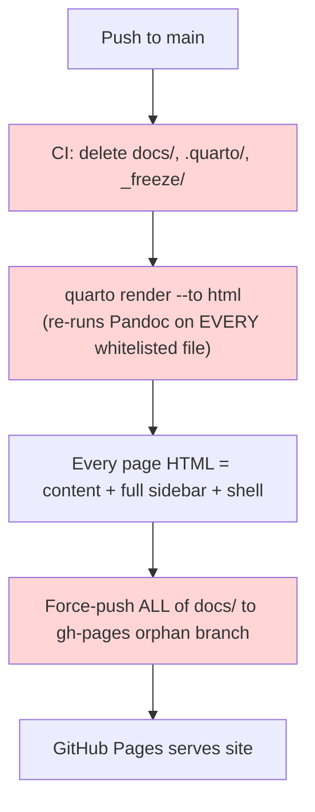
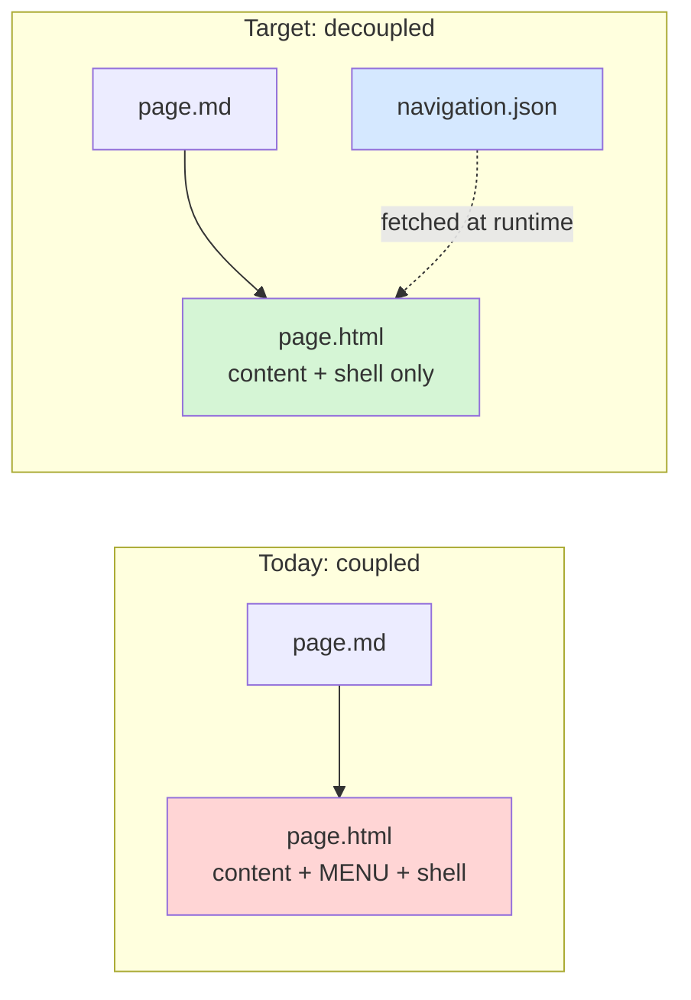
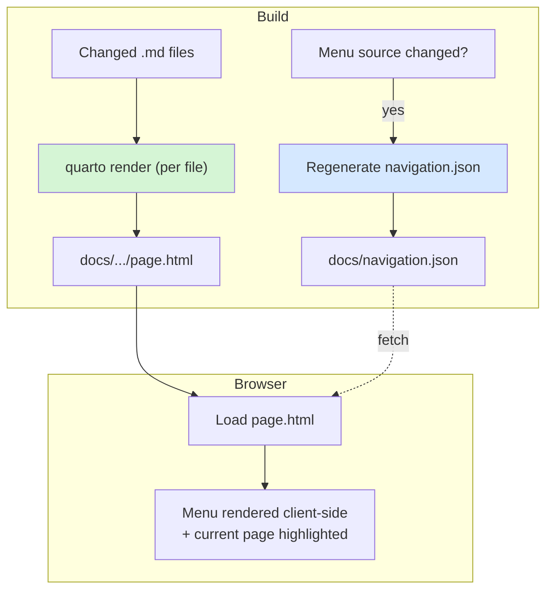

# Progressive (incremental) build for the Learning Hub

The Learning Hub is a Quarto `website` project. Today every deploy performs a **full render of the entire site**: Quarto re-runs Pandoc on every whitelisted page, then GitHub Actions force-pushes the whole `docs/` output to `gh-pages`. As the article count grows this now takes **tens of minutes**, even when a single word changed in a single file.

This document analyses **why** the whole site rebuilds, confirms **two decisive findings** in the current setup, and describes **how to make the build incremental** — so that only new or modified articles are compiled and the left menu is updated as an independent step. The goal is to cut a routine content edit from *tens of minutes* to *seconds*.

## Table of contents

- [The point, and the problem](#the-point-and-the-problem)
- [How the build works today](#how-the-build-works-today)
- [Root-cause analysis: why every page rebuilds](#root-cause-analysis-why-every-page-rebuilds)
- [Two decisive findings](#two-decisive-findings)
- [What incremental build actually requires](#what-incremental-build-actually-requires)
- [Target architecture](#target-architecture)
- [The incremental build pipeline](#the-incremental-build-pipeline)
- [A pragmatic, phased path](#a-pragmatic-phased-path)
- [Trade-offs and risks](#trade-offs-and-risks)
- [Open questions and validations](#open-questions-and-validations)
- [References](#references)

---

## The point, and the problem

A documentation site is *append-mostly*, yet the current build treats every change as a full-site event. Two observations frame the whole problem:

- **The waste**: on a typical change, one article is added or edited. Recompiling every other (unchanged) article is pure overhead that grows with the archive.
- **The coupling**: Quarto's `website` project treats the site as **one atomic unit**. The left menu is compiled **into every page**, and the CI **deletes the output and cache before every render**. So the cost of any change is the cost of the whole site — and that cost grows linearly with the article count.

The desired end state:

1. Only **new or modified articles** are compiled to HTML and dropped into `docs/` at the correct path.
2. The **menu** is updated **afterwards**, as an **independent step**, without touching page content.
3. The menu behaves as an **external page selector** — independent of any page's content — while every page shares common stylesheets/scripts.

That end state is achievable. The rest of this document explains the current coupling and how to break it.

---

## How the build works today

### The moving parts

| Concern | Where it lives | Behaviour |
|---|---|---|
| **Project type** | [_quarto.yml](../../../../../_quarto.yml) → `project.type: website` | Site rendered as one unit; sidebar injected into every page |
| **Render set** | `project.render:` whitelist | Explicit list of ~hundreds of `.md`/`.qmd` files to render |
| **Left menu** | `website.sidebar.contents` (≈340 lines) | Native Quarto sidebar, **baked into every output page** |
| **Menu data (unused)** | `navigation.json` via [scripts/generate-navigation.ps1](../../../../../scripts/generate-navigation.ps1) | Generated from the sidebar YAML, copied to `docs/` — but **not consumed by the live site** |
| **Shared shell** | `header-includes.html`, `styles.css`, `theme-*.scss` | Injected into every page (`include-in-header`, `css`, `theme`) |
| **CI** | [.github/workflows/quarto-publish.direct.yml](../../../../../.github/workflows/quarto-publish.direct.yml) | Wipes `docs/`, `.quarto/`, `_freeze/`, runs `quarto render`, force-pushes `gh-pages` |

### The current flow



The three red steps are exactly the ones that scale with **site size** instead of **change size**.

---

## Root-cause analysis: why every page rebuilds

Four independent causes each force whole-site work. All four must be addressed to reach a true seconds-scale build.

### Cause 1 — The sidebar is baked into every page

Quarto's `website.sidebar` is compiled into the HTML `<body>` of **every** rendered page. The menu is therefore **physically duplicated** into hundreds of output files. Consequence:

- Changing **one** menu entry invalidates **every** page.
- Even for a content-only edit, Quarto still regenerates each page's sidebar block.

This is the deepest coupling: the menu is *not* independent of page content today — it is embedded in it.

### Cause 2 — CI destroys the cache before every render

The render step begins by deleting `docs/`, `.quarto/`, and `_freeze/`:

```powershell
Remove-Item -Recurse -Force .quarto -ErrorAction SilentlyContinue
Remove-Item -Recurse -Force docs -ErrorAction SilentlyContinue
Remove-Item -Recurse -Force _freeze -ErrorAction SilentlyContinue
quarto render --to html
```

Even if Quarto *could* skip unchanged work, the wipe guarantees it cannot. Every run starts from zero.

### Cause 3 — `quarto render` (project mode) re-runs Pandoc on the entire render list

A project-level `quarto render` converts **all** files in `project.render`. There is no built-in "skip if HTML is newer than Markdown" for website projects. For prose-only articles the Pandoc Markdown→HTML pass runs every time regardless.

### Cause 4 — `freeze` is not configured (and would not fix prose anyway)

There is no `freeze:` key under `execute:` in `_quarto.yml`. Two things follow:

- Quarto's freeze cache is unused.
- **Even if enabled, `freeze` only caches *computational* output** (executed code cells). It does **not** skip the Pandoc conversion of prose. For a mostly-prose site, `freeze` alone would not deliver incremental builds.

> The implication of Cause 3 + Cause 4 is important: the only reliable way to be incremental is to **invoke rendering per changed file** (not project-wide), and to **remove the whole-project coupling** (the sidebar).

---

## Two decisive findings

Investigation surfaced two facts that shape the whole solution.

### Finding A — The live left menu is 100% native Quarto (baked per page)

The menu users see is driven entirely by `website.sidebar.contents` in `_quarto.yml` and is rendered into each page at build time. There is no client-side menu on the live site. This is the coupling that must be broken for menu updates to become independent.

### Finding B — `navigation.json` and `right-nav.html` already exist, but are vestigial

The repository **already** contains most of the plumbing for a content-independent menu — it is just **not wired to the live site**:

- [scripts/generate-navigation.ps1](../../../../../scripts/generate-navigation.ps1) generates `navigation.json` from the sidebar YAML and the CI copies it into `docs/`.
- `_includes/right-nav.html` is a "Related Pages" widget with a `Loading…` placeholder meant to be populated client-side.

But:

- `navigation.json` is **not fetched** by `header-includes.html` or any live include.
- `_includes/right-nav.html` is **not referenced** by `_quarto.yml` (no `include-*-body` entry points to it).
- The only live references to `navigation.json` are the *generator script* and *existence checks* in CI. Everything else that mentions it is **documentation about the aspiration**, not the running system.

**Consequence — and the good news**: the intended design (a client-side, content-independent menu fed by `navigation.json`) was already envisioned and partially built. Completing that wiring is the key that unlocks independent menu updates.

---

## What incremental build actually requires

Two independences must hold simultaneously.

### 1. Page independence

A page's output HTML must be a pure function of **that page's Markdown + shared assets** — never of the menu or of sibling pages. When this holds, rendering page X can never invalidate page Y, so "render only what changed" becomes correct, not just fast.

The blocker is Cause 1: the sidebar embedded in each page. Remove the sidebar from page output and page independence is achieved.

### 2. Menu independence

The menu must live in **one** artifact loaded at runtime (a client-side "page selector"), so that:

- Updating the menu = replacing **one** file (`navigation.json`), for the **whole** site.
- Updating a page = never touches the menu.

This is exactly Finding B's infrastructure, finished and switched on.



---

## Target architecture

The design that satisfies both independences and matches your "external menu = page selector" requirement:

1. **Remove the menu from page rendering.** Disable / empty the native `website.sidebar` so pages no longer embed menu markup. Pages keep their own TOC, title, and content.
2. **Serve the menu client-side.** Ship `navigation.json` plus a small loader script (injected once via a shared include such as `header-includes.html` or a dedicated `include-before-body` partial). On load, the script fetches `navigation.json`, renders the left menu, and highlights the current page by matching `location.pathname`.
3. **Every page shares the same CSS/JS.** The theme, `styles.css`, and the menu loader are common assets referenced by every page — so a page carries **no** menu-specific HTML, only a mount point.
4. **Render pages individually.** Because pages no longer depend on the menu or each other, each changed `.md` can be rendered on its own and dropped into `docs/` at its mirrored path.
5. **Regenerate the menu only when structure changes.** `navigation.json` is rebuilt only when the menu source (the sidebar YAML, or a folder-tree scan) changes — and the update propagates to the whole site by replacing that single file.



---

## The incremental build pipeline

Target CI logic, expressed as steps:

```text
on push:
  1. changed = git diff --name-only <last-deployed-sha>..HEAD -- '*.md' '*.qmd'
     render_set = changed ∩ project.render whitelist

  2. for each file in render_set:
        quarto render "<file>" --to html      # writes docs/<mirrored-path>.html
        # (pages no longer embed the menu → safe, isolated, fast)

  3. if _quarto.yml sidebar (or folder structure) changed:
        pwsh scripts/generate-navigation.ps1   # rebuild navigation.json
        copy navigation.json -> docs/

  4. if shared assets changed (styles.css, header-includes.html, theme-*.scss):
        FULL rebuild (rare) — these legitimately affect every page

  5. deploy: checkout gh-pages, copy ONLY changed outputs, commit, push
     # replace the orphan-branch full-wipe with an incremental commit

  6. record HEAD as <last-deployed-sha> for the next diff
```

Expected cost by change type after the migration:

| Change type | Work performed | Rough cost |
|---|---|---|
| Edit one article | Render 1 file + deploy diff | seconds |
| Add one article | Render 1 file + regenerate `navigation.json` + deploy diff | seconds |
| Reorder/rename menu entry | Regenerate `navigation.json`, copy 1 file | ~1 second |
| Change theme / global CSS / shared header | Full rebuild | minutes (rare) |

---

## A pragmatic, phased path

The migration can be de-risked by sequencing it. Phase 1 delivers most of the win with the least architectural change; Phase 2 completes the vision.

### Phase 1 — Change-detection with the current architecture (quick win)

Without decoupling the menu yet:

- Stop deleting `docs/`, `.quarto/`, `_freeze/` in CI.
- Derive `render_set` from `git diff ∩ whitelist` and call `quarto render "<file>"` per changed file.
- Switch the deploy from orphan-branch force-push to an incremental commit.

This makes **content-only edits** (the common case) render in seconds. The residual limitation: because the menu is still baked per page, a **menu-structure change** only updates re-rendered pages, leaving stale menus elsewhere. Mitigate by triggering a **full rebuild only when the sidebar YAML changes** (rare).

### Phase 2 — Decouple the menu to client-side (the real fix)

Finish the `navigation.json` wiring described in [Target architecture](#target-architecture): disable the native sidebar, add the client-side menu loader, and reduce menu updates to replacing one file. After Phase 2, *no* change type except shared-asset edits requires touching more than the changed pages.

---

## Trade-offs and risks

Being honest about the costs of the client-side-menu approach:

- **Requires JavaScript for the menu.** Page **content** is still server-rendered (so per-page SEO is unaffected), but the **navigation** becomes JS-dependent. For a personal learning hub this is an acceptable trade.
- **Lose Quarto's built-in sidebar behaviours.** Active-page highlighting, auto-collapse, and prev/next must be reimplemented in the loader. `navigation.json` already carries the tree, so highlighting by `location.pathname` is straightforward.
- **Site-wide search is a separate whole-site step.** Quarto's `search: true` builds a global index across all pages. Options: keep a periodic/full rebuild for search, or move to an incrementally-updatable client index (for example, Pagefind).
- **Shared-asset edits still fan out.** Changing the theme, `styles.css`, or `header-includes.html` legitimately affects every page and requires a full rebuild — but these changes are infrequent.
- **Output-path fidelity matters.** Per-file `quarto render` must land HTML at the same mirrored path the project render would use, so surgical replacement in `docs/` is exact. This needs a quick validation (see below).

---

## Open questions and validations

Concrete things to verify before committing to the migration:

1. **Single-file render path parity** — confirm `quarto render "<file>"` writes to the identical `docs/` path as a project render (mirrored input tree), including for whitelisted `readme.md`/`summary.md` files.
2. **Rendering without the sidebar** — decide between (a) keeping `project.type: website` with an emptied/disabled sidebar, or (b) rendering pages via a minimal non-website profile. Option (a) is less disruptive; verify it still injects `header-includes.html`, theme, and CSS.
3. **Menu loader injection point** — `include-in-header` targets `<head>`; the menu mount likely wants `include-before-body`/`include-after-body`. Confirm the include hook and a stable mount element.
4. **Baseline SHA source** — where to persist `<last-deployed-sha>` (a file on `gh-pages`, a Git tag, or a workflow artifact) so the diff is reliable across self-hosted runner state resets.
5. **First-build + fallback** — define behaviour when no baseline exists (full build) and when `navigation.json` fails to load (graceful degradation to a minimal menu).
6. **Deploy mechanics** — replace the orphan-branch wipe with an incremental commit while preserving the `.gitignore.gh-pages` handling currently in the workflow.

---

## References

**[Quarto — Project Basics and rendering](https://quarto.org/docs/projects/quarto-projects.html)** 📘 [Official]  
Explains project types, the `render:` list, and how `quarto render` processes a project versus a single input file. Primary reference for validating single-file render behaviour and output paths.

**[Quarto — Website navigation (navbar & sidebar)](https://quarto.org/docs/websites/website-navigation.html)** 📘 [Official]  
Documents how `website.sidebar` is compiled into pages. Confirms the coupling that this analysis proposes to remove.

**[Quarto — Freeze (caching computations)](https://quarto.org/docs/projects/code-execution.html#freeze)** 📘 [Official]  
Clarifies that `freeze` caches *computational* output only, not the Pandoc prose conversion — the basis for Cause 4.

**[Quarto — Includes (`include-in-header`, `include-before/after-body`)](https://quarto.org/docs/authoring/includes.html)** 📘 [Official]  
Reference for where to inject the client-side menu loader across all pages.

**[Pagefind — static search you can update incrementally](https://pagefind.app/)** 📗 [Verified Community]  
A candidate for replacing the whole-site Quarto search index if site-wide search must stay incremental.

**[03.00-tech/20.01-markdown/01-quarto/02.02-split-navigation-build.md](../../../../../03.00-tech/20.01-markdown/01-quarto/02.02-split-navigation-build.md)** 📘 [Official — internal]  
Existing in-repo design note describing the content/navigation split. Confirms this direction was already envisioned; this document supersedes it with the current, evidence-based state (Findings A and B).

**[scripts/generate-navigation.ps1](../../../../../scripts/generate-navigation.ps1)** 📘 [Official — internal]  
The existing generator that already produces `navigation.json` from the sidebar YAML — the artifact the client-side menu would consume.
